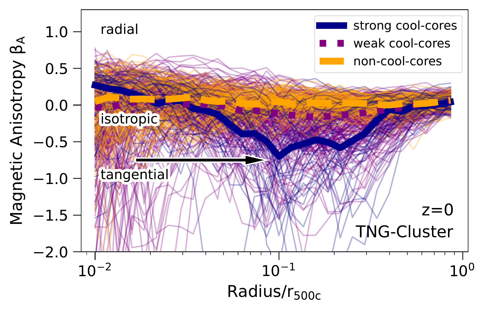
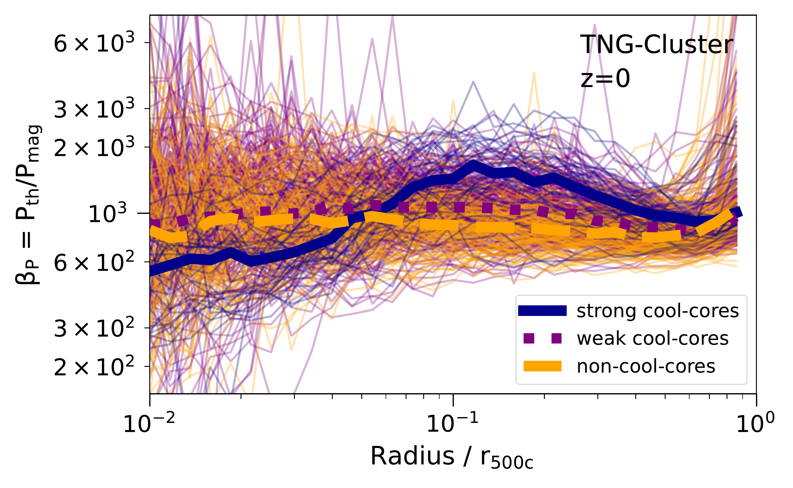
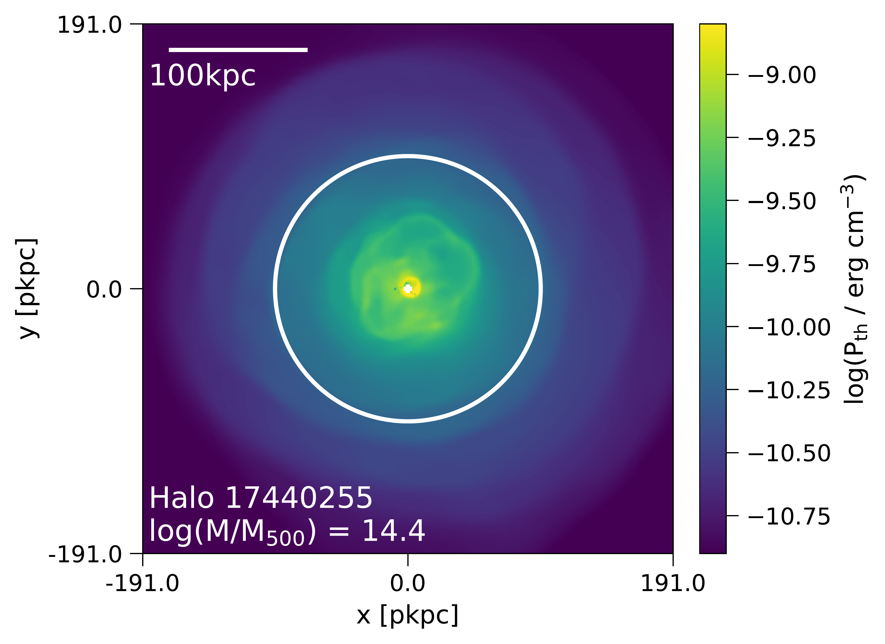
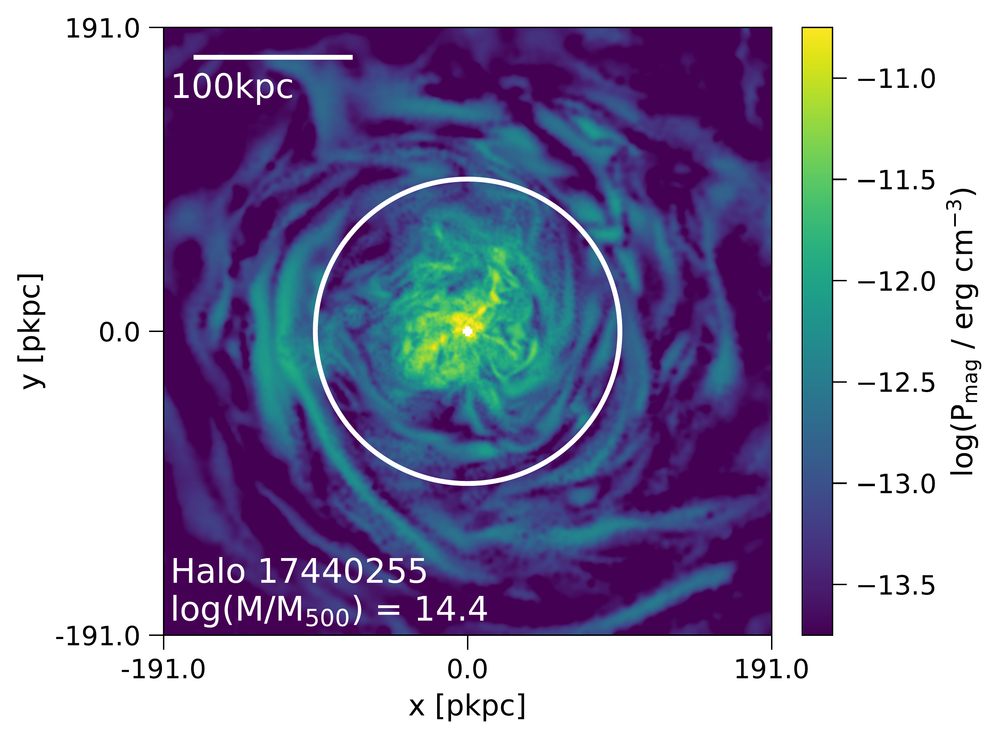

$\newcommand{\ensuremath}{}$
$\newcommand{\xspace}{}$
$\newcommand{\object}[1]{\texttt{#1}}$
$\newcommand{\farcs}{{.}''}$
$\newcommand{\farcm}{{.}'}$
$\newcommand{\arcsec}{''}$
$\newcommand{\arcmin}{'}$
$\newcommand{\ion}[2]{#1#2}$
$\newcommand{\textsc}[1]{\textrm{#1}}$
$\newcommand{\hl}[1]{\textrm{#1}}$
$\newcommand{\footnote}[1]{}$
$\newcommand{\mvir}{{\rm M}_{\rm 500c}}$
$\newcommand{\rvir}{r_{\rm 500c}}$
$\newcommand{\mtc}{{\rm M}_{\rm 200c}}$
$\newcommand{\rtc}{r_{\rm 200c}}$
$\newcommand{\msun}{M_\odot}$
$\newcommand{\betaP}{\beta_{\rm P}}$
$\newcommand{\betaA}{\beta_{\rm A}}$
$\newcommand{\cmr}[1]{{\color{red}\bf{[MR: #1]}}}$
$\newcommand{\mr}[1]{{\color{red}#1}}$

# Magnetic fields in the intracluster medium with TNG-Cluster: properties, morphology, and tangential anisotropy

<mark>Appeared on: 2025-07-18</mark> -  _submitted to A&A_

K. Lehle, et al. -- incl., <mark>M. Prunier</mark>, <mark>A. Pillepich</mark>

**Abstract:** We characterize the magnetic field properties of 352 massive galaxy clusters from the TNG-Cluster magnetohydrodynamical cosmological simulation with a focus on central magnetic field morphology in cool-core (CC) vs non-cool-core (NCC) clusters. We present the central values and radial profiles of magnetic field strength and plasma parameter as a function of mass, cooling status and redshift. Compared to low-redshift observations, TNG-Cluster produces reasonable magnetic field amplitudes in the central regions of clusters spanning a range of $1-200  \mu$ G. We then discuss the main finding of this work: $z=0$ cool-core clusters have preferentially tangential magnetic fields at a characteristic scale of $\sim 0.1 \rvir$ . These strongly tangential field orientations are specific to CCs. In contrast, across the full cluster population, magnetic fields show isotropic configurations at all radii and redshifts. As individual halos grow, the evolution of their magnetic field topologies is diverse: tangential features can be short-lived, persist over large cosmological time-scales, or periodically appear, vanish, and reappear towards $z=0$ . We discuss the underlying physics and possible physical scenarios to explain the origin of these structures. We argue that both AGN feedback-driven outflows, and merger-driven sloshing motions, cannot explain the population-wide tangential bias in magnetic field orientation. Instead, we propose that the trapping of internal gravity waves is responsible for the tangentially biased magnetic field topologies that we find in cool-core TNG-Cluster halos, due to the strong entropy gradient in these clusters.

**Figure 7. -** The topology of magnetic fields can be preferentially tangential for cool-core clusters. **Top panel:** Visualization of magnetic fields in a single TNG-Cluster halo at $z=0$(Halo 17440255) showing the central $40\%$ of $\rvir$. The background color shows the magnetic anisotropy $\betaA$ in the $xy$-plane. Negative values (yellow) correspond to tangential magnetic fields and positive values (blue) correspond to radially oriented magnetic fields. Overplotted in gray are the magnetic field directions, which appear as relief-like structures in the image. The white circle marks the radius at which the magnetic anisotropy profile (bottom panel) has its minimum. **Bottom panel:** Radial profiles of magnetic field anisotropy parameter $\betaA$ at $z=0$ for all halos in TNG-Cluster. Thin lines show individual halos, colored by CC state. The thick lines show the median profiles for SCCs (blue), WCCs (purple) and NCCs (orange). WCCs and NCCs show a flat profile at $\betaA\sim0$, while SCCs exhibit a dip at $\sim 0.1$\rvir$$ with $\betaA <0$. This shows that WCCs and NCCs have primarily isotropic magnetic fields, while SCCs have preferably tangentially oriented magnetic fields in the vicinity of this radius (as indicated by black arrow). (*fig:betaA*)

**Figure 3. -** Gallery of magnetic field strength and morphology in sixteen high-mass galaxy clusters selected from TNG-Cluster at $z=0$. Each panel shows the central region and extends $0.2$\rvir$$ from side-to-side, giving projections of mean magnetic field strength in a thin slice of $15$ kpc depth. The white circles indicate $0.1$\rvir$$. The panels are ordered by ascending central entropy $K_0$, such that the strongest cool-core (CC) systems are in the upper left, and the strongest non-cool-core (NCC) halos are located in the bottom right. Central magnetic field strength increases rapidly with halo mass, and is higher in CC versus NCC clusters. (*fig:galleryB*)

**Figure 5. -** **Main panel:** radial profiles of the plasma beta parameter $\beta_{\rm P}$ at $z=0$ for all TNG-Cluster halos, colored according to CC state. Thin lines show individual clusters, while the three thick lines show median stacks of SCC, WCC, and NCC clusters. **Lower panels:** maps of thermal pressure (left) and magnetic pressure (right) of one individual SCC halo ans an example. Both maps show the central region with $r<0.2$\rvir$$ for a slice with depth $15$ kpc. The overall pressure budget is dominated by the thermal pressure for both CCs and NCCs. $\beta_{\rm P}$ profiles for WCCs and NCCs are flat with average values of $\beta_{\rm P}\sim 900$. SCCs have a small dip in the core and a excess at $0.1 $\rvir$$. However, these trends are rather weak. (*fig:profileBetaP*)

