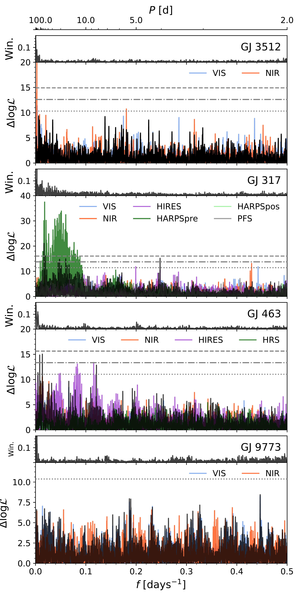
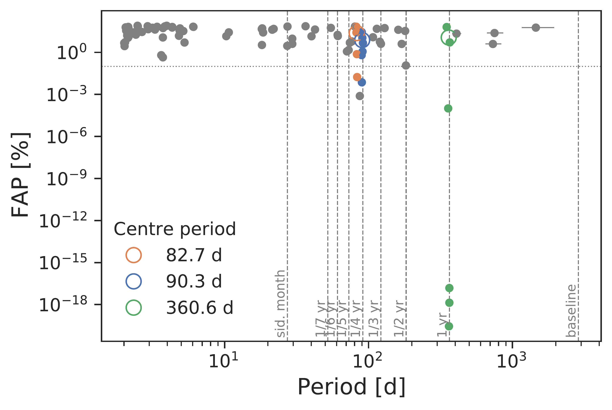
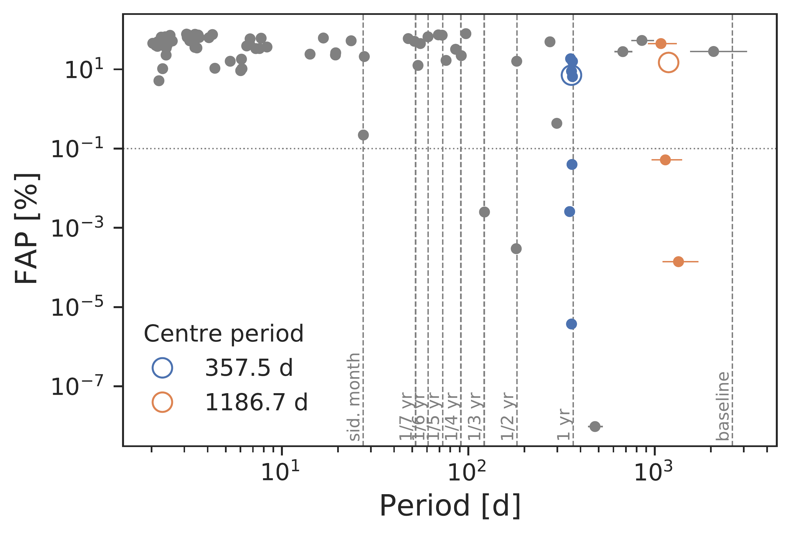
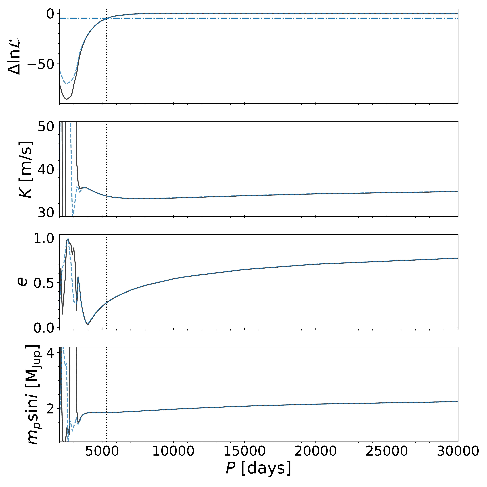

$\newcommand{\ensuremath}{}$
$\newcommand{\xspace}{}$
$\newcommand{\object}[1]{\texttt{#1}}$
$\newcommand{\farcs}{{.}''}$
$\newcommand{\farcm}{{.}'}$
$\newcommand{\arcsec}{''}$
$\newcommand{\arcmin}{'}$
$\newcommand{\ion}[2]{#1#2}$
$\newcommand{\textsc}[1]{\textrm{#1}}$
$\newcommand{\hl}[1]{\textrm{#1}}$
$\newcommand{\footnote}[1]{}$
$\newcommand{\kms}{km s^{-1}}$
$\newcommand{\ms}{m s^{-1}}$
$\newcommand{\mjup}{M_{\rm Jup}}$
$\newcommand{\lnZ}{\ln \mathcal{Z}}$
$\newcommand{\lnL}{\ln \mathcal{L}}$
$\newcommand{\aunc}[2]{^{+#1}_{#2}}$
$\newcommand{\Comm}[1]{\textcolor{red}{\textbf{#1}}}$

# The CARMENES search for exoplanets around M dwarfs: Revisiting the GJ 317, GJ 463, and GJ 3512 systems and two newly discovered planets orbiting GJ 9773 and GJ 508.2

<mark>Appeared on: 2025-07-22</mark> -  _32 pages (including appendix with radial velocity time series), 16 figures, 14 tables. Accepted for publication in A&A_

J. C. Morales, et al. -- incl., <mark>T. Henning</mark>

**Abstract:** Surveys for exoplanets indicate that the occurrence rate of gas giant planets orbiting late-type stars in orbits with periods shorter than 1000 days is lower than in the case of Sun-like stars. This is in agreement with planet formation models based on the core or pebble accretion paradigm. The CARMENES exoplanet survey has been conducting radial-velocity observations of several targets that show long-period trends or modulations that are consistent with the presence of giant planets at large orbital separations. We present an analysis of five such systems that were monitored with the CARMENES spectrograph, as well as with the IRD spectrograph. In addition, we used archival data to improve the orbital parameters of the planetary systems. We improve the parameters of three previously known planets orbiting the M dwarfs GJ 317, GJ 463, and GJ 3512. We also determine the orbital parameters and minimum mass of the planet GJ 3512 c, for which only lower limits had been given previously. Furthermore, we present the discovery of two new giant planets orbiting the stars GJ 9733 and GJ 508.2, although for the second one only lower limits to the orbital properties can be determined. The new planet discoveries add to the short list of known giant planets orbiting M-dwarf stars with subsolar metallicity at long orbital periods above 2000 days. These results reveal that giant planets appear to form more frequently in wide orbits than in close-in orbits around low-mass and lower metallicity stars.

**Figure 2. -** Periodogram of the residuals from the fits to the RV datasets of GJ 3512, GJ 317, GJ 463, and GJ 9773 (from top to bottom). In each panel the solid black line corresponds to the joint periodogram of all datasets, while solid lines depict the periodogram for each individual dataset as labelled. The top panel for each target illustrates the window function. Solid horizontal grey lines show the 0.1\%(dashed), 1\%(dot-dashed), and 10\%(dotted) FAP levels. (*fig:res_periodogram*)

**Figure 1. -** Clustering periodogram analysis \citep{Kemmer2025} for the activity indices of GJ 3512 (top) and GJ 9773 (bottom). The 0.1\% FAP threshold is shown as a horizontal dotted grey line, while vertical dashed lines mark the position of common periods caused by the sampling of data and their harmonics as labelled. Symbols with different colours correspond to clusters of periods that appear on different activity indicators. The mean values are reported in the legend. (*fig:clustering*)

**Figure 3. -** Parameters of the fits to the RV time series of GJ 508.2 as a function of the orbital period. The differential $\lnL$  of the fit with respect to the maximum value, the fitted RV semi-amplitude and eccentricity, and the corresponding planet minimum mass are shown from top to bottom. Dahsed blue and solid black lines correspond, respectively, to fits considering only RVs from CARMENES VIS, and considering both VIS and NIR RVs simultaneously. The dot-dashed blue line in the top panel indicates the threshold corresponding to $\Delta$\lnL=5, and the vertical dotted lines, the corresponding orbital period. (*fig:pfix_gj508*)

