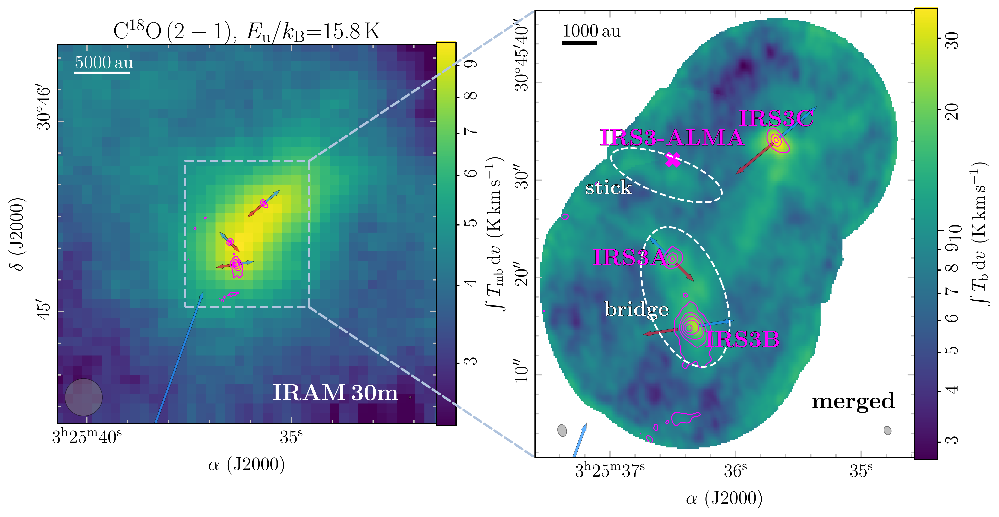
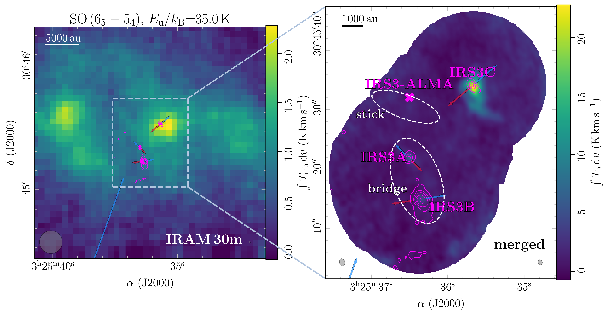
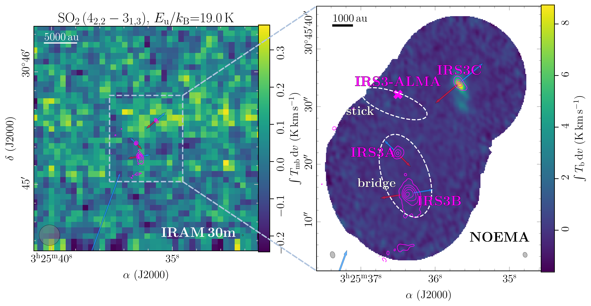
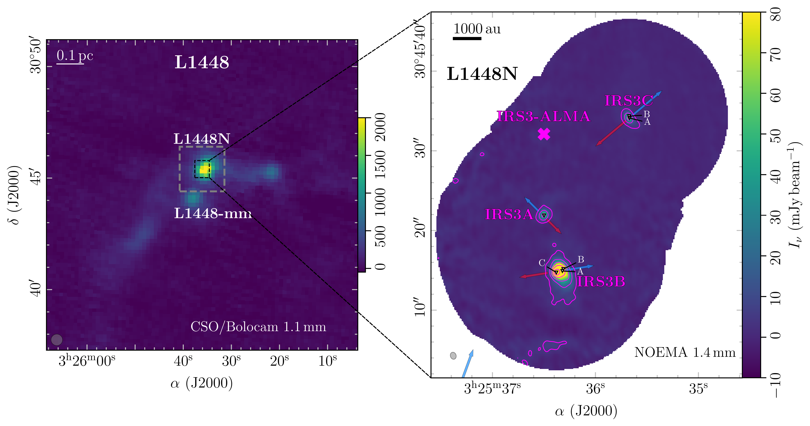
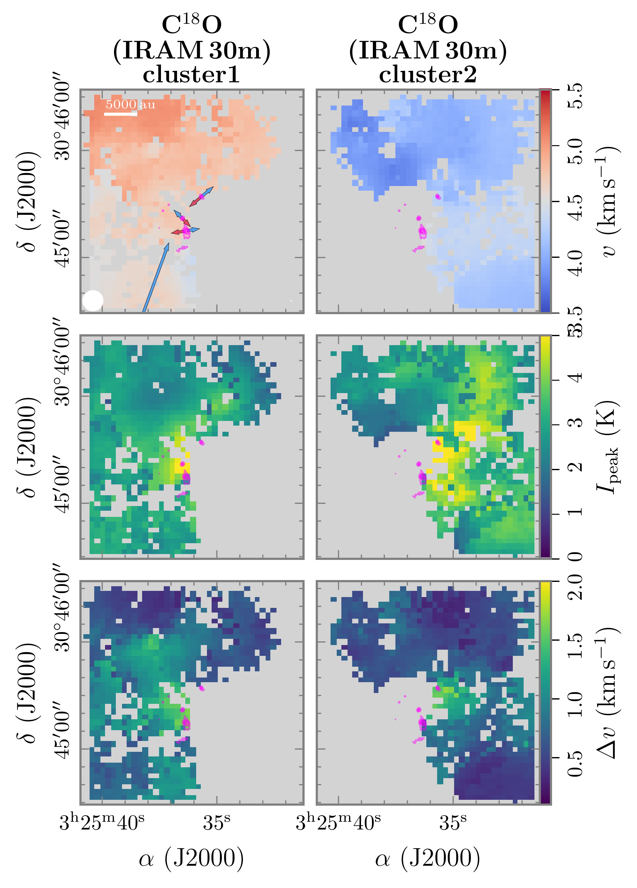
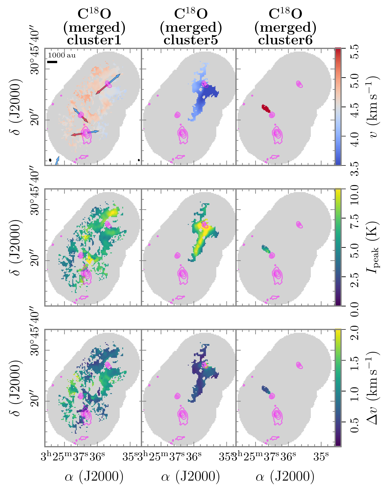
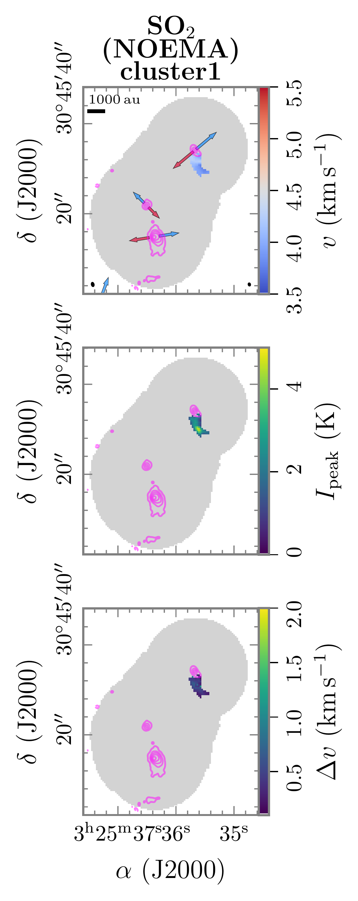

$\newcommand{\ensuremath}{}$
$\newcommand{\xspace}{}$
$\newcommand{\object}[1]{\texttt{#1}}$
$\newcommand{\farcs}{{.}''}$
$\newcommand{\farcm}{{.}'}$
$\newcommand{\arcsec}{''}$
$\newcommand{\arcmin}{'}$
$\newcommand{\ion}[2]{#1#2}$
$\newcommand{\textsc}[1]{\textrm{#1}}$
$\newcommand{\hl}[1]{\textrm{#1}}$
$\newcommand{\footnote}[1]{}$
$\newcommand{\arraystretch}{1.5}$
$\newcommand{\arraystretch}{1.2}$
$\newcommand{\arraystretch}{1.1}$
$\newcommand\as{\ifmmode{\rlap.} " \! \else {\rlap.} " \!\fi}$

# ANTIHEROES-PRODIGE: Quantifying the connection from envelope to disk with the IRAM 30m telescope and NOEMA: I. Attack of the streamers: L1448N's fight for order in the chaos

<mark>Appeared on: 2025-07-23</mark> -  _accepted for publication in A&A, 13 pages, 9 figures_

<mark>C. Gieser</mark>, et al. -- incl., <mark>T. Henning</mark>, <mark>D. Semenov</mark>

**Abstract:** Star formation is a hierarchical process ranging from molecular clouds down to individual protostars. In particular how infalling asymmetric structures, called streamers, delivering new material onto protostellar systems, are connected to the surrounding envelope is not understood. We aim to investigate the connection between the cloud material at 10 000 au scales down to 300 au scales towards L1448N in the Perseus star-forming region hosting three young Class 0/I protostellar systems (IRS3A, IRS3B, and IRS3C). Sensitive molecular line observations taken with the Institut de Radioastronomie Millimetrique (IRAM) 30m telescope and the Northern Extended Millimeter Array (NOEMA) at 1.4 mm are used to study the kinematic properties in the region traced by the molecular lines (C $^{18}$ O, SO, DCN, and SO $_{2}$ ). The temperature in the region is estimated using transitions of c-C $_{3}$ H $_{2}$ . Several infalling streamers are associated with the protostellar systems, some of them traced by C $^{18}$ O and DCN, while one of them is bright in SO and $SO_2$ . The kinematic properties of the former streamers are consistent with the velocities observed at large envelope scales of 10 000 au, while the latter case show different kinematics. The masses and infall rates of the streamers are 0.01 $M_\odot$ and 0.01-0.1 $M_\odot$ and 10 $^{-6}$ $M_\odot$ yr $^{-1}$ and $5-18\times10^{-6}$ $M_\odot$ yr $^{-1}$ for IRS3A and IRS3C, respectively. The envelope mass in the L1448N region is $\approx$ 16 $M_\odot$ , thus the mass of a single streamer is low compared to the envelope mass ( $<$ 1 \% ). However, compared to the estimated mass of the protostellar systems a single streamer could deliver up to 1 \% and 8-17 \% of mass towards IRS3A ( $M_* \approx 1.2$ $M_\odot$ ) and IRS3C ( $M_* \approx 1$ $M_\odot$ ), respectively. The rotational signatures of structures in L1448N are all connected - from the large-scale envelope, infalling streamers, down to the rotation of all three disks. Two of the three Class 0/I protostellar systems are still fed by this surrounding material, which can be associated to the remnant envelope. However, we also find a streamer that is bright in SO and SO $_{2}$ towards IRS3C that could be connected to a nearby sulfur reservoir. Further studies are required to study the diverse chemical compositions and the origin of the streamers.

**Figure 6. -** Line integrated intensity map of C$^{18}$O ($2-1$), SO ($6_{5}-5_{4}$), and SO$_{2}$($4_{2,2}-3_{1,3}$) of the IRAM 30m data (left) and merged or NOEMA data (right). In all panels the line integrated intensity is shown in color. Contours and arrows are the same as in Fig. \ref{fig:continuum}. The synthesized beam of the line and continuum data is shown in the bottom left and right corner, respectively. In all panels scale bars are shown in the top left corner. In the right panels, distinct structures (bridge and stick) seen in molecular emission are indicated by dashed ellipses. (*fig:C18OSOSO2mom0*)

**Figure 5. -** Continuum images toward L1448N. The left panel shows large-scale 1.1 mm continuum emission of L1448  ([Enoch, Young and Glenn 2006]()) . The beam size is shown in the bottom left. The map size of the IRAM 30m observations is highlighted by the grey dashed rectangle. The right panel shows the NOEMA 1.4 mm continuum of L1448N with contour levels at 5, 25, 60, 120, 200$\times \sigma_\mathrm{cont}$ with $\sigma_\mathrm{cont}$=0.78 mJy beam$^{-1}$. The triangles and white labels mark the positions of individual protostars  ([Tobin, Looney and Li 2016]())  and the pink cross marks the recently detected IRS3-ALMA source  ([Looney, Lin and Li 2025]()) . Bipolar outflow directions launched by the three protostellar systems are marked by red and blue arrows, including the blueshifted outflow lobe launched by L1448-mm towards the southeast. The synthesized beam of the NOEMA continuum data is shown in the bottom left corner. In both panels scale bars are shown in the top left corner. (*fig:continuum*)

**Figure 8. -** Main clusters extracted with \texttt{DBSCAN}. The velocity, peak intensity, and line width are shown in color in the top, central, and bottom panels, respectively. Contours and arrows are the NOEMA 1.4 mm continuum with the same levels as in Fig. \ref{fig:continuum}. In cluster 1 of each analyzed data set, the synthesized beam of the line and continuum data is shown in the bottom left and right corner, respectively, and scale bars are shown in the top left corner. The remaining clusters are shown in Fig. \ref{fig:clusters_app}. (*fig:clusters*)

