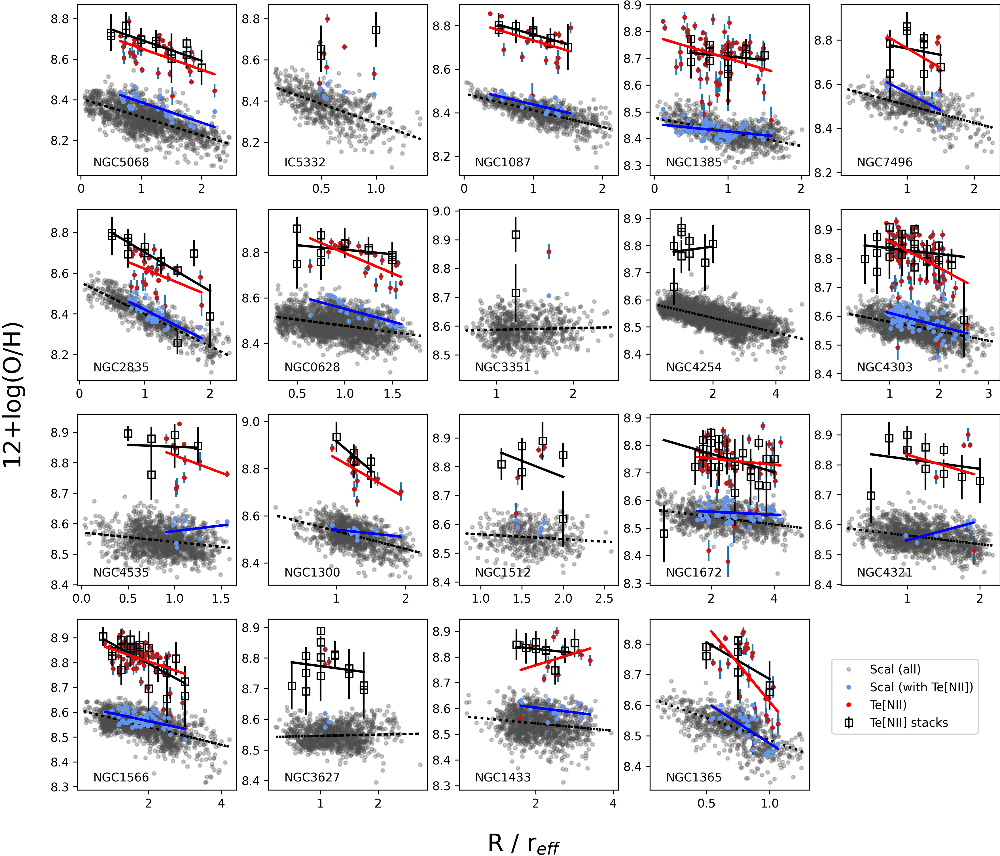
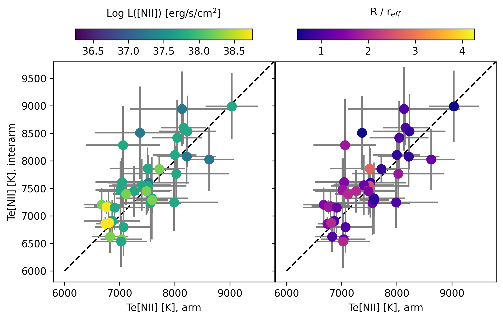
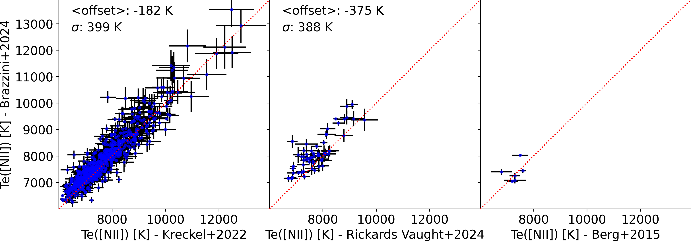

$\newcommand{\ensuremath}{}$
$\newcommand{\xspace}{}$
$\newcommand{\object}[1]{\texttt{#1}}$
$\newcommand{\farcs}{{.}''}$
$\newcommand{\farcm}{{.}'}$
$\newcommand{\arcsec}{''}$
$\newcommand{\arcmin}{'}$
$\newcommand{\ion}[2]{#1#2}$
$\newcommand{\textsc}[1]{\textrm{#1}}$
$\newcommand{\hl}[1]{\textrm{#1}}$
$\newcommand{\footnote}[1]{}$
$\newcommand{\oiii}{[O \textsc{iii}]}$
$\newcommand{\nii}{[N \textsc{ii}]}$
$\newcommand{\sii}{[S \textsc{ii}]}$
$\newcommand{\oi}{[O \textsc{i}]}$
$\newcommand{\niion}{[N \textsc{i}]}$
$\newcommand{\hei}{[He \textsc{i}]}$
$\newcommand{\siii}{[S \textsc{iii}]}$
$\newcommand{\oii}{[O \textsc{ii}]}$
$\newcommand{\neii}{[Ne \textsc{ii}]}$
$\newcommand{\hii}{H \textsc{ii}}$
$\newcommand{\ha}{H\alpha}$
$\newcommand{\hb}{H\beta}$
$\newcommand{\niiauroral}{[N \textsc{ii}]\lambda5755}$
$\newcommand{\doh}{\Delta(O/H)}$
$\newcommand{\sigmaoh}{\sigma(O/H)}$
$\newcommand{\te}{T_{\rm e}}$
$\newcommand{\logten}{log_{10}}$
$\newcommand{\nee}{n_{\rm e}}$
$\newcommand{\OSU}{\label{OSU} Department of Astronomy, The Ohio State University, 140 West 18th Avenue, Columbus, Ohio 43210, USA}$
$\newcommand{\Alberta}{\label{Alberta} Department of Physics, University of Alberta, Edmonton, AB T6G 2E1, Canada}$
$\newcommand{\ANU}{\label{ANU} Research School of Astronomy and Astrophysics, Australian National University, Canberra, ACT 2611, Australia}$
$\newcommand{\IPAC}{\label{IPAC} Caltech-IPAC, 1200 E. California Blvd. Pasadena, CA 91125, USA}$
$\newcommand{\Carnegie}{\label{Carnegie} Observatories of the Carnegie Institution for Science, 813 Santa Barbara Street, Pasadena, CA 91101, USA}$
$\newcommand{ÇAPP}{\label{CCAPP} Center for Cosmology and Astroparticle Physics, 191 West Woodruff Avenue, Columbus, OH 43210, USA}$
$\newcommand{\CfA}{\label{CfA} Harvard-Smithsonian Center for Astrophysics, 60 Garden Street, Cambridge, MA 02138, USA}$
$\newcommand{\CITEVA}{\label{CITEVA} Centro de Astronomía (CITEVA), Universidad de Antofagasta, Avenida Angamos 601, Antofagasta, Chile}$
$\newcommand{\CNRS}{\label{CNRS} CNRS, IRAP, 9 Av. du Colonel Roche, BP 44346, F-31028 Toulouse cedex 4, France}$
$\newcommand{\ESO}{\label{ESO} European Southern Observatory, Karl-Schwarzschild Stra{\ss}e 2, D-85748 Garching bei München, Germany}$
$\newcommand{\ESOChile}{\label{ESOChile} European Southern Observatory, Avenida Alonso de Cordoba 3107, Casilla 19, Santiago 19001, Chile}$
$\newcommand{\HD}{\label{HD} Astronomisches Rechen-Institut, Zentrum für Astronomie der Universität Heidelberg, Mönchhofstra\ss e 12-14, D-69120 Heidelberg, Germany}$
$\newcommand{\ICRAR}{\label{ICRAR} International Centre for Radio Astronomy Research, University of Western Australia, 35 Stirling Highway, Crawley, WA 6009, Australia}$
$\newcommand{\IRAM}{\label{IRAM} Institut de Radioastronomie Millimétrique (IRAM), 300 Rue de la Piscine, F-38406 Saint Martin d'Hères, France}$
$\newcommand{\ITA}{\label{ITA} Universität Heidelberg, Zentrum für Astronomie, Institut für Theoretische Astrophysik, Albert-Ueberle-Str 2, D-69120 Heidelberg, Germany}$
$\newcommand{\IWR}{\label{IWR} Universität Heidelberg, Interdisziplinäres Zentrum für Wissenschaftliches Rechnen, Im Neuenheimer Feld 205, D-69120 Heidelberg, Germany}$
$\newcommand{\JHU}{\label{JHU} Department of Physics and Astronomy, The Johns Hopkins University, Baltimore, MD 21218, USA}$
$\newcommand{\Leiden}{\label{Leiden} Leiden Observatory, Leiden University, P.O. Box 9513, 2300 RA Leiden, The Netherlands}$
$\newcommand{\Maryland}{\label{Maryland} Department of Astronomy, University of Maryland, College Park, MD 20742, USA}$
$\newcommand{\MPE}{\label{MPE} Max-Planck-Institut für extraterrestrische Physik, Giessenbachstra{\ss}e 1, D-85748 Garching, Germany}$
$\newcommand{\MPIA}{\label{MPIA} Max-Planck-Institut für Astronomie, Königstuhl 17, D-69117, Heidelberg, Germany}$
$\newcommand{\Nagoya}{\label{Nagoya} Department of Physics, Nagoya University, Furo-cho, Chikusa-ku, Nagoya, Aichi 464-8602, Japan}$
$\newcommand{\NRAO}{\label{NRAO} National Radio Astronomy Observatory, 520 Edgemont Road, Charlottesville, VA 22903-2475, USA}$
$\newcommand{\OAN}{\label{OAN} Observatorio Astronómico Nacional (IGN), C/Alfonso XII, 3, E-28014 Madrid, Spain}$
$\newcommand{\ObsParis}{\label{ObsParis} Sorbonne Université, Observatoire de Paris, Université PSL, CNRS, LERMA, F-75014, Paris, France}$
$\newcommand{\Princeton}{\label{Princeton} Department of Astrophysical Sciences, Princeton University, Princeton, NJ 08544 USA}$
$\newcommand{\UToledo}{\label{UToledo} University of Toledo, 2801 W. Bancroft St., Mail Stop 111, Toledo, OH, 43606}$
$\newcommand{\Toulouse}{\label{Toulouse} Université de Toulouse, UPS-OMP, IRAP, F-31028 Toulouse cedex 4, France}$
$\newcommand{\UBonn}{\label{UBonn} Argelander-Institut für Astronomie, Universität Bonn, Auf dem Hügel 71, 53121 Bonn, Germany}$
$\newcommand{\UChile}{\label{UChile} Departamento de Astronomía, Universidad de Chile, Camino del Observatorio 1515, Las Condes, Santiago, Chile}$
$\newcommand{\UConn}{\label{UConn} Department of Physics, University of Connecticut, Storrs, CT, 06269, USA}$
$\newcommand{\UCSD}{\label{UCSD} Center for Astrophysics and Space Sciences, Department of Physics,  University of California, San Diego, 9500 Gilman Drive, La Jolla, CA 92093, USA}$
$\newcommand{\UGent}{\label{UGent} Sterrenkundig Observatorium, Universiteit Gent, Krijgslaan 281 S9, B-9000 Gent, Belgium}$
$\newcommand{\ULyon}{\label{ULyon} Univ Lyon, Univ Lyon 1, ENS de Lyon, CNRS, Centre de Recherche Astrophysique de Lyon UMR5574,\ F-69230 Saint-Genis-Laval, France}$
$\newcommand{\UMass}{\label{UMass} University of Massachusetts—Amherst, 710 N. Pleasant Street, Amherst, MA 01003, USA}$
$\newcommand{\UWyoming}{\label{UWyoming} Department of Physics and Astronomy, University of Wyoming, Laramie, WY 82071, USA}$
$\newcommand{\LAM}{\label{LAM} Aix Marseille Univ, CNRS, CNES, LAM (Laboratoire d’Astrophysique de Marseille), Marseille, France}$
$\newcommand{\UHawaii}{\label{UHawaii} Institute for Astronomy, University of Hawaii, 2680 Woodlawn Drive, Honolulu, HI 96822, USA}$
$\newcommand{\UCM}{\label{UCM} Departamento de Física de la Tierra y Astrofísica, Universidad Complutense de Madrid, E-28040, Spain}$
$\newcommand{\IPARC}{\label{IPARC} Instituto de Física de Partículas y del Cosmos IPARCOS, Facultad de Ciencias Físicas, Universidad Complutense de Madrid, E-28040, Spain}$
$\newcommand{\STScI}{\label{STScI} Space Telescope Science Institute, 3700 San Martin Drive, Baltimore, MD 21218, USA}$
$\newcommand{\McMaster}{\label{McMaster} Department of Physics and Astronomy, McMaster University, 1280 Main Street West, Hamilton, ON L8S 4M1, Canada}$
$\newcommand{\INAF}{\label{INAF} INAF -- Osservatorio Astrofisico di Arcetri, Largo E. Fermi 5, I-50157, Firenze, Italy}$
$\newcommand{\Sydney}{\label{Sydney} Sydney Institute for Astronomy, School of Physics A28, The University of Sydney, NSW 2006, Australia}$
$\newcommand{\CITA}{\label{CITA} Canadian Institute for Theoretical Astrophysics (CITA), University of Toronto, 60 St George St, Toronto, ON M5S 3H8, Canada}$
$\newcommand{\ASIAA}{\label{ASIAA} Institute of Astronomy and Astrophysics, Academia Sinica, No. 1, Sec. 4, Roosevelt Road, Taipei 10617, Taiwan}$
$\newcommand{\TKU}{\label{TKU} Department of Physics, Tamkang University, No.151, Yingzhuan Rd., Tamsui Dist., New Taipei City 251301, Taiwan}$
$\newcommand{\PSMA}{\label{PSMA} Penn State Mont Alto, 1 Campus Drive, Mont Alto, PA  17237, USA}$
$\newcommand{\ILL}{\label{ILL} ILL}$
$\newcommand{\stromlo}{\label{stromlo} Research School of Astronomy and Astrophysics, Australian National University, Mt Stromlo Observatory, Weston Creek, ACT 2611, Australia}$
$\newcommand{\UCatolica}{\label{UCatolica} Instituto de Astronomía, Universidad Católica del Norte, Av. Angamos 0610, Antofagasta, Chile}$
$\newcommand{\UT}{\label{UT} McDonald Observatory, The University of Texas at Austin, 1 University Station, Austin, TX 78712-0259, USA}$
$\newcommand{\Vanderbilt}{\label{Vanderbilt} Department of Physics and Astronomy, Vanderbilt University, VU Station 1807, Nashville, TN 37235, USA}$
$\newcommand{\UNF}{\label{UNF} Department of Physics, University of North Florida, 1 UNF Dr. Jacksonville FL 32224}$
$\newcommand{\NAOC}{\label{NAOC} Chinese Academy of Sciences South America Center for Astronomy, National Astronomical Observatories, CAS, Beijing 100101, China}$
$\newcommand{\CASA}{\label{CASA} Center for Astrophysics and Space Astronomy, University of Colorado, 389 UCB, Boulder, CO 80309-0389, USA}$
$\newcommand{\UNAM}{\label{UNAM} Universidad Nacional Autónoma de México, Instituto de Astronomía, AP 106, Ensenada 22800, BC, México}$
$\newcommand{\UDP}{\label{UDP} Instituto de Estudios Astrofísicos, Facultad de Ingeniería y Ciencias, Universidad Diego Portales, Av. Ejército Libertador 441, Santiago, Chile}$
$\newcommand{\Steward}{\label{Steward} Steward Observatory, University of Arizona, 933 N. Cherry Ave., Tucson, AZ 85721-0065, USA}$
$\newcommand{\APO}{\label{APO} Apache Point Observatory and New Mexico State University, P.O. Box 59,$
$Sunspot, NM 88349-0059, USA}$
$\newcommand{\UNAMCU}{\label{UNAMCU} Universidad Nacional Autónoma de México, Instituto de Astronomía, AP 70-264, CDMX 04510, México}$
$\newcommand{\UWash}{\label{UWash} Department of Astronomy, University of Washington, Seattle, WA, 98195}$
$\newcommand{Ç}{\label{CC} Department of Physics, Colorado College, Colorado Springs, CO 80903}$
$\newcommand{\Utah}{\label{Utah} Department of Physics and Astronomy, University of Utah, 115 S. 1400 E., Salt Lake City, UT 84112, USA}$
$\newcommand{\UConcepcion}{\label{UConcepcion} Departamento de Astronomía, Universidad de Concepción, Casilla 160-C, Concepción, Chile}$
$\newcommand{\FCLA}{\label{FCLA} Franco-Chilean Laboratory for Astronomy, IRL 3386, CNRS and Universidad de Chile, Santiago, Chile}$
$\newcommand{\Oklahoma}{\label{Oklahoma} Homer L. Dodge Department of Physics and Astronomy, University of Oklahoma, Norman, OK 73019, USA}$
$\newcommand{\UIUC}{\label{UIUC} Department of Astronomy, University of Illinois, Urbana, IL 61801, USA}$
$\newcommand{\Harvard}{\label{Harvard} Harvard-Smithsonian Center for Astrophysics, Cambridge, MA 02138, USA}$
$\newcommand{\caltech}{\label{caltech} Department of Astronomy, California Institute of Technology, Pasadena, CA 91125, USA}$
$\newcommand{\UOA}{\label{UOA} Department of Physics, University of Arkansas, 226 Physics Building, 825 West Dickson Street, Fayetteville, AR 72701, USA}$
$\newcommand{\trieste}{\label{trieste} Department of Physics, Astronomy Section, University of Trieste, Via G.B. Tiepolo, 11, I-34143 Trieste, Italy}$
$\newcommand{\Rad}{\label{Rad}{ Elizabeth S. and Richard M. Cashin Fellow at the Radcliffe Institute for Advanced Studies at Harvard University, 10 Garden Street, Cambridge, MA 02138, USA}}$
$\newcommand{\UCT}{\label{UCT}{ Department of Astronomy, University of Cape Town, Rondebosch 7701, Cape Town, South Africa}}$
$\newcommand{\Oxford}{\label{Oxford}{ Sub-department of Astrophysics, Department of Physics, University of Oxford, Keble Road, Oxford OX1 3RH, UK}}$
$\newcommand\hyper{@linkstart##1##2 $
$     }$
$\newcommand\hyper{@linkstart##1##2 $
$     }$
$\newcommand\hyper{@linkstart##1##2 $
$     }$
$\newcommand\hyper{@linkstart##1##2 $
$     }$
$\newcommand\natexlab{#1}$

#    Temperature based radial metallicity gradients in nearby galaxies   

<mark>Appeared on: 2025-07-29</mark> -  _12 pages, 6 figures, plus appendix. Accepted by A&A_

<mark>K. Kreckel</mark>, et al.

**Abstract:** Gas-phase abundances provide insights into the baryon cycle, with radial gradients and 2D metallicity distributions tracking how metals build up and redistribute within galaxy disks over cosmic time. We use a catalog of 22,958 $\hii$ regions across 19 nearby spiral galaxies to examine how precisely the radial abundance gradients can be traced using only the $\niiauroral$ electron temperature as a proxy for `direct method' metallicities. Using 534 direct detections of the temperature sensitive $\niiauroral$ auroral line, we measure gradients in 15 of the galaxies. Leveraging our large catalog of individual HII regions, we stack in bins of $\hii$ region $\nii$ $\lambda$ 6583 luminosity and radius to recover stacked radial gradients. We find good agreement between the metallicity gradients from the stacked spectra,  those gradients from individual regions and those from strong line methods. In addition, particularly in the stacked $\te$ $\nii$ measurements, some galaxies show very low ( $<$ 0.05 dex) scatter in metallicities, indicative of a well-mixed ISM. We examine individual high confidence (S/N $>$ 5) outliers and identify 13 regions across 9 galaxies with anomalously low metallicity, although this is not strongly reflected in the strong line method metallicities. By stacking arm and interarm regions, we find no systematic evidence for offsets in metallicity between these environments, suggesting enrichment within spiral arms is due to very localized processes. This work demonstrates the potential to systematically exploit the single $\niiauroral$ auroral line for detailed gas-phase abundance studies of galaxies. It provides strong validation of previous  results, based on the strong line calibrations, of a well-mixed ISM across typical star-forming spiral galaxies.

**Figure 5. -** A comparison of metallicity gradients. The Scal values (grey) are compared with individual $\te$$\nii$ metallicities (red) and $\te$$\nii$ stacked metallicities (black). For context, the subsample of individual regions with $\te$$\nii$ detections are highlighted within the Scal measurements in light blue. Linear radial gradients are fit when there are at least 5 measurements that cover at least 0.5 r$_{\rm eff}$. Note that $\hii$ regions in NGC 4254 and NGC 4535 do not cover the full disk due to the AO notch filter. Galaxies are ordered from low (top-left) to high (bottom-right) stellar mass, and axis scalings are not  matched  between galaxies.   (*fig:gradients_scal*)

**Figure 2. -** A comparison of $\te$$\nii$ measured in stacked arm and interarm environments. We color-code the points by L($\nii$) (left) and radius (right) but see no evidence for trends or bulk offsets between environments.  (*fig:stack-arm-interarm*)

**Figure 3. -** A comparison of $\te$$\nii$ measurements used in this work \citep{Brazzini2024} with three different sets of measurements available in the literature. While auroral line fits in \cite{Kreckel2022}(left) and \cite{RRV2024}(center) are both based on the same underlying MUSE data set, different assumptions have been made in the SSP fitting and region boundaries. \cite{Berg2015} measurements (right) are based on independent long-slit spectroscopy. As there are only five regions in common with \cite{Berg2015}, no offset or scatter is calculated in comparison with this sample. (*fig:compare_Te*)

