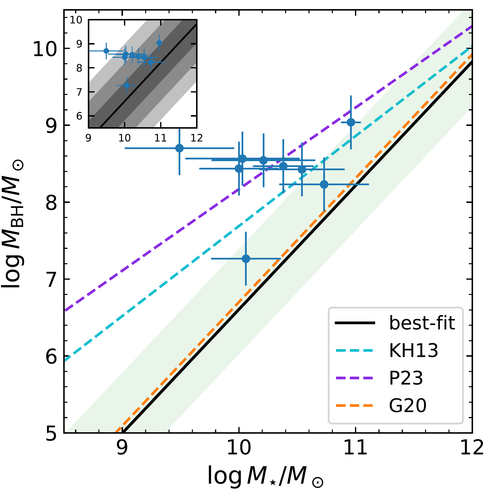
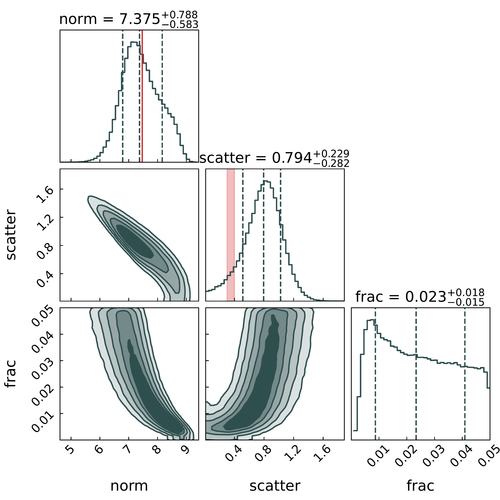
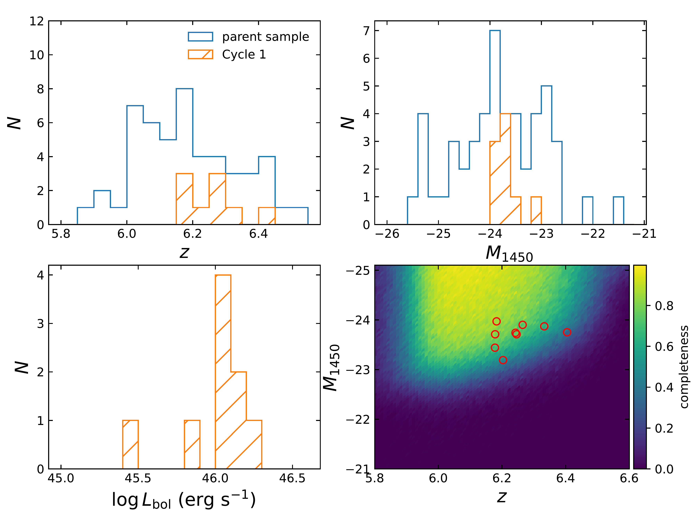
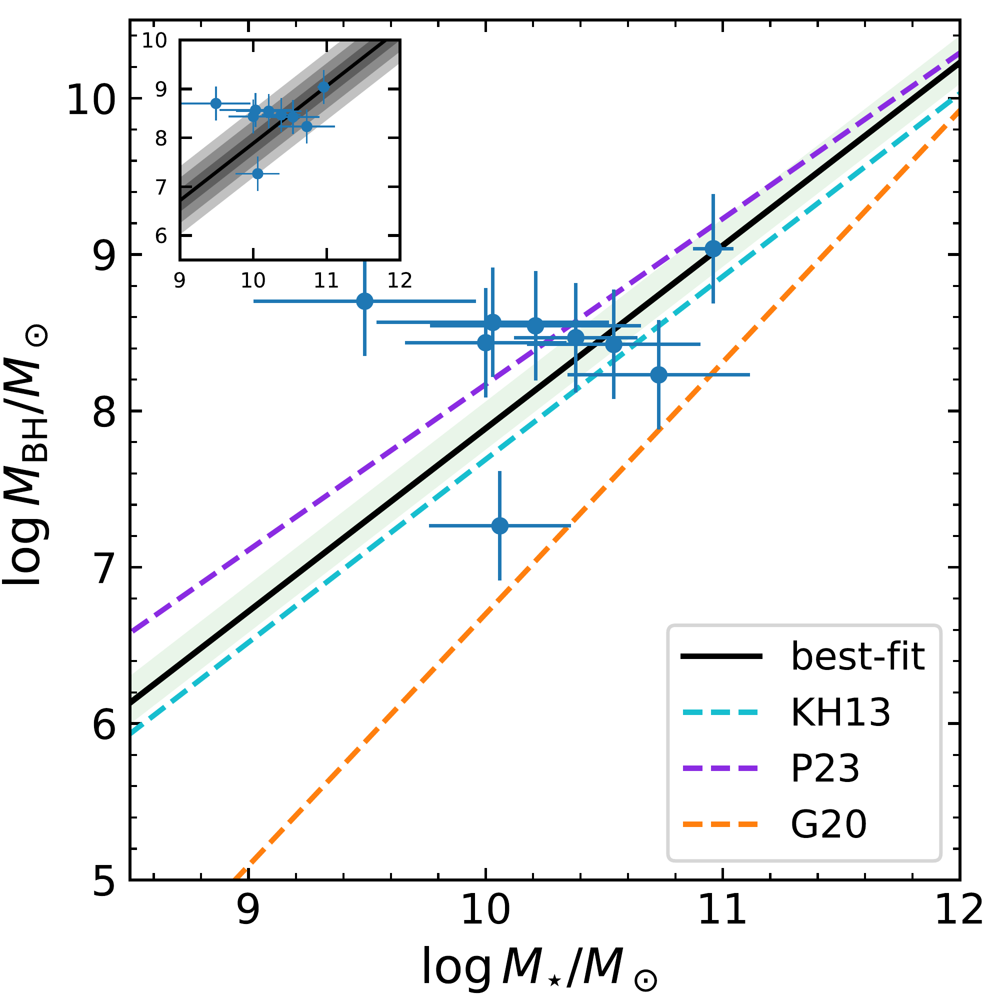
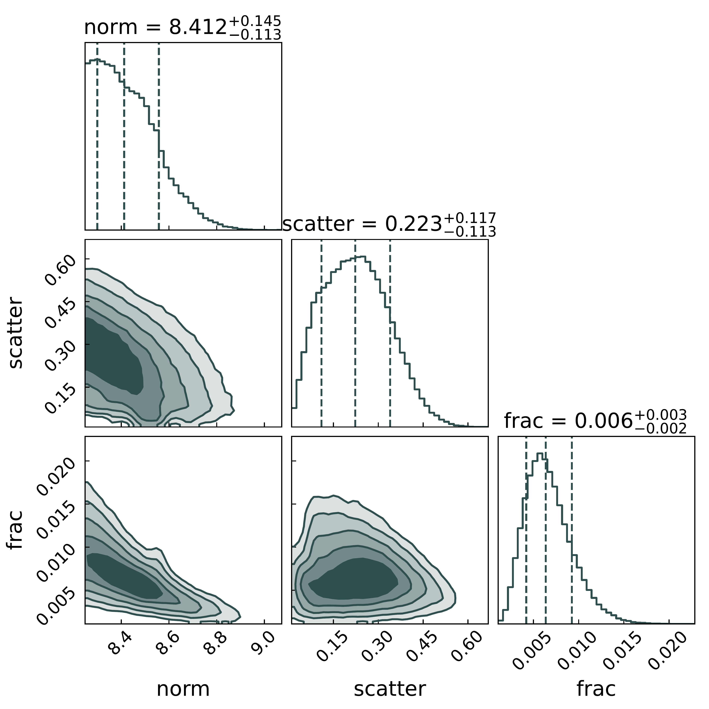

$\newcommand{\ensuremath}{}$
$\newcommand{\xspace}{}$
$\newcommand{\object}[1]{\texttt{#1}}$
$\newcommand{\farcs}{{.}''}$
$\newcommand{\farcm}{{.}'}$
$\newcommand{\arcsec}{''}$
$\newcommand{\arcmin}{'}$
$\newcommand{\ion}[2]{#1#2}$
$\newcommand{\textsc}[1]{\textrm{#1}}$
$\newcommand{\hl}[1]{\textrm{#1}}$
$\newcommand{\footnote}[1]{}$
$\newcommand$
$\newcommand$
$\newcommand{\red}[1]{\textcolor{red}{#1}}$
$\newcommand{\blue}[1]{\textcolor{blue}{#1}}$
$\newcommand{\vdag}{(v)^\dagger}$
$\newcommand{\Msun}{\ensuremath{\mathrm{M}_\odot}\xspace}$
$\newcommand{\MBH}{\ensuremath{M_\mathrm{BH}}\xspace}$
$\newcommand{\MS}{\ensuremath{M_*}\xspace}$
$\newcommand{\myemail}{silverman@ipmu.jp}$

# SHELLQs-JWST perspective on the intrinsic mass relation between supermassive black holes and their host galaxies at $z>6$

<mark>Appeared on: 2025-08-01</mark> -  _12 pages, 5 figures, Submitted to ApJ, comments welcome_

J. D. Silverman, et al. -- incl., <mark>J. Li</mark>, <mark>K. Jahnke</mark>, <mark>F. Walter</mark>

**Abstract:** The relation between the masses of supermassive black holes (SMBHs) and their host galaxies encodes information on their mode of growth, especially at the earliest epochs. The James Webb Space Telescope (JWST) has opened such investigations by detecting the host galaxies of AGN and more luminous quasars within the first billion years of the universe ( $z\gtrsim6$ ). Here, we evaluate the relation between the mass of SMBHs and the total stellar mass of their host galaxies using a sample of nine quasars at $6.18\leq z \leq 6.4$ from the Subaru High- $z$ Exploration of Low-luminosity Quasars (SHELLQs) survey with NIRCam and NIRSpec observations.  We find that the observed location of these quasars in the SMBH--galaxy mass plane ( $\log M_\mathrm{BH}/\Msun \sim8$ --9; $\log M_*/\Msun \sim9.5$ --11)  is consistent with a non-evolving intrinsic mass relation with dispersion ( $0.80_{-0.28}^{+0.23}$ dex) higher than the local value ( $\sim$ 0.3--0.4 dex). Our analysis is based on a forward model of systematics and includes a consideration of the impact of selection effects and measurement uncertainties, an assumption on the slope of the mass relation, and finds a reasonable AGN fraction (2.3 \% ) of galaxies at $z\sim6$ with an actively growing UV-unobscured black hole. In particular, models with a substantially higher normalisation in $\MBH$ would require an unrealistically low intrinsic dispersion ( $\sim$ 0.22 dex) and a lower AGN fraction ( $\sim$ 0.6 \% ). Consequently, our results predict a large population of AGNs at lower black hole masses, as are now just starting to be discovered in focused efforts with JWST.

**Figure 2. -** $Top$ Black hole mass ($\MBH$) versus stellar mass ($\MS$) of the host galaxy for the 9 SHELLQs quasars. The best-fit relation (black line) and scatter (1$\sigma$; shaded area) are indicated which incorporate selection biases and measurement uncertainties. Local relations of  ([Greene, Strader and Ho 2020]()) (G20) and  ([Kormendy and Ho 2013]()) (KH13) are also indicated, along with the high-$z$ assessment of  ([Pacucci, et. al 2023]()) (P23) using JWST AGN in CEERS  ([Kocevski, Finkelstein and Barro 2024]())  and JADES  ([Maiolino, Scholtz and Curtis-Lake 2024]()) . The inset plot displays the location of the observed quasar sample with respect to our best-fit relation with shaded areas marking the 1--3$\sigma$ ranges. $Bottom$ Best-fit inference on model parameters (normalization, scatter of the linear mass relation, and AGN fraction) with the slope fixed to 1.61. The normalization of the G20 relation is indicated by the vertical red line in the top panel, while the local intrinsic dispersion of quiescent galaxies is shown by the red vertical band in the top-middle panel. (*fig:mass_rel*)

**Figure 1. -** Properties of the Cycle 1 sample as drawn from SHELLQs  ([Matsuoka, Strauss and Kashikawa 2018]()) : redshift, absolute UV magnitude, bolometric luminosity, and selection completeness as a function of absolute magnitude and redshift. (*fig:sample*)

**Figure 4. -** Same as Figure \ref{fig:mass_rel} but with the intrinsic mass relation forced to be larger than the [Kormendy and Ho (2013)]() relation (i.e., overmassive case) and the slope fixed to 1.17. As shown, this case demands a mass relation with very little dispersion (0.22, even less than the local relation) and a very low AGN fraction (0.6\%); therefore, this solution is not preferred. (*fig:mass_rel_high*)

