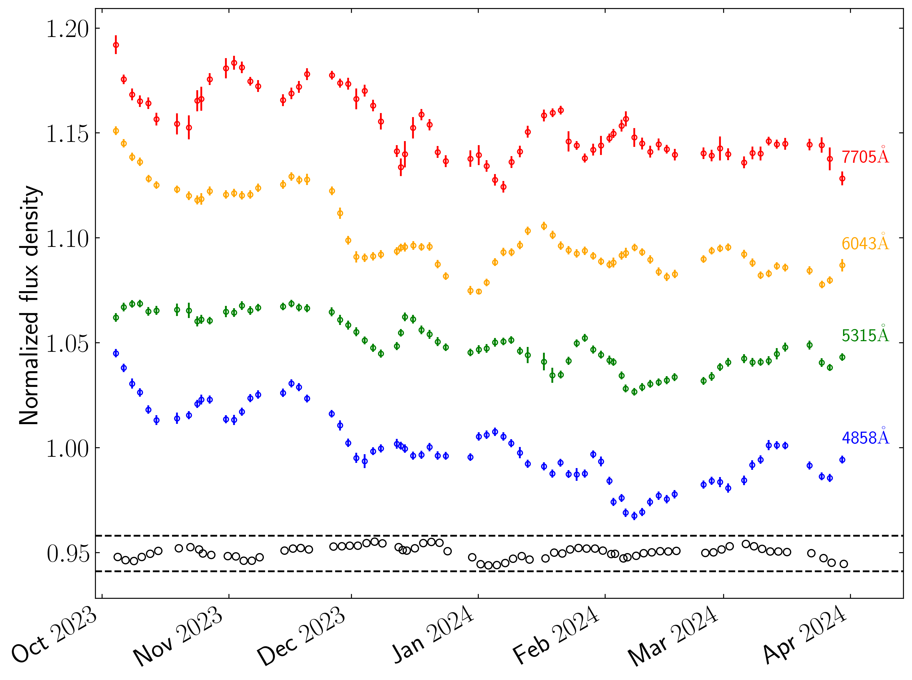
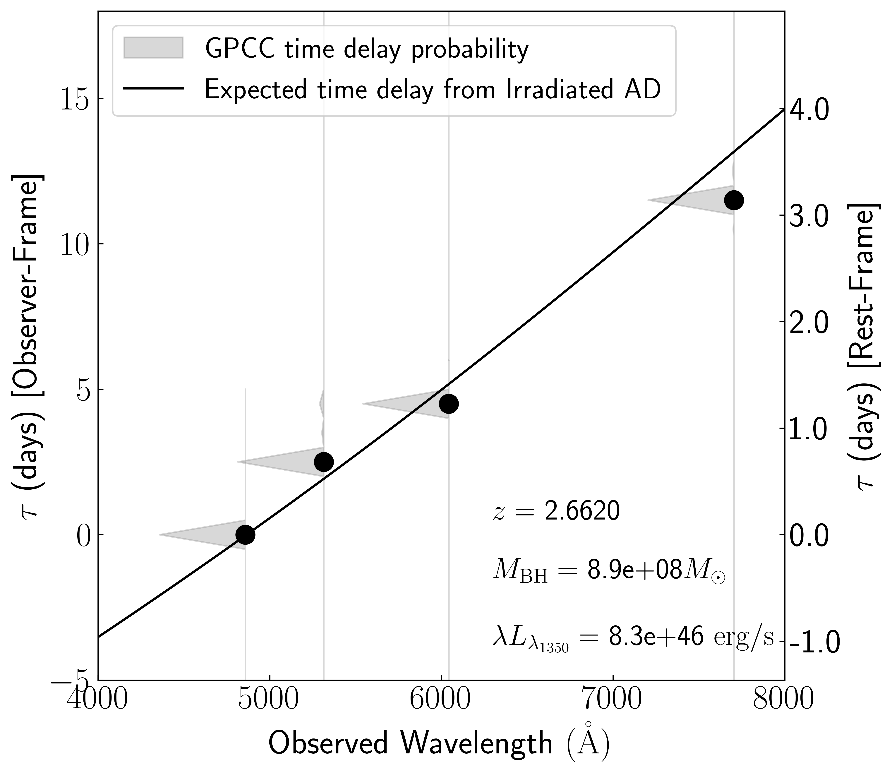
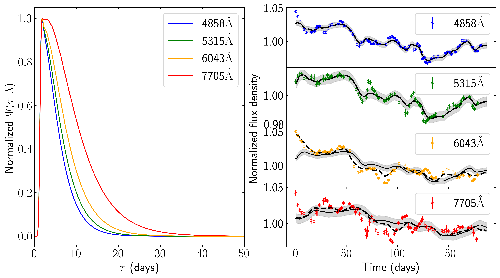

$\newcommand{\ensuremath}{}$
$\newcommand{\xspace}{}$
$\newcommand{\object}[1]{\texttt{#1}}$
$\newcommand{\farcs}{{.}''}$
$\newcommand{\farcm}{{.}'}$
$\newcommand{\arcsec}{''}$
$\newcommand{\arcmin}{'}$
$\newcommand{\ion}[2]{#1#2}$
$\newcommand{\textsc}[1]{\textrm{#1}}$
$\newcommand{\hl}[1]{\textrm{#1}}$
$\newcommand{\footnote}[1]{}$
$\newcommand{\bd}[1]{\mbox{\boldmath #1}}$
$\newcommand{\arraystretch}{1.4}$
$\newcommand{\civ}{{C\sc{iv}}\/}$
$\newcommand{\ciii}{{C\sc{iii}]}\/}$

# Accretion disc reverberation mapping in a high-redshift quasar

<mark>Appeared on: 2025-08-04</mark> -  _Accepted for publication in Astronomy & Astrophysics_

F. P. Nuñez, <mark>E. Bañados</mark>, S. Panda, J. Heidt

**Abstract:** Powered by supermassive black holes at their centers, quasars are among the most luminous objects in the Universe, serving as important probes of cosmic history and galaxy evolution. The size of the accretion disc surrounding the black hole is a critical parameter for understanding quasar physics and their potential use as standard candles in cosmology. However, direct measurements of accretion disc sizes have so far been confined to the Local Universe ( $z<0.2$ ), limiting our understanding of quasars during the peak of cosmic activity. Here, we report the first direct measurement of the accretion disc size in the quasar QSO J0455-4216 at $z=2.66$ , when the Universe was only $\sim2$ Gyrs old. Medium-band filters mounted on the MPG/ESO 2.2-metre telescope at La Silla Observatory were used to isolate continuum emission regions during a six-month monitoring campaign. The light curves exhibit pronounced variability features and enabled the detection of inter-band time delays from different parts of the disc. We mapped the disc and located its ultraviolet-emitting outermost region at $\( 3.02^{+0.33}_{-0.57} \)$ light-days from the black hole ( $\( \sim 500 \)$ AU). Given a supermassive black hole 900 million times the mass of the Sun, these measurements validate accretion disc theory at an unprecedented redshift and pave the way for efficient black hole mass estimates, reducing decades-long spectroscopic reverberation campaigns to just a few years or less.

**Figure 1. -** Multi-band light curves of QSO J0455-4216. Variability of around 7\% is observed across all wavelengths for the entire campaign (6 months), while a smaller variability of about 5\% is present within individual months of observations. Micro-variability on the order of 2\%-3\% is evident on timescales of days, with delayed features between bands of a few days. For comparison, the light curve of a representative reference star in the field used in constructing the AGN light curves is shown at the bottom. Dotted lines indicate a 1\% variability and all light curves are vertically shifted for clarity. (*fig:Figure1*)

**Figure 2. -** Observed time delay spectrum. The shaded regions represent the time delay ($\tau$) probability distributions obtained using the GPCC method (\citealt{2023A&A...674A..83P}), with black dots indicating the most likely delay corresponding to the peak of each distribution. The solid line denotes the expected delay from an optically thick, geometrically thin accretion disc irradiated by a lamp post geometry. A summary of the physical parameters used in the model, including the black hole mass ($M_{\rm BH}$), luminosity ($\lambda L_{\lambda_{1350}}$), and redshift ($z$), is provided. (*fig:Figure2*)

**Figure 3. -** _Left_: Normalized accretion disc transfer functions \(\Psi(\tau|\lambda)\) for the four photometric bands: \( 4858   \text{Å} \)(blue), \( 5315   \text{Å} \)(green), \( 6043   \text{Å} \)(orange), and \( 7705   \text{Å} \)(red). As predicted by standard thin-disc (SS73) and lamp-post models, the transfer functions broaden with increasing wavelength. Longer-wavelength emission arises from larger radii, resulting in longer time delays due to the greater light travel distance. _Right_: Observed normalized continuum light curves (points with error bars) compared with model predictions. Dashed lines show the results from a single-band modelling approach, in which a latent signal is inferred independently for each filter. Solid black lines show the model light curves computed from the joint GPCC-inferred latent signal, convolved with the corresponding transfer functions. The shaded regions represent the \( 1\sigma \) uncertainties propagated through the model scaling process; see Appendix \ref{ad:simul} for details. (*fig:Figure3*)

