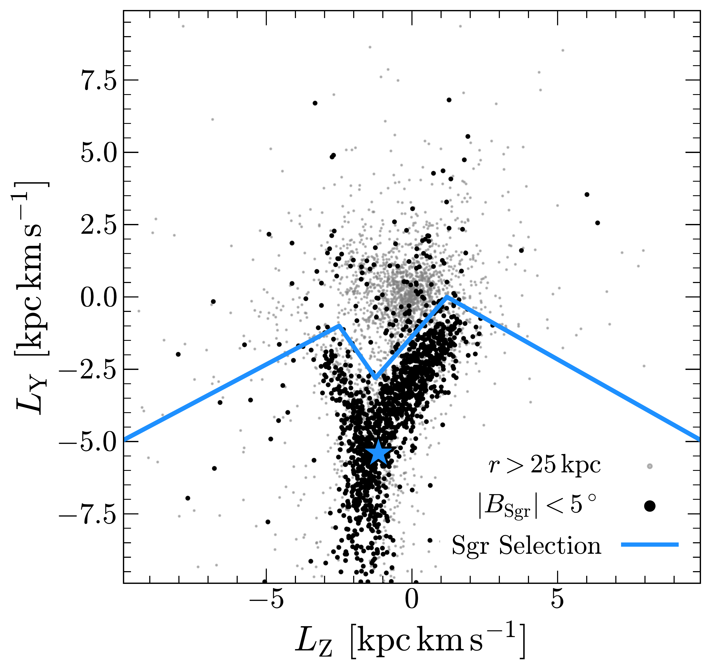
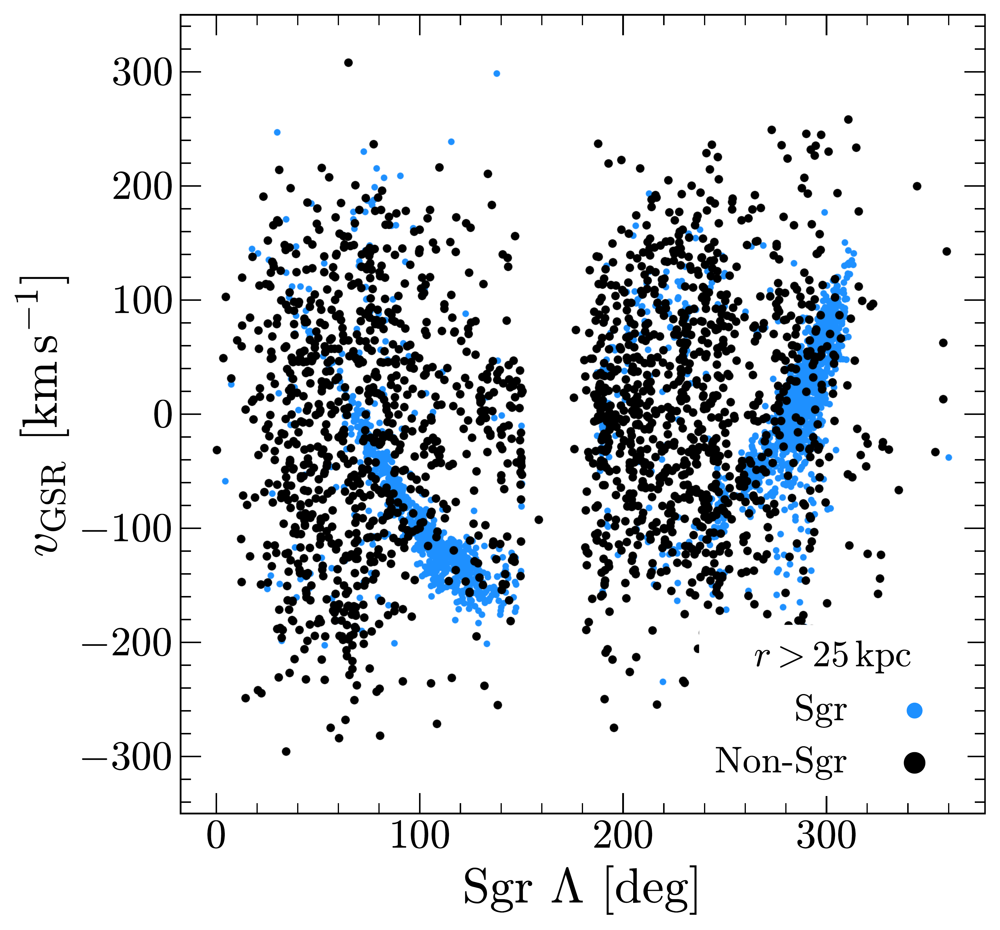
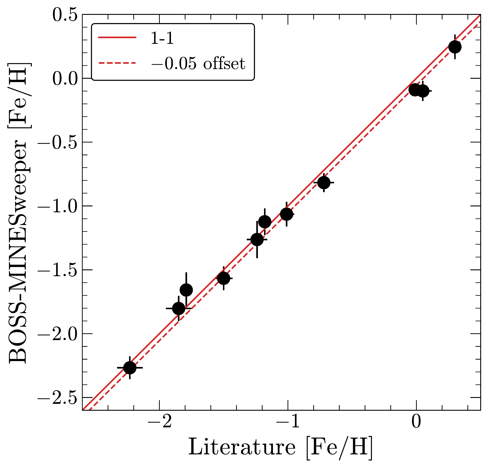
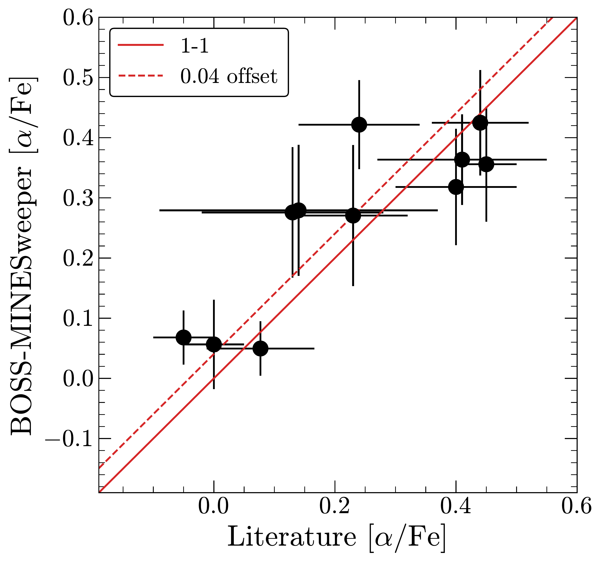
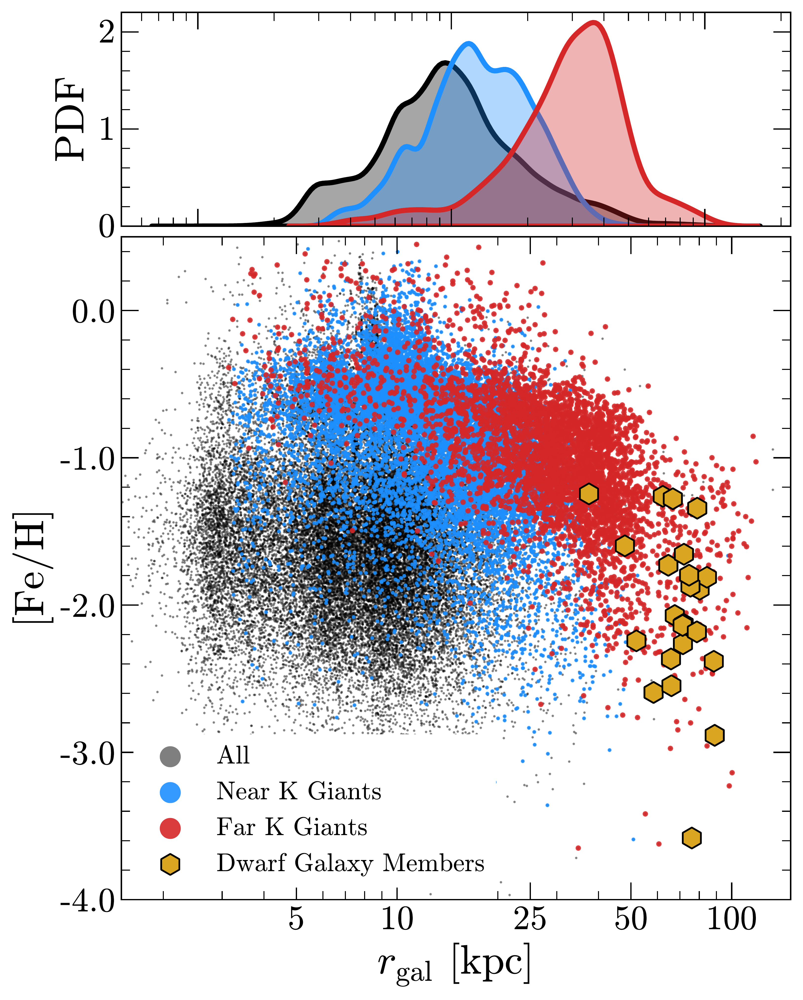

$\newcommand{\ensuremath}{}$
$\newcommand{\xspace}{}$
$\newcommand{\object}[1]{\texttt{#1}}$
$\newcommand{\farcs}{{.}''}$
$\newcommand{\farcm}{{.}'}$
$\newcommand{\arcsec}{''}$
$\newcommand{\arcmin}{'}$
$\newcommand{\ion}[2]{#1#2}$
$\newcommand{\textsc}[1]{\textrm{#1}}$
$\newcommand{\hl}[1]{\textrm{#1}}$
$\newcommand{\footnote}[1]{}$
$\newcommand{\vdag}{(v)^\dagger}$
$\newcommand$
$\newcommand$
$\newcommand$
$\newcommand$
$\newcommand$
$\newcommand$
$\newcommand$
$\newcommand{\@}{outputaffil@separated $
$}$

# Mapping the Distant and Metal-Poor Milky Way with SDSS-V

<mark>Appeared on: 2025-08-05</mark> -  _31 pages, 19 figures; Submitted to AAS Journals;_

V. Chandra, et al. -- incl., <mark>H.-W. Rix</mark>

**Abstract:** $\noindent$ The fifth-generation Sloan Digital Sky Survey (SDSS-V) is conducting the first all--sky low--resolution spectroscopic survey of the Milky Way's stellar halo.We describe the stellar parameter pipeline for the SDSS-V halo survey, which simultaneously models spectra, broadband photometry, and parallaxes to derive stellar parameters, metallicities, alpha abundances, and distances.The resulting $\minesweepercat$ catalog is validated across a wide range of stellar parameters and metallicities using star clusters and a comparison to high-resolution spectroscopic surveys.We demonstrate several scientific capabilities of this dataset: identifying the most chemically peculiar stars in our Galaxy, discovering and mapping distant halo substructures, and measuring the all--sky dynamics of the Milky Way on the largest scales.The $\minesweepercat$ catalog for SDSS DR19 is publicly available and will be updated for future data releases.

**Figure 9. -** The Sagittarius Stream (Sgr) in SDSS-V.
    **Top:** Selection of Sgr members in angular momentum space. Stars lying very close to the orbital plane of Sgr are used to define a polygon that captures most likely Sgr members.
    **Bottom:** The Galactocentric radial velocity of stars beyond 25 kpc as a function of longitude along the Sgr stream, with angular momentum-selected Sgr stars highlighted in blue.
    Our selection is effective at excising Sgr stars from the field halo.  (*fig:sgr*)

**Figure 2. -** Mean metallicity and alpha abundance for calibration clusters in SDSS-V, as compared to parameters from the literature.
    The underlying data and references are listed in Table \ref{tab:clusters}.
    The 1-1 line is overlaid, along with the constant offset measured as the median difference between \minesweeper  and literature.
     (*fig:cluster_means*)

**Figure 6. -** Performance of the distant halo selection carton.
    Blue (red) points show giants targeted to lie beyond $d_\mathrm{helio} > 10 (30)$ kpc.
    The top panel shows the marginal distribution of $r_\mathrm{gal}$.
    Gold points show a cross-match to the dwarf spheroidal galaxy member catalog from \cite{Walker2023}.
    Our parallax and color-based target selection is highly efficient at identifying the most distant stars in the MW halo. (*fig:kg*)

