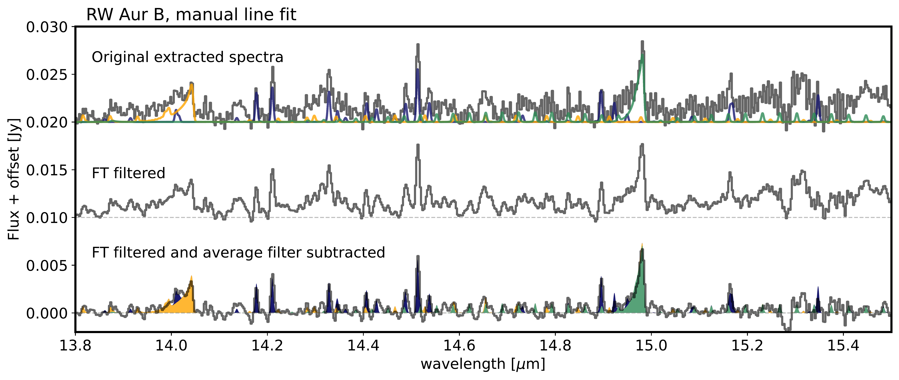

$\newcommand{\ensuremath}{}$
$\newcommand{\xspace}{}$
$\newcommand{\object}[1]{\texttt{#1}}$
$\newcommand{\farcs}{{.}''}$
$\newcommand{\farcm}{{.}'}$
$\newcommand{\arcsec}{''}$
$\newcommand{\arcmin}{'}$
$\newcommand{\ion}[2]{#1#2}$
$\newcommand{\textsc}[1]{\textrm{#1}}$
$\newcommand{\hl}[1]{\textrm{#1}}$
$\newcommand{\footnote}[1]{}$
$\newcommand{\pageref}{\oldpageref*}$

# MINDS. Young binary systems with JWST/MIRI: \\variable water-rich primaries and extended emission

<mark>Appeared on: 2025-08-05</mark> -  _Accepted for publication in A&A, 26 pages, 20 Figures. Shortened abstract in arxiv_

N. T. Kurtovic, et al. -- incl., <mark>T. Henning</mark>, <mark>G. Perotti</mark>, <mark>K. Schwarz</mark>, <mark>A. Somigliana</mark>

**Abstract:** Dynamical disk-companion interactions can have a large impact on the evolution of circumstellar disks, as these can produce perturbations to the material distribution, density, and temperature, affecting their potential for planet formation. As part of the JWST GTO program MINDS, we analyze the mid-infrared emission of three Class II binary systems: VW Cha, WX Cha, and RW Aur, to investigate the impact of stellar multiplicity on the chemistry and physics of their inner disk. We analyze the 1D spectrum from JWST/MIRI-MRS for primary and secondary disks separately, extracted by combining forward modeling with a theoretical PSF and aperture photometry. After continuum subtraction, we modeled the molecular lines with 0D slab models. We interpret the results by comparing our JWST spectra to VLT/CRIRES+, Spitzer/IRS. The extended mid-infrared emission is compared to ALMA, for which we also include the binary DF Tau in our sample. Primary and secondary disks are dramatically different in their mid-infrared emission, with primary disks showing $H_2$ O-rich spectra, and secondary disks being mostly line poor to the sensitivity of our spectra. When comparing MIRI-MRS to Spitzer/IRS, we observe large variability in the line emission of VW Cha A, as well as in the continuum of RW Aur A. The disks around VW Cha BC and RW Aur B show evidence of ionizing radiation, and a further comparison with ALMA at high angular resolution dust continuum suggest that the spectrum of RW Aur B is well explained by its $\sim 4$ au cavity.    All the systems show [ Ne II ] jet emission, and three of them also show spatially resolved emission structures in $H_2$ , likely originated by outflows and dynamical interactions. Many of the observed features in the primary disks, such as enhanced water emission, could be linked to the increased accretion and radial drift produced by dynamical disk truncation. However, additional mechanisms are needed to explain the large differences between primary and secondary disks, potentially inner disk substructures. This work is an example of the need for combining multiple facilities to fully understand the observations from JWST.

**Figure 4. -** Comparison of the JWST/MIRI-MRS spectra and Spitzer/IRS in mode SH and LH. The panels **(a)**, **(b)**, and **(c)** show the comparison of MIRI-MRS with native resolution in grey, and in red after being convolved to the IRS resolution. The IRS spectra is shown in blue. The residuals from subtracting the IRS spectra to the MIRI-MRS are shown in green. Panel **(d)** is a zoom into the [Ne II] emission, with two vertical dashed lines showing the location of the [Ne II] at rest and the wavelength of [Ne II] with -180 km s$^{-1}$ of blueshift. The emission of VW Cha BC is also shown, and convolved to the resolution of the IRS. Panel **(e)** is a zoom into the region with the main emission of HCN and $CO_2$. For comparison, the residuals from subtracting the IRS observation to the MIRI-MRS observation are shown both with their real flux, and with the MIRI-MRS flux scaled by 0.5. Panel **(f)** shows the region with the most prominent cold $H_2$O lines. Even after scaling MIRI-MRS by 0.5, there are still residuals consistent with a 200 K slab. (*fig:vwcha:comp-spt-jwst*)

**Figure 15. -**  The molecular line emission of RW Aur B. In the top is the original continuum subtracted spectra, with the same continuum subtraction algorithm used for the primary disks. In the middle is the spectra after filtering the signals with frequency smaller than than 0.5 px$^{-1}$. In the bottom, the spectra after frequency filtering and subtracting a masked average with a window size of 10 px. For reference, slab models for HCN, $H_2$O, and $CO_2$, are shown with the original and with the modified spectra.  (*fig:app:rwaurb_manual_fit*)

**Figure 2. -** JWST/MIRI-MRS spectra for the three binary systems in our sample, scaled to 150 pc for comparison. The spectra of the secondary sources are enlarged in the insert, showing the observed flux between the MIRI-MRS band 1A and 3C.  (*fig:all_jwstmiri*)

