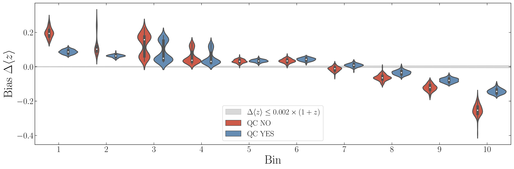
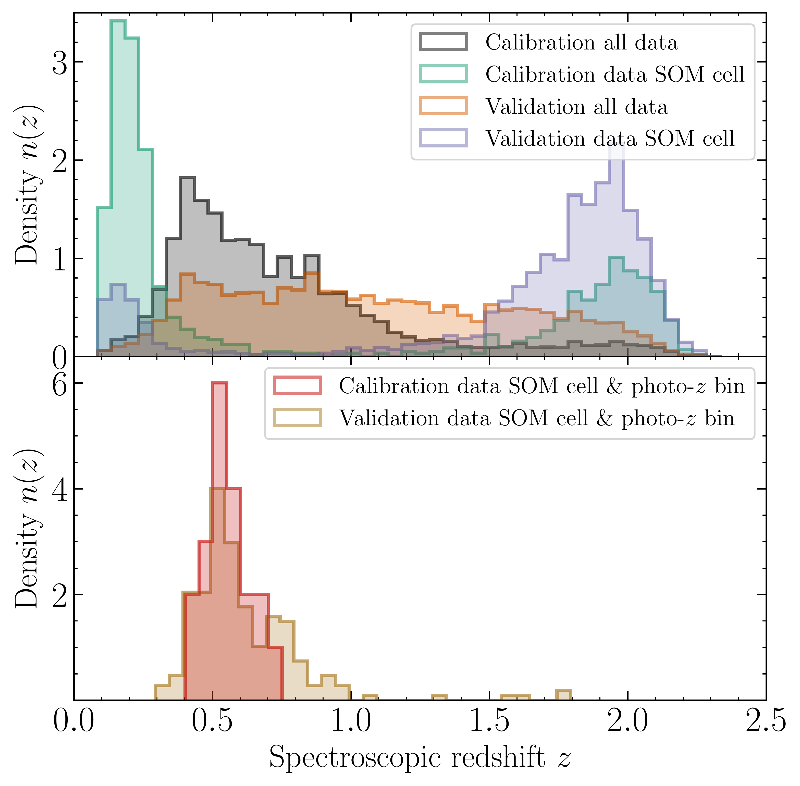
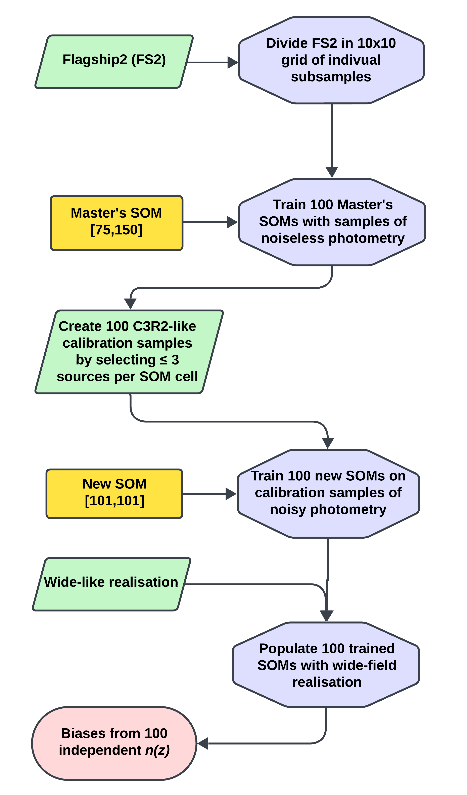

$\newcommand{\ensuremath}{}$
$\newcommand{\xspace}{}$
$\newcommand{\object}[1]{\texttt{#1}}$
$\newcommand{\farcs}{{.}''}$
$\newcommand{\farcm}{{.}'}$
$\newcommand{\arcsec}{''}$
$\newcommand{\arcmin}{'}$
$\newcommand{\ion}[2]{#1#2}$
$\newcommand{\textsc}[1]{\textrm{#1}}$
$\newcommand{\hl}[1]{\textrm{#1}}$
$\newcommand{\footnote}[1]{}$
$\newcommand{\orcid}[1]$
$\newcommand{\arraystretch}{1.1}$
$\newcommand{\arraystretch}{1.0}$

# $\Euclid$ \/: Photometric redshift calibration with \ self-organising maps$\thanks{This paper is published on     behalf of the Euclid Consortium}$

<mark>Appeared on: 2025-08-06</mark> -  _20 pages, 16 figures_

W. Roster, et al. -- incl., <mark>K. Jahnke</mark>

**Abstract:** The $\Euclid$ large-scale weak-lensing survey aims to trace the evolution of cosmic structures up to redshift $z$ $\sim$ 3 and beyond. Its success depends critically on obtaining highly accurate mean redshifts for ensembles of galaxies $n(z)$ in all tomographic bins, essential for deriving robust cosmological constraints. However, photometric redshifts (photo- $z$ s) suffer from systematic biases, arising from various sources of uncertainty and dominated by selection effects of the spectroscopic sample used for calibration. To address these challenges, we utilised self-organising maps (SOMs) with mock samples resembling the Euclid Wide Survey (EWS) from the Flagship2 simulation, to validate $\Euclid$ 's uncertainty requirement of $|\Delta\langle z \rangle| = \langle z_{\text{est}} \rangle - \langle z \rangle \leq 0.002 (1+z)$ per tomographic bin, assuming DR3-level data. Consequently, we identify the most effective galaxy selection for our tomographic bins, while systematically examining the implementation of quality control cuts to reduce sources of uncertainty. In particular, we observe that defining the redshift tomography using the mean spectroscopic redshift (spec- $z$ ) per SOM cell, results in none of the ten tomographic redshift bins satisfying the requirement. In contrast, the redshift tomography on the photo- $z$ s of the EWS-like sample yields superior results, with eight out of ten bins [ $0 < z\leq 2.5$ ] meeting the $\Euclid$ requirement. To enhance the realism of our study, we morph our calibration sample to mimic the C3R2 survey in incremental steps. In this context, a maximum of six out of ten bins meet the requirement, strongly advocating the adoption of a redshift tomography defined by the photo- $z$ s of individual galaxies rather than the commonly used mean spec- $z$ of SOM cells. To examine the impact on the expected biases for $\Omega_{\text{m}}$ , $\sigma_{8}$ , and $\Delta w_{0}$ measured by $\Euclid$ , we perform a Fisher forecast for cosmic shear only, based on our redshift uncertainties. Here, we find that even under an evaluation of the uncertainty where the impact of the redshift bias is substantial, most absolute biases remain below 0.1 $\sigma$ in the idealised scenario and below 0.3 $\sigma$ in the more realistic case.

**Figure 12. -** Violin plot of biases per bin using tomography defined by SOM spec-$z$ before (red) and after (blue) applying QC. These distributions also include box-and-whisker plots. Lastly, the dynamic ($\Delta\langle z \rangle$) < 0.002(1+$z$) \Euclid requirement are given by grey shaded area. (*fig:6.10*)

**Figure 2. -** *Top*: Mean spec-$z$ distributions for the validation and calibration sample subject to a non-trivial selection function. The respective distributions are also depicted for a single SOM cell chosen at random. *Bottom*: Display of the distributions found for the same randomly selected cell after applying photo-$z$ binning. (*fig:2.02*)

**Figure 5. -** Flowchart outlining the sequential process of utilising noiseless SOMs to create a set of calibration samples, which are then used to train a secondary set of SOMs using noisy photometric data. Lastly, the trained noisy SOMs are populated by the EWS-like data. (*fig:4.1.1*)

