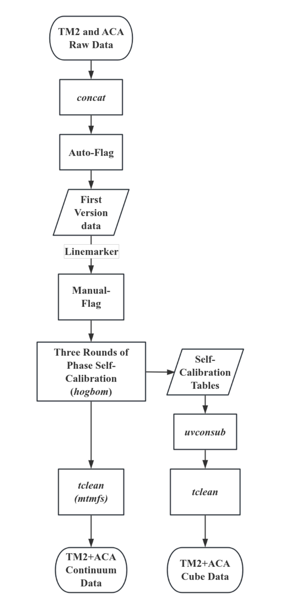
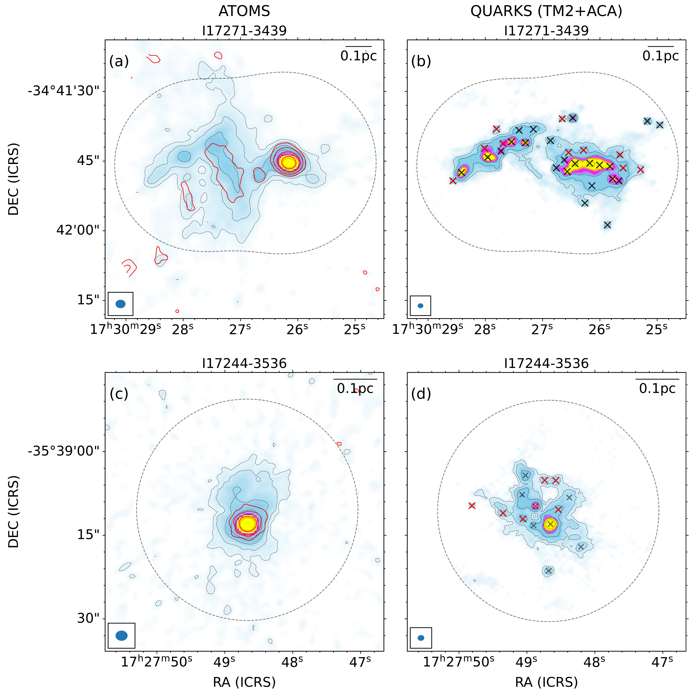
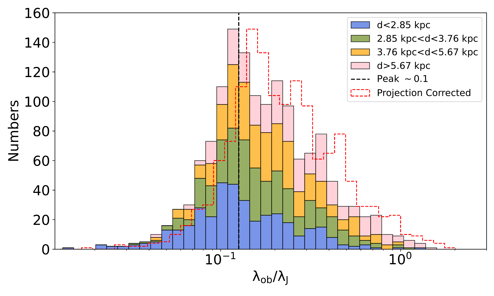

$\newcommand{\ensuremath}{}$
$\newcommand{\xspace}{}$
$\newcommand{\object}[1]{\texttt{#1}}$
$\newcommand{\farcs}{{.}''}$
$\newcommand{\farcm}{{.}'}$
$\newcommand{\arcsec}{''}$
$\newcommand{\arcmin}{'}$
$\newcommand{\ion}[2]{#1#2}$
$\newcommand{\textsc}[1]{\textrm{#1}}$
$\newcommand{\hl}[1]{\textrm{#1}}$
$\newcommand{\footnote}[1]{}$
$\newcommand{\vdag}{(v)^\dagger}$
$\newcommand$
$\newcommand$
$\newcommand{\arcm}{\hbox{^\prime}}$
$\newcommand{\etal}{{\rm et al.}\thinspace}$
$\newcommand{\eg}{{\it e.g. }}$
$\newcommand{\etc}{{\it etc. }}$
$\newcommand{\ie}{{\it i.e. }}$
$\newcommand{\cf}{{\it c.f. }}$
$\newcommand{◦ee}{\hbox{^\circ}}$
$\newcommand{\NHH}{\ensuremath{N_{\mathrm{H_{2}}}}}$
$\newcommand{\s}{\ensuremath{\mbox{~s}}}$
$\newcommand{\ps}{\ensuremath{\s^{-1}}}$
$\newcommand{\cm}{\ensuremath{\mbox{~cm}}}$
$\newcommand{\pcmsq}{\ensuremath{\cm^{-2}}}$
$\newcommand{\pcmcu}{\ensuremath{\cm^{-3}}}$
$\newcommand{\km}{\ensuremath{\mbox{~km}}}$
$\newcommand{\erg}{\ensuremath{\mbox{~erg}}}$
$\newcommand{\ergps}{\ensuremath{\erg \ps}}$
$\newcommand{\mJy}{\ensuremath{\mbox{~mJy}}}$
$\newcommand{\ML}{\ensuremath{\mbox{\Msol/\LBsol}}}$
$\newcommand{\Hi}{H\textsc{i}}$
$\newcommand{\Hii}{H\textsc{ii}}$
$\newcommand{\Ha}{\ensuremath{\mathrm{H\alpha}}}$
$\newcommand{\nh}{\ensuremath{\mathrm{n}_\mathrm{H}}}$
$\newcommand{\Mdot}{\ensuremath{\dot{\mathrm{M}}}}$
$\newcommand{\thco}{^{13}CO}$
$\newcommand{\twco}{^{12}CO}$
$\newcommand{\etco}{C^{18}O}$
$\newcommand{\vel}{km s^{-1}}$
$\newcommand{\filAname}{G350.5-N}$
$\newcommand{\filBname}{G350.5-S}$
$\newcommand{\imcoor}{\alpha_{2000}=17^{\mathrm{h}}18^{\mathrm{m}}13\fs84, \delta_{2000}=-36◦28\arcmin21\farcs5}$
$\newcommand{\her}{Herschel}$
$\newcommand{\mline}{M_{\rm line}}$
$\newcommand{\msun}{M_{\odot}}$
$\newcommand{\lsun}{L_{\odot}}$
$\newcommand{\um}{\mum}$
$\newcommand{\cmcm}{cm^{-2}}$
$\newcommand{\egcite}{\citep[e.g.,][]}$
$\newcommand{\lmsun}{M_{\odot}~pc^{-1}}$
$\newcommand{\chiiioh}{CH_3OH}$
$\newcommand{\hciiin}{HC_3N}$
$\newcommand{\hcop}{HCO^{+}}$
$\newcommand{\htcop}{H^{13}CO^{+}}$
$\newcommand{\halpha}{H40_{\alpha}}$
$\newcommand{\chthocho}{CH_3OCHO}$
$\newcommand{\chthcho}{CH_3CHO}$
$\newcommand{\chthoh}{CH_3OH}$
$\newcommand{\chii}{H/UC-H\textsc{ii}}$
$\newcommand{\uchii}{UC-H\textsc{ii}}$
$\newcommand{\hchii}{HC-H\textsc{ii}}$
$\newcommand{\hii}{H\textsc{ii}}$
$\newcommand{\CHMC}{s-cHMC}$
$\newcommand{\PCHMC}{w-cHMC}$
$\newcommand{\filname}{G34}$
$\newcommand{\mdotyr}{M_{\odot}~yr^{-1}}$
$\newcommand{\tred}{\textcolor{red}}$
$\newcommand{\tblue}{\textcolor{blue}}$
$\newcommand{\torange}{\textcolor{orange}}$
$\newcommand{\orcidauthorHL}{0000-0003-3343-9645}$
$\newcommand{\mgt}{\color{magenta}}$
$\newcommand{\arraystretch}{1.8}$
$\newcommand{\arraystretch}{1.8}$
$\newcommand\aj{{\rm{AJ}}}$
$\newcommand\araa{{\rm{ARA\&A}}}$
$\newcommand\apj{{\rm{ApJ}}}$
$\newcommand\icarus{{\rm{Icarus}}}$
$\newcommand\apjs{{\rm{ApJS}}}$
$\newcommand\apjl{{\rm{ApJL}}}$
$\newcommand\apss{{\rm{Ap\&SS}}}$
$\newcommand\aap{{\rm{A\&A}}}$
$\newcommand\aapr{{\rm{A\&AR}}}$
$\newcommand\aaps{{\rm{A\&AS}}}$
$\newcommand\baas{{\rm{BAAS}}}$
$\newcommand\memras{{\rm{MmRAS}}}$
$\newcommand\mnras{{\rm{MNRAS}}}$
$\newcommand\pasp{{\rm{PASP}}}$
$\newcommand\prl{{\rm{Phys. Rev. Lett.}}}$
$\newcommand\jqsrt{{\rm{Journal of Quantitative Spectroscopy and Radiative$
$Transfer}}}$
$\newcommand\actaa{{\rm{Acta Astronomica}}}$

# $\bf$ The ALMA-QUARKS Survey: III. Clump-to-core fragmentation and search for high-mass starless cores

<mark>Appeared on: 2025-08-06</mark> -  _30 pages, 16 figures, accepted by ApJS_

D. Yang, et al.

**Abstract:** The Querying Underlying mechanisms of massive star formation with ALMA-Resolved gas Kinematics and Structures (QUARKS) survey observed 139 infrared-bright (IR-bright) massive protoclusters at 1.3 mm wavelength with ALMA. This study investigates clump-to-core fragmentation and searches for candidate high-mass starless cores within IR-bright clumps using combined ALMA 12-m (C-2) and Atacama Compact Array (ACA) 7-m data, providing $\sim$ 1 $\arcsec$ ( $\sim\rm0.02$ pc at 3.7 kpc) resolution and $\sim\rm0.6 mJy beam^{-1}$ continuum sensitivity ( $\sim 0.3 $ $\msun$ at 30 K). We identified 1562 compact cores from 1.3 mm continuum emission using $_ getsf_$ . Observed linear core separations ( $\lambda_{\rm obs}$ ) are significantly less than the thermal Jeans length ( $\lambda_{\rm J}$ ), with the $\lambda_{\rm obs}/\lambda_{\rm J}$ ratios peaking at $\sim0.2$ . This indicates that thermal Jeans fragmentation has taken place within the IR-bright protocluster clumps studied here. The observed low ratio of $\lambda_{\rm obs}/\lambda_{\rm J}\ll 1$ could be the result of evolving core separation or hierarchical fragmentation. Based on associated signatures of star formation (e.g., outflows and ionized gas), we classified cores into three categories: 127 starless, 971 warm, and 464 evolved cores. Two starless cores have mass exceeding 16 $\msun$ , and represent high-mass candidates. The scarcity of such candidates suggests that competitive accretion-type models could be more applicable than turbulent core accretion-type models in high-mass star formation within these IR-bright protocluster clumps.

**Figure 1. -** Flow chart for ALMA-QUARKS ACA and TM2 combined data reduction.
    The elliptical boxes denote the raw data and the final reduced data. The rectangle indicates a specific processing step, while the parallelogram does an intermediate product during the data reduction. (*fig:flowchat*)

**Figure 10. -** Comparison of ATOMS 3 mm and QUARKS 1.3 mm continuum images for two protocluster clumps. The black dashed circle in each panel defines the field of view of the QUARKS survey. Left panels (a, c): ATOMS 3 mm continuum emission. The dashed contour levels are [3, 6, 12, 24, 48, 96] rms, with $\rm rms$\s$im 1.4$ and $\rm $\s$im 0.4 mJy beam^{-1}$ for I17271-3439 and I17244-3536, respectively. Red contours correspond to integrated emission of the $\rm H40\alpha$ recombination line representative of ionized gas from the ATOMS survey, with rms $\sim\rm 0.2$ and $\sim \rm 0.1 Jy beam^{-1} km s^{-1}$ for I17271-3439 and I17244-3536, respectively.
    Right panels (b, d): QUARKS TM2+ACA 1.3 mm continuum emission. The contour levels are the same as in left panels, but with $\rm rms $\s$im 2.1$ and $\sim \rm 0.4 mJy beam^{-1}$ for I17271-3439 and I17244-3536, respectively.
    The cross symbols correspond to the cores extracted from 1.3mm continuum emission using the _ getsf_ algorithm, where black markers denote those detected by the algorithm at a configuration with a minimum source size employing the beam size, while red markers correspond to relatively faint cores detected at the other configuration employing half-beam.
    The beam sizes of ATOMS and QUARKS TM2+ACA continuum emission are shown on the lower left, and the 0.1 pc scale bar is on the upper right of each panel. (*fig:mst*)

**Figure 4. -** Distribution of the ratio between the observed core separation to the predicted thermal Jeans length. The black dashed line shows the peak of the distribution. The red contour represents the distribution with the spatial projection correction applied (see text).
     (*fig:Jeans_sep*)

