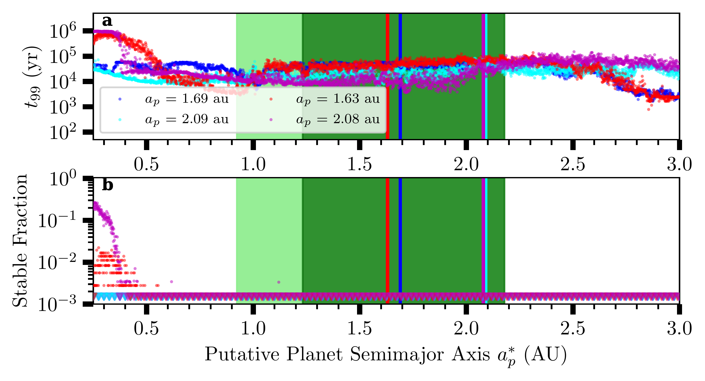
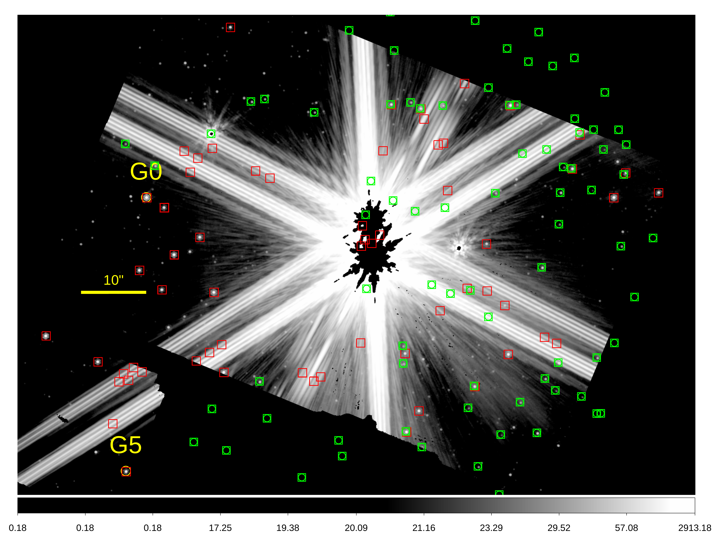
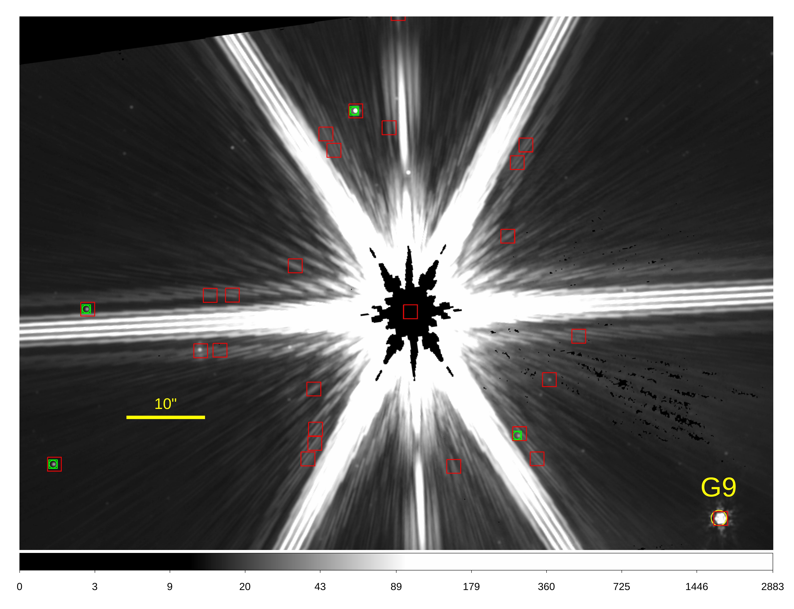

$\newcommand{\ensuremath}{}$
$\newcommand{\xspace}{}$
$\newcommand{\object}[1]{\texttt{#1}}$
$\newcommand{\farcs}{{.}''}$
$\newcommand{\farcm}{{.}'}$
$\newcommand{\arcsec}{''}$
$\newcommand{\arcmin}{'}$
$\newcommand{\ion}[2]{#1#2}$
$\newcommand{\textsc}[1]{\textrm{#1}}$
$\newcommand{\hl}[1]{\textrm{#1}}$
$\newcommand{\footnote}[1]{}$
$\newcommand{\teff}{\ensuremath{T_{\rm eff}}}$
$\newcommand{\rsun}{\ensuremath{ R_\Sun}}$
$\newcommand{\lsun}{\ensuremath{ L_\Sun}}$
$\newcommand{\mj}{\ensuremath{ M_{\rm Jup}}}$
$\newcommand{\rj}{\ensuremath{R_{\rm Jup}}}$
$\newcommand{\mearth}{M_\oplus}$
$\newcommand{\rearth}{R_\oplus}$
$\newcommand{\mum}{\mum}$
$\newcommand{◦ee}{^\circ}$
$\newcommand{\acenA}{\alpha~Cen~A\xspace}$
$\newcommand{\acen}{\alpha~Cen\xspace}$
$\newcommand{\acenAb}{\alpha~Cen~Ab\xspace}$
$\newcommand{\acenB}{\alpha~Cen~B\xspace}$
$\newcommand{\acenAB}{\alpha~Cen~AB\xspace}$
$\newcommand{\acenABC}{\alpha~Cen~ABC\xspace}$
$\newcommand{\emus}{\epsilon~Mus\xspace}$
$\newcommand{\sone}{S1\xspace}$
$\newcommand{\chas}[1]{\textcolor{orange}{#1}}$
$\newcommand{\aniket}[1]{\textcolor{blue}{#1}}$
$\newcommand{\pierre}[1]{\textcolor{magenta}{#1}}$

# Worlds Next Door: A Candidate Giant Planet Imaged in the Habitable Zone of $\acenA$.\ I. Observations, Orbital and Physical Properties, and Exozodi Upper Limits

<mark>Appeared on: 2025-08-07</mark> -  _Accepted to ApJL. 34 pages, 22 figures, 10 tables_

C. Beichman, et al. -- incl., <mark>T. Henning</mark>

**Abstract:** We report on coronagraphic observations of the nearest solar-type star, $\acenA$ , using the MIRI instrument on the $*James Webb*$ Space Telescope. The proximity of $\acen$ (1.33 pc) means that the star's habitable zone is spatially resolved at mid-infrared wavelengths, so sufficiently large planets or quantities of exozodiacal dust would be detectable via direct imaging. With three epochs of observation (August 2024, February 2025, and April 2025), we achieve a sensitivity sufficient to detect $T_{\rm eff}\approx$ 225--250 K (1--1.2 $R_{\rm Jup}$ ) planets between 1 $\arcsec$ --2 $\arcsec$ and exozodiacal dust emission at the level of $>$ 5--8 $\times$ the brightness of our own zodiacal cloud. The lack of exozodiacal dust emission sets an unprecedented limit of a few times the brightness of our own zodiacal cloud---a factor of $\gtrsim$ 5--10 more sensitive than measured toward any other stellar system to date. In August 2024, we detected a F $_\nu$ (15.5 $\mum$ ) = 3.5 mJy point source, called $\sone$ , at a separation of 1.5 $\arcsec$ from $\acenA$ at a contrast level of $5.5\times10^{-5}$ . Because the August 2024 epoch had only one successful observation at a single roll angle, it is not possible to unambiguously confirm $\sone$ as a bona fide planet. Our analysis confirms that $\sone$ is neither a background nor a foreground object. $\sone$ is not recovered in the February and April 2025 epochs. However, if $\sone$ is the counterpart of the object, $C1$ , seen by the VLT/NEAR program in 2019, we find that there is a 52 \% chance that the $S1+C1$ candidate was missed in both follow-up JWST/MIRI observations due to orbital motion. Incorporating constraints from the non-detections, we obtain families of dynamically stable orbits for $S1+C1$ with periods between 2--3 years. These suggest that the planet candidate is on an eccentric ( $e \approx 0.4$ ) orbit significantly inclined with respect to the $\acenAB$ orbital plane ( $i_{\rm mutual} \approx 50^\circ$ , prograde, or $\approx 130^\circ$ , retrograde). Based on the photometry and inferred orbital properties, the planet candidate could have a temperature of 225 K, a radius of $\approx$ 1--1.1 $\rj$ and a mass between 90--150 $\mearth$ , consistent with RV limits. This paper is first in a series of two papers: Paper II (Sanghi \& Beichman et al. 2025, in press) discusses the data reduction strategy and finds that $\sone$ is robust as a planet candidate, as opposed to an image or detector artifact.

**Figure 19. -** The planet candidate is initialized using the mean values from Table \ref{tab:orbit} with $K_{\rm RV}<3 {\rm m/s}$, where the color-coded points denote the planet candidate with a prograde (blue/cyan) or retrograde (red/magenta) orbit. The top panel shows the lifetime $t_{99}$ when $99\%$ of the test particles are unstable, while the bottom panel measures the fraction of stable particles for a given initial semi-major axis. The triangles denote upper limits for the stable fraction due to the finite number of trials (360) per semimajor axis. The light green region denotes the optimistic HZ, while the dark green represents the more conservative HZ.
  (*fig:PlanetStability*)

**Figure 21. -** *Left:* Orbit of $\acen$B relative to $\acenA$ showing one epoch of Hipparcos and two epochs of ALMA data. *Center:* zoom-in showing the ALMA data. *Top right:* The difference between the parallax effect as seen from Earth and from JWST at L2. *Bottom right:* The uncertainty in position of $\acen$ as a function of year before and after the addition of the new 2023 ALMA observations. (*fig:ALMA1*)

**Figure 12. -** *Left:* F1000W image of $\acenA$B showing Gaia stars (green boxes) and MIRI detections (red boxes). The stars labeled $G0$ and $G5$ were used for target acquisition of $\acenA$. *Right:* similar F1000W image for $\emus$. The star labeled $G9$ was used for target acquisition of $\emus$.  (*fig:TAobs*)

