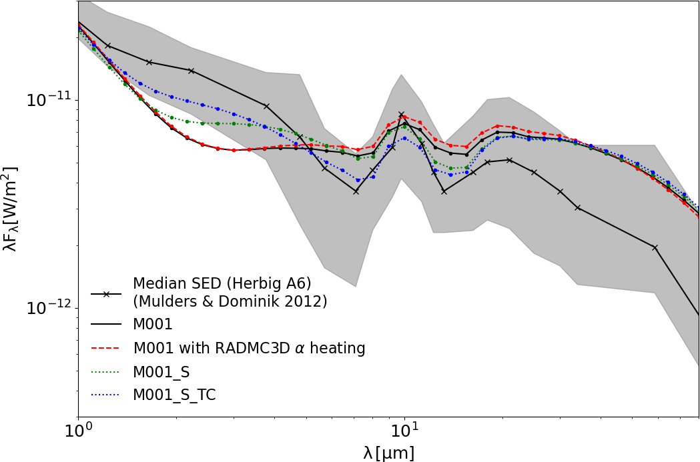
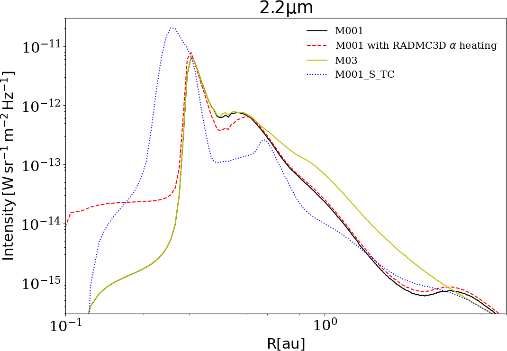
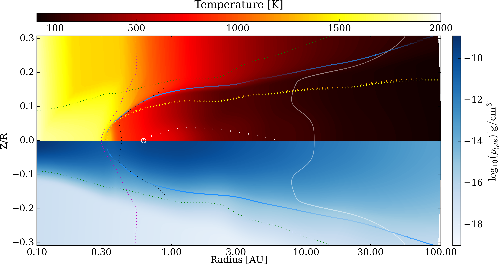
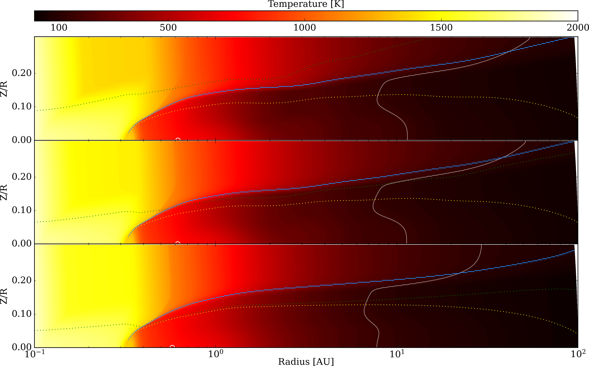

$\newcommand{\ensuremath}{}$
$\newcommand{\xspace}{}$
$\newcommand{\object}[1]{\texttt{#1}}$
$\newcommand{\farcs}{{.}''}$
$\newcommand{\farcm}{{.}'}$
$\newcommand{\arcsec}{''}$
$\newcommand{\arcmin}{'}$
$\newcommand{\ion}[2]{#1#2}$
$\newcommand{\textsc}[1]{\textrm{#1}}$
$\newcommand{\hl}[1]{\textrm{#1}}$
$\newcommand{\footnote}[1]{}$
$\newcommand$
$\newcommand{\mum}{\upmum}$
$\newcommand{\Omegas}{\mathit{\Omega}}$

# Multi dust species inner rim in magnetized protoplanetary disks

<mark>Appeared on: 2025-08-07</mark> -  _accepted at A&A_

<mark>M. Flock</mark>, et al. -- incl., <mark>M. Benisty</mark>, <mark>R. v. Boekel</mark>

**Abstract:** The inner regions of protoplanetary disks, within ten astronomical units (au), are where terrestrial planets are born. Developing multi-physics models of this environment is crucial for understanding how planets form.By developing a new class of multi-dust radiative magnetized inner rim models and comparing them with recent near-infrared observational data, we can gain valuable insights into the conditions during planet formation. Our goal is twofold: to study the influence of highly refractory dust species on the inner rim shape and to determine how the magnetic field affects the inner disk structure. The resulting temperature and density structures are analyzed and compared to observations. The comparison focuses on a median SED of Herbig stars and interferometric constraints from the H, K, and N-band of three Herbig-type star-disk systems: \texttt{HD 100546} , \texttt{HD 163296} , and \texttt{HD 169142} . With the new models, we investigate 1) the influence of a large-scale magnetic field on the inner disk structure and 2) the effect of having the four most important dust species (corundum, iron, forsterite, and enstatite) shaping the rim, each with its sublimation temperatures.Further, we improve our model by using frequency-dependent irradiation and the effect of accretion heating. With the \texttt{Optool} package, we obtain frequency-dependent opacities for each dust grain family and calculate the corresponding temperature-dependent Planck and Rosseland opacities. When multiple dust species are considered, the dust's sublimation front, i.e., the inner rim, becomes smoother and radially more extended. Strongly magnetized disks show a substantial increase in the emission flux between the L and N-bands. Our results show that weakly magnetized disk models with large-scale vertical magnetic fields $\leq 0.3$ Gauss at 1 au best fit with NIR interferometric observations. Our model comparison supports the existence of moderate magnetic fields ( $\beta \ge 10^4$ ), which could drive a magnetic wind in the inner disk. Our results show that multi-dust models, including magnetic fields, still lack NIR emission, especially in the H-band. Half-light radii derived from H-band emission by near-infrared interferometry indicate that the missing flux originates within the inner rim, where even corundum grains sublimate. One potential solution might be a heated gas disk or evaporating objects like planetesimals close to the star.

**Figure 6. -** Top: SED for additional models: with accretion heating (red dashed), with only silicate grains (green dotted), and with only silicates with a constant and high ($T_{\rm ev}=1500K$) sublimation temperature \texttt{M001\_S\_TC}(blue dotted). The red dashed line was calculated based on model \texttt{M001}, including accretion heating in the \texttt{RADMC3D} calculation. Bottom: Radial intensity profile { along the major axis (Y=0)} for models \texttt{M001}, \texttt{M03},  \texttt{M001} with accretion heating in \texttt{RADMC3D} and the model \texttt{M001\_S\_TC}{at K-band (2.2 $\mum$)}. (*fig:sed_acc*)

**Figure 12. -** 2D temperature and gas density profile of model \texttt{M001}. The green dotted line shows plasma beta unity. {The black dotted line shows the MRI transition (900 K contour line)}. The circle indicates the location of the pressure maxima where { inward drifting pebbles} can be trapped. The dotted magenta line shows the sublimation of the corundum. The white solid line shows the water snowline. The blue line shows the location of maximal irradiation heating corresponding to the $\tau_\mathrm{r} = 1$ line. {Yellow and orange small dashes show the $\tau_\mathrm{z} = 1$ line at 2.2 and 10 $\mu$m (K-band and N-band). White separated small dashes show the $\tau_\mathrm{z} = 1$ for 1 mm emission.} (*fig:inittemp*)

**Figure 14. -** 2D temperature profile with increasing magnetization from top to bottom showing models: \texttt{M001},\texttt{M01} and \texttt{M03}. The green dotted line shows the plasma beta unity line. The blue line shows the location of maximal irradiation heating corresponding to the $\tau_\mathrm{r} = 1$ line. Using the local Planck Opacity, the yellow dotted line shows the $\tau_\mathrm{z} = 1$ line. The white solid line shows the water snowline. (*fig:tempmag*)

