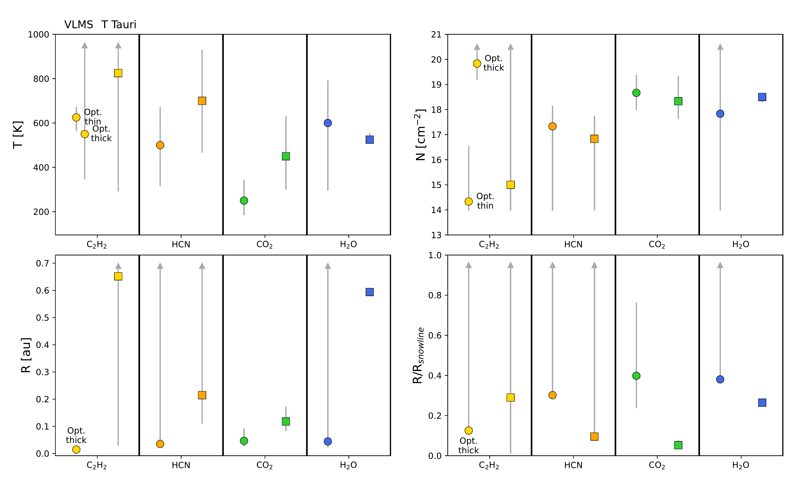

$\newcommand{\ensuremath}{}$
$\newcommand{\xspace}{}$
$\newcommand{\object}[1]{\texttt{#1}}$
$\newcommand{\farcs}{{.}''}$
$\newcommand{\farcm}{{.}'}$
$\newcommand{\arcsec}{''}$
$\newcommand{\arcmin}{'}$
$\newcommand{\ion}[2]{#1#2}$
$\newcommand{\textsc}[1]{\textrm{#1}}$
$\newcommand{\hl}[1]{\textrm{#1}}$
$\newcommand{\footnote}[1]{}$
$\newcommand{\orcid}[1]{\unskip\protect\href{https://orcid.org/#1}{\protect\includegraphics[width=8pt,clip]{logo_orcid}}}$
$\newcommand{\Lsun}{L_{\odot}}$
$\newcommand{\Msun}{M_{\odot}}$
$\newcommand{\Mearth}{M_{\oplus}}$
$\newcommand{\Rsun}{R_{\odot}}$
$\newcommand{\Mdot}{\dot{M}}$
$\newcommand{\Mdust}{{M_{\rm{dust}}}}$
$\newcommand{\Mdisk}{{M_{\rm{disk}}}}$
$\newcommand{\Av}{A_V}$
$\newcommand{\msunyr}{\rm{M_{\sun}   yr^{-1}}}$
$\newcommand{\Teff}{T_{\rm eff}}$
$\newcommand{\mic}{\mum}$
$\newcommand{\tstar}{T_{*}}$
$\newcommand{\rstar}{R_{*}}$
$\newcommand{\mstar}{M_{*}}$
$\newcommand{\rdisk}{r_{\rm{disk}}}$
$\newcommand{\mdisk}{M_{\rm{disk}}}$
$\newcommand{\hwall}{h_{\rm{wall}}}$
$\newcommand{\amaxbig}{a_{\rm{max,big}}}$
$\newcommand{\amaxsmall}{a_{\rm{max,small}}}$
$\newcommand{\brgamma}{Br\gamma}$
$\newcommand{\Lacc}{L_{\rm{acc}}}$
$\newcommand{\LaccL}{L_{\rm{acc}}/L_{*}}$
$\newcommand{\Lbrg}{L_{\rm{Br\gamma}}}$
$\newcommand{\Fbrg}{F_{\rm{Br\gamma}}}$
$\newcommand{\angstrom}{\mbox{\normalfontÅ}}$
$\newcommand{\Lstar}{L_{*}}$
$\newcommand{\LNIR}{L_{\rm{NIR}}}$
$\newcommand{\LIR}{L_{\rm{IR}}}$
$\newcommand{\vsini}{vsin(i)}$
$\newcommand{\Ri}{R_{i}}$
$\newcommand{\mdotmdisk}{\dot{M}--M_{\rm{disk}}}$
$\newcommand{\tdisk}{t_{\rm{disk}}}$
$\newcommand{\sg}[1]{\textcolor{red}{Sierra}: #1}$

# MINDS. A transition from $H_2$O to $C_2$$H_2$ dominated spectra with decreasing stellar luminosity

<mark>Appeared on: 2025-08-07</mark> -  _Accepted for publication in A&A. 15 pages, 9 figures. ArXiv abstract is shortened_

S. L. Grant, et al. -- incl., <mark>T. Henning</mark>, <mark>G. Perotti</mark>, <mark>K. Schwarz</mark>

**Abstract:** The chemical composition of the inner regions of disks around young stars will largely determine the properties of planets forming in these regions. Many disk physical processes drive the disk chemical evolution, some of which depend on and/or correlate with the stellar properties. We aim to explore the connection between stellar properties and the inner disk chemistry in protoplanetary disks, as traced by mid-infrared spectroscopy. We use JWST-MIRI observations of a large, diverse sample of sources to explore trends between the carbon-bearing molecule $C_2$ $H_2$ and the oxygen-bearing molecule $H_2$ O. Additionally, we calculate the average spectrum for the T Tauri ( $\mstar$ $>$ 0.2 $\Msun$ ) and very low-mass star (VLMS, $\mstar$ $\leq$ 0.2 $\Msun$ ) samples from JWST-MIRI MRS data and use slab models to determine the properties of the average spectra in each subsample. We find a significant anti-correlation between the flux ratio of $C_2$ $H_2$ /$H_2$ O and the stellar luminosity. Disks around VLMS have significantly higher $F_{\rm{C_2H_2}}$ / $F_{\rm{H_2O}}$ flux ratios than their higher-mass counterparts, driven by the generally weak $H_2$ O and strong $C_2$ $H_2$ in disks around low-mass hosts. We also explore trends with the strength of the 10 $\mu$ m silicate feature, the stellar accretion rate, and the disk dust mass, all of which show correlations with $F_{\rm{C_2H_2}}$ / $F_{\rm{H_2O}}$ , which may be related to processes driving the carbon-enrichment in disks around VLMS, but also have degeneracies with system properties (i.e., the $\mstar$ -- $\Mdot$ and $\mstar$ -- $\mdisk$ relationships). Slab model fits to the average spectra show that $H_2$ O emission in the VLMS sample is quite similar in temperature and column density to a warm ( $\sim$ 600 K) $H_2$ O component in the T Tauri spectrum, indicating that the high C/O gas phase ratio in these disks is not due to oxygen depletion alone. Instead, the presence of many hydrocarbons, including some with high column densities, suggests that carbon enhancement in the disks around VLMS is taking place. The observed differences in the inner disk chemistry as a function of host properties are likely to be accounted for by differences in the disk temperatures, stellar radiation field, and the evolution of dust grains.

**Figure 3. -** Left: $F_{\rm{C_2H_2}}$/$F_{\rm{H_2O}}$ as a function of the strength of the 10 $\mic$ silicate feature (stronger silicate features have higher values). For four of the VLMS, there is either no 10 $\mic$ emission or the emission is coming at least partially from $C_2$$H_4$, therefore we adopt feature strength of 1 for these sources (denoted by open points). Two outliers at a 10 $\mic$ band strength of 3 and 3.8 are the transitional disks LkCa 15 and PDS 70 and have been removed for clarity. Middle: The relationship between $F_{\rm{C_2H_2}}$/$F_{\rm{H_2O}}$ and $\Mdot$. Right: The relationship between $F_{\rm{C_2H_2}}$/$F_{\rm{H_2O}}$ and $\Mdust$. The PCCs and $p-$values can be found for each panel. All of the relationships are statistically significant ($p-$value$<$0.05); however the correlations are not as strong as the $F_{\rm{C_2H_2}}$/$F_{\rm{H_2O}}$ vs. stellar luminosity relationship. Rotated triangular markers for the VLMS sample indicate lower limits on $F_{\rm{C_2H_2}}$/$F_{\rm{H_2O}}$ and upper limits on $\Mdust$. Error bars are smaller than the points for most targets.  (*fig: C2H2 H2O Mstar Mdot Mdust*)

**Figure 9. -** Same as Figure \ref{fig: chi2 ttauri}, but now for the molecules in the average VLMS spectrum. (*fig: chi2 vlms*)

**Figure 5. -** The best-fit slab model parameters for the average VLMS spectrum (left circles) and T Tauri spectrum (right squares) for the different molecules. The $H_2$O component for the T Tauri spectrum is the intermediate ($T\sim600$) component. Temperature and column density are shown on the top on the left and right, respectively. The equivalent emitting radius is shown on the bottom left and that radius normalized to the $H_2$O snowline for each subsample is shown on the bottom right. Only the optically thick $C_2$$H_2$ component is shown for the VLMS in the radii plots, as the radius is unconstrained in the optically thin case. Error bars are determined from the 1$\sigma$ confidence intervals and in some cases are degenerate between parameters. For example, in the case of optically thin emission, the column density and equivalent emitting radii are degenerate. See Figures \ref{fig: chi2 ttauri} and \ref{fig: chi2 vlms} for the $\chi^2$ maps for the T Tauri and VLMS fits, respectively. (*fig: avg params*)

