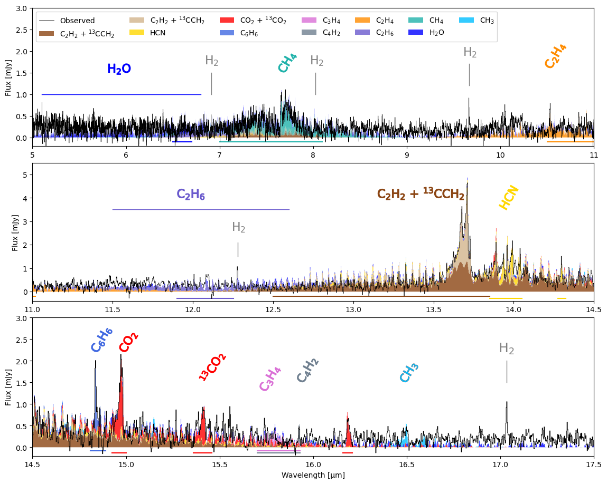
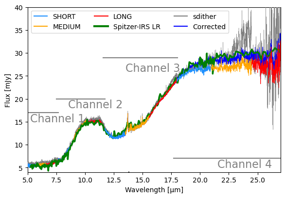

$\newcommand{\ensuremath}{}$
$\newcommand{\xspace}{}$
$\newcommand{\object}[1]{\texttt{#1}}$
$\newcommand{\farcs}{{.}''}$
$\newcommand{\farcm}{{.}'}$
$\newcommand{\arcsec}{''}$
$\newcommand{\arcmin}{'}$
$\newcommand{\ion}[2]{#1#2}$
$\newcommand{\textsc}[1]{\textrm{#1}}$
$\newcommand{\hl}[1]{\textrm{#1}}$
$\newcommand{\footnote}[1]{}$
$\newcommand{\todo}{\textcolor{purple}}$
$\newcommand{\mum}{\mum\xspace}$
$\newcommand{\referee}{\textcolor{red}}$
$\newcommand{\Lsun}{L_\odot}$
$\newcommand{\Msun}{M_\odot}$
$\newcommand{\Macc}{\dot{M}_\mathrm{acc}}$
$\newcommand{\chaha1}{Cha~H\alpha~1}$
$\newcommand\natexlab{#1}$

# MINDS. Cha H$\alpha$ 1, a brown dwarf with a hydrocarbon-rich disk.

<mark>Appeared on: 2025-08-08</mark> -  _16 pages, 14 figures_

M. Morales-Calderón, et al. -- incl., <mark>T. Henning</mark>, <mark>G. Perotti</mark>, <mark>M. Samland</mark>, <mark>K. Schwarz</mark>

**Abstract:** The chemistry of disks around brown dwarfs (BDs) remain largely unexplored due to their faintness. Despite the efforts performed with Spitzer, we have far less understanding of planet formation, chemical composition, disk structure, and evolution in disks around BDs compared to their more massive counterparts (T Tauri and Herbig Ae/Be stars), which are more readily studied due to their greater brightness. Recent JWST observations, with up to an order of magnitude improvement in both spectral and spatial resolution, have shown that these systems are chemically rich, offering valuable insights into giant planet formation. As part of the MIRI mid-INfrared Disk Survey (MINDS) JWST guaranteed time program, we aim to characterize the gas and dust composition of the disk around the brown dwarf [ NC98 ] Cha HA 1, hereafter $\chaha$ 1, in the mid-infrared. We obtain data from the MIRI Medium Resolution Spectrometer (MRS) from 4.9 to 28 $\mum$ ( $R\sim$ 1500 - 3500; FWHM $\sim$ 0.2" - 1.2"). We use the dust fitting tool DuCK to investigate the dust composition and grain sizes while we identify and fit molecular emission in the spectrum using slab models. Compared with disks around very low mass stars, clear silicate emission features are seen in this BD disk. In addition, JWST reveals a plethora of hydrocarbons, including $C_2$ $H_2$ , $^{13}$ $CCH_2$ , $CH_3$ , $CH_4$ , $C_2$ $H_4$ , $C_4$ $H_2$ ,  $C_3$ $H_4$ , $C_2$ $H_6$ ,  and $C_6$ $H_6$ which suggest a disk with a gas C/O > 1. Additionally, we detect $CO_2$ , $^{13}$ $CO_2$ , HCN, $H_2$ , and $H_2$ O. CO and OH are absent from the spectrum.The dust is dominated by large $\sim$ 4 $\mum$ size amorphous silicates ($MgSiO_3$ ). We infer a small dust mass fraction ( $>$ 10 $\%$ ) of 5 $\mum$ size crystalline forsterite. We do not detect polycyclic aromatic hydrocarbons. The mid-infrared spectrum of $\chaha$ 1 shows the most diverse chemistry seen to date in a BD protoplanetary disk, consisting of a strong dust feature, 12 carbon-bearing molecules plus $H_2$ , and water. The diverse molecular environment offers a unique opportunity to test our understanding of BD disks chemistry and how it affects the possible planets forming in them.

**Figure 12. -** $\chaha$1 spectrum, with the JWST-MIRI continuum subtracted data (black) compared to the stacked emission from the slab models for $C_2$$H_2$ + $^{13}$$CCH_2$, HCN, $CO_2$ + $^{13}$$CO_2$, $C_6$$H_6$, $C_3$$H_4$, $C_4$$H_2$, $C_2$$H_4$, $C_2$$H_6$, $CH_4$, $H_2$O, and $CH_3$. The parameters of the slab models shown can be found in Table \ref{Tab:molecules} and  \ref{Tab:App:molecules}. The $H_2$ lines are also marked. Horizontal lines represent the windows in which the $\chi^2$ for each fitting has been evaluated. Note that the y axis are different for each panel. (*Fig:models*)

**Figure 11. -** $\chi^2$ maps for HCN, $CO_2$ +  $^{13}$$CO_2$, $C_6$$H_6$, $C_2$$H_4$, $C_2$$H_6$, $CH_4$, and  water. The color scale shows the $\chi^2_{min}$/$\chi^2$. The best fit model ($\chi^2_{min}$/$\chi^2$ = 1) is marked with a red circle. A red contour denotes the emitting region radius as listed in Table \ref{Tab:molecules}. Gray contours show the emitting radii in au while white contours represent the 1$\sigma$, 2$\sigma$, and 3$\sigma$ levels.
 (*Fig:xis*)

**Figure 1. -** MIRI $\chaha$1 reduced spectra. Blue, yellow, and red colors denote the SHORT, MEDIUM and LONG bands respectively for each channel of the ddither approach.  The gray line shows the sdither reduction and the blue spectrum is the final flux-corrected one in Ch. 4. The green line corresponds to the Spitzer $\chaha$1 low resolution spectrum obtained from CASSIS \citep{Lebouteiller11}. (*Fig:spec*)

