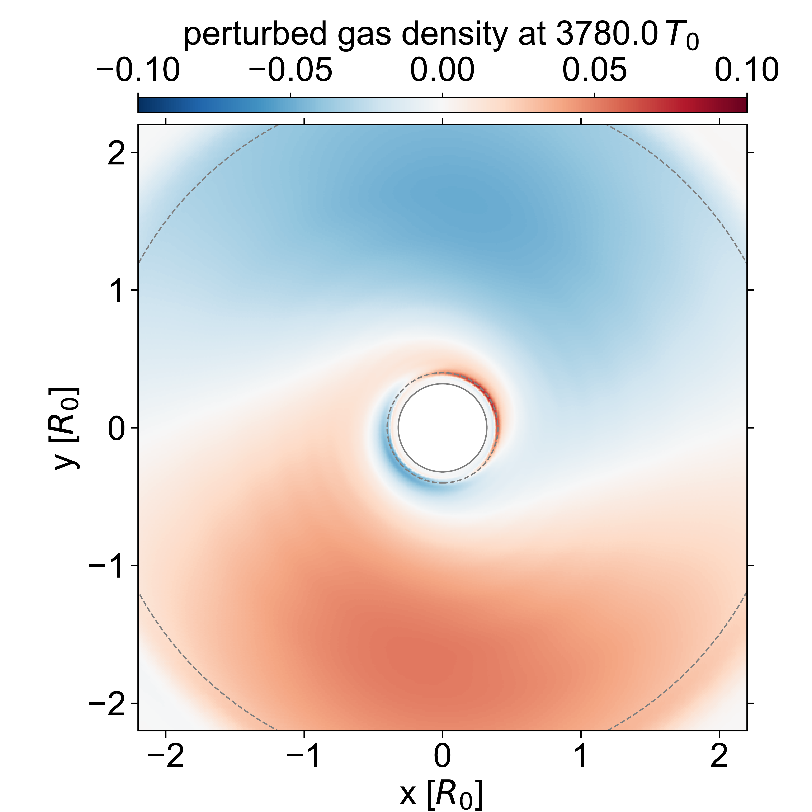

$\newcommand{\ensuremath}{}$
$\newcommand{\xspace}{}$
$\newcommand{\object}[1]{\texttt{#1}}$
$\newcommand{\farcs}{{.}''}$
$\newcommand{\farcm}{{.}'}$
$\newcommand{\arcsec}{''}$
$\newcommand{\arcmin}{'}$
$\newcommand{\ion}[2]{#1#2}$
$\newcommand{\textsc}[1]{\textrm{#1}}$
$\newcommand{\hl}[1]{\textrm{#1}}$
$\newcommand{\footnote}[1]{}$
$\newcommand{\myeqref}[1]{Eq. (\ref{#1})}$
$\newcommand{\figref}[1]{Fig.~\ref{#1}}$
$\newcommand{\Figref}[1]{Figure~\ref{#1}}$
$\newcommand{\ITdd}{\texttt{ITdd}}$
$\newcommand{\fargo}{{\sc fargo}}$
$\newcommand{\fargotwodoned}{{\sc fargo-2d1d}}$
$\newcommand{\fargoadsg}{{\sc fargo-adsg}}$
$\newcommand{\fargothreed}{{\sc fargo3d}}$
$\newcommand{\inewcommandix}{{\sc inewcommandix}}$
$\newcommand{\phantomcode}{{\sc phantom}}$
$\newcommand{\sbt}{ \begin{picture}(-1,1)(1,-3)\circle*{3}\end{picture} }$
$\newcommand{\hm}[2]{\textcolor{green}{#1}\textcolor{limegreen}{\st{#2}}}$
$\newcommand{\el}[1]{\textcolor{magenta}{#1}}$
$\newcommand{\jeff}[2]{\textcolor{teal}{#1} \textcolor{teal}{\st{#2}}}$
$\newcommand{\ac}[2]{\textcolor{blue}{#1} \textcolor{blue}{\st{#2}}}$
$\newcommand{\cb}[1]{\textcolor{NavyBlue}{#1}}$
$\newcommand{\mnr}[2]{\textcolor{teal}{#1}}$

# The reflex instability: \\exponential growth of a large-scale $m=1$ mode in astrophysical discs$\vspace{-16pt}$

<mark>Appeared on: 2025-08-12</mark> -  _Published in the Open Journal of Astrophysics_

A. Crida, et al. -- incl., <mark>P. Griveaud</mark>

**Abstract:** We report the finding of a linear, non-axisymmetric, global instability in gas discs around stars, which may be relevant to other astrophysical discs. It takes the form of an $m=1$ mode that grows in the disc density distribution while the star-barycentre distance rises exponentially with a characteristic timescale that is orders of magnitude longer than the orbital period.  We present results of hydrodynamical simulations with various codes and numerical methods, using either barycentric or stellocentric reference frames, with or without the disc's self gravity: all simulations consistently show an unstable mode growing exponentially.  The instability disappears if, and only if, the reflex motion of the star due to the disc's asymmetry is not taken into account in the simulations. For this reason we refer to this instability as the $*reflex instability*$ .  We identify a feedback loop as a possible origin, whereby the acceleration of the star excites the eccentricity of the disc, yielding an $m=1$ mode in the density distribution which, in turn, pulls the star.  The growth timescale of the instability decreases with increasing disc mass and is a few hundred orbits for disc-to-star mass ratios of a few percent. If truly physical, and not due to a numerical artifact that would be common to all the codes we have employed, the reflex instability could have a dramatic impact on protoplanetary discs evolution and planetary formation.

**Figure 4. -** Time evolution of the radial distance between the star and the centre-of-mass of the star-disc system for simulations using our reference setup, obtained for different codes and by varying numerical parameters (see caption and text). (*fig:com_tlogr_numerics*)

**Figure 2. -** Orbital evolution of a particle feeling an acceleration $\vec{a}=-(1/r^2)\vec{u}_r+\vec{a}_c$. Top left panel : $\vec{a}_c=0.004 \vec{u}_y$. Top right : $\vec{a}_c = 0.02 \mathcal{R}_{\pi/2}(\vec{P})$. Bottom left panel : $\vec{a}_c = 0.02 \mathcal{R}_{\pi/8}(\vec{P})$, where $\mathcal{R}_\phi$ is the rotation by an angle $\phi$ in the $x-y$ plane. Bottom right panel : evolution of the eccentricity in the three simulations (same color).
     (*fig:RK4*)

**Figure 3. -** Results of our reference setup for the $\fargo$twodoned simulation which uses a barycentric frame. The left panel shows the position of the star in the barycentric frame. The open square symbols mark the star's position in the middle and right panels, and the arrows display the acceleration exerted by the disc on the star (arbitrary magnitude). The middle and right panels display the perturbation of the surface density of the disc relative to its azimuthally-averaged initial density, at two times separated by about half a pattern period. The solid curve shows the inner edge of the computational grid, the dashed curves show the edges of the inner and outer wave-damping zones. (*fig:bary*)

