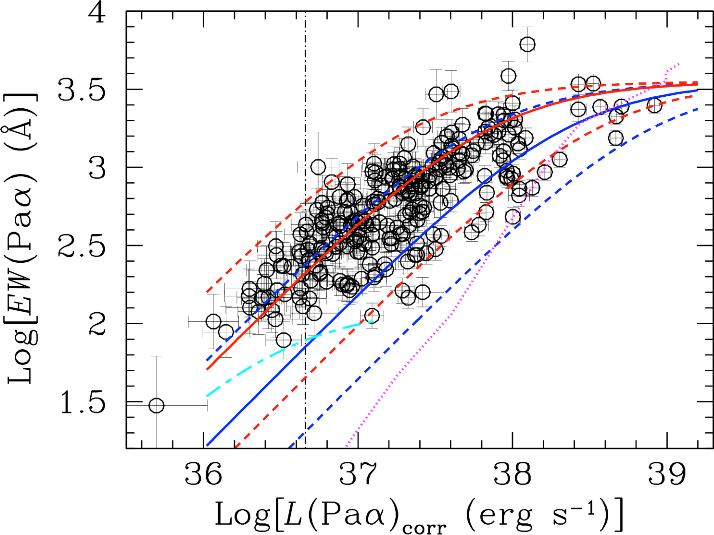
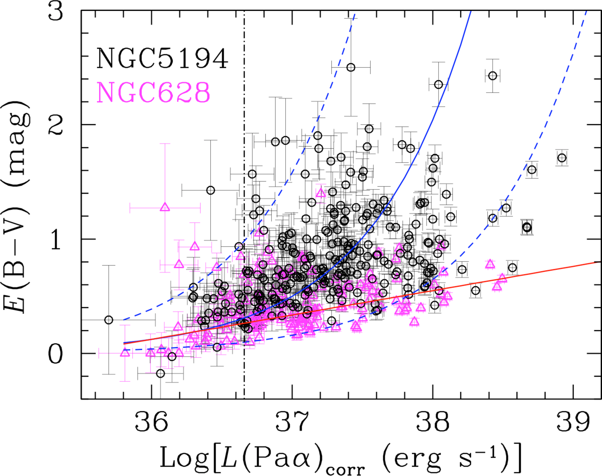
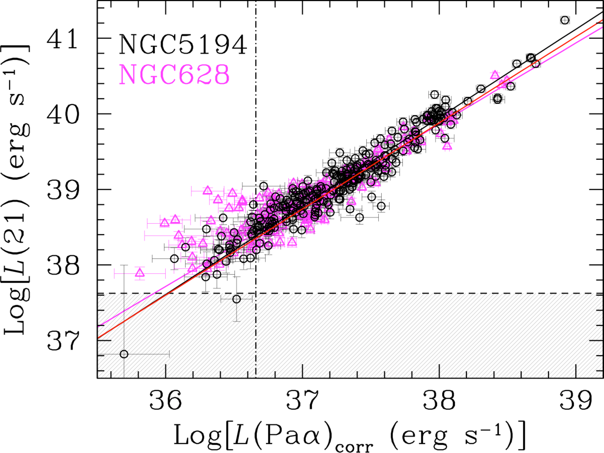
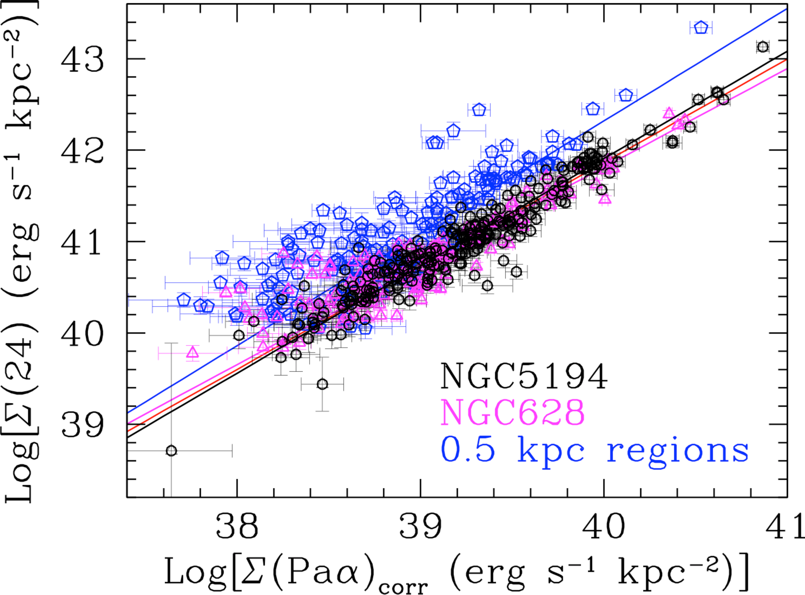
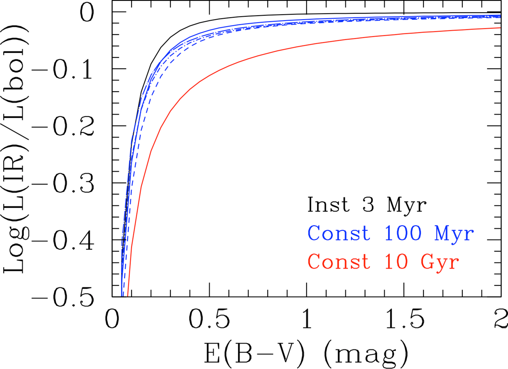
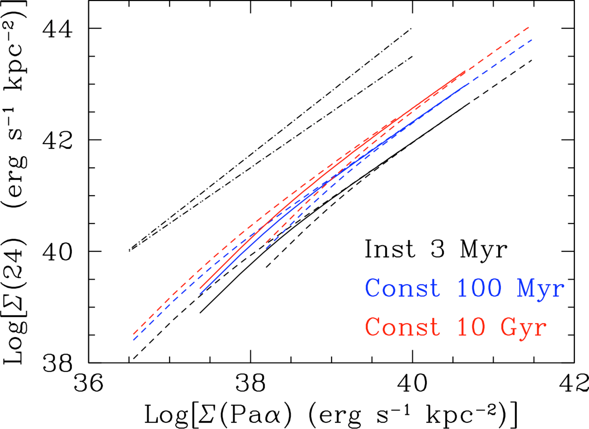

$\newcommand{\ensuremath}{}$
$\newcommand{\xspace}{}$
$\newcommand{\object}[1]{\texttt{#1}}$
$\newcommand{\farcs}{{.}''}$
$\newcommand{\farcm}{{.}'}$
$\newcommand{\arcsec}{''}$
$\newcommand{\arcmin}{'}$
$\newcommand{\ion}[2]{#1#2}$
$\newcommand{\textsc}[1]{\textrm{#1}}$
$\newcommand{\hl}[1]{\textrm{#1}}$
$\newcommand{\footnote}[1]{}$

# Quantification of The Age Dependence of Mid--Infrared Star Formation Rate Indicators

<mark>Appeared on: 2025-08-13</mark> -  _41 pages, 16 figures; accepted for publication on the Astrophysical Journal on August 8th, 2025_

D. Calzetti, et al. -- incl., <mark>E. Schinnerer</mark>, <mark>F. Walter</mark>

**Abstract:** We combine James Webb Space Telescope images of the nearby galaxy NGC 5194  in the hydrogen recombination line Pa $\alpha$ ( $\lambda$ 1.8756 $\mu$ m) from the Cycle 1 program JWST--FEAST with 21 $\mu$ m dust continuum images from the Cycle 2 Treasury program JWGT to quantify the difference in the calibration of mid--infrared star formation rates (SFR) between HII regions and galaxies. We use the archival HST H $\alpha$ image to correct the Pa $\alpha$ emission for the effects of dust attenuation. Our data confirm previous results that the dust--corrected Pa $\alpha$ flux is tightly correlated with the 21 $\mu$ m emission at the scales of HII regions. When combined with published JWST data for the HII regions of the galaxy NGC 628 and Spitzer 24 $\mu$ m data for whole galaxies and for kpc--size galaxy regions, we show that the L(24)--L(Pa $\alpha$ ) correlation has exponent $>$ 1 across six decades in luminosity. In addition, the hybrid 24 $\mu$ m+H $\alpha$ SFR indicator has a scaling constant about 4.4 times higher for HII regions than for whole galaxies, also in agreement with previous results. Models of stellar populations with a range of star formation histories reveal that the observed trends can be entirely ascribed to and quantified with the contribution to the IR emission by stellar populations older than $\sim$ 5--6 Myr. Based on the models' results, we provide: (1) a calibration for the infrared SFR across six orders of magnitude in L(24), from HII regions to luminous galaxies, and (2) a prescription for the scaling constant of the hybrid infrared SFR indicators as a function of the star formation timescale.

**Figure 3. -** The EW(Pa$\alpha$) (left panel) and the color excess E(B$-$V) (right panel) as a function of the attenuation--corrected luminosity in Pa$\alpha$ for the HII regions in NGC 5194. The data are shown as black circles, with their 1$\sigma$ uncertainties. The right panel includes the data for NGC 628 as magenta triangles, with their 1$\sigma$ uncertainties. Both panels show as a vertical black dot--dashed line the expected Pa$\alpha$ luminosity of a 4 Myr old, 3,000 M$_{\odot}$ cluster, the lower-end luminosity limit in our analysis to mitigate stochastic IMF sampling effects  ([Cerviño, et. al 2002]()) . ** (Left):** The magenta dotted line shows the EW(Pa$\alpha$) model track of an HII region of constant mass $\sim$2$\times$10$^5$ M$_{\odot}$ with increasing age from 1 Myr (top--right) to 10 Myr (bottom--left). The red continuous line is the model track for a constant age, 3 Myr old, HII region of decreasing mass, from $\sim$3$\times$10$^5$ M$_{\odot}$ down to $\sim$2$\times$10$^2$ M$_{\odot}$,  immersed in a constant luminosity non--ionizing stellar field, with a scatter of factors $-$3/$+$5 (higher/lower red dashed lines) about the mean trend. The cyan line is the same track, but for a 6 Myr old HII region. The blue lines are the tracks for NGC 628,  from [Calzetti, Adamo and Linden (2024)](), using the same model but with a larger photometric aperture
(continuous line for the mean trend and dashed lines for the scatter). ** (Right):** The two empirical relations shown are from [Calzetti, Kennicutt and Engelbracht (2007)]() for $\sim$0.5 kpc  star forming regions (blue solid line for the mean trend and dashed lines for the 90--percentile) and from [Garn and Best (2010)]() for galaxies (red continuous line).  (*fig:corr_lum*)

**Figure 4. -** ** (Left:)** The luminosity at 21 $\mu$m, L(21), as a function of the attenuation--corrected luminosity at Pa$\alpha$ for the 254 line--emitting regions in NGC 5194 (black circles, this work) and the 143 regions in NGC 628 (magenta triangles, [Calzetti, Adamo and Linden (2024)](), with 1$\sigma$ uncertainties. The horizontal dashed line and grey region show the location of the 5$\sigma$ threshold at 21 $\mu$m in NGC 5194. The black and magenta lines show the best fits through the data with Pa$\alpha$ luminosity above the IMF sampling limit (vertical dot--dashed line) for the two galaxies separately, while the red line is for the data from the two galaxies combined. ** (Right:)** The luminosity surface density at 24 $\mu$m, $\Sigma$(24), as a function of the attenuation--corrected luminosity surface density at Pa$\alpha$ for the same HII regions in NGC 5194 (black circles) and NGC 628 (magenta triangles), also with 1$\sigma$ uncertainties, after converting the luminosity at 21 $\mu$m to 24 $\mu$m. The solid lines indicate the fits through the HII regions using the same color scheme as the left panel.  The data for the luminosity surface densities of 160 $\sim$0.5 kpc regions at $\sim$solar metallicity from [Calzetti, Kennicutt and Engelbracht (2007)]() are shown as blue pentagons with the best linear fit from those authors marked as a blue line. (*fig:l21_vs_lpa*)

**Figure 14. -** ** (Left:)** The fraction of bolometric luminosity emerging in the infrared, as a function of color excess E(B--V), for the following stellar population models: 3 Myr old instantaneous burst (black solid line); constant star formation over 100 Myr (blue lines); and constant star formation over 10 Gyr (red solid line). The effect of different extinction/attenuation curve choices are shown for the 100 Myr constant star formation model: starburst attenuation curve (blue solid) and the Milky Way (blue dashed), Large Magellanic Cloud (blue short dot--dashed) and Small Magellanic Cloud (blue long dot--dashed) extinction curves. ** (Right:)** The 24 $\mu$m luminosity surface density as a function of the extinction--corrected Pa$\alpha$ luminosity surface density for the three star formation models described in the Left panel. The Pa$\alpha$ surface density is derived via the E(B--V)--$\Sigma$(Pa$\alpha$) relation in equation \ref{equa:newebv} ([Calzetti, Kennicutt and Engelbracht 2007]()) . The models for the 3 Myr instantaneous burst (black solid line), $\tau$=100 Myr constant star formation (blue solid line) and $\tau$=10 Gyr constant star formation (red solid line) mark a sequence of increasing $\Sigma$(24) at fixed $\Sigma$(Pa$\alpha$)$_{corr}$. The relation at each age is shown with the 90\% scatter in the E(B--V)--Pa$\alpha$ relation from [Calzetti, Kennicutt and Engelbracht (2007)]() as dashed lines.  The black dot--dashed straight lines are examples of linear relations with slopes (bottom to top) of 1 and 1.14, to provide a visual reference. (*fig:LIR_EBV*)

