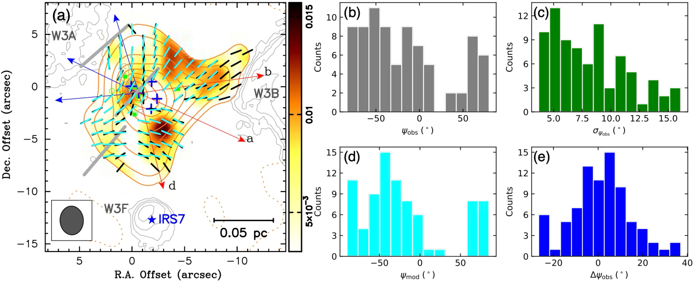

$\newcommand{\ensuremath}{}$
$\newcommand{\xspace}{}$
$\newcommand{\object}[1]{\texttt{#1}}$
$\newcommand{\farcs}{{.}''}$
$\newcommand{\farcm}{{.}'}$
$\newcommand{\arcsec}{''}$
$\newcommand{\arcmin}{'}$
$\newcommand{\ion}[2]{#1#2}$
$\newcommand{\textsc}[1]{\textrm{#1}}$
$\newcommand{\hl}[1]{\textrm{#1}}$
$\newcommand{\footnote}[1]{}$
$\newcommand{\HI}{\mbox{H\thinspace{\sc i} }}$
$\newcommand{\HII}{\mbox{H\thinspace{\sc ii} }}$
$\newcommand{\vdag}{(v)^\dagger}$
$\newcommand{\dif}{\mathrm{d}}$
$\newcommand{\key}[1]{{\color{magenta}\bf #1}}$
$\newcommand{\vec}{\boldsymbol}$

# Pinched Magnetic Fields in the High-mass Protocluster W3 IRS5

<mark>Appeared on: 2025-08-15</mark> -  _19 pages, 7 figures, accepted for publication in The Astrophysical Journal_

H.-R. V. Chen, et al. -- incl., <mark>H. Beuther</mark>

**Abstract:** We present polarization maps of dust emission at 340 GHz in the luminous high-mass protocluster, W3 IRS5, observed with the Submillimeter Array.The projected magnetic fields appear fairly organized with a pinched morphology in the northern part and a concave shape in the southern part.We fit the polarization maps with a two-component magnetic field model: an hourglass model centered at the continuum peak, SMM2, and an empirical sphere centered at the O-type star, IRS7.Using the Davis-Chandrasekhar-Fermi method, we calculate a projected field strength of $B_\mathrm{pos} = 1.4 \; \mathrm{mG}$ .Along with the Zeeman measurement, a total magnetic field strength of $B_\mathrm{tot} = 1.6 \; \mathrm{mG}$ is obtained.We find that the gravitational energy is the most dominant, followed by magnetic energy, and then turbulent energy.Small values of the virial parameter, $\alpha_\mathrm{vir} = 0.8$ , and the ratio of timescales, $t_\mathrm{ff}/t_\mathrm{corss} = 0.6$ , suggest an ongoing collapse.We also show collimated molecular outflows in the $\mathrm{CO \; (3-2)}$ and $\mathrm{SiO \; (8-7)}$ transitions.The morphology of magnetic fields and the surrounding $\HII$ regions put forward a scenario for W3 IRS5.A gravitationally unstable dense core formed within a neutral gas ridge plowed by the expansions of W3 A and W3 B.The core began to contract, causing gravity to pull the magnetic field lines inward, which resulted in a pinched field morphology.Subsequent expansion of W3 F, ionized by IRS7, perturbed the magnetic field, creating concave patterns.The dynamical interactions among protostars led to misalignment of their outflows.

**Figure 1. -** (a) SMA 340 GHz continuum map (color scale and red contours) of W3 IRS5 overlaid on VLA $6 \; \mathrm{cm}$ continuum map \citep[gray contours; ][]{Tieftrunk1997} with labels of the nearby $\HI$I regions, W3 A, W3 B, and W3 F.
Red contours are plotted at $(-3,3,6,14,22,30,38,46,54,62) \times \sigma$, where $\sigma = 21 \; \mathrm{mJy   beam^{-1}}$ with a beam size of $2$\farcs$7 \times 2$\farcs$2$($\mathrm{P. A.} = 3^\circ$).
Blue crosses mark the positions of five compact continuum sources identified at $354 \; \mathrm{GHz}$ ([Wang, Bourke and Hogerheijde 2013]()) , where SMM2 coincides with the continuum peak, and SMM1 is located to the east.
Green open circles are the positions of near-infrared sources  ([Megeath, Wilson and Corbin 2005]()) , and green filled squares are the positions of compact radio sources at $22 \; \mathrm{GHz}$ and $43 \; \mathrm{GHz}$ ([Tuthill and Danchi 2005]()) .
The blue-filled star marks the position of the high-mass star, IRS7, powering the hypercompact $\HI$I region, W3 F, while another infrared source, IRS N7 (blue-open star), without any radio counterpart, is also shown  ([Bik, Henning and Stolte 2012]()) .
Several outflow axes (and a bipolar outflow along line of sight) reported in the literature are presented with labels of their associated tracers, including molecular outflows \citep[e.g.][]{Mitchell1991,Rodon2008,Wang2012}, water masers  ([Imai, Kameya and Sasao 2000]()) , and radio compact sources  ([Wilson, et. al 2003]()) .
The gray dashed contours outline the more extended $6 \; \mathrm{cm}$ radiation at $4 \; \mathrm{mJy   beam^{-1}}$ with $3^{\prime\prime}$ resolution.
(b) The SMA polarized intensity map (color scale) overlaid with the orientation of the projected magnetic field, $B_\mathrm{pos}$(line segment), which corresponds to dust polarization orientation rotated by $90^\circ$.
Line segments are sampled twice per synthesized beam in locations where $I > 3\sigma_I$ and $P > 3\sigma_P$(in black), and also $2\sigma_P < P < 3\sigma_P$(in purple).
The length of line segments is proportional to the fractional linear polarization in percentage, $P/I$, and the scalebar is shown in the upper right.
Three thick line segments in gray show the large-scale magnetic field orientation measured from single-dish polarimeters.
Red and blue arrows indicate bipolar outflows along with the outflow label.
 (*fig:bvec*)

**Figure 4. -** (a) Best-fit magnetic field model (cyan) overlaid on the observed magnetic field orientation (black) for models composed of an hourglass component centered at SMM2 combined with a spherical component centered at IRS 7.
Data on the outskirts are excluded for optimization.
The length of line segments is fixed and arbitrary.
Red and blue arrows indicate bipolar outflows, same as the outflow axes shown in Fig. \ref{fig:bvec}(a).
Symbols are the same as those in Fig. \ref{fig:bvec}(b).
(b)--(e) Histogram of anglar distribution for (b) observed position angle, $\psi_\mathrm{obs}$, (c) measurement uncertainty, $\sigma_{\psi_\mathrm{obs}}$, (d) position angle of the best-fit model, $\psi_\mathrm{mod}$, and (e) field oritation residual, $\Delta \psi_\mathrm{obs} = \psi_\mathrm{obs} - \psi_\mathrm{mod}$.
 (*fig:bmod*)

**Figure 5. -** 
Polarization maps of the (a) Stokes-$I$, (b) Stokes-$Q$, and (c) Stokes-$U$ parameters.
The thick gray contour outlines the $340 \; \mathrm{GHz}$ continuum emission at the $3\sigma$ level.
 (*fig:iqu*)

