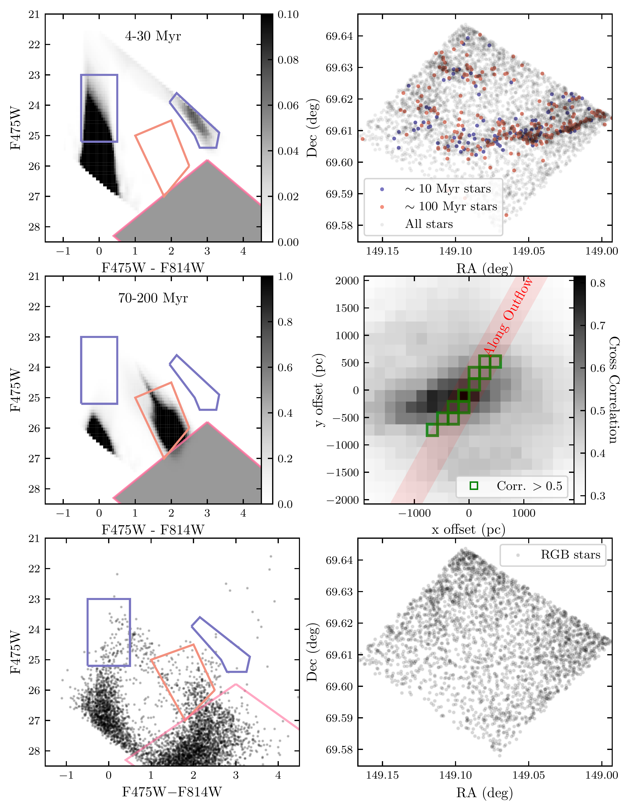
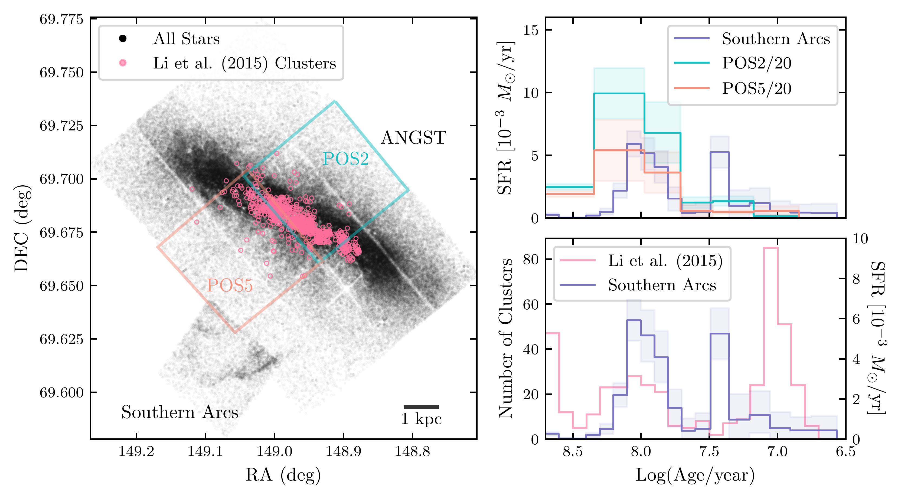
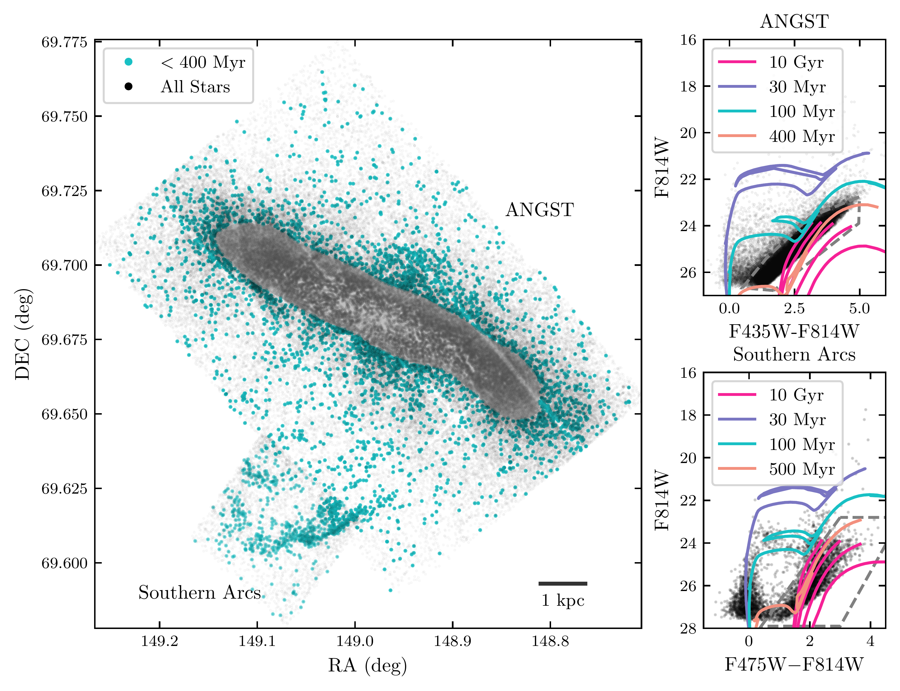

$\newcommand{\ensuremath}{}$
$\newcommand{\xspace}{}$
$\newcommand{\object}[1]{\texttt{#1}}$
$\newcommand{\farcs}{{.}''}$
$\newcommand{\farcm}{{.}'}$
$\newcommand{\arcsec}{''}$
$\newcommand{\arcmin}{'}$
$\newcommand{\ion}[2]{#1#2}$
$\newcommand{\textsc}[1]{\textrm{#1}}$
$\newcommand{\hl}[1]{\textrm{#1}}$
$\newcommand{\footnote}[1]{}$
$\newcommand{\vdag}{(v)^\dagger}$
$\newcommand$
$\newcommand$

# Stars Born in the Wind: M82’s Outflow and Halo Star Formation

<mark>Appeared on: 2025-08-15</mark> -  _22 pages; 11 figures; 1 table; accepted for publication in The Astrophysical Journal_

V. V. Rao, et al. -- incl., <mark>F. Walter</mark>

**Abstract:** Starburst galaxies, like M82, launch kiloparsec-scale galactic outflows that interact with the circumgalactic medium (CGM) in complex ways. Apart from enriching the CGM with metals and energy, these outflows may trigger star formation in the halo- either by driving shocks into the CGM or transporting cold, star-forming gas. To investigate such processes, we analyze the star formation history (SFH) of the Southern Arcs—arc-like stellar features located $\sim5$ kpc from M82’s star-forming disk along the minor axis—using _Hubble Space Telescope_ Wide Field Camera 3 photometry. From resolved stellar populations, we derive SFHs over the last $\sim500$ Myr, finding that $\sim85\%$ of the stellar mass formed between $\sim150$ and $\sim70$ Myr ago, followed by a brief pause, with the remaining $\sim15$ \% forming since $\sim30$ Myr ago. The two stellar populations are co-spatial on scales of at least $\sim200 $ pc. The timing of the $\sim100$ Myr burst aligns with star formation in the M82 disk and the age distribution of its star clusters, suggesting a causal link between the disk starburst and halo star formation. We explore two mechanisms that could explain these observations. In the first, shocks driven by the interaction between hot outflowing gas and cooler CGM material compress dense clouds, triggering collapse and star formation. In the second, stars form directly within massive, cool clouds associated with the outflow. As these clouds move ballistically through the halo, subsequent interactions with tidal debris may trigger additional star formation, producing the observed episodic structure.

**Figure 6. -** (**Left**) CMD selection of $\sim10$ Myr and $\sim100$ Myr stars from model Hess diagrams generated from PADUA models. (**Top Right**) Spatial distribution of $\sim10$ Myr stars (blue) and $\sim100$ Myr stars (orange). (**Middle Right**) 2D spatial cross-correlation between the $\sim10 $Myr and $\sim100 $Myr populations. Pixels that correspond to shifts along the direction of the outflow and having a correlation $>0.5$ are marked in green. (**Bottom Right**) RGB stars from the ancient halo population appear randomly distributed. (*fig:spat-dist*)

**Figure 7. -** The SFH of the Southern Arcs appears correlated with the SFH of the central M82 disk. (**Left**) Resolved stars in the M82 field from ANGST and the Southern Arcs. Regions for which SFHs were calculated by [Williams, Dalcanton and Johnson (2011)]()(POS2 and POS5) are shown in the same plot. Locations of young massive star clusters (YMCs) studied by [Li, Anders and Li (2015)]() are also shown for reference. (**Top Right**) SFHs of POS2 (cyan) and POS5 (orange) scaled down by a factor of 20 compared to the SFH of the Southern Arcs obtained from PADUA models (blue). POS2 and POS5 are dominated by stars from the central disk region of M82. The Southern Arcs and the central M82 disk both experienced enhanced star formation $\sim100$ Myr ago. (**Bottom Right**) Histogram of star cluster ages from [Li, Anders and Li (2015)]()(pink) compared to the SFH of the Southern Arcs obtained from PADUA models (blue). The M82 disk experienced multiple epochs of star cluster formation similar to the Southern Arcs. (*fig:age-compare*)

**Figure 3. -** (**Left**) Resolved stars in the M82 field from ANGST  ([Dalcanton, Williams and Seth 2009]())  with the stars from the Southern Arcs field (this work). The points in cyan represent populations of stars $\lesssim 400$ Myr, selected by excluding the red giant branch (RGB) stars from the color-magnitude diagram (CMD) of each dataset (dashed grey regions in the panels on the right) with matched depths (F814W$<26$). The M82 disk has been masked out for these stars to accentuate structures that follow the breakout of the outflow from the disk. Arc-like features in the Southern Arcs field appear to be spatial extensions of young stellar structures in ANGST that may be related to M82's starburst outflow. (**Top Right**) F814W vs. F435W-F814 CMD of `good star' (GST) sources from ANGST with some typical PARSEC  ([Bressan, Marigo and Girardi 2012]())  isochrones (shifted assuming $A_V=0.1$ and $(m-M)_0 =27.8$). The 10 Gyr isochrones have metallicities, [M/H] = 0, -0.5, -1.0, -1.5, -2.0. The younger isochrones have [M/H] = 0.
    (**Bottom Right**) CMD of `GST' sources from the Southern Arcs. PARSEC isochrones  with a foreground extinction (shifted assuming $A_V=0.35$ and $(m-M)_0=27.8$) are over-plotted to broadly explain the multiple stellar populations. The 10 Gyr isochrones ([M/H] = 0, -0.5, -1.0, -1.5, -2.0) correspond to the old, RGB halo stars. The 100 Myr isochrone accounts for some of the fainter main sequence (MS) stars and most of horizontal branch core helium burners (HeB). The 30 Myr isochrone accounts for the brighter MS stars, HeBs, and red supergiants. We assume an [M/H]$= -$0.25 for the $\le500$ Myr isochrones. (*fig:m82-angst*)

