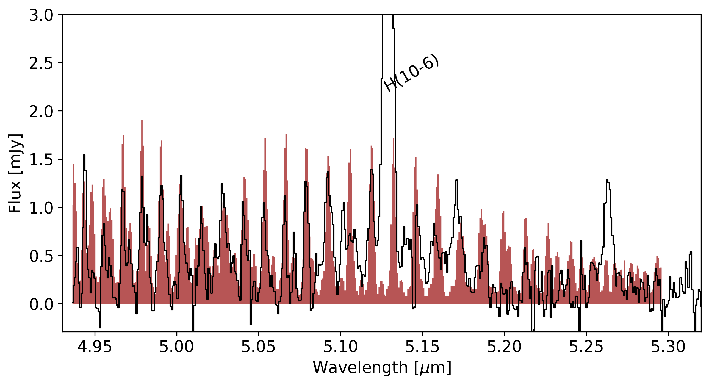
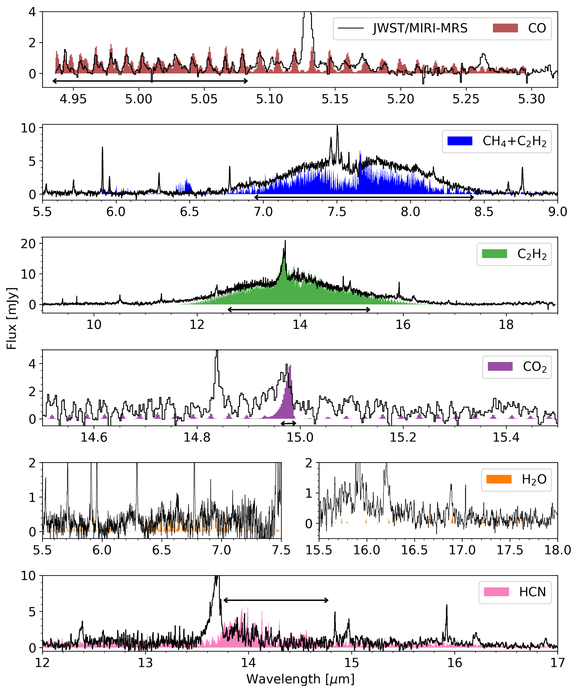

$\newcommand{\ensuremath}{}$
$\newcommand{\xspace}{}$
$\newcommand{\object}[1]{\texttt{#1}}$
$\newcommand{\farcs}{{.}''}$
$\newcommand{\farcm}{{.}'}$
$\newcommand{\arcsec}{''}$
$\newcommand{\arcmin}{'}$
$\newcommand{\ion}[2]{#1#2}$
$\newcommand{\textsc}[1]{\textrm{#1}}$
$\newcommand{\hl}[1]{\textrm{#1}}$
$\newcommand{\footnote}[1]{}$
$\newcommand{\ikc}[1]{\textcolor{green}{\textsf{#1 }}}$
$\newcommand{\jk}[1]{\textcolor{purple}{\rm #1^{(\rm new)}}}$

# MINDS. Strong oxygen depletion in the inner regions of a very low-mass star disk?

<mark>Appeared on: 2025-08-19</mark> -  _accepted for publication in AandA_

J. Kanwar, et al. -- incl., <mark>T. Henning</mark>

**Abstract:** JWST is discovering a plethora of species in planet-forming disks around very low-mass stars such as $\ce{C2H2}$ , $\ce{C6H6}$ , $\ce{C4H2}$ , $\ce{CH3}$ etc. The column densities of these species retrieved from 0D slab models are very large, e.g. of the order of $10^{20}$ cm $^{-2}$ . This is indicating a carbon-dominated chemistry in a gas with a high C/O ratio. The disk around 2MASS-J1605321-1993159 (M4.5) is one such source showing a molecular pseudo-continuum of $\ce{C2H2}$ . Still two oxygen-bearing molecules, CO and $\ce{CO2}$ are also detected in this source. We aim to take the next step beyond 0D slab models to interpret the spectrum. We examine whether 2D thermo-chemical disk models can produce the large inferred column densities of $\ce{C2H2}$ in the inner regions of the disk and produce a pseudo-continuum in the mid-IR spectrum. We also want to constrain  whether depletion of oxygen or enrichment of carbon is causing the high C/O ratio triggering a carbon-dominated chemistry. We utilize the radiative thermo-chemical disk model P ${\tiny RO}$ D ${\tiny I}$ M ${\tiny O}$ to identify a disk structure which is capable of producing the observed molecular emission of species such as CO, $\ce{CO2}$ , $\ce{C2H2}$ , and $\ce{H2O}$ simultaneously. The spectrum is generated using the fast line tracer FLiTs. We derive the gas temperature $\langle T \rangle$ , column density $\langle$ log $_{\rm{10}} N\rangle$ and the emitting area $\langle r_{\rm{1}} - r_{\rm{2}} \rangle$ for these molecules from the 2D disk model and compare them to the parameters retrieved originally from 0D slab models. We use the different effect that changing the O or C abundance has on $\ce{CO}$ and $\ce{C2H2}$ respectively to discriminate between O depletion and C enhancement. We find that a disk structure characterised by the presence of a gap can best explain the observations. The inner disk is strongly depleted in dust, especially small grains ( $<5 \mu$ m), and elemental oxygen, leading to a large C/O ratio. This is required to produce a molecular pseudo-continuum of $\ce{C2H2}$ and at the same time a relatively weak $\ce{CO}$ emission. The P- and R-branch of $\ce{C2H2}$ probe deeper layers of the disk whereas the Q-branch probes mostly the surface layers. The combined emission of CO and $\ce{CO2}$ puts strong constraints on the gap's location (0.1-0.5 au) given a disk gas mass. We report here also the new detection of the CO $\nu$ = 2 $\rightarrow$ 1 transition in the JWST spectrum. 2D thermo-chemical disk models are able to produce the observed molecular pseudo-continuum of $\ce{C2H2}$ . We find that the combination of different species emission in the JWST spectra can be used to discriminate between different scenarios such as O-depletion, C-enhancement or both and offers the potential to extract spatial substructure at scales smaller than $\sim 1$ au.

**Figure 9. -** The zoom-in JWST/MIRI MRS spectrum (black) showing CO emission. The emission of CO from the best thermo-chemical model convolved to 3500 and resampled to JWST-MIRI/MRS resolution is shown in brown. The H {\sc i} 10-6 line is marked in grey. (*CO*)

**Figure 23. -** The modelled spectrum of the best disk model convolved and resampled to the JWST-MIRI/MRS resolution and compared to the continuum subtracted observed spectrum. \citet[Extended Data Figure 5]{Tabone2023} provide two different continua and therefore, we use the continuum from their middle panel to depict \ce{C2H2} and \ce{CH4} whereas the continuum from their bottom panel is used to depict the rest of the molecules. The solid black line depicts the region where the modeled fluxes approximately match the observations. These are the regions where little effect from blending is expected. (*spectrum*)

**Figure 5. -** Vibrational stability equation of state
               $S_{\mathrm{vib}}(\lg e, \lg \rho)$.
               $>0$ means vibrational stability.
              Vibrational stability equation of state
               $S_{\mathrm{vib}}(\lg e, \lg \rho)$.
               $>0$ means vibrational stability.
              Nonlinear Model ResultsNonlinear Model ResultsSpectral types and photometry for stars in the
  region.Spectral types and photometry for stars in the
  region.List of nearby SNe used in this work.Summary for ISOCAM sources with mid-IR excess
(YSO candidates).Summary for ISOCAM sources with mid-IR excess
(YSO candidates). Sample stars with absolute magnitudecontinued. Sample stars with absolute magnitudecontinued.Shown in greyscale is a...Plotted above...Complexes characterisation.Line data and abundances ...Continued. (*FigVibStab*)

