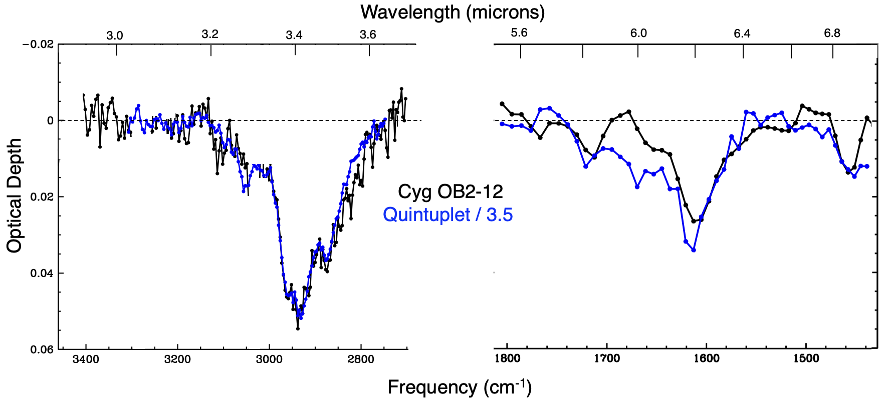
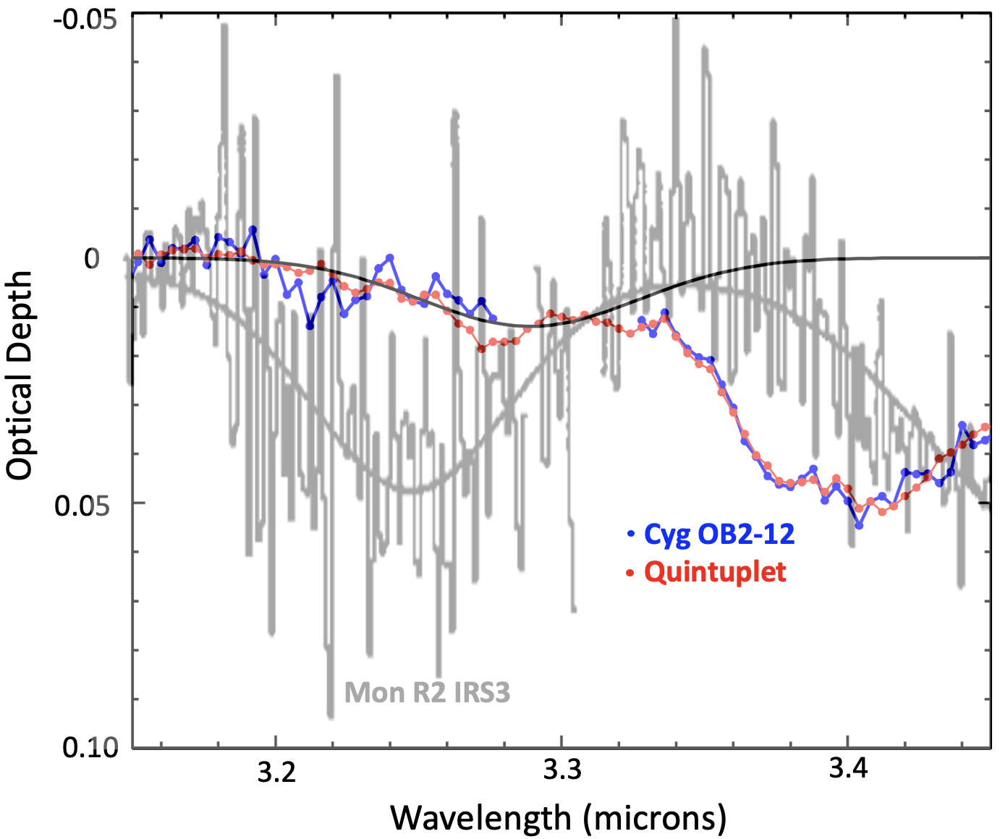
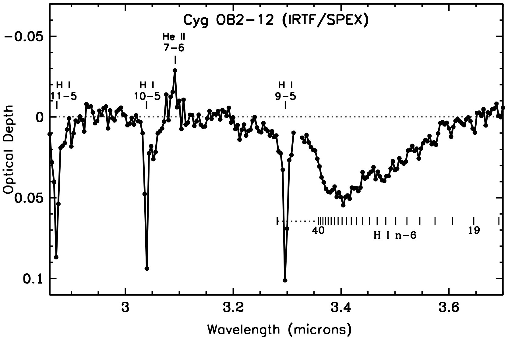

$\newcommand{\ensuremath}{}$
$\newcommand{\xspace}{}$
$\newcommand{\object}[1]{\texttt{#1}}$
$\newcommand{\farcs}{{.}''}$
$\newcommand{\farcm}{{.}'}$
$\newcommand{\arcsec}{''}$
$\newcommand{\arcmin}{'}$
$\newcommand{\ion}[2]{#1#2}$
$\newcommand{\textsc}[1]{\textrm{#1}}$
$\newcommand{\hl}[1]{\textrm{#1}}$
$\newcommand{\footnote}[1]{}$
$\newcommand{\vdag}{(v)^\dagger}$
$\newcommand$
$\newcommand$
$\newcommand{\Ou}{`Oumuamua}$
$\newcommand{\choh}{CH_3OH }$
$\newcommand{\hto}{H_2O }$
$\newcommand{\chisq}{\chi^2 }$
$\newcommand{\Av}{A_V }$
$\newcommand{\Ak}{A_K }$
$\newcommand{\cm}{cm^{-3} }$
$\newcommand{\mum}{\textmu m}$
$\newcommand{\arcm}{\mbox{\ensuremath{.\mkern-4mu^\prime}}}$
$\newcommand{\arcs}{\mbox{\ensuremath{.\!\!^{\prime\prime}}}}$
$\newcommand{\arcd}{\mbox{\ensuremath{.\!\!^\circ}}}$
$\newcommand{\degs}{\ensuremath{^{\circ}}}$
$\newcommand{\Lsun}{\ensuremath{L_\odot}}$
$\newcommand{\Msun}{\ensuremath{M_\odot}}$
$\newcommand{\eg}{e.g.,}$
$\newcommand{\ie}{i. e. }$
$\newcommand{\hawaii}{Hawai\!`i}$

# A Tale of Two Sightlines: Comparison of Hydrocarbon Dust Absorption Bands toward Cygnus OB2-12 and the Galactic Center

<mark>Appeared on: 2025-08-19</mark> -  _28 pages, 7 figures, accepted by ApJ_

Y. J. Pendleton, et al. -- incl., <mark>J. Bouwman</mark>, <mark>T. Henning</mark>

**Abstract:** Infrared spectra of hydrocarbon dust absorption bands toward the bright hypergiant Cygnus OB2-12 are compared to published spectra of the Quintuplet Cluster, a sightline to the Galactic center. The Cyg OB2-12 data include a new ground-based 2.86 $-$ 3.70 $\mum$ spectrum and a previously published, but here further analyzed, spectrum of the 5.50--7.34 $\mum$ region. Higher spectral resolution data for the  Cyg OB2-12 sightline in the 3 $\mum$ region allows a detailed comparison of the 3.4 $\mum$ aliphatic bands to those observed toward the Quintuplet. Despite differences in interstellar environments along each sightline, strong similarities are observed  in the central wavelengths and relative strengths for bands at $\sim$ 3.3, 3.4, 5.85, 6.2, and 6.85 $\mum$ . Analysis of these bands, produced by aromatic, aliphatic, olefinic, hydrogenated, and oxygenated components, shows that carbonaceous dust is a significant component of the diffuse interstellar medium, second in abundance only to silicates, and is primarily aromatic in nature. The grains producing these bands likely consist of large aromatic carbon cores with thin aliphatic mantles composed of hydrogenated amorphous carbon (HAC). Laboratory analog spectra reproduce the observed aliphatic absorption bands well, supporting the presence of such mantles. We present evidence that the carriers of both the 3.4 $\mum$ aliphatic and the 3.3 $\mum$ aromatic bands reside exclusively in the diffuse ISM, and that the 3.3 $\mum$ bands observed in the diffuse ISM differ from those seen in dense clouds, implying chemically distinct carriers. $\keywords{astrochemistry---dust,extinction---ISM:molecules---ISM:lines and bands---infrared:ISM---techniques:spectroscopic}$

**Figure 1. -** Optical depth spectra of Cyg OB2-12 (black) and Quintuplet (blue) sightlines.  Both the near-IR and mid-IR optical depth spectra of the Quintuplet \cite[both from][]{chiar2013structure} are divided by 3.5 so that the strengths of the 3.4 $\mum$ match and thus facilitate comparison of relative band intensities. The continuum level of the mid-IR spectrum of the Quintuplet is slightly shifted from that in chiar2013structure as discussed in the text. (*fig:fig3*)

**Figure 2. -** 
Comparison of spectral profiles of the 3.3 $\mum$ absorption bands towards Cyg OB2-12 (red) and the GC Quintuplet (blue; data from Figure \ref{fig:fig3}, this paper), and the 3.25 $\mum$ band in the deeply embedded YSO Mon R2 IRS3 \citep[][shown with its Gaussian fit, both in gray]{sellgren95}. The Gaussian used to fit the 3.3 $\mum$ bands in the spectra of Cyg OB2-12 and the Quintuplet is shown in black.  (*fig:fig6*)

**Figure 3. -** The 2.86$-$3.70 $\mum$ optical depth spectrum of Cyg OB2-12 obtained with SpeX on the NASA IRTF. The spectrum is displayed at a resolution of 0.004 $\mum$. Telluric line residuals were removed as described in \S \ref{sec: NIR obs}. Three $\ion${H}{1}  Pfund series (_ n_$-$5) absorption lines and a weak $\ion${He}{2} emission line are labeled. The wavelengths of the  $\ion${H}{1}  Humphreys series (_ n_$-$6) lines and the series limit at 3.283 $\mum$ are indicated by short vertical lines. Data points in the interval  3.31$-$3.32 $\mum$ are spurious  due to incomplete correction of the nearly totally opaque telluric absorption by closely spaced lines of the methane $\nu_{3}$ Q-branch, and are not shown. The noise level varies with wavelength but can be estimated from the point to point fluctuations in the signal in regions devoid of absorption features, such as 2.90$-$3.00 $\mum$ and 3.12$-$3.20 $\mum$. (*fig:fig1*)

