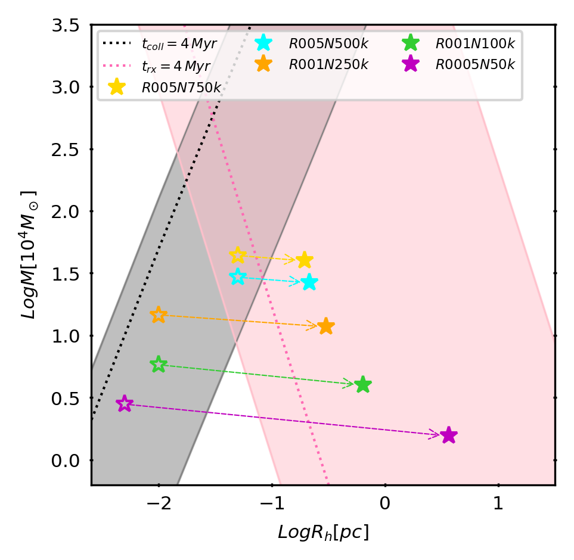
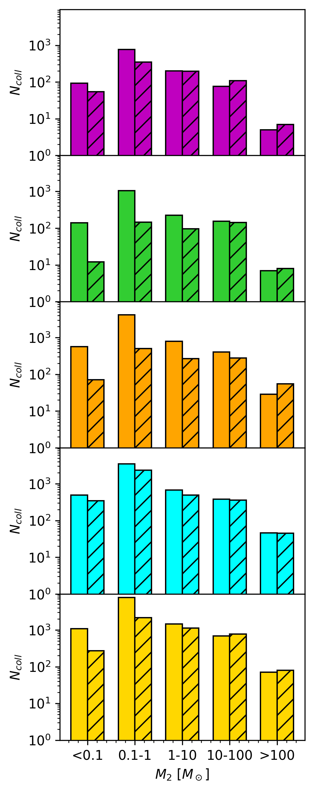
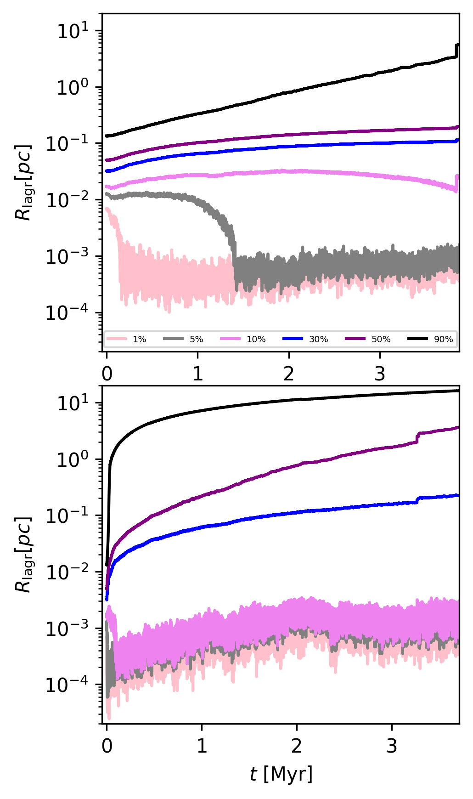

$\newcommand{\ensuremath}{}$
$\newcommand{\xspace}{}$
$\newcommand{\object}[1]{\texttt{#1}}$
$\newcommand{\farcs}{{.}''}$
$\newcommand{\farcm}{{.}'}$
$\newcommand{\arcsec}{''}$
$\newcommand{\arcmin}{'}$
$\newcommand{\ion}[2]{#1#2}$
$\newcommand{\textsc}[1]{\textrm{#1}}$
$\newcommand{\hl}[1]{\textrm{#1}}$
$\newcommand{\footnote}[1]{}$
$\newcommand{\ff}[1]{\textcolor{blue}{\bf #1}}$

# Efficient black hole seed formation in low metallicity and dense stellar clusters   with implications for JWST sources

<mark>Appeared on: 2025-08-21</mark> -  _16 pages, 12 figures_

M. Vergara, et al. -- incl., <mark>N. Neumayer</mark>

**Abstract:** Recent observations with the James Webb Space Telescope (JWST) have revealed the presence of young massive clusters (YMCs) as building blocks of the first galaxies during the first billion years of the Universe. They are not only important constituents of the galaxies, but also potential birth places of very massive stars (VMSs) and black hole (BH) seeds. In this paper, we explore the stellar dynamics in extremely dense clusters with an initial half-mass density of $\rho_{h} \gtrsim 10^8 \rm M_\odot pc^{-3}$ at very low metallicity. These densities are roughly comparable to some of the densest clusters found by JWST. Our detailed $N$ -body and Monte Carlo simulations, which include stellar evolution, show that the formation of VMSs through collisions is unavoidable, with the resulting final masses reaching $\sim 5 \times 10^3$ to $4 \times 10^4 \rm M_\odot$ . These simulations  serve to verify the hypothesis that there is a critical mass scale at which collisions in the system become very efficient and thus VMSs and potentially intermediate-mass BHs (IMBHs) can form. We use nbody6++gpu and MOCCA , including the latest updates of the stellar evolution routines SSE/BSE, along with specific routines to handle the formation and dynamical evolution of VMSs. We show that dense star clusters rapidly form VMSs due to constant stellar bombardment. The VMSs eventually collapse and form a BH seed with masses ranging from a few $10^{3}$ to a few $10^{4} \rm M_\odot$ in less than $4 $ Myr. We discover a critical mass-density threshold in star clusters, beyond which the latter experience several runaway collisions, leading to the formation of massive BH seeds. Considering the ratio of stellar mass to critical mass for typical YMCs detected via JWST, we expect efficiencies in the range up to $10\%$ for the so far detected clusters, thus corresponding to expected BH masses up to $10^5 \rm M_\odot$ in case of their formation via collisions, we predict a relation for the BH mass that follows the shape of $\log(M_{BH} /\rm M_\odot)=-0.76 + 0.76 \log(M /\rm M_\odot)$ . As a side product, the frequent formation of VMS may naturally explain the high amount of nitrogen found in galaxies at high redshift.

**Figure 6. -** The dotted lines represent when the timescales ($t_{coll}$ and t$_{rx}$) are equal to $\tau = 4 $Myr. The shaded regions indicate the parameter space where the respective timescales fall within the range $1 $Myr $\leq \tau \leq 10 $Gyr, highlighting different dynamical regimes: pink for two-body relaxation and grey for stellar collisions. Our clusters \texttt{R0005N50k}, \texttt{R001N100k}, \texttt{R001N250k}, \texttt{R005N500k}, and \texttt{R005N750k}, evolve for $3.73$, $3.81$, $3.64$, $3.80$, $3.87 $Myr, respectively. We show their initial conditions with empty symbols and the final conditions with filled symbols, connected by arrows. (*fig_ic*)

**Figure 13. -** Histograms showing the number of collisions contributing to VMS/BH seed formation. The mass bins are: $<0.1 \mathrm{M}_\odot$, $0.1$–$1 \mathrm{M}_\odot$, $1$–$10 \mathrm{M}_\odot$, $10$–$100 \mathrm{M}_\odot$, and $>100 \mathrm{M}_\odot$. Results are shown for both the N-body simulations (solid bars) and the MOCCA simulations (hatched bars). From top to bottom, the models are \texttt{R0005N50k}, \texttt{R001N100k}, \texttt{R001N250k}, \texttt{R005N500k}, and \texttt{R005N750k}. (*fig:hist_coll*)

**Figure 7. -** Lagrangian radii calculated from the initial mass of the cluster for the $90\%$, $70\%$, $50\%$, $30\%$, $10\%$, and $1\%$ of the enclosed mass of model \texttt{R005N750k}(top) and model \texttt{R0005N50k}(bottom). (*R0005N50k-R005N750k*)

