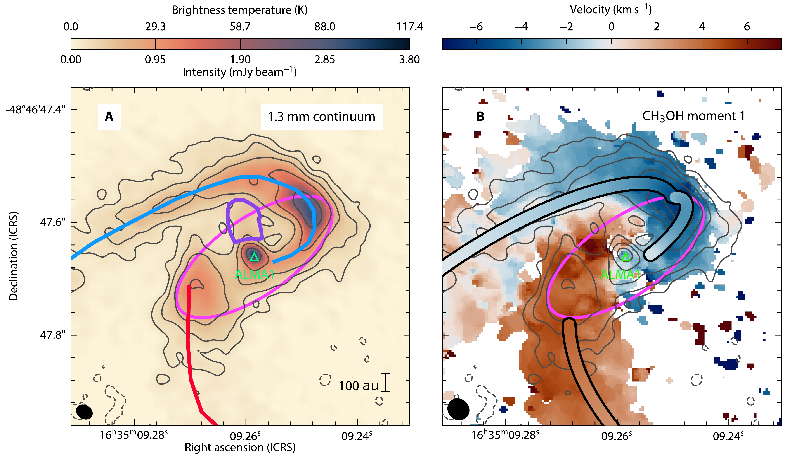
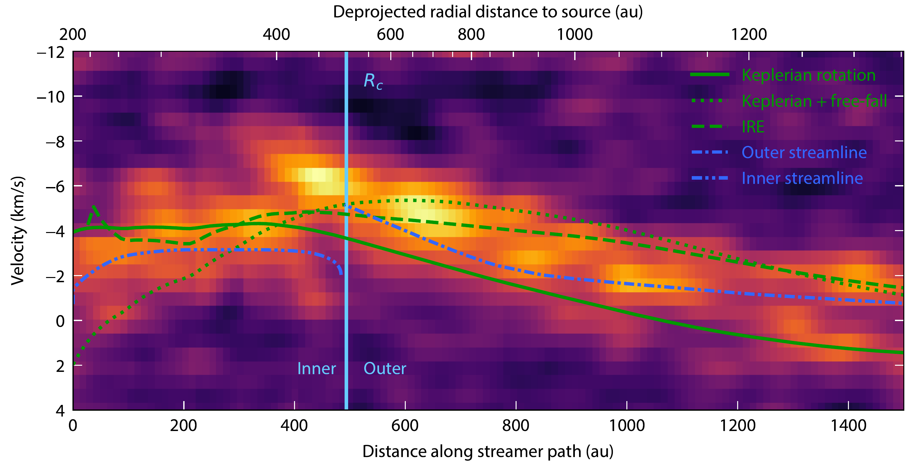
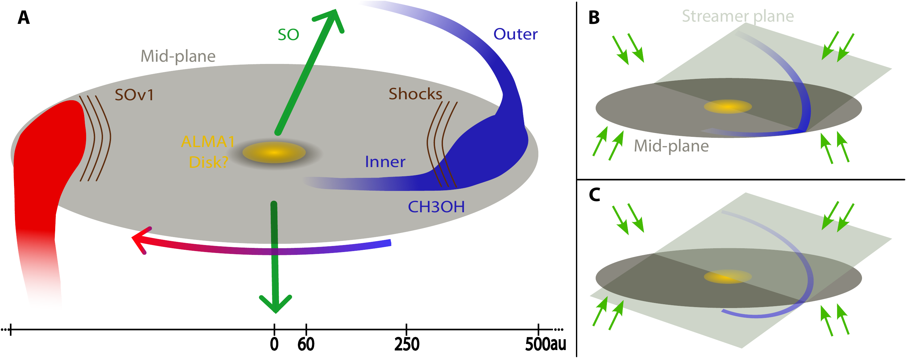

$\newcommand{\ensuremath}{}$
$\newcommand{\xspace}{}$
$\newcommand{\object}[1]{\texttt{#1}}$
$\newcommand{\farcs}{{.}''}$
$\newcommand{\farcm}{{.}'}$
$\newcommand{\arcsec}{''}$
$\newcommand{\arcmin}{'}$
$\newcommand{\ion}[2]{#1#2}$
$\newcommand{\textsc}[1]{\textrm{#1}}$
$\newcommand{\hl}[1]{\textrm{#1}}$
$\newcommand{\footnote}[1]{}$
$\newcommand{\pcc}{ cm^{-3}}$
$\newcommand{\msun}{{\rm M}_\odot}$
$\newcommand{\lsun}{{\rm L}_\odot}$
$\newcommand{\kms}{km s^{-1}}$
$\newcommand{◦}{^{\circ}}$
$\newcommand{\mas}{{\rm mas}}$
$\newcommand{\apj}{ApJ}$
$\newcommand{\apjl}{ApJL}$
$\newcommand{\aap}{A\&A}$
$\newcommand{\mnras}{MNRAS}$
$\newcommand{\araa}{ARA\&A}$
$\newcommand{\ssr}{SSRv}$
$\newcommand{\pasp}{PASP}$
$\newcommand{\aj}{AJ}$
$\newcommand$
$\newcommand{\fnum@figure}{\textbf{Figure \thefigure}}$
$\newcommand{\fnum@table}{\textbf{Table \thetable}}$
$\newcommand{\thefigure}{S\arabic{figure}}$
$\newcommand{\thetable}{S\arabic{table}}$
$\newcommand{\theequation}{S\arabic{equation}}$
$\newcommand{\thepage}{S\arabic{page}}$
$\newcommand\scititle{$
$	Massive extended streamers feed high-mass young stars$
$}$

# $\bfseries$ $\boldmath$ $\scititle$

<mark>Appeared on: 2025-08-25</mark> -  _Published in Science Advances and available at this https URL_

F. A. Olguin, et al. -- incl., <mark>Y. Cheng</mark>

**Abstract:** $\bfseries$ $\boldmath$ Stars are born in a variety of environments that determine how they gather gas to achieve their final masses.It is generally believed that disks are ubiquitous around protostars as a result of angular momentum conservation and are natural places to grow planets.As such, they are proposed to be the last link in the inflow chain from the molecular cloud to the star.However, disks are not the only form that inflows can take.Here we report on high-resolution observations performed with the Atacama Large Millimeter/submillimeter Array that reveal inflows in the form of streamers.These streamers persist well within the expected disk radius, indicating that they play a substitute role channeling material from the envelope directly to an unresolved small disk or even directly to the forming high-mass protostar.These flows are massive enough to feed the central unresolved region at a rate sufficient to quench the feedback effects of the young massive star.

**Figure 1. -** **ALMA 1.3 mm continuum emission and CH$\bf _3$OH $\bf J_{K_a,K_c** =18_{3,15}-17_{4,14} A, v_t=0$ first moment map.}**(A)** The green triangle corresponds to the central source, ALMA1.
The contour levels are $-3$, 5, 10, 20, 40, 80$\times\sigma_{rms}$ with $\sigma_{rms}=28$$\mu$Jy beam$^{-1}$.
The blue- and red-shifted streamer directions are shown by the curves for the corresponding color.
The purple region shows extended emission from ALMA1 likely tracing a jet component.
**(B)** The first moment velocity map with respect to the systemic velocity ($-47.2$ km s$^{-1}$\cite{Taniguchi2023}) is accompanied by colored curves describing the trajectory and velocity distribution of the streamlines of a rotating and infalling envelope.
The blue streamer is divided in two streamlines.
The outer component presents a refinement of the streamline model presented in \cite{Olguin2023}, while the inner component corresponds to a similar model but with a streamline origin at the centrifugal radius and close to the mid-plane (see Materials and Methods).
The contours are the same as in (A).
The pink ellipse correspond to a circle of radius 500 au, i.e., the centrifugal radius, projected in plane of the sky assuming an inclination angle of 65◦ with respect to the line of sight.
Synthesized beam sizes for the continuum and first moment maps are shown in the bottom left corner.
 (*fig:continuum*)

**Figure 2. -** **Blue-shifted streamer position-velocity (PV) diagram in CH$\bf _3$OH.**
The green solid line corresponds to the line of sight Keplerian velocity at the same deprojected distance to the central source, ALMA1.
Similarly, the dotted green line corresponds to a Keplerian rotation and infall velocity distribution, while the dashed line corresponds to the IRE velocity distribution \cite{Oya2022}.
The inner and outer blue streamer models in Fig. \ref{fig:continuum}B are shown in blue dot-dashed lines.
The lower abscissa scale corresponds to the distance along the path used to calculate the PV diagram slice (shown in Fig. \ref{fig:continuum}) with the package  pvextractor, while the upper one corresponds to the radial distance to ALMA1 assuming that the slice points are located in the mid-plane (see Materials and Methods).
The mid-plane is assumed to be inclined 65◦ with respect to the line of sight.
The vertical light blue line marks the position of the centrifugal radius, $R_c=500$ au.
 (*fig:pvmap*)

**Figure 3. -** **Schematic representation of the different kinematic components and flow scenarios.**(** A**) Schematic representation of the observations with the different components labeled by the tag with the respective color.
The green arrows point in the direction of the outflows, while the blue to red arrow indicated the rotation direction.
The scale at the bottom indicates the radius of ALMA1, the centrifugal barrier radius and the centrifugal radius from left to right, respectively.
(** B**) and (** C**) Are the two scenarios proposed to explain the origin of the shocks in the blue streamer.
Green arrows represent the background infall from the less dense envelope.
 (*fig:sketch*)

