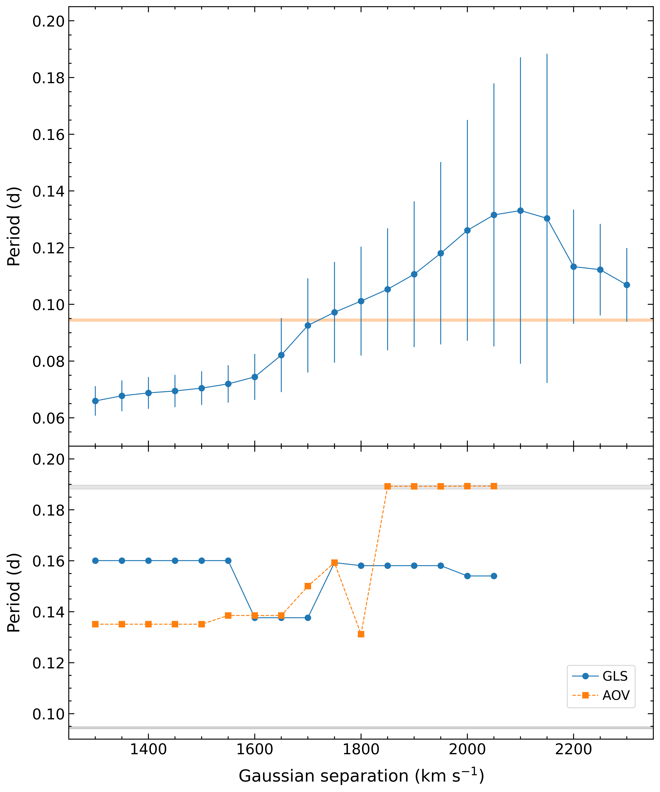

$\newcommand{\ensuremath}{}$
$\newcommand{\xspace}{}$
$\newcommand{\object}[1]{\texttt{#1}}$
$\newcommand{\farcs}{{.}''}$
$\newcommand{\farcm}{{.}'}$
$\newcommand{\arcsec}{''}$
$\newcommand{\arcmin}{'}$
$\newcommand{\ion}[2]{#1#2}$
$\newcommand{\textsc}[1]{\textrm{#1}}$
$\newcommand{\hl}[1]{\textrm{#1}}$
$\newcommand{\footnote}[1]{}$
$\newcommand{\Ha}{H\textalpha}$
$\newcommand{\Hb}{H\textbeta}$
$\newcommand{\Hg}{H\textgamma}$
$\newcommand{\Hd}{H\textdelta}$
$\newcommand{\Hep}{H\textepsilon}$
$\newcommand{\Ion}[2]{#1 {\sc #2}}$
$\newcommand{\Line}[3]{#1 {\sc #2}~\textlambda #3}$
$\newcommand{\kms}{\mbox{\mathrm{km~s^{-1}}}}$
$\newcommand{\he}[1]$
$\newcommand{\hel}[2]$
$\newcommand{\Msun}{\mbox{M_{\rm \odot}}}$
$\newcommand{\Rsun}{\mbox{R_{\rm \odot}}}$
$\newcommand{\sw}{\textit{Swift} J1910.2--0546}$
$\newcommand{\jj}{J1910}$
$\newcommand{\porb}{P}$
$\newcommand{\ebv}{E(B-V)}$
$\newcommand{\ebvval}[1]{E(B-V) = #1}$
$\newcommand{\ergs}{erg s^{-1} cm^{-2}}$
$\newcommand{\savefootnote}[2]{\footnote{\label{#1}#2}}$
$\newcommand{\repeatfootnote}[1]{\textsuperscript{\ref{#1}}}$

# Characterising the short-orbital period X-ray transient $\sw$

<mark>Appeared on: 2025-08-26</mark> -  _13 pages, 10 figures. Accepted for publication in A&A_

J. M. Corral-Santana, et al. -- incl., <mark>A. P. Garcia</mark>

**Abstract:** $\sw$ (=MAXI J1910 $-$ 057) is a Galactic X-ray transient discovered during a bright outburst in 2012. Its X-ray spectral and timing properties point to a black-hole accretor, yet the orbital period remains uncertain, and no reliable dynamical constraints on the binary parameters are available.The 2012 event, extensively monitored at X-ray and optical wavelengths, offers a rare opportunity to investigate the structure and dynamics of the system and to constrain its fundamental properties. We use time-series optical photometry and spectroscopy, obtained during outburst and quiescence, to estimate the orbital period, characterise the donor star, determine the interstellar extinction, distance, and system geometry, and constrain the component masses. Multi-site $r$ -band and clear-filter light curves and WHT/ACAM spectra from the 2012 outburst are combined with time-series spectroscopy from GTC/OSIRIS and VLT/FORS2 in quiescence.  Period searches are conducted using generalised Lomb–Scargle, phase-dispersion minimisation, and analysis-of-variance algorithms. Diffuse interstellar bands constrain $E(B\!-\!V)$ , while empirical correlations involving $\Ha$ yield estimates of $K_2$ , $q$ , and $i$ . We detect a coherent, double-humped modulation with a period of $0.0941\pm0.0007$ d ( $2.26\pm0.02$ h) during the outburst. Its morphology is consistent with an early superhump, suggesting that the true orbital period may be slightly shorter than 4.52 h. The $\Ha$ radial velocity curves do not yield a definitive orbital period. In quiescence, TiO bands indicate an M3--M3.5 donor contributing $\simeq\!70\%$ of the red continuum. Diffuse interstellar bands give $E(B\!-\!V)=0.60\pm0.05$ and $N_{\mathrm{H}}=(3.9\pm1.3)\times10^{21}$ cm $^{-2}$ , placing the system at a distance of 2.8–4.0 kpc. The $\Ha$ line width in quiescence ( $\mathrm{FWHM}_0 = 990\pm45$ $\kms$ ), via a FWHM- $K_2$ calibration, provides an estimate of $K_2$ , while its double-peaked profile gives $q$ and the orbital inclination. The latter appears much higher than estimates from X-ray studies. Adopting the resulting $K_{2}=230\pm17$ $\kms$ and $q=0.032\pm0.010$ , and two orbital period scenarios (2.25 and 4.50 \; h), Monte Carlo sampling returns a compact object mass $M_{1}=8$ -- $11$ $\Msun$ and an inclination $i = 13^{\circ}$ – $18^{\circ}$ for plausible donor masses ( $M_{2}=0.25$ -- $0.35$ $\Msun$ ). We favour an orbital period of 4.5 \; h. $\sw$ may be a short-period, low-inclination black hole X-ray transient, although a neutron star accretor cannot be completely ruled out. Further phase-resolved spectroscopy and photometry during quiescence are needed to better determine its fundamental parameters.

**Figure 1. -** VLT/FORS2 $I$-band acquisition image obtained during quiescence. $\jj$ is marked with a red cross at the centre of the 1.2$\arcmin$ field. North is up, east is to the left.
     (*fig:fc*)

**Figure 7. -** Top panel: $r$-band light curves from SMARTS 0.9-m and INT/WFC, expressed as flux ratios and magnitudes, relative to the comparison star. Middle panels: SMARTS light curve (top left) and INT/WFC light curves from the first three nights when $\jj$ maintained an almost constant flux level, after subtracting the nightly averages. The red dashed curve represents the best-fit sine wave with a period corresponding to the highest peak in the periodogram shown below. Bottom left panel: GLS periodogram of the four $r$-band light curves displayed in the middle panels (4, 9, 10, and 11 Jun 2012). The highest peak corresponds to a period of $0.0941$\;d ($= 2.26$\;h). Bottom middle and right panels: The four light curves folded on this period and twice that value. The pale blue points represent the unbinned data, while the purple points are binned data across 40 phase intervals. Zero phase corresponds to the HJD of the first data point, and a full cycle is repeated for continuity. (*j1910_mnras_fig_GLS_01*)

**Figure 3. -** Top panel: Best sine-fit periods derived from the radial velocity curves of the $\Ha$ emission line in the OSIRIS spectra, as a function of the double-Gaussian separation used in the velocity extraction. The shaded horizontal band indicates the periods derived from the light curves. Error bars represent 1$\sigma$ uncertainties. Bottom panel: Periods corresponding to the highest peaks in the GLS (blue circles) and AOV (orange squares) periodograms derived from the quiescent FORS2 $\Ha$ radial velocity curves, as a function of the Gaussian separation used to extract the velocities. The period search was restricted to the range 0.068--0.25\;d. The lower shaded horizontal band marks the periods observed in the photometric light curves, while the upper band corresponds to twice these values. (*fig:j1910_mnras_fig_Ha_RVC*)

