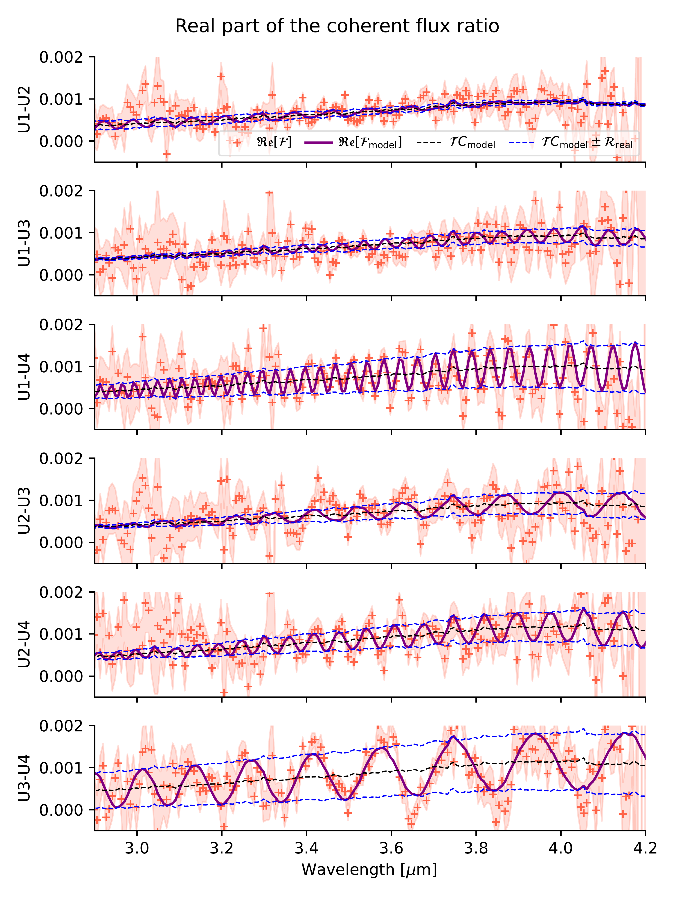
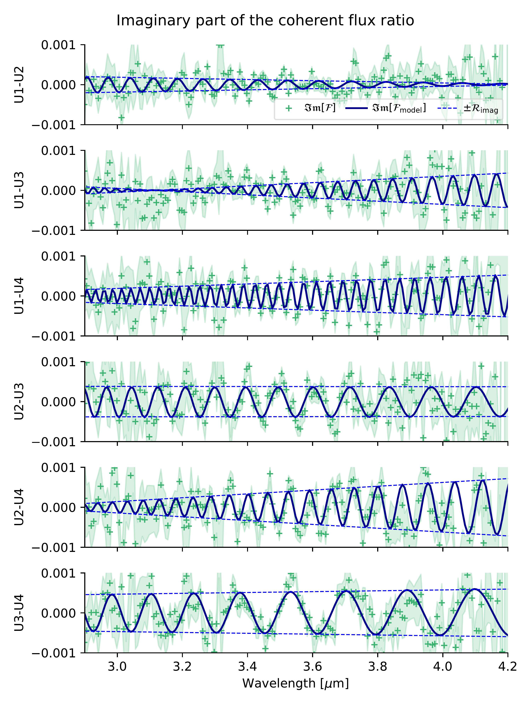
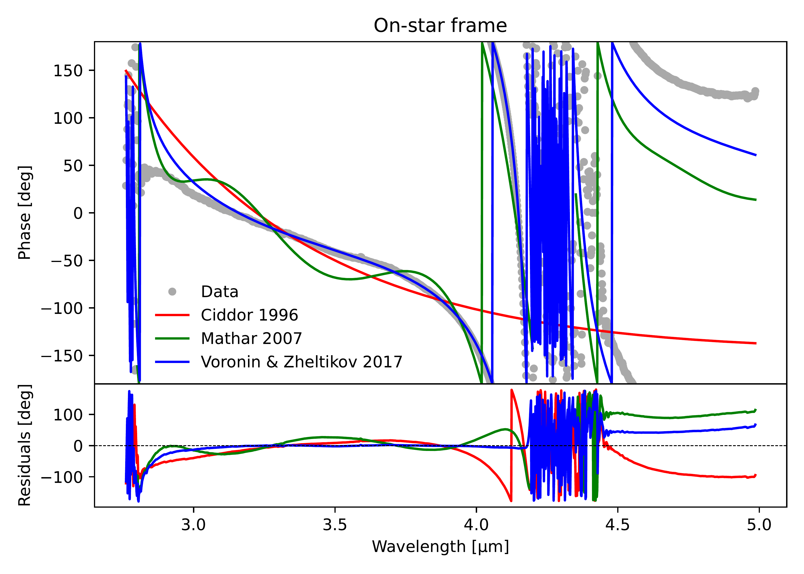
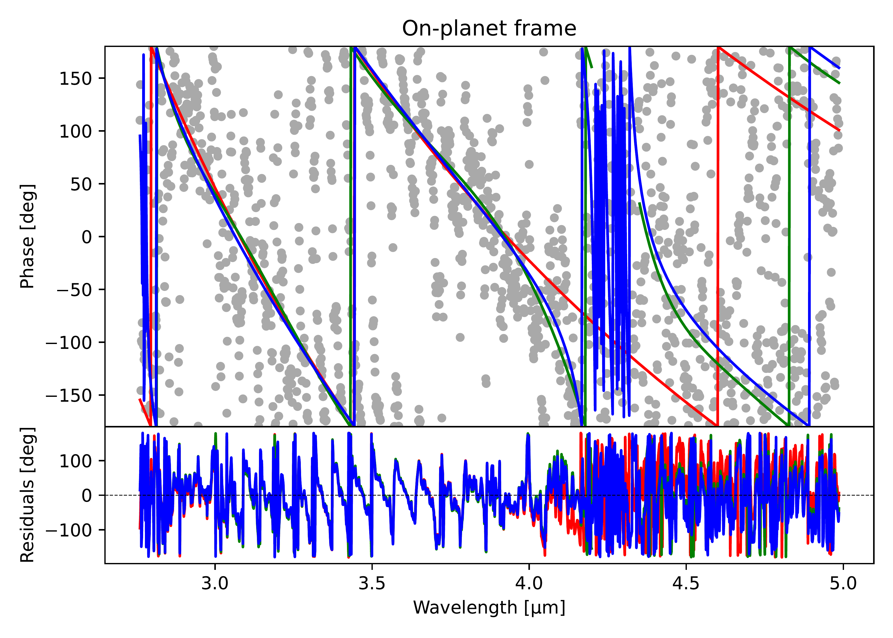

$\newcommand{\ensuremath}{}$
$\newcommand{\xspace}{}$
$\newcommand{\object}[1]{\texttt{#1}}$
$\newcommand{\farcs}{{.}''}$
$\newcommand{\farcm}{{.}'}$
$\newcommand{\arcsec}{''}$
$\newcommand{\arcmin}{'}$
$\newcommand{\ion}[2]{#1#2}$
$\newcommand{\textsc}[1]{\textrm{#1}}$
$\newcommand{\hl}[1]{\textrm{#1}}$
$\newcommand{\footnote}[1]{}$

# The mid-infrared spectrum of $\beta$ Pictoris b: First VLTI/MATISSE interferometric observations of an exoplanet $\thanks{Based on public data released from the MATISSE commissioning observations at the VLT Interferometer under ESO Programme 60.A-9257(H), and NACO observations under ESO Programme 088.C-0196.}$

<mark>Appeared on: 2025-08-27</mark> -  _21 pages, 17 figures. Accepted for publication in A&A_

M. Houllé, et al. -- incl., <mark>D. Blain</mark>, <mark>G. Chauvin</mark>, <mark>P. Mollière</mark>, <mark>M. Ravet</mark>, <mark>P. Boley</mark>, <mark>L. Kreidberg</mark>, <mark>R. v. Boekel</mark>

**Abstract:** Few spectra of directly-imaged exoplanets have been obtained in the mid-infrared ( $>3$ µm). This region is particularly rich in molecular spectral signatures, whose measurements can help recover atmospheric parameters and provide a better understanding of giant planet formation and atmospheric dynamics. In the past years, exoplanet interferometry with the VLTI/GRAVITY instrument has provided medium-resolution spectra of a dozen substellar companions in the near infrared. The 100-meter interferometric baselines allow for the stellar and planetary signals to be efficiently disentangled at close angular separations ( $<0.3$ "). We aim to extend this technique to the mid-infrared using MATISSE, the VLTI’s mid-infrared spectro-interferometer. We take advantage of the fringe tracking and off-axis pointing capabilities recently brought by the GRA4MAT upgrade. Using this new mode, we observed the giant planet $\beta$ Pictoris b in $L$ and $M$ bands (2.75--5 µm) at a spectral resolution of 500. We developed a method to correct chromatic dispersion and non-common paths effects in the fringe phase and modelled the planet astrometry and stellar contamination. We obtained a high-signal-to-noise spectrum of $\beta$ Pictoris b, showing the planet continuum in $L$ (for the first time) and $M$ bands, which contains broad absorption features of $H_2$ O and CO. In conjunction with a new GRAVITY spectrum, we modelled it with the \texttt{ForMoSA} nested sampling tool and the Exo-REM grid of atmospheric models, and found a solar carbon-to-oxygen ratio in the planet atmosphere. This study opens the way to the characterization of fainter and closer-in planets with MATISSE, which could complement the JWST at angular separations too close for it to obtain exoplanet spectra. Starting in 2025, the new adaptive optics system brought by the GRAVITY+ upgrade will further extend the detection limits of MATISSE.

**Figure 12. -** Spectrum of $\beta$ Pic b with MATISSE (black, this work) compared to other instruments: NACO (yellow, new data), GPI \citep[blue,][]{Chilcote2017}, GRAVITY (green, new data) and MIRI \citep[red,][]{Worthen2024}. Only the slope of the NACO spectrum can be compared to MATISSE as the absolute level was scaled manually. MATISSE data with a S/N < 5, located in strong telluric bands and not used in this work, are shown in grey. The absorption curves of $H_2$O, CO, and $CH_4$, calculated from the best-fitting Exo-REM model presented in Sect. \ref{sec:modeling}, are plotted at the top to visualize their impact on the spectrum. $H_2$O and CO leaves a visible pattern, but not $CH_4$, likely because it is dominated by $H_2$O absorption or buried in noise. (*fig:spectrum*)

**Figure 10. -** Real (left) and imaginary (right) parts of the measured planet-to-star coherent flux ratio $\mathcal{F}$ on the six UT baselines, during one 10-s frame. The error range is plotted in the background. The thick lines show the best-fit model as described in Sect. \ref{sec:astrometry}. It includes the star-planet modulation, the stellar speckle contamination (dashed blue curves), and the planet-to-star contrast assumption (dashed black curve). (*fig:model+dataampphase*)

**Figure 2. -** Measured differential phase (grey dots) in two MATISSE frames, one on the star (top) and the other on the planet (bottom). Overlaid are the models presented in this work using the air refractive indices of [ and Voronin (2017)]()(blue), [ and Mathar (2007)]()(green) and [ and Ciddor (1996)]()(red). In the absence of chromatic or non-common path OPD, the differential phase should be zero on the star or an oscillation on the planet.
     (*fig:phase-correction*)

