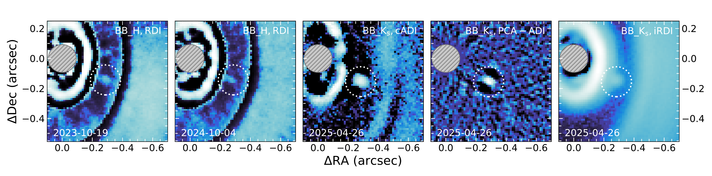
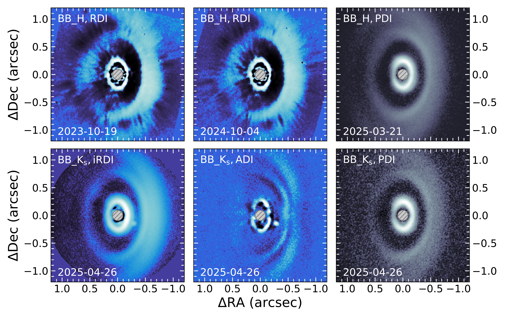
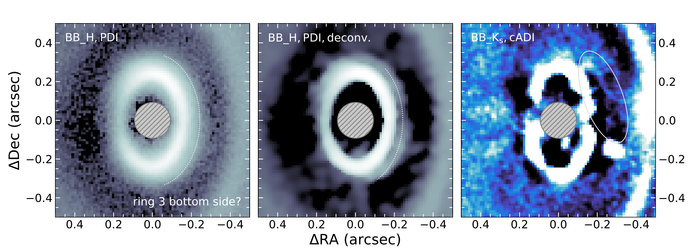

$\newcommand{\ensuremath}{}$
$\newcommand{\xspace}{}$
$\newcommand{\object}[1]{\texttt{#1}}$
$\newcommand{\farcs}{{.}''}$
$\newcommand{\farcm}{{.}'}$
$\newcommand{\arcsec}{''}$
$\newcommand{\arcmin}{'}$
$\newcommand{\ion}[2]{#1#2}$
$\newcommand{\textsc}[1]{\textrm{#1}}$
$\newcommand{\hl}[1]{\textrm{#1}}$
$\newcommand{\footnote}[1]{}$
$\newcommand{\wis}{WISPIT\xspace}$
$\newcommand{\wisa}{WISPIT~2\xspace}$
$\newcommand{\wisb}{WISPIT~2b\xspace}$
$\newcommand{\vdag}{(v)^\dagger}$
$\newcommand{\mj}{\ensuremath{\mathrm{M_{Jup}}}\xspace}$
$\newcommand$
$\newcommand$
$\newcommand{\mb}[1]{\textcolor{blue}{[#1]}}$
$\newcommand{\sfa}[1]{\textcolor{purple}{[#1]}}$
$\newcommand{\pmra}{\mu_{\alpha *}}$
$\newcommand{\pmdec}{\mu_{\delta}}$
$\newcommand{\masyr}{mas yr^{-1}}$
$\newcommand{\kms}{km s^{-1}}$
$\newcommand{\cms}{cm s^{-2}}$
$\newcommand{\arraystretch}{1.2}$
$\newcommand{\arraystretch}{1.2}$
$\newcommand{\arraystretch}{1.2}$
$\newcommand{\arraystretch}{1.2}$
$\newcommand{\arraystretch}{1.2}$
$\newcommand{\arraystretch}{1.2}$
$\newcommand{\arraystretch}{1.2}$
$\newcommand{\arraystretch}{1.2}$
$\newcommand{\arraystretch}{1.2}$
$\newcommand{\arraystretch}{1.2}$
$\newcommand{\arraystretch}{1.2}$

# WIde Separation Planets In Time (WISPIT): \ A gap-clearing planet in a multi-ringed disk around the young solar-type star WISPIT 2

<mark>Appeared on: 2025-08-27</mark> - 

R. F. v. Capelleveen, et al. -- incl., <mark>M. Benisty</mark>

**Abstract:** In the past decades several thousand exoplanet systems have been discovered around evolved, main-sequence stars, revealing a wide diversity in their architectures.To understand how the planet formation process can lead to vastly different outcomes in system architecture we have to study the starting conditions of planet formation within the disks around young stars.In this study we are presenting high resolution direct imaging observations with VLT/SPHERE of the young ( $\sim$ 5 Myr), nearby ( $\sim$ 133 pc), solar-analog designated as $\wisa$ ( $=$ TYC 5709-354-1).These observations were taken as part of our survey program that explores the formation and orbital evolution of wide-separation gas giants.WISPIT 2 was observed in four independent epochs using polarized light and total intensity observations.They reveal for the first time an extended (380 au) disk in scattered light with a multi-ringed sub-structure.We directly detect a young proto-planet $\wisb$ , embedded in a disk gap and show that it is co-moving with its host star.Multiple SPHERE epochs demonstrate that it shows orbital motion consistent with Keplerian motion in the observed disk gap.Our $H$ and $K_s$ -band photometric data are consistent with thermal emission from a young planet.By comparison with planet evolutionary models, we find a mass of the planet of $4.9^{+0.9}_{-0.6}$ $\mj$ .This mass is also consistent with the width of the observed disk gap, retrieved from hydrodynamic models. $\wisb$ is the first unambiguous planet detection in a multi-ringed disk, making the $\wisa$ system the ideal laboratory to study planet-disk interaction and subsequent evolution.

**Figure 10. -** All detections of the embedded planet $\wis$b in the various observation epochs and filters.
    We indicate the embedded planet position with a white, dotted circle.
    The coronagraph position is indicated with a gray, hashed mask.
    For the 2025 $K_s$-band data we show that the embedded planet is recovered with  classical and \ac{pca}-based \ac{adi} as well as in iRDI. (*fig:planet-images*)

**Figure 9. -** SPHERE/IRDIS observations of the $\wis$a system.
The gray, hashed disk in the image center indicates the size of the coronagraphic mask.
The differential imaging method and observed waveband for each image are indicated in the top left corner.
Blue-hued images reduced with the \ac{adi} or \ac{rdi}(50 principal components) methods are showing total intensity, sensitive to disk scattered light and thermal emission from embedded planets.
The gray-hued images are $Q_\phi$ images (reduced with the \ac{pdi} method) showing linearly polarized scattered light, not sensitive to thermal emission.
 (*fig:obs-results*)

**Figure 17. -** Zoom-in on the innermost disk ring (ring 3).
      We show polarized light $Q_\phi$ images in the gray color scheme in the left and middle panel and the total intensity cADI $K_s$-band image in the blue color scheme in the right panel.
      The middle panel shows the $Q_\phi$ image after image deconvolution was applied.
      Left and middle panel are displayed on a log scale due to the large dynamic range of the inner disk region while the right panel is on a linear scale.
      The gray hashed circle in the image center marks the area covered by the coronagraphic mask.
      We indicate with dotted lines (left and middle panel) and with a solid encircling ellipse (right panel) the signature of the inner disk bottom side. (*app:fig:disk bottom*)

