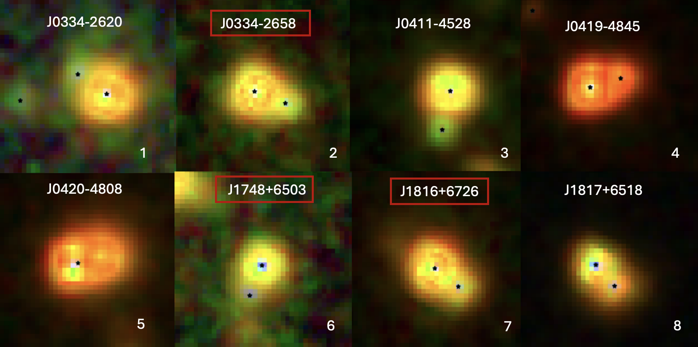
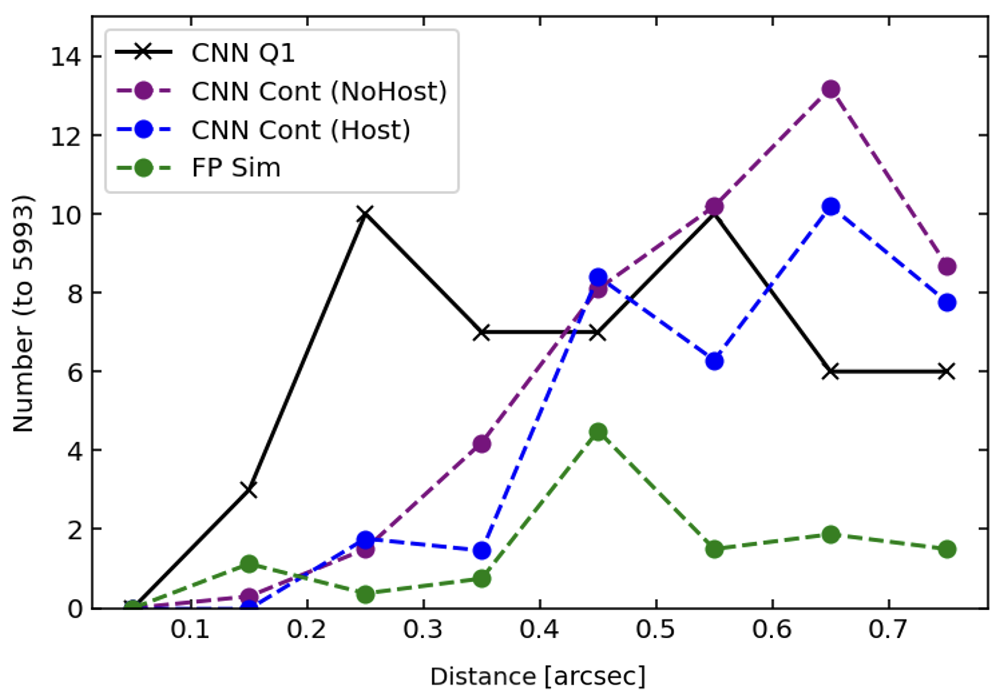
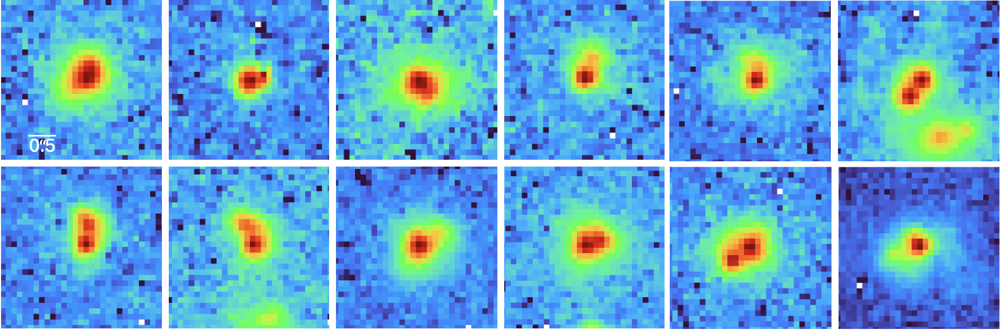

$\newcommand{\ensuremath}{}$
$\newcommand{\xspace}{}$
$\newcommand{\object}[1]{\texttt{#1}}$
$\newcommand{\farcs}{{.}''}$
$\newcommand{\farcm}{{.}'}$
$\newcommand{\arcsec}{''}$
$\newcommand{\arcmin}{'}$
$\newcommand{\ion}[2]{#1#2}$
$\newcommand{\textsc}[1]{\textrm{#1}}$
$\newcommand{\hl}[1]{\textrm{#1}}$
$\newcommand{\footnote}[1]{}$
$\newcommand{\orcid}[1]$
$\newcommand\aa{@@strip}$

# $\Euclid$: A machine-learning search for dual and lensed AGN at sub-arcsec separations$\thanks{This paper is published on behalf of the Euclid Consortium.}$

<mark>Appeared on: 2025-08-28</mark> -  _18 figures_

L. Ulivi, et al. -- incl., <mark>K. Jahnke</mark>

**Abstract:** Cosmological models of hierarchical structure formation predict the existence of a widespread population of dual accreting supermassive black holes (SMBHs) on kiloparsec-scale separations, corresponding to projected distances $<$ $\ang{;;0.8}$ at redshifts higher than 0.5. However, close companions to known active galactic nuclei (AGN) or quasars (QSOs) can also be multiple images of the object itself, strongly lensed by a foreground galaxy, as well as foreground stars in a chance superposition. Thanks to its large sky coverage, sensitivity, and high spatial resolution, $\Euclid$ offers a unique opportunity to obtain a large, homogeneous sample of dual/lensed AGN candidates with sub-arcsec projected separations.   Here we present a machine learning approach, in particular a Convolutional Neural Network (CNN), to identify close companions to known QSOs down to separations of $\sim $ $\ang{;;0.15}$ , comparable to the $\Euclid$ VIS point spread function (PSF). We investigated the performance of the CNN trained on a large sample of simulated single and dual AGN.    We studied the effectiveness of the CNN in identifying dual AGN  and demonstrated that it outperforms traditional techniques such as \texttt{IRAFStarFinder} . Applying our CNN to a sample of $\sim $ 6000 QSOs from the Q1 $\Euclid$ data release (covering $\SI{63.1}{\deg\squared}$ ), we find a fraction of about 0.25 \% dual AGN candidates with separation $\sim $  $\ang{;;0.4}$ (corresponding to $\sim $ 3 kpc at $z $ =1). Estimating the foreground contamination from stellar objects, we find that most of the pair candidates with separation higher than $\ang{;;0.5}$ are likely contaminants, while below this limit, contamination is expected to be less than 20 \% .  For objects at higher separation (> $\ang{;;0.5}$ , i.e. 4 kpc at $z $ =1), we performed PSF subtraction and used colour-colour diagrams to constrain their nature. We present a first set of dual/lensed AGN candidates detected in the Q1 $\Euclid$ data, providing a starting point for the analysis of future data releases.

**Figure 17. -** Three-colour composite images (\IE, \JE, \HE) of dual AGN candidates derived from MER photometry or PSF subtraction. Systems enclosed in red boxes are those where both sources lie within the AGN region in both photometric methods. The black stars mark the positions of the input sources from the MER catalogue. The size of each cutout is $\ang{;;3} \times \ang{;;3}$. (*fig:phot_cand*)

**Figure 7. -** Comparison between the number of dual candidates found by CNN and the expected contaminants. The number is normalized by the total number of AGN considered after the cuts (5993). Dual AGN candidates found by CNN in bins of separation (in black), number of expected contaminants classified dual by the CNN once we added a primary source without (purple) and with (blue) host galaxy, and
    false positives expected from simulations (in green). (*fig:contamination*)

**Figure 16. -** Dual AGN candidates found by the network with separations between \ang{;;0.15} and \ang{;;0.45}. The number of objects in this separation range exceeds the number expected from foreground objects and false positives caused by clumpy galaxy structure, making these candidates more reliable than those at larger separations. The size of each cutout is $\ang{;;3} \times \ang{;;3}$, and the flux is shown in logarithmic scale.    (*fig:Closesources*)

