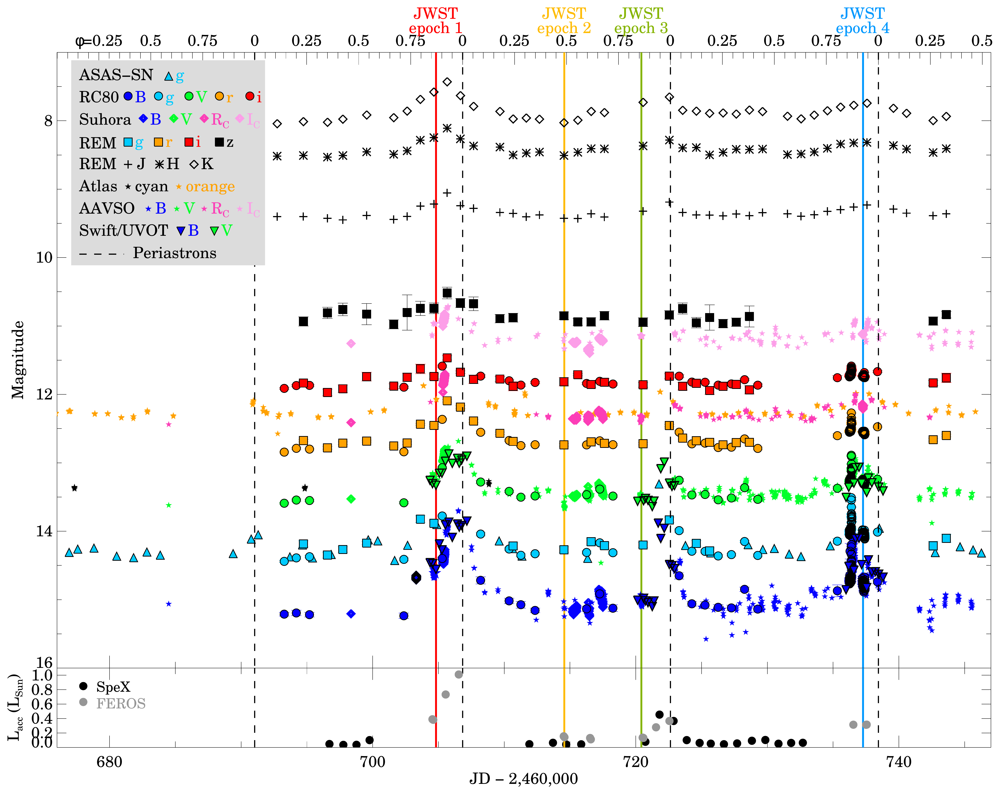
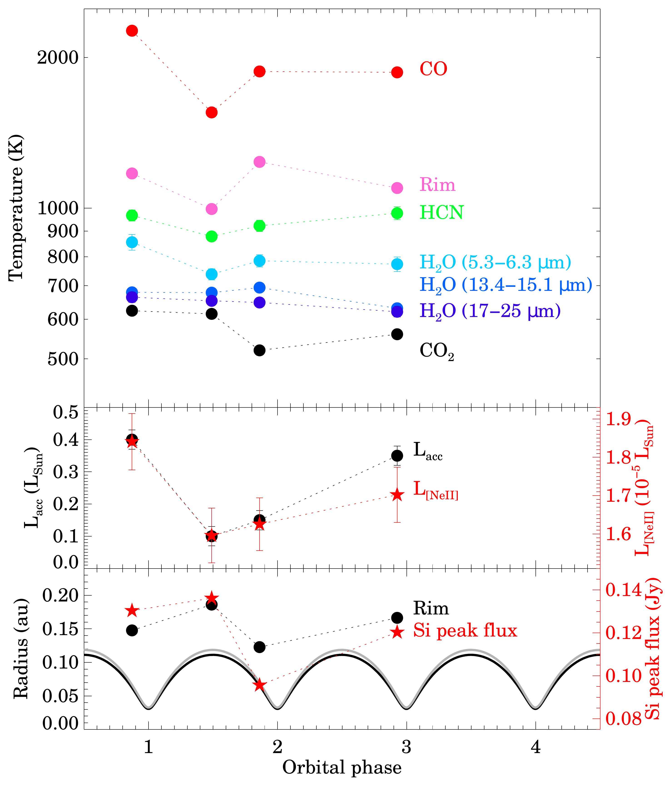
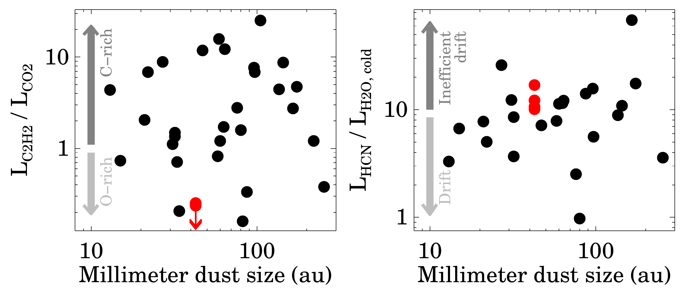

$\newcommand{\ensuremath}{}$
$\newcommand{\xspace}{}$
$\newcommand{\object}[1]{\texttt{#1}}$
$\newcommand{\farcs}{{.}''}$
$\newcommand{\farcm}{{.}'}$
$\newcommand{\arcsec}{''}$
$\newcommand{\arcmin}{'}$
$\newcommand{\ion}[2]{#1#2}$
$\newcommand{\textsc}[1]{\textrm{#1}}$
$\newcommand{\hl}[1]{\textrm{#1}}$
$\newcommand{\footnote}[1]{}$
$\newcommand{\linenumbers}$
$\newcommand{\nolinenumbers}$
$\newcommand\natexlab{#1}$

# Time-resolved protoplanetary disk physics in DQ Tau with JWST

<mark>Appeared on: 2025-08-28</mark> -  _21 pages, 20 figures, accepted for publication in the A&A_

Á. Kóspál, et al. -- incl., <mark>D. Semenov</mark>

**Abstract:**            Accretion variability is ubiquitous in YSOs. While large outbursts may strongly affect the disk, the effects of moderate bursts are less understood. We aim to study the physical response of the disk around the eccentric binary system DQ Tau to its periodic accretion changes. We organized a multi-wavelength campaign centered on four JWST/MIRI spectra. We targeted three periastrons (high accretion state) and one apastron (quiescence). We used optical and near-infrared spectroscopy and photometry to measure how the accretion luminosity varies. We decomposed the multi-epoch SEDs into stellar, accretion, and rim components. We fitted the solid-state features using various opacity curves and the molecular features using slab models. We find the inner disk of DQ Tau to be highly dynamic. The temperature, luminosity, and location of the inner dust rim vary in response to the movement of stars and the L_acc variations. This causes variable shadowing of the outer disk, leading to an anti-correlation between the rim temperature and the strength of the silicate feature. The dust mineralogy remains constant, dominated by large amorphous olivine and pyroxene grains, with smaller fractions of crystalline forsterite. The excitation of CO (1550-2260 K), HCN (880-980 K), and hot H2O (740-860 K) molecules as well as the luminosity of the [NeII] line correlate with the accretion rate, while the warm (650 K) and cold (170-200 K) H2O components are mostly constant. CO emission, originating from a hot (>1500 K) region likely within the dust sublimation radius, is most sensitive to L_acc changes. In comparison with other T Tauri disks, DQ Tau is highly C-poor and displays moderately inefficient pebble drift. We conclude that even moderate accretion rate changes affect the thermal structure in the planet-forming disk regions on short timescales, providing a crucial benchmark for understanding disk evolution.         

**Figure 12. -** Light curves (top) and accretion luminosity (bottom) of DQ Tau. Vertical dashed lines mark the epochs of periastrons. The solid vertical lines in color show the epochs of the JWST/MIRI observations. (*fig:light*)

**Figure 7. -** Temperature of the dust rim and of various gas components (top), accretion luminosity and the luminosity of the [Ne II] line at 12.81$ \mu$m (middle), dust rim radius, peak flux of the continuum-subtracted 10$ \mu$m silicate feature, and the distance of the primary (black) and secondary (gray) from the barycenter (bottom). Error bars smaller than the symbol size are not plotted. (*fig:temperature*)

**Figure 6. -** Line luminosity ratios as a function of millimeter dust size for the JDISC sample (black dots, from \citealt{arulanantham2025}) and for DQ Tau (red symbols). (*fig:nicole*)

