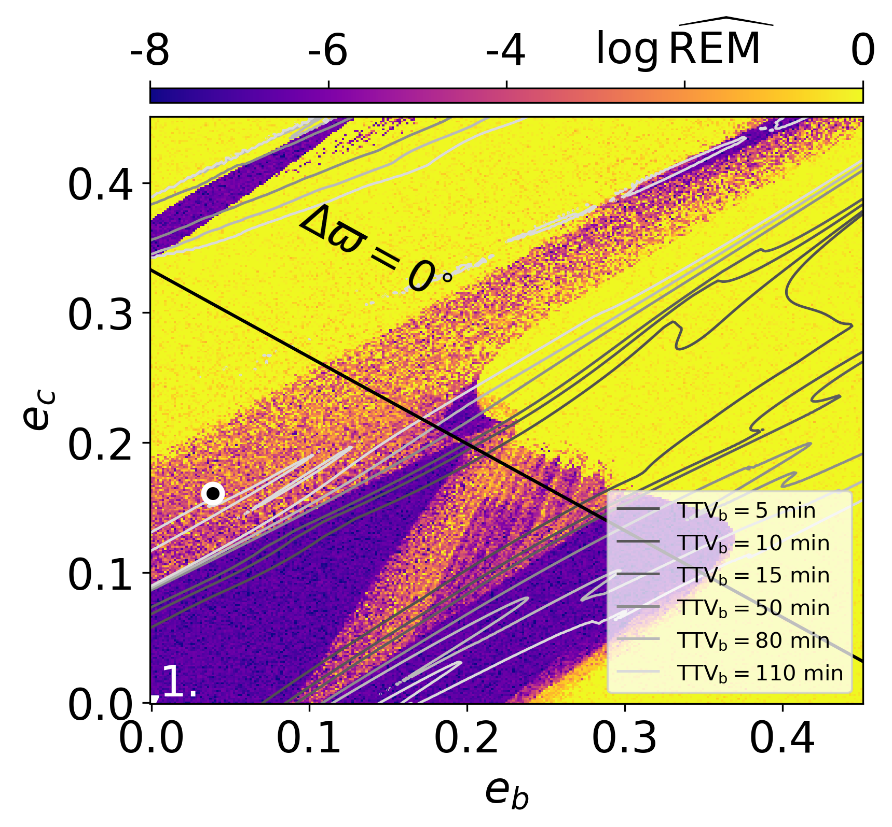
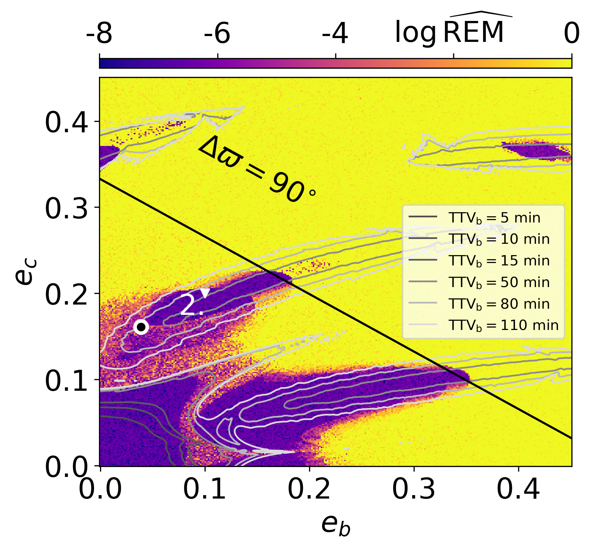
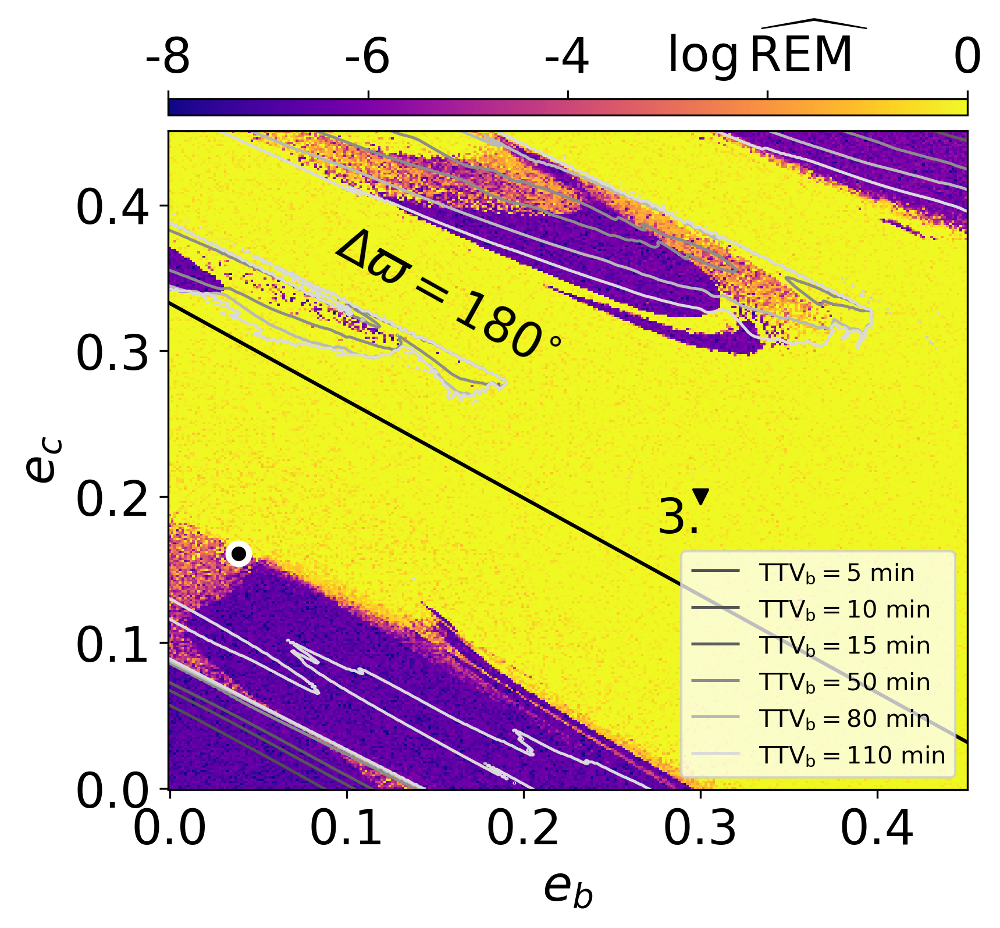
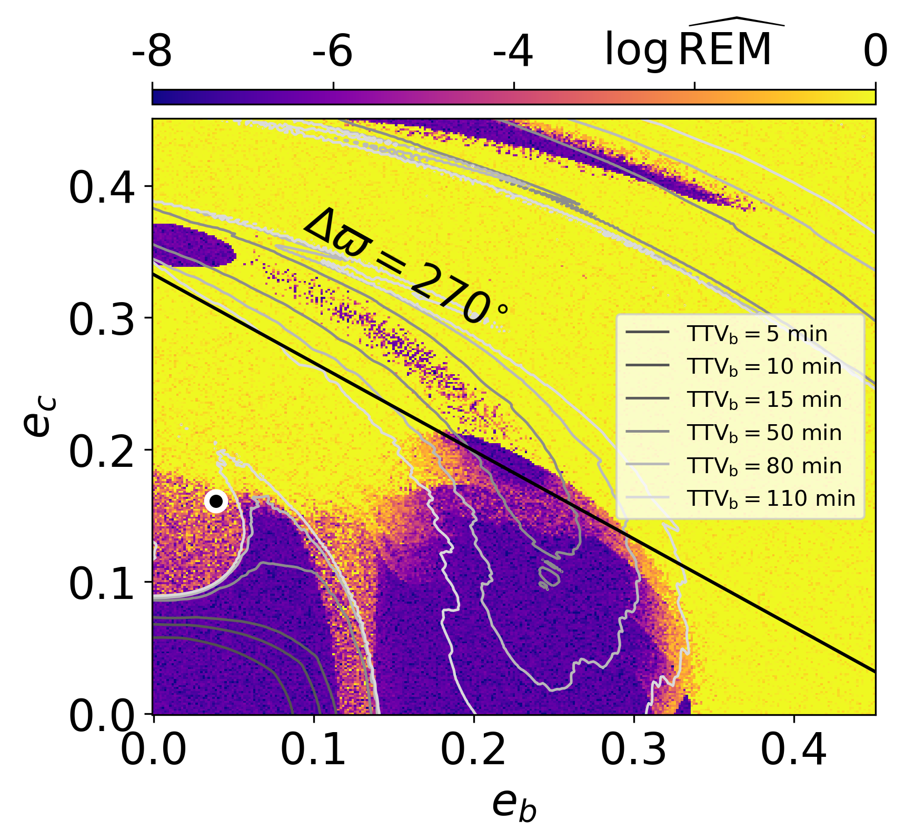
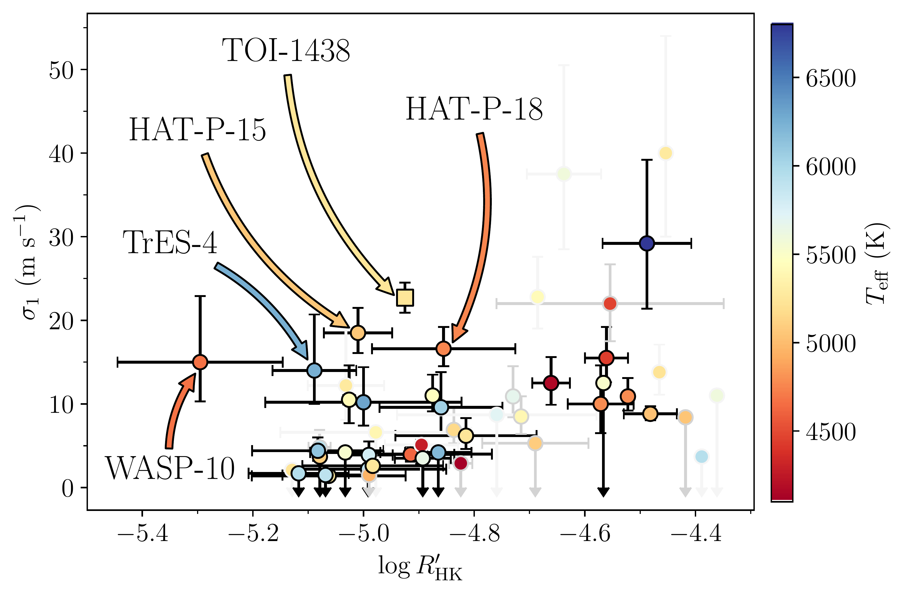
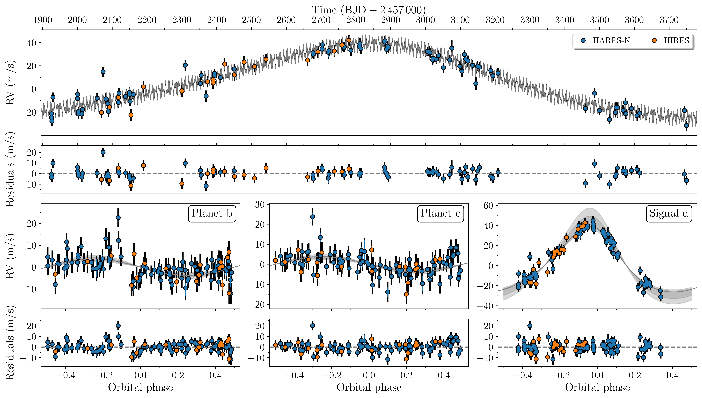

$\newcommand{\ensuremath}{}$
$\newcommand{\xspace}{}$
$\newcommand{\object}[1]{\texttt{#1}}$
$\newcommand{\farcs}{{.}''}$
$\newcommand{\farcm}{{.}'}$
$\newcommand{\arcsec}{''}$
$\newcommand{\arcmin}{'}$
$\newcommand{\ion}[2]{#1#2}$
$\newcommand{\textsc}[1]{\textrm{#1}}$
$\newcommand{\hl}[1]{\textrm{#1}}$
$\newcommand{\footnote}[1]{}$
$\newcommand{\vsini}{V \sin i_\star}$
$\newcommand{\vrad}{V_{\rm rad}}$
$\newcommand{\vmic}{V_{\rm mic}}$
$\newcommand{\vmac}{V_{\rm mac}}$
$\newcommand{\dex}{\rm dex}$
$\newcommand{\teff}{T_{\rm eff}}$
$\newcommand{\logg}{log g_\star}$
$\newcommand{\met}{[M/H]}$
$\newcommand{\feh}{[Fe/H]}$
$\newcommand{\cah}{[Ca/H]}$
$\newcommand{\mgh}{[Mg/H]}$
$\newcommand{\nah}{[Na/H]}$
$\newcommand{\sih}{[Si/H]}$
$\newcommand{\kms}{km s^{-1}}$
$\newcommand{\ms}{m~s^{-1}}$
$\newcommand{\msd}{m~s^{-1}~day^{-1}}$
$\newcommand{\gc}{g~cm^{-3}}$
$\newcommand{\lgr}{\log (R^\prime_{HK})}$
$\newcommand{\lgt}{\log~t}$
$\newcommand{\Lsun}{L_{\odot}}$
$\newcommand{\Msun}{M_{\odot}}$
$\newcommand{\Rsun}{R_{\odot}}$
$\newcommand{\msunyr}{M_{\odot} yr^{-1}}$
$\newcommand{\Fearth}{F_{\oplus}}$
$\newcommand{\mearth}{M_{\oplus}}$
$\newcommand{\rearth}{R_{\oplus}}$
$\newcommand{\rjup}{R_\mathrm{J}}$
$\newcommand{\mjup}{M_\mathrm{J}}$
$\newcommand{\Porb}{P_{\rm orb}}$
$\newcommand{\Prot}{P_{\rm rot}}$
$\newcommand{\mstar}{M_\star}$
$\newcommand{\lstar}{L_\star}$
$\newcommand{\rstar}{R_\star}$
$\newcommand{\rhostar}{\rho_{\mathrm{*}}}$
$\newcommand{\rhoplanet}{\rho_\mathrm{p}}$
$\newcommand{\rplanet}{R_{\mathrm{p}}}$
$\newcommand{\mplanet}{M_{\mathrm{p}}}$
$\newcommand{\halpha}{H\alpha}$
$\newcommand{\hbeta}{H\beta}$
$\newcommand{\sii}{[S {\sc II}] }$
$\newcommand{\oii}{[O {\sc I}] }$
$\newcommand{\oiii}{[O {\sc III}] }$
$\newcommand{\oi}{[O {\sc i}] }$
$\newcommand{\cai}{Ca {\sc I} }$
$\newcommand{\caii}{[Ca {\sc II}] }$
$\newcommand{\feii}{[Fe {\sc II}] }$
$\newcommand{\nii}{[N {\sc II}] }$
$\newcommand{\mgi}{Mg {\sc I} }$
$\newcommand{\nai}{[Na {\sc I}]}$
$\newcommand{\av}{A_{V}}$
$\newcommand{\vmag}{m_{V}}$
$\newcommand{\tic}{TIC~229650439}$
$\newcommand{\ticno}{229650439}$
$\newcommand{\ticb}{TIC~229650439.01}$
$\newcommand{\ticc}{TIC~229650439.02}$
$\newcommand{\targeta}{\mbox{TOI-1438}}$
$\newcommand{\targetone}{TOI-1438.01}$
$\newcommand{\targettwo}{TOI-1438.02}$
$\newcommand{\targetb}{TOI-1438~b}$
$\newcommand{\targetc}{TOI-1438~c}$
$\newcommand{\bjdtdb}{\ensuremath{\rm{BJD_{TDB}}}}$
$\newcommand{\logRHK}[1][]{-4.925 \pm 0.013}$
$\newcommand{\smassariadne}[1][]{0.876 \pm 0.038}$
$\newcommand{\smassariadnegrav}[1][]{0.764\pm 0.127}$
$\newcommand{\smassparam}[1][]{0.867 \pm 0.027}$
$\newcommand{\sradiusariadne}[1][]{0.820 \pm 0.017}$
$\newcommand{\sradiusisochrones}[1][]{0.x\pm 0.0x}$
$\newcommand{\sradiusparam}[1][]{0.822\pm 0.018}$
$\newcommand{\sradiusspechmatch}[1][]{0.81\pm 0.08}$
$\newcommand{\sradiusgaia}[1][]{0.853^{+0.026}_{-0.016} }$
$\newcommand{\srhoariadne}[1][]{2.2 \pm 0.2}$
$\newcommand{\srhospechmatch}[1][]{x \pm x}$
$\newcommand{\srhoparam}[1][]{2.2 \pm 0.2}$
$\newcommand{\srhotransitmodel}[1][]{x \pm x}$
$\newcommand{\srhotic}[1][]{x \pm x}$
$\newcommand{\steffariadne}[1][]{5230\pm 60}$
$\newcommand{\sloggariadne}[1][]{4.50\pm0.07}$
$\newcommand{\sfehariadne}[1][]{0.03\pm0.06}$
$\newcommand{\Lumariadne}[1][]{0.45 \pm 0.02}$
$\newcommand{\Avariadne}[1][]{0.04 \pm 0.05}$
$\newcommand{\steffsme}[1][]{5189 \pm 65}$
$\newcommand{\sloggsme}{4.50\pm 0.05}$
$\newcommand{\scahsme}[1][]{0.07\pm 0.06}$
$\newcommand{\sfehsme}[1][]{0.04\pm 0.05}$
$\newcommand{\snasme}[1][]{0.13\pm 0.06}$
$\newcommand{\smghsme}[1][]{0.14 \pm 0.06}$
$\newcommand{\ssihsme}[1][]{0.07 \pm 0.06}$
$\newcommand{\svsinisme}[1][]{1.8 \pm 0.9}$
$\newcommand{\svmic}[1][]{0.8}$
$\newcommand{\svmac}[1][]{2.5}$
$\newcommand{\velsme}[1][\mathrm{km s^{-1}}]{-29.21}$
$\newcommand{\steffspechmatch}[1][]{5225 \pm 110}$
$\newcommand{\sloggspechmatch}[1][]{4.53 \pm 0.12}$
$\newcommand{\sfehspechmatch}[1][]{0.06\pm 0.09}$
$\newcommand{\sloggparam}[1][]{4.52 \pm 0.03}$
$\newcommand{\steffgaia}[1][]{5202^{+8}_{-4} }$
$\newcommand{\slogggaia}[1][]{4.53 \pm 0.01}$
$\newcommand{\sfehgaia}[1][]{-0.14 \pm 0.01}$
$\newcommand{\lstargaia}[1][]{0.449\pm0.002}$
$\newcommand{\distancegaia}{ 110.7\pm 0.1}$
$\newcommand{\parallaxgaia}{9.0312\pm0.0111}$
$\newcommand{\velgaia}[1][\mathrm{km s^{-1}}]{-29.40 \pm 0.34}$
$\newcommand{\pmra}{-22.8246 \pm 0.0125}$
$\newcommand{\pmdec}{53.0721 \pm  0.0155}$
$\newcommand{\stefftfop}[1][]{5259\pm 125}$
$\newcommand{\sfehtfop}[1][]{0.10 \pm 0.06 }$
$\newcommand{\sloggtfop}[1][]{4.57 \pm 0.09 }$
$\newcommand{\sradiustfop}[1][]{0.816 \pm 0.046 }$
$\newcommand{\smasstfop}[1][]{0.90 \pm 0.11}$
$\newcommand{\spectraltype}{K0V}$
$\newcommand{\smassspectraltype}{0.88}$
$\newcommand{\sradiusspectraltype}{0.81}$
$\newcommand{\srhospectraltype}{2.3}$
$\newcommand{\protvsini}{22.8 \pm 11.4}$
$\newcommand{\prottess}{23.0 \pm 1.4}$
$\newcommand{\agespechmatch}[1][]{4.2\pm 1.5}$
$\newcommand{\ageparam}{5.9\pm 4.2}$
$\newcommand{\ageariadne}[1][]{2.6^{+4.2}_{-2.3}}$
$\newcommand{\ageallmodels}[1][]{2 - 6}$
$\newcommand{\Tzerob}[1][]$
$\newcommand{\Tzeroc}[1][]$
$\newcommand{\Tzerod}[1][]$
$\newcommand{\Pb}[1][]$
$\newcommand{\Pc}[1][]$
$\newcommand{\lnPd}[1][]$
$\newcommand{\Pd}[1][]$
$\newcommand{\Pdyear}[1][]$
$\newcommand{\eb}[1][ ]$
$\newcommand{\ebfree}[1][ ]$
$\newcommand{\wb}[1][]$
$\newcommand{\cosib}[1][]$
$\newcommand{\bb}[1][ ]$
$\newcommand{\arb}[1][ ]$
$\newcommand{\rrb}[1][ ]$
$\newcommand{\kb}[1][]$
$\newcommand{\ecfree}[1][ ]$
$\newcommand{\wc}[1][]$
$\newcommand{\ed}[1][ ]$
$\newcommand{\wwd}[1][]$
$\newcommand{\cosic}[1][]$
$\newcommand{\bc}[1][ ]$
$\newcommand{\arc}[1][ ]$
$\newcommand{\rrc}[1][ ]$
$\newcommand{\kc}[1][]$
$\newcommand{\kd}[1][]$
$\newcommand{\mpb}[1][]$
$\newcommand{\mpc}[1][]$
$\newcommand{\mpdearth}[1][]$
$\newcommand{\mpdjup}[1][]$
$\newcommand{\rpb}[1][]$
$\newcommand{\rpc}[1][]$
$\newcommand{\Tperib}[1][]$
$\newcommand{\ecosd}[1][]$
$\newcommand{\esind}[1][]$
$\newcommand{\ecosc}[1][]$
$\newcommand{\esinc}[1][]$
$\newcommand{\eblim}[1][]$
$\newcommand{\eclim}[1][]$
$\newcommand{\prvb}[1][]$
$\newcommand{\ib}[1][]$
$\newcommand{\ic}[1][]$
$\newcommand{\ab}[1][]$
$\newcommand{\ac}[1][]$
$\newcommand{\ad}[1][]$
$\newcommand{\depthbSC}[1][]$
$\newcommand{\RMbSC}[1][]$
$\newcommand{\insolationb}[1][]$
$\newcommand{\insolationc}[1][]$
$\newcommand{\tsmb}[1][ ]$
$\newcommand{\tsmc}[1][ ]$
$\newcommand{\denstrb}[1][]$
$\newcommand{\densspb}[1][]$
$\newcommand{\Teqb}[1][]$
$\newcommand{\Teqc}[1][]$
$\newcommand{\ttotb}[1][]$
$\newcommand{\tfulb}[1][]$
$\newcommand{\ttotc}[1][]$
$\newcommand{\tfulc}[1][]$
$\newcommand{\tegb}[1][]$
$\newcommand{\deltamagb}[1][]$
$\newcommand{\denpb}[1][]$
$\newcommand{\denpc}[1][]$
$\newcommand{\grapb}[1][]$
$\newcommand{\grapc}[1][]$
$\newcommand{\grapparsb}[1][]$
$\newcommand{\jspb}[1][]$
$\newcommand{\jspc}[1][]$
$\newcommand{\qoneSC}[1][]$
$\newcommand{\qtwoSC}[1][]$
$\newcommand{\qsum}[1][]$
$\newcommand{\HARPSN}[1][]$
$\newcommand{\jHARPSN}[1][]$
$\newcommand{\HIRES}[1][]$
$\newcommand{\jHIRES}[1][]$

# TOI-1438:  A  rare system with two short-period sub-Neptunes and a tentative long-period Jupiter-like planet  orbiting a  $\spectraltype$ star

<mark>Appeared on: 2025-09-01</mark> -  _31 pages, 21 figures. Accepted by Astronomy & Astrophysics (A&A) 31 July 2025_

C. M. Persson, et al. -- incl., <mark>I. J. M. Crossfield</mark>

**Abstract:** We present the detection and characterisation of the $\targeta$ multi-planet system   discovered   by the  Transiting Exoplanet Survey Satellite (TESS).To confirm the planetary nature of the  candidates and determine their masses,  we collected a series  of follow-up observations including    high-spectral resolution  observations with HARPS-N and HIRES over a period of five years.  Our combined modelling  shows that the $\spectraltype$ star hosts   two transiting sub-Neptunes with $R_\mathrm{b} = $ $\rpb$  $\rearth$ , $R_\mathrm{c} = $ $\rpc$  $\rearth$ , $M_\mathrm{b} = $ $\mpb$  $\mearth$ , and $M_\mathrm{c} = $ $\mpc$  $\mearth$ . The orbital periods of planets b and c are 5.1 and 9.4 days, respectively,   corresponding to instellations of $\insolationb$  $\Fearth$ and $\insolationc$  $\Fearth$ .  The bulk densities are $\denpb$  $\gc$ and $\denpc$  $\gc$ , respectively, suggesting a volatile-rich   interior composition. By combining the planet and stellar parameters, we were able to compute a set of  planet interior structure models. Planet b presents a high-metallicity envelope that can accommodate up to 2.5 \% in H/He in mass, while planet c cannot have more than 0.2 \% as H/He in mass. For any composition of the core considered (Fe-rock or ice-rock), both planets would require a volatile-rich envelope.  In addition to the two planets, the radial velocity (RV) data  clearly reveal a third   signal,   likely coming from a non-transiting planet, with an   orbital period of $\Pdyear$ years  and an RV semi-amplitude of $\kd$  $\ms$ . Our best-fit model finds a minimum mass of $\mpdjup$  $\mjup$ and an eccentricity of $\ed$ .However, several RV activity indicators also show  strong signals at similar periods, suggesting  this signal might (partly) originate from   stellar   activity.More data over a longer period of time are needed to conclusively determine the nature of this   signal.If it is confirmed as a triple-planet system, $\targeta$ would be one of the few detected systems to date characterised by an architecture with two small, short-period planets and one massive, long-period planet, where the inner and outer systems are separated by an orbital period ratio of the order of a few hundred.

**Figure 6. -** Dynamical maps of the eccentricities of the two inner planets ($e_b$, $e_c$) and fixed values of the argument of pericentre of $\targetb$($\Delta \varpi =\omega_c-\omega_b$). The black filled circle with a white rim shows the location of the solution obtained by modelling with the eccentricities set as free parameters. Small values of the fast indicator $\log \mathrm{\widehat{REM}}$ characterises regular (long-term stable) solutions, which are marked with black and dark blue colour. Chaotic solutions are marked with brighter colours, up to yellow. The black line represents the so-called collision curve of orbits, defined by the condition: $a_b(1 + e_b) = a_c(1 - e_c)$.  The resolution of each plot is 301 $\times$ 301 points. Triangles  marked $1-3$ correspond to the solutions shown in Fig. \ref{figure-TOI-2427-ebec}.
    Also, the labelled grey contours refer to the TTV amplitudes shown in Fig. \ref{figure-TOI-2427-TTV}(details in Section \ref{sec-dynamical_analysis}).
     (*figure-TOI-2427-dynamical_map*)

**Figure 10. -** RV jitter ($\sigma_1$) as derived in \citet{Bonomo2017} as a function of $\log R^\prime_{\rm HK}$ activity index calculated in \citet{Claudi2024} for exoplanet host stars with $M_\star<1.1$ $\Msun$. Light-grey error bars denote systems with a baseline shorter than 1 yr, grey error bars are systems with a baseline  $1-2$ yr, and black error bars are systems with   baselines $>2$ yr. The error bars with arrows are upper limits on the RV jitter. The markers are colour coded with the stellar $T_{\rm eff}$. $\targeta$ is marked with a square. The marked systems HAT-P-15, HAT-P-19, TrES-4, and WASP-10 are discussed in Sect. \ref{Subsection: system architecture}.
        Adapted from Fig. 3 in  \citet{Hekker2006}. (*fig:jitter*)

**Figure 13. -** RVs of $\targeta$. Top: The HARPS-N (blue) and HIRES (orange) RV time series with the best-fitting three Keplerian model in grey with residuals shown in the panel below. Lower: The phasefolded RV curves for planet b (left) and c (middle) as well as signal d (right). The best-fitting models are shown as the grey lines with the shaded area denoting the $1$ and $2 \sigma$ intervals in the $K$-amplitude. Residuals are given below. (*fig:rvs*)

