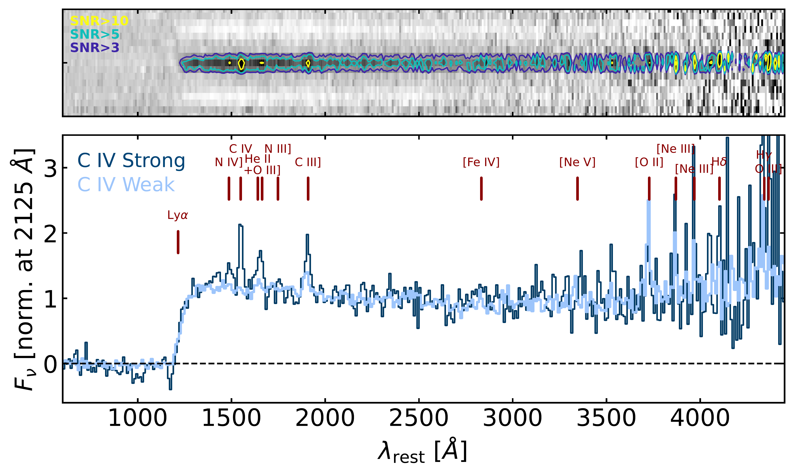
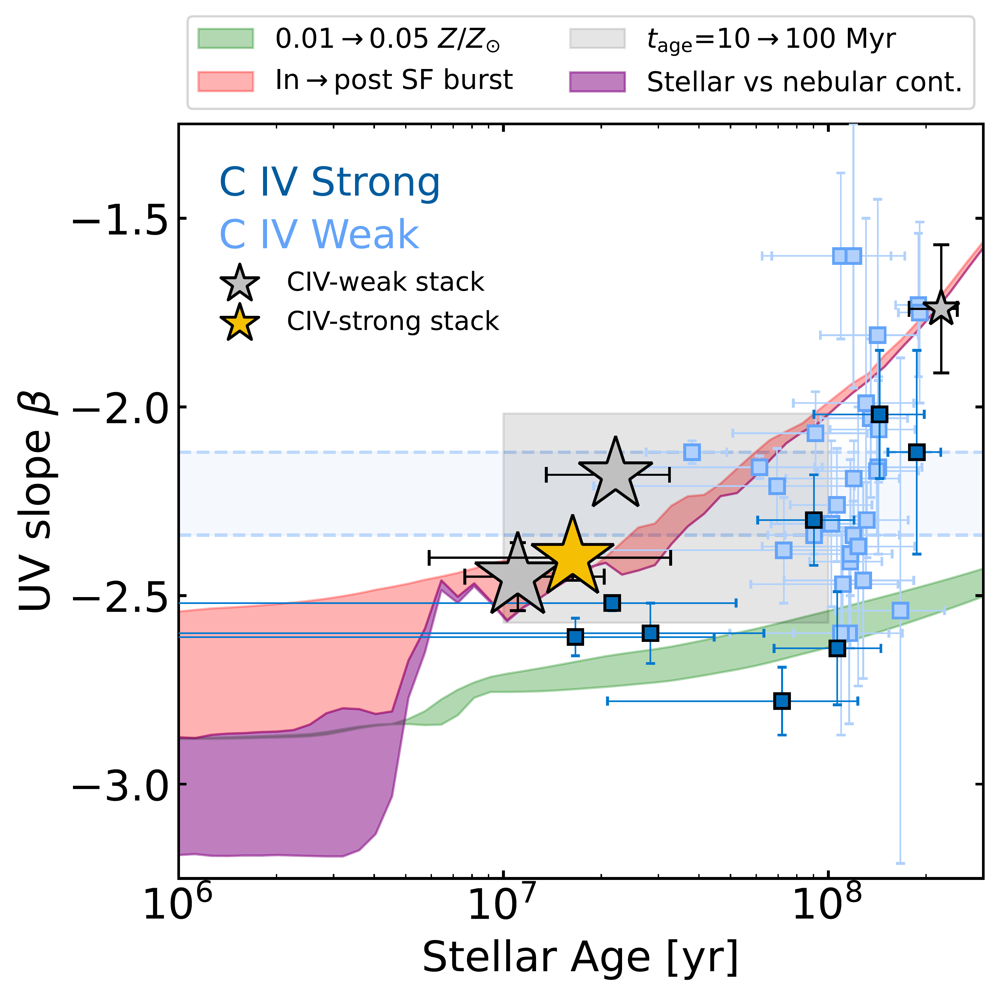
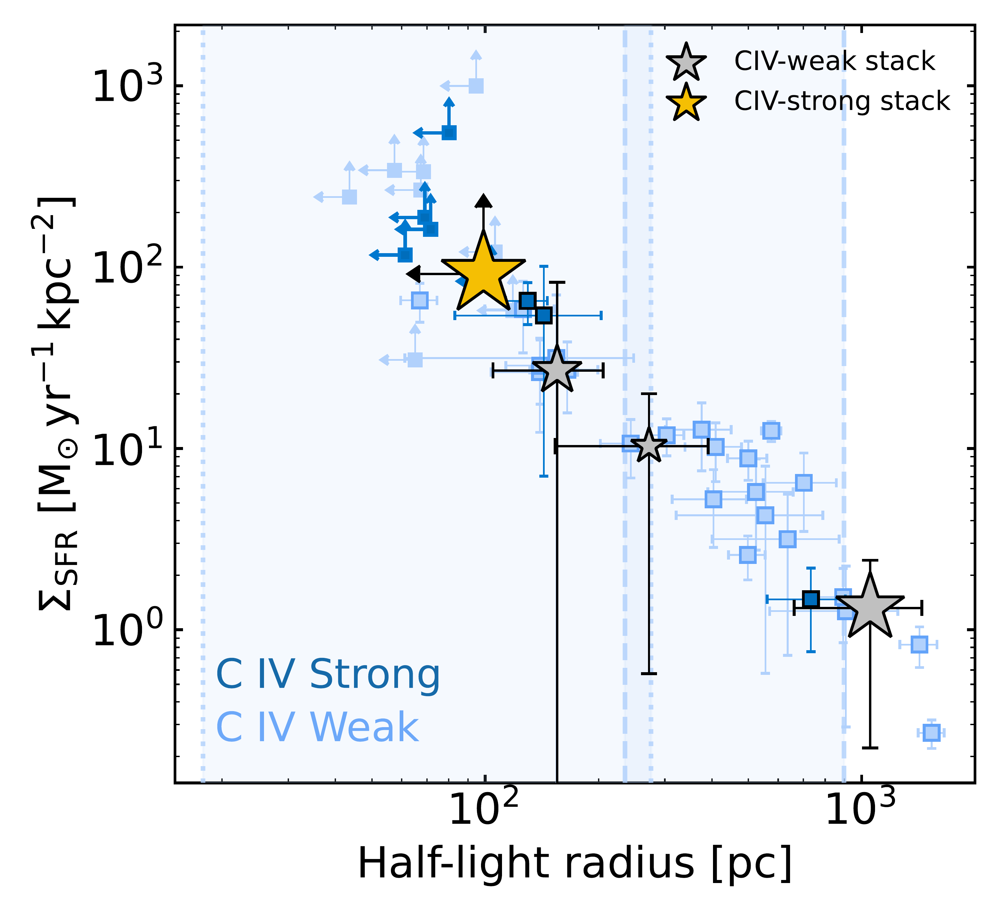

$\newcommand{\ensuremath}{}$
$\newcommand{\xspace}{}$
$\newcommand{\object}[1]{\texttt{#1}}$
$\newcommand{\farcs}{{.}''}$
$\newcommand{\farcm}{{.}'}$
$\newcommand{\arcsec}{''}$
$\newcommand{\arcmin}{'}$
$\newcommand{\ion}[2]{#1#2}$
$\newcommand{\textsc}[1]{\textrm{#1}}$
$\newcommand{\hl}[1]{\textrm{#1}}$
$\newcommand{\footnote}[1]{}$
$\newcommand{\kms}{km s^{-1}}$
$\newcommand{\oii}{O {\scriptsize II}}$
$\newcommand{\oiii}{O {\scriptsize III}}$
$\newcommand{\oiv}{O {\scriptsize IV}}$
$\newcommand{\caii}{Ca {\scriptsize II}}$
$\newcommand{\cii}{C {\scriptsize II}}$
$\newcommand{\ciii}{C {\scriptsize III}}$
$\newcommand{\sii}{S {\scriptsize II}}$
$\newcommand{\nii}{N {\scriptsize II}}$
$\newcommand{\niii}{N {\scriptsize III}}$
$\newcommand{\niv}{N {\scriptsize IV}}$
$\newcommand{\neiii}{Ne {\scriptsize III}}$
$\newcommand{\nv}{N {\scriptsize V}}$
$\newcommand{\civ}{C {\scriptsize IV}}$
$\newcommand{\hi}{H {\scriptsize I}}$
$\newcommand{\hii}{H {\scriptsize II}}$
$\newcommand{\hei}{He {\scriptsize I}}$
$\newcommand{\heii}{He {\scriptsize II}}$
$\newcommand{\feiv}{Fe {\scriptsize IV}}$
$\newcommand{\nev}{Ne {\scriptsize V}}$
$\newcommand{\hdelta}{H\delta}$
$\newcommand{\hbeta}{H\beta}$
$\newcommand{\halpha}{H\alpha}$
$\newcommand{\lya}{Ly\alpha}$
$\newcommand{\hst}{\textit{HST}}$
$\newcommand{\jwst}{\textit{JWST}}$
$\newcommand{\spitzer}{\textit{Spitzer}}$
$\newcommand{\eazy}{\texttt{EAzY}}$
$\newcommand{\pypeit}{\texttt{PypeIt}}$
$\newcommand{\bagpipes}{\texttt{Bagpipes}}$
$\newcommand{\thefigure}{A\arabic{figure}}$
$\newcommand{\thebibliography}{\DeclareRobustCommand{\VAN}[3]{##3}\VANthebibliography}$

# JWST Spectroscopic Insights Into the Diversity of Galaxies in the First 500 Myr: Short-Lived Snapshots Along a Common Evolutionary Pathway

<mark>Appeared on: 2025-09-02</mark> -  _20 pages, 13 figures. Submitted for publication, comments welcome_

G. Roberts-Borsani, et al. -- incl., <mark>F. Walter</mark>

**Abstract:** We investigate the nature and spectroscopic diversity of early galaxies from a sample of 40 sources at $z\geqslant10$ with JWST/NIRSpec prism observations, the largest of its kind thus far. We compare the properties of strong UV line emitters, as traced by intense $\civ$ emission, with those of more "typical" sources with weak or undetected $\civ$ . The more typical (or " $\civ$ -weak") sources reveal significant scatter in their $\ciii$ ] line strengths, UV continuum slopes, and physical sizes, spanning $\ciii$ ] equivalent widths of $\sim$ 1-51 Å, UV slopes of $\beta\sim-1.6$ to $-2.6$ , and half-light radii of $\sim$ 50-1000 pc. In contrast, $\civ$ -strong sources generally occupy the tail of these distributions, with $\ciii$ ] EWs of 16-51 Å, UV slopes $\beta\lesssim-2.5$ , compact morphologies ( $r_{\rm 50} \lesssim 100$ pc), and elevated star formation surface densities ( $\Sigma_{\rm SFR} \gtrsim 100 M_\odot \mathrm{yr}^{-1} \mathrm{kpc}^{-2}$ ). Collectively these properties are consistent with concentrated starbursts that temporarily outshine the extended structure of the galaxy. Comparing average properties from composite spectra, we find the diversity of the sample is primarily driven by bursts and lulls of star formation on very short timescales ( $\leq$ 3 Myr), where strong $\civ$ emitters are observed at the apex of these phases and sources devoid of emission lines represent periods of relative inactivity. An apparent association between strong $\civ$ and enhanced nitrogen abundance suggests both features may be modulated by the same duty cycle and reflect a generic mode of star formation. We show that AGN are unlikely to be a significant contributor to this duty cycle based on a comparison of UV line diagnostics to photoionisation models, although some non-thermal activity cannot be fully ruled out. Our results support a unified evolutionary picture whereby transient bursts and lulls can explain the spectral diversity and early growth of bright galaxies in the first 500 Myr.

**Figure 12. -** **Composite spectra of the $\civ$-strong (dark blue) and $\civ$-weak (light blue) samples at $z\simeq10.0-14.4$, and the corresponding 2D spectrum of the former.** Emission lines of interest (detected or not) and the Ly$\alpha$ break are indicated by red vertical lines in the 1D spectrum, as well as S/N ratio contours of 3, 5 and 10 in the 2D spectrum. The $\civ$-strong composite reveals strongly enhanced $\niv$], $\civ$, $\hei$i$+$\oiii], and $\cii$i] line emission compared to its $\civ$-weak counterpart comprising the rest of the sample. The comparison highlights the strong variance across the galaxy population and diversity of astrophysical processes underpinning the evolution of galaxies within the first 500 Myr. (*fig:stack*)

**Figure 6. -** **Contributions to the UV continuum slopes of $z\geqslant10$ galaxies.** The mass-weighted ages from \texttt{Bagpipes} are plotted with the spectroscopic $\beta$ measurements for individual objects (small squares) and composite measurements (stars), following previous color schemes. Composite symbols are scaled in size according to their recent star formation activity, where a larger size equates to more recent star formation. The intrinsic scatter in $\beta$ measured in Section \ref{subsec:beta} for $\civ$-weak objects is shown as the light-blue box, while the range of $\beta$ determined from a number of FSPS models are shown as green fill (varying metallicity), red fill (timing relative to a burst of star formation), purple fill (stellar vs nebular continuum contributions), and grey fill (varying stellar ages). Only variations in the recent star formation history and in stellar age are able to explain the intrinsic scatter of observed UV slopes. (*fig:beta_origins*)

**Figure 7. -** **The burstiness of star formation in $z\geqslant10$ galaxies.** Individual measurements are plotted as small squares following previous color schemes, while composite measurements from stacked NIRSpec spectra and NIRCam F200W data of _unlensed_ sources are shown as stars (grey for the $\civ$-weak population, gold for the $\civ$-strong population). Each composite symbol is scaled in size according to their recent star formation activity, where larger size corresponds to more recent star formation. The log-normal scatter around the median of the morphological distributions in Section \ref{subsec:morphologies} are plotted as light blue boxes. The large range of SFR surface densities and correlation with half-light radius suggests varying gas densities and star formation efficiencies, while the positions of $\civ$-strong objects at the most compact end of the distribution with high star formation rate surface densities highlights the requirement of extreme star formation episodes to power $\civ$ emission. (*fig:bursty*)

