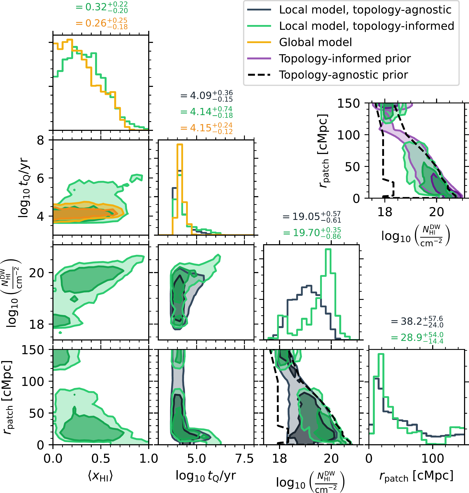
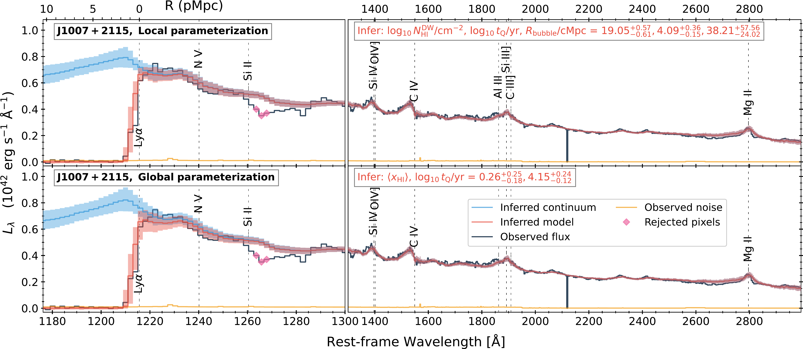
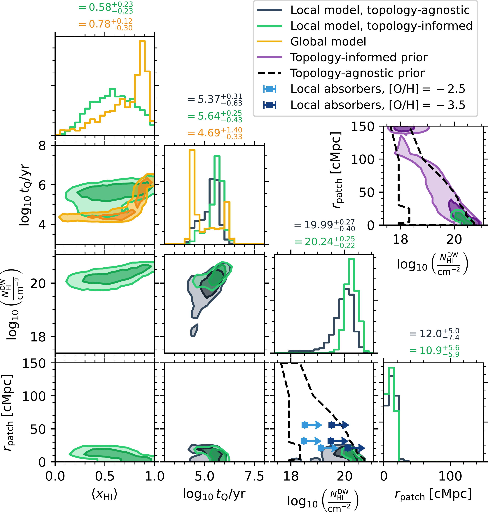

$\newcommand{\ensuremath}{}$
$\newcommand{\xspace}{}$
$\newcommand{\object}[1]{\texttt{#1}}$
$\newcommand{\farcs}{{.}''}$
$\newcommand{\farcm}{{.}'}$
$\newcommand{\arcsec}{''}$
$\newcommand{\arcmin}{'}$
$\newcommand{\ion}[2]{#1#2}$
$\newcommand{\textsc}[1]{\textrm{#1}}$
$\newcommand{\hl}[1]{\textrm{#1}}$
$\newcommand{\footnote}[1]{}$
$\newcommand{\xHI}{\langle x_\mathrm{HI} \rangle}$
$\newcommand{\NHI}{N_\mathrm{HI}^\mathrm{DW}}$
$\newcommand{\NHIabs}{N_\mathrm{HI}^\mathrm{abs}}$
$\newcommand{\NHIIGM}{N_\mathrm{HI}^\mathrm{IGM}}$
$\newcommand{\Rb}{r_\mathrm{patch}}$
$\newcommand{\tQ}{t_\mathrm{Q}}$
$\newcommand{\logNHI}{\log_{10} \NHI/\mathrm{cm}^{-2}}$
$\newcommand{\logNHIabs}{\log\NHIabs}$
$\newcommand{\logNHIIGM}{\log\NHIIGM}$
$\newcommand{\logtQ}{\log_{10} \tQ/\mathrm{yr}}$
$\newcommand{\thebibliography}{\DeclareRobustCommand{\VAN}[3]{##3}\VANthebibliography}$

# First constraints on the local ionization topology in front of two quasars at $z \sim 7.5$

<mark>Appeared on: 2025-09-02</mark> -  _submitted to MNRAS_

T. Kist, et al. -- incl., <mark>E. Bañados</mark>

**Abstract:** Thus far, Lyman- $\alpha$ damping wings towards quasars have been used to probe the _global_ ionization state of the foreground intergalactic medium (IGM). A new parameterization has demonstrated that the damping wing signature also carries _local_ information about the distribution of neutral hydrogen (HI) in front of the quasar before it started shining. Leveraging a recently introduced Bayesian \texttt{JAX} -based Hamiltonian Monte Carlo (HMC) inference framework, we derive constraints on the Lorentzian-weighted HI column density $\NHI$ , the quasar's distance $\Rb$ to the first neutral patch and its lifetime $\tQ$ based on JWST/NIRSpec spectra of the two $z \sim 7.5$ quasars J1007+2115 and J1342+0928. After folding in model-dependent topology information, we find that J1007+2115 (and J1342+0928) is most likely to reside in a $\xHI = 0.32_{-0.20}^{+0.22}$ ( $0.58_{-0.23}^{+0.23}$ ) neutral IGM while shining for a remarkably short lifetime of $\logtQ = 4.14_{-0.18}^{+0.74}$ (an intermediate lifetime of $5.64_{-0.43}^{+0.25}$ ) along a sightline with $\logNHI = 19.70_{-0.86}^{+0.35}$ ( $20.24_{-0.22}^{+0.25}$ ) and $\Rb = 28.9_{-14.4}^{+54.0}  \mathrm{cMpc}$ ( $10.9_{-5.9}^{+5.6}  \mathrm{cMpc}$ ). In light of the potential presence of local absorbers in the foreground of J1342+0928 as has been recently suggested, we also demonstrate how the Lorentzian-weighted column density $\NHI$ provides a natural means for quantifying their contribution to the observed damping wing signal.

**Figure 1. -** Posterior distributions inferred from the JWST/NIRSpec spectrum of the quasar J1007+2115 depicted in Figure \ref{fig:spec_J1007} in the context of the local IGM damping wing parameterization (black) and the global one (yellow). Both distributions are marginalized over $7$ nuisance parameters describing the shape of the quasar continuum. Additionally depicted in green is the topology-informed version of the local constraints, entailing the non-trivial prior $P_\mathrm{top}($\logNHI$, $\Rb$)$(explicitly depicted in purple in the extra panel), and also providing a constraint on the global IGM neutral fraction $\xHI$ in good agreement with the directly inferred one. (*fig:corner_J1007*)

**Figure 4. -** Inferred model for the JWST/NIRSpec spectrum of the quasar J1007+2115, fitted in the context of the local IGM damping wing parameterization (upper row) and the global one (lower row). The observed (and rebinned) spectrum of the quasar is depicted in black, with the noise vector shown in yellow. The inferred model spectrum is depicted in red and the unabsorbed inferred continuum in blue, where solid lines represent the median inferred models, and shaded regions the $16 \%$ and the $84 \%$ percentile variations reflecting parameter uncertainty, continuum reconstruction errors, as well as spectral noise. (*fig:spec_J1007*)

**Figure 2. -** Like Figure \ref{fig:corner_J1007} but for the posterior distributions inferred from the JWST/NIRSpec spectrum of the quasar J1342+0928 depicted in Figure \ref{fig:spec_J1342}. The $($\NHI$, $\Rb$)$ panel also shows the putative local absorber constraints obtained by davies2025 assuming two different metallicities which provide lower limits on $\NHI$. (*fig:corner_J1342*)

