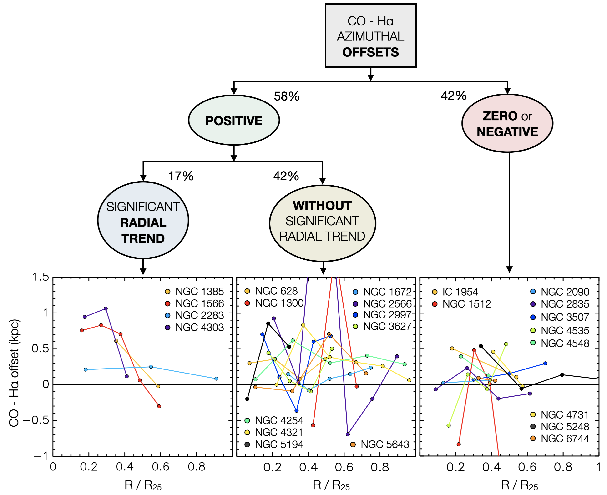
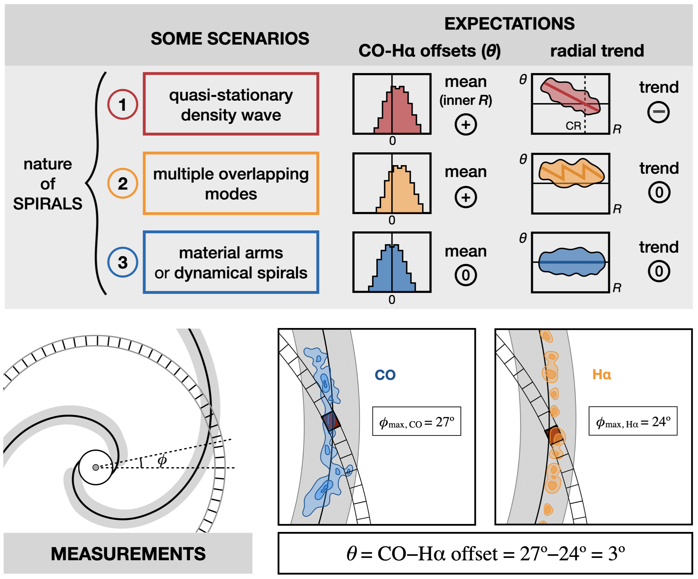
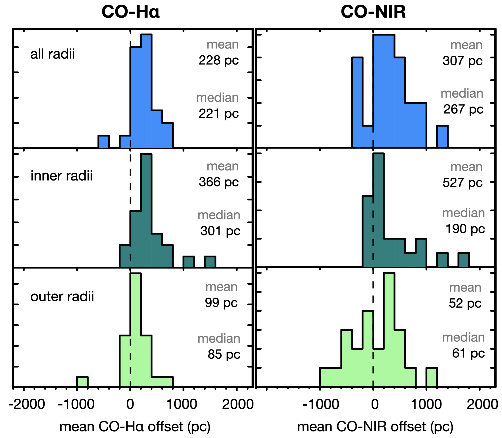

$\newcommand{\ensuremath}{}$
$\newcommand{\xspace}{}$
$\newcommand{\object}[1]{\texttt{#1}}$
$\newcommand{\farcs}{{.}''}$
$\newcommand{\farcm}{{.}'}$
$\newcommand{\arcsec}{''}$
$\newcommand{\arcmin}{'}$
$\newcommand{\ion}[2]{#1#2}$
$\newcommand{\textsc}[1]{\textrm{#1}}$
$\newcommand{\hl}[1]{\textrm{#1}}$
$\newcommand{\footnote}[1]{}$
$\newcommand{\re}{\ensuremath{r_\mathrm{e}}}$
$\newcommand{\SigStar}{\ensuremath{\Sigma_\mathrm{\star}}}$
$\newcommand{\SigMol}{\ensuremath{\Sigma_\mathrm{mol}}}$
$\newcommand{\SigSFR}{\ensuremath{\Sigma_\mathrm{SFR}}}$
$\newcommand{\tdep}{\ensuremath{\tau_\mathrm{dep}}}$
$\newcommand{\hi}{\ion{H}{I}}$
$\newcommand{\hii}{\ion{H}{II}}$
$\newcommand{\OSU}{\label{OSU} Department of Astronomy, The Ohio State University, 140 West 18th Avenue, Columbus, Ohio 43210, USA}$
$\newcommand{\Alberta}{\label{Alberta} Department of Physics, University of Alberta, Edmonton, AB T6G 2E1, Canada}$
$\newcommand{\ANU}{\label{ANU} Research School of Astronomy and Astrophysics, Australian National University, Canberra, ACT 2611, Australia}$
$\newcommand{\IPAC}{\label{IPAC} Caltech-IPAC, 1200 E. California Blvd. Pasadena, CA 91125, USA}$
$\newcommand{\Carnegie}{\label{Carnegi} Observatories of the Carnegie Institution for Science, 813 Santa Barbara Street, Pasadena, CA 91101, USA}$
$\newcommand{ÇAPP}{\label{CCAPP} Center for Cosmology and Astroparticle Physics, 191 West Woodruff Avenue, Columbus, OH 43210, USA}$
$\newcommand{\CfA}{\label{CfA} Harvard-Smithsonian Center for Astrophysics, 60 Garden Street, Cambridge, MA 02138, USA}$
$\newcommand{\CITEVA}{\label{CITEVA} Centro de Astronomía (CITEVA), Universidad de Antofagasta, Avenida Angamos 601, Antofagasta, Chile}$
$\newcommand{\CNRS}{\label{CNRS} CNRS, IRAP, 9 Av. du Colonel Roche, BP 44346, F-31028 Toulouse cedex 4, France}$
$\newcommand{\ESO}{\label{ESO} European Southern Observatory, Karl-Schwarzschild Stra{\ss}e 2, D-85748 Garching bei München, Germany}$
$\newcommand{\Heidelberg}{\label{Heidelberg} Astronomisches Rechen-Institut, Zentrum für Astronomie der Universität Heidelberg, Mönchhofstra\ss e 12-14, D-69120 Heidelberg, Germany}$
$\newcommand{\COOL}{\label{COOL} Cosmic Origins Of Life (COOL) Research DAO, coolresearch.io}$
$\newcommand{\ICRAR}{\label{ICRAR} International Centre for Radio Astronomy Research, University of Western Australia, 35 Stirling Highway, Crawley, WA 6009, Australia}$
$\newcommand{\IRAM}{\label{IRAM} Institut de Radioastronomie Millimétrique (IRAM), 300 Rue de la Piscine, F-38406 Saint Martin d'Hères, France}$
$\newcommand{\IRAP}{\label{IRAP} IRAP, OMP, Université de Toulouse, 9 Av. du Colonel Roche, BP 44346, F-31028 Toulouse cedex 4, France}$
$\newcommand{\ITA}{\label{ITA} Universität Heidelberg, Zentrum für Astronomie, Institut für Theoretische Astrophysik, Albert-Ueberle-Str 2, D-69120 Heidelberg, Germany}$
$\newcommand{\IWR}{\label{IWR} Universität Heidelberg, Interdisziplinäres Zentrum für Wissenschaftliches Rechnen, Im Neuenheimer Feld 205, D-69120 Heidelberg, Germany}$
$\newcommand{\JHU}{\label{JHU} Department of Physics and Astronomy, The Johns Hopkins University, Baltimore, MD 21218, USA}$
$\newcommand{\Leiden}{\label{Leiden} Leiden Observatory, Leiden University, P.O. Box 9513, 2300 RA Leiden, The Netherlands}$
$\newcommand{\Maryland}{\label{Maryland} Department of Astronomy, University of Maryland, College Park, MD 20742, USA}$
$\newcommand{\MPE}{\label{MPE} Max-Planck-Institut für extraterrestrische Physik, Giessenbachstra{\ss}e 1, D-85748 Garching, Germany}$
$\newcommand{\MPIA}{\label{MPIA} Max-Planck-Institut für Astronomie, Königstuhl 17, D-69117, Heidelberg, Germany}$
$\newcommand{\Nagoya}{\label{Nagoya} Department of Physics, Nagoya University, Furo-cho, Chikusa-ku, Nagoya, Aichi 464-8602, Japan}$
$\newcommand{\NRAO}{\label{NRAO} National Radio Astronomy Observatory, 520 Edgemont Road, Charlottesville, VA 22903-2475, USA}$
$\newcommand{\NRAOAb}{\label{NRAOAb} National Radio Astronomy Observatory, 800 Bradbury SE, Suite 235, Albuquerque, NM 87106, USA}$
$\newcommand{\OAN}{\label{OAN} Observatorio Astronómico Nacional (IGN), C/Alfonso XII, 3, E-28014 Madrid, Spain}$
$\newcommand{\ObsParis}{\label{ObsParis} Sorbonne Université, Observatoire de Paris, Université PSL, CNRS, LERMA, F-75014, Paris, France}$
$\newcommand{\Princeton}{\label{Princeton} Department of Astrophysical Sciences, Princeton University, 4 Ivy Ln., Princeton, NJ 08544 USA}$
$\newcommand{\UToledo}{\label{UToledo} University of Toledo, 2801 W. Bancroft St., Mail Stop 111, Toledo, OH, 43606}$
$\newcommand{\Toulouse}{\label{Toulouse} Université de Toulouse, UPS-OMP, IRAP, F-31028 Toulouse cedex 4, France}$
$\newcommand{\UBonn}{\label{UBonn} Argelander-Institut für Astronomie, Universität Bonn, Auf dem Hügel 71, 53121 Bonn, Germany}$
$\newcommand{\UChile}{\label{UChile} Departamento de Astronomía, Universidad de Chile, Camino del Observatorio 1515, Las Condes, Santiago, Chile}$
$\newcommand{\UConn}{\label{UConn} Department of Physics, University of Connecticut, Storrs, CT, 06269, USA}$
$\newcommand{\UCSD}{\label{UCSD} Center for Astrophysics and Space Sciences, Department of Physics,  University of California, San Diego, 9500 Gilman Drive, La Jolla, CA 92093, USA}$
$\newcommand{\UCSDAA}{\label{UCSDAA} Department of Astronomy \& Astrophysics,  University of California, San Diego, 9500 Gilman Drive, La Jolla, CA 92093, USA}$
$\newcommand{\UGent}{\label{UGent} Sterrenkundig Observatorium, Universiteit Gent, Krijgslaan 281 S9, B-9000 Gent, Belgium}$
$\newcommand{\ULyon}{\label{ULyon} Univ Lyon, Univ Lyon 1, ENS de Lyon, CNRS, Centre de Recherche Astrophysique de Lyon UMR5574, F-69230 Saint-Genis-Laval, France}$
$\newcommand{\UMass}{\label{UMass} University of Massachusetts—Amherst, 710 N. Pleasant Street, Amherst, MA 01003, USA}$
$\newcommand{\UWyoming}{\label{UWyoming} Department of Physics and Astronomy, University of Wyoming, Laramie, WY 82071, USA}$
$\newcommand{\LAM}{\label{LAM} Aix Marseille Univ, CNRS, CNES, LAM (Laboratoire d’Astrophysique de Marseille), Marseille, France}$
$\newcommand{\UHawaii}{\label{UHawaii} Institute for Astronomy, University of Hawaii, 2680 Woodlawn Drive, Honolulu, HI 96822, USA}$
$\newcommand{\UCM}{\label{UCM} Departamento de Física de la Tierra y Astrofísica, Universidad Complutense de Madrid, E-28040, Spain}$
$\newcommand{\IPARC}{\label{IPARC} Instituto de Física de Partículas y del Cosmos IPARCOS, Facultad de Ciencias Físicas, Universidad Complutense de Madrid, E-28040, Spain}$
$\newcommand{\UCT}{\label{UCT} Department of Astronomy, University of Cape Town, Rondebosch 7701, South Africa}$
$\newcommand{\STScI}{\label{STScI} Space Telescope Science Institute, 3700 San Martin Drive, Baltimore, MD 21218, USA}$
$\newcommand{\esaSTScI}{\label{esaSTScI} AURA for the European Space Agency (ESA), ESA Office, Space Telescope Science Institute, 3700 San Martin Drive, Baltimore, MD 21218, USA}$
$\newcommand{\McMaster}{\label{McMaster} Department of Physics and Astronomy, McMaster University, 1280 Main Street West, Hamilton, ON L8S 4M1, Canada}$
$\newcommand{\INAF}{\label{INAF} INAF -- Osservatorio Astrofisico di Arcetri, Largo E. Fermi 5, I-50157, Firenze, Italy}$
$\newcommand{\Sydney}{\label{Sydney} Sydney Institute for Astronomy, School of Physics A28, The University of Sydney, NSW 2006, Australia}$
$\newcommand{\UA}{\label{UA} Centro de Astronomía (CITEVA), Universidad de Antofagasta, Avenida Angamos 601, Antofagasta, Chile}$
$\newcommand{\CITA}{\label{CITA} Canadian Institute for Theoretical Astrophysics (CITA), University of Toronto, 60 St George St, Toronto, ON M5S 3H8, Canada}$
$\newcommand{\ASIAA}{\label{ASIAA} Institute of Astronomy and Astrophysics, Academia Sinica, No. 1, Sec. 4, Roosevelt Road, Taipei 10617, Taiwan}$
$\newcommand{\TKU}{\label{TKU} Department of Physics, Tamkang University, No.151, Yingzhuan Rd., Tamsui Dist., New Taipei City 251301, Taiwan}$
$\newcommand{\PSMA}{\label{PSMA} Penn State Mont Alto, 1 Campus Drive, Mont Alto, PA  17237, USA}$
$\newcommand{\ILL}{\label{ILL} Institut Laue-Langevin, 71 avenue des Martyrs, F-38042 Grenoble, France}$
$\newcommand{\TUM}{\label{TUM} Technical University of Munich, School of Engineering and Design, Department of Aerospace and Geodesy, Chair of Remote Sensing Technology, Arcisstr. 21, 80333 Munich, Germany}$
$\newcommand{\Surrey}{\label{Surrey} Department of Physics, University of Surrey, Guildford GU2 7XH, UK}$
$\newcommand{\Oxford}{\label{Oxford} Sub-department of Astrophysics, Department of Physics, University of Oxford, Keble Road, Oxford OX1 3RH, UK}$
$\newcommand{\AIP}{\label{AIP} Leibniz-Institut for Astrophysik Potsdam (AIP), An der Sternwarte 16, 14482 Potsdam, Germany}$
$\newcommand{\StAndrews}{\label{StAndrews} School of Physics and Astronomy, University of St Andrews, North Haugh, St Andrews, KY16 9SS, UK}$
$\newcommand{\IAC}{\label{IAC}{Instituto de Astrofísica de Canarias, C/ Vía Láctea s/n, E-38205, La Laguna, Spain}}$
$\newcommand{\ULL}{\label{ULL}{Departamento de Astrofísica, Universidad de La Laguna, Av. del Astrofísico Francisco Sánchez s/n, E-38206, La Laguna, Spain}}$
$\newcommand{\insubria}{ \label{insubria} Universit{à} dell’Insubria, via Valleggio 11, 22100 Como, Italy}$
$\newcommand{\Radcliffe}{\label{Radcliffe} Elizabeth S. and Richard M. Cashin Fellow at the Radcliffe Institute for Advanced Studies at Harvard University, 10 Garden Street, Cambridge, MA 02138, USA}$
$\newcommand{\UniCA}{\label{UniCA} Université Côte d'Azur, Observatoire de la Côte d'Azur, CNRS, Laboratoire Lagrange, 06000, Nice, France}$
$\newcommand{\Shizuoka}{\label{Shizuoka} Faculty of Global Interdisciplinary Science and Innovation, Shizuoka University, 836 Ohya, Suruga-ku, Shizuoka 422-8529, Japan}$
$\newcommand{\PMO}{\label{PMO}$
$Purple Mountain Observatory, No. 10 Yuanhua Road, Qixia District, 210023 Nanjing, China}$
$\newcommand{\Msun}{\ifmmode{\mathrm M_\odot}\else{M_\odot}\fi}$
$\newcommand\action{#1}$
$\newcommand\mod{#1}$
$\newcommand\mq{#1}$
$\newcommand\action{#1}$
$\newcommand{\mqb}{\vspace*{3mm} \noindent \bullet }$

# Azimuthal offsets in spiral arms of nearby galaxies

<mark>Appeared on: 2025-09-03</mark> -  _21 pages, 8 figures. Accepted for publication in A&A_

M. Querejeta, et al. -- incl., <mark>E. Schinnerer</mark>, <mark>A. Hughes</mark>, <mark>K. Kreckel</mark>, <mark>J. Neumann</mark>

**Abstract:** Spiral arms play a central role in disc galaxies, but their dynamical nature remains a long-standing open question. Azimuthal offsets between molecular gas and star formation are expected if gas crosses spiral arms, as predicted by quasi-stationary density wave theory. In this work, we measure offsets between CO and H $\alpha$ peaks in radial bins for 24 galaxies from the PHANGS survey that display a well-delineated spiral structure. The offsets exhibit substantial scatter, implying that star formation is not exclusively initiated at a coherent spiral shock. We define offsets such that positive values mean H $\alpha$ peaks lie ahead of CO peaks in the direction of galactic rotation. With this convention, 14 galaxies show mean positive CO-H $\alpha$ offsets, typically of a few hundred parsecs. In four of these 14 galaxies (17 \% of the total), offsets become smaller with increasing radius, as expected for a single quasi-stationary spiral density wave. Ten galaxies (42 \% ) show positive mean offsets but no clear correlation with radius, which is compatible with multiple overlapping modes. In the remaining ten galaxies (42 \% ), we find no significantly positive offsets, which could point to transient dynamical spirals or material arms, where gas and stars co-rotate with the spiral perturbation. Across the full sample, we find mostly positive offsets between CO peaks and the gravitational potential minimum, confirming that gas often crosses the spiral perturbation. For the four galaxies with clear positive offsets and a radial trend, we derived pattern speeds in good agreement with the literature. Overall, our results suggest that even well-delineated spirals in the local Universe can arise from a variety of underlying dynamical mechanisms.

**Figure 6. -** Classification of galaxies in our sample into three categories depending on whether they show positive mean CO-H$\alpha$ offsets or not and whether there is a significant trend with radius or not. \mod{The error bars are smaller than the size of the plotted circles.} The solid lines show running means for individual galaxies plotted against radius normalised by $R_{25}$. All galaxies are barred except for NGC 628, NGC 1385, NGC 2090, NGC 2997, and NGC 4254. (*fig:classification*)

**Figure 3. -** Top: Illustration showing the expectations for a non-exhaustive list of three scenarios that explain spiral structure: a quasi-stationary density wave (constant pattern speed), multiple overlapping modes (i.e. different pattern speeds across the disc), and material arms (always made up of the same stars, all of which are by definition co-rotating) or dynamical spirals (transient features made up of rather short, unconnected segments). Middle panels: Expected histograms for the distribution of CO-H$\alpha$ offsets ($\theta$) as well as the expected mean offset. We define offsets such that positive values mean H$\alpha$ peaks lie ahead of CO peaks in the direction of galactic rotation. For quasi-stationary density waves, we expect such offsets to be positive inside co-rotation and negative outside; however, since we sample mostly the inner parts of galaxies, the net offsets should typically be positive within our fields of view. The right panels indicate whether we should find a significant correlation between offsets and radius or not. Bottom: Illustration of how we measure azimuthal offsets in spiral arms in practice. For each radial bin (an elliptical annulus of width ${\sim}100$ pc that accounts for the inclination and PA of the galaxy), we average the CO and H$\alpha$ intensities in azimuthal bins. We then find the azimuth ($\phi$) corresponding to the maximum of both tracers within the footprint of each spiral mask ($\phi_{\rm max}$). The angular difference between the bins of peak intensity yields the offset of interest, $\theta$, at that radius. To account for galaxy rotation, if the galaxy rotates anti-clockwise, the offset $\theta$ is multiplied by $\eta = -1$.
 (*fig:method*)

**Figure 5. -** Histograms showing the distribution of the mean CO-H$\alpha$ and CO-NIR offsets across the whole galaxy sample. Each histogram includes one mean offset per galaxy, computed by averaging all measured offsets for all radii (top), the inner half (middle, $R < (R_{\rm min}^{\rm CO} + R_{\rm max}^{\rm CO})/2$), and the outer half (bottom, $R \ge (R_{\rm min}^{\rm CO} + R_{\rm max}^{\rm CO})/2$)).  (*fig:histo_CO-Ha*)

