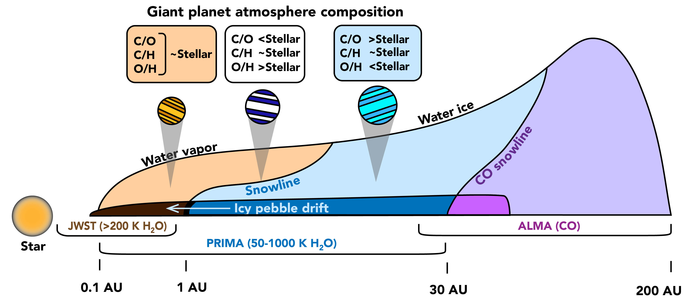
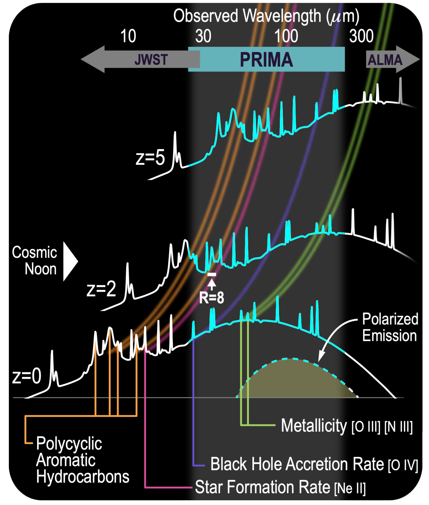
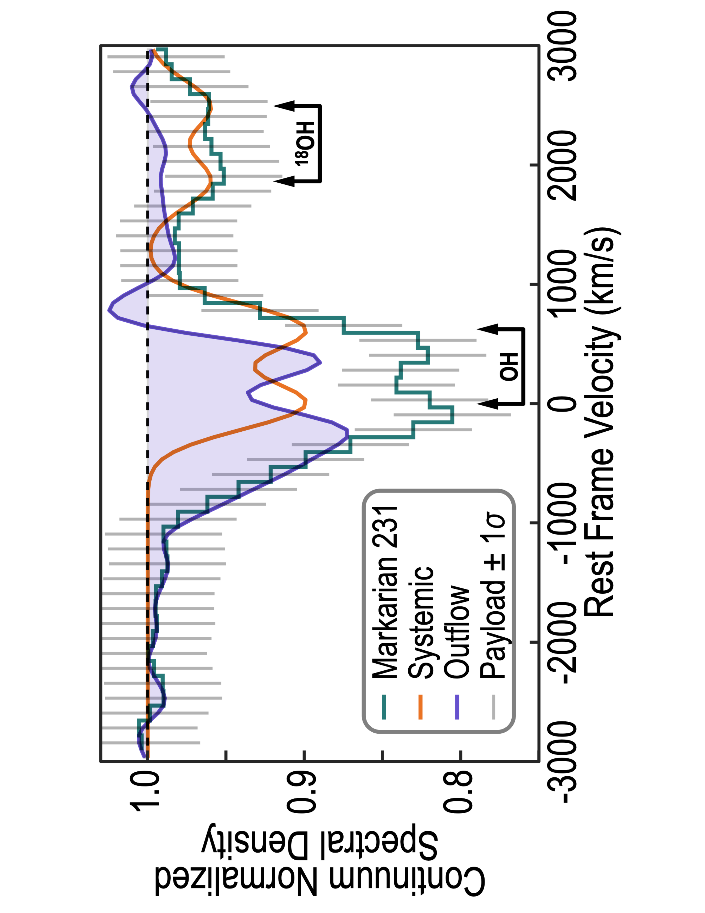

$\newcommand{\ensuremath}{}$
$\newcommand{\xspace}{}$
$\newcommand{\object}[1]{\texttt{#1}}$
$\newcommand{\farcs}{{.}''}$
$\newcommand{\farcm}{{.}'}$
$\newcommand{\arcsec}{''}$
$\newcommand{\arcmin}{'}$
$\newcommand{\ion}[2]{#1#2}$
$\newcommand{\textsc}[1]{\textrm{#1}}$
$\newcommand{\hl}[1]{\textrm{#1}}$
$\newcommand{\footnote}[1]{}$
$\newcommand{\mnras}{MNRAS}$
$\newcommand{\apj}{ApJ}$
$\newcommand{\apjs}{ApJS}$
$\newcommand{\apjl}{ApJL}$
$\newcommand{\aap}{A\&A}$
$\newcommand{\nat}{Nature}$
$\newcommand{\baas}{BAAS}$
$\newcommand{\pasp}{PASP}$
$\newcommand{\araa}{ARA\&A}$
$\newcommand{\ssr}{Space Science Reviews}$
$\newcommand{\aapr}{The Astronomy \& Astrophysics Review}$
$\newcommand{\pasa}{PASA}$
$\newcommand{\cftdotsep}{\cftnodots}$

# The Far-Infrared Enhanced Survey Spectrometer (FIRESS) for PRIMA: Science Drivers $\footnote{\copyright 2025. All rights reserved. }$

<mark>Appeared on: 2025-09-03</mark> -  _Accepted for publication in JATIS_

K. M. Pontoppidan, et al. -- incl., <mark>T. Henning</mark>, <mark>O. Krause</mark>

**Abstract:** We present the science drivers for the Far-Infrared Enhanced Survey Spectrometer (FIRESS), one of two science instrument on the PRobe Infrared Mission for Astrophysics (PRIMA). FIRESS is designed to meet science objectives in the areas of the origins of planetary atmospheres, the co-evolution of galaxies and supermassive black holes, and the buildup of heavy elements in the Universe. In addition to these drivers, FIRESS is envisioned as a versatile far-infrared spectrometer, capable of addressing science questions in most areas of astrophysics and planetary astronomy as part of a dominant General Observer (GO) program with 2/3 of the current science cases using FIRESS. We summarize how the instrument design choices and parameters enable the main science drivers as well as a broad and vibrant GO program.

**Figure 1. -** The bulk composition of planets reflect that of their natal protoplanetary disks at the disk radii where planets accrete their mass. For rocky planets, the bulk composition will be that of the solids of the disk, whereas giant planet atmospheres derive their composition from the disk gas. The total abundance of the disk ([C/H] and [O/H]) as well as the carbon-to-oxygen ratio (C/O) as measured by PRIMA-FIRESS are key tracers of how disk chemical evolution shapes planetary atmospheres. (*fig:disk_cartoon*)

**Figure 2. -** FIRESS is capable of measuring the abundances of PAHs at redshifts $z=2-5$ and unobscured tracers of star formation and black hole accretion rates at $z>1$.  (*fig:galaxy_tracers*)

**Figure 3. -** Simulation of a FIRESS high-resolution observation of OH absorption from a galactic wind. In this case, the resolving power is tuned to $R=900$ to optimize the sensitivity to the line profile. (*fig:oh*)

