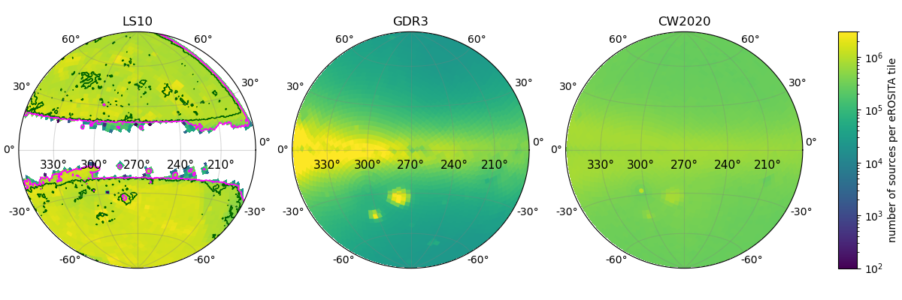
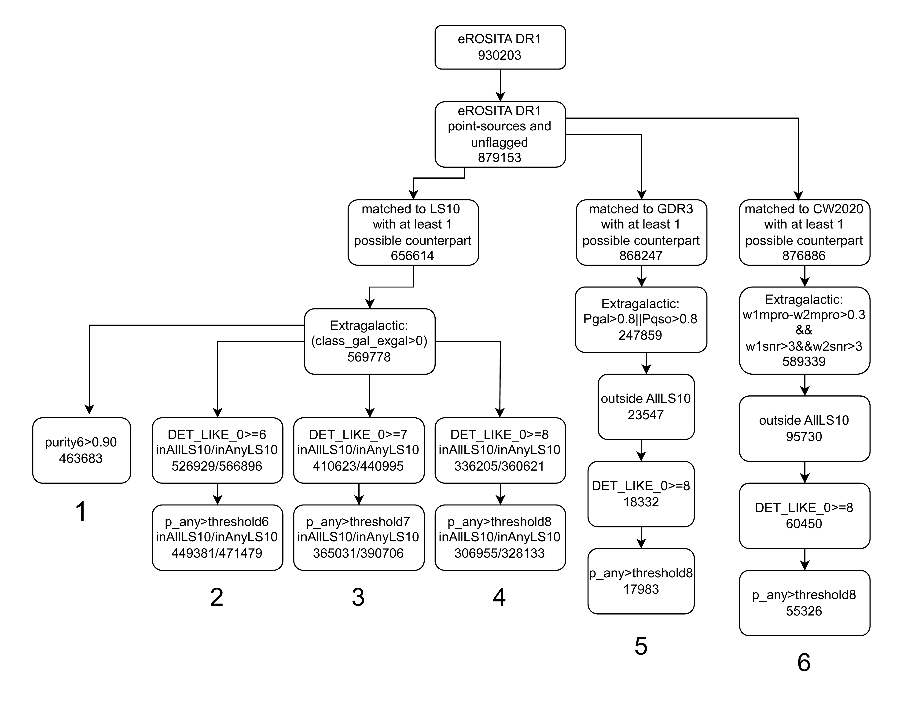
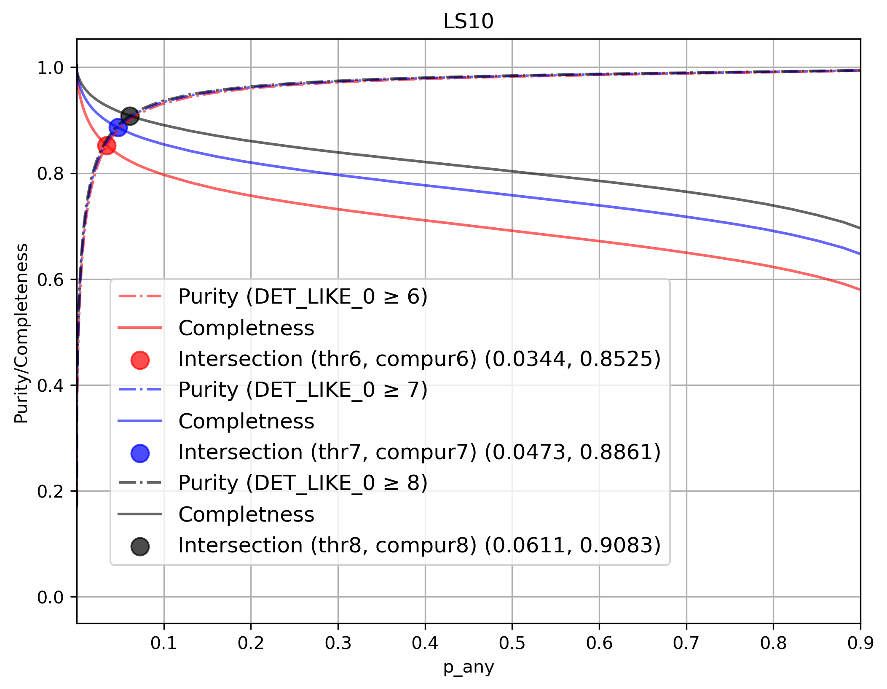
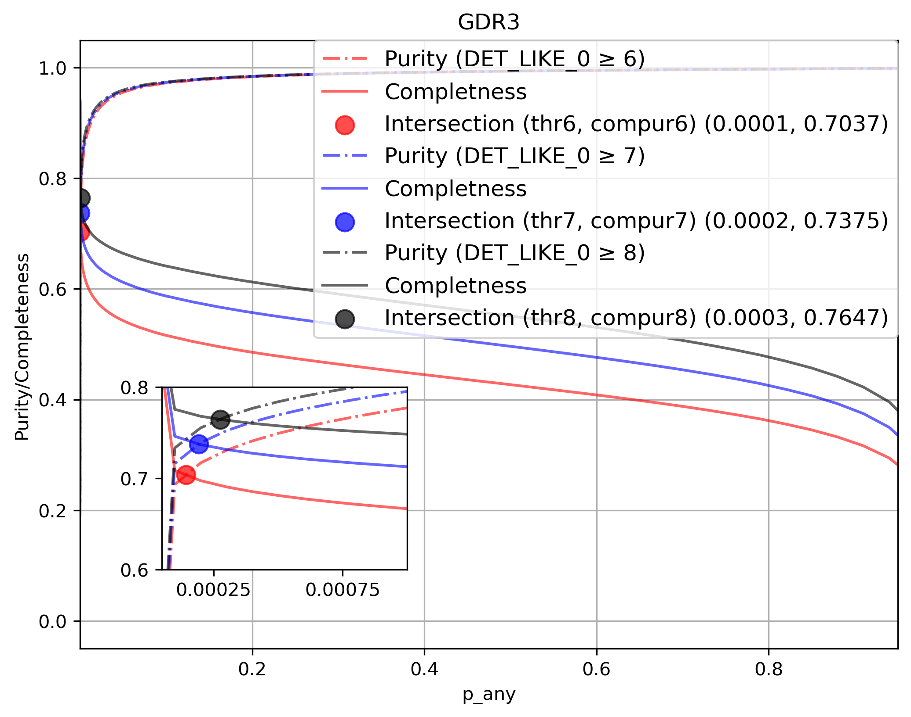
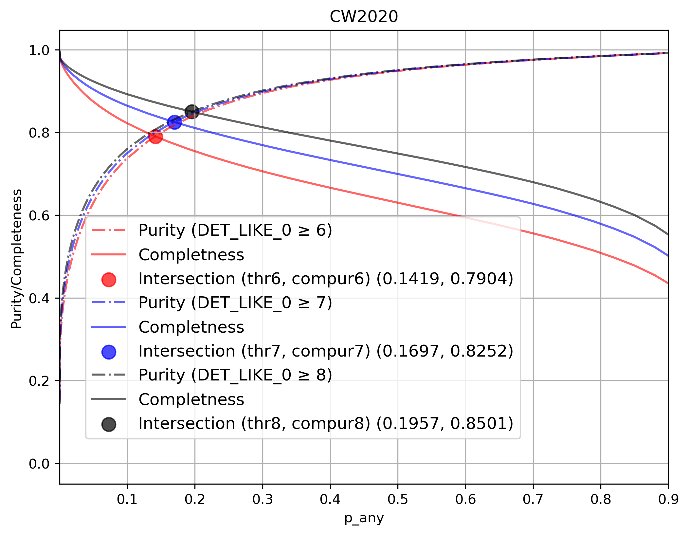

$\newcommand{\ensuremath}{}$
$\newcommand{\xspace}{}$
$\newcommand{\object}[1]{\texttt{#1}}$
$\newcommand{\farcs}{{.}''}$
$\newcommand{\farcm}{{.}'}$
$\newcommand{\arcsec}{''}$
$\newcommand{\arcmin}{'}$
$\newcommand{\ion}[2]{#1#2}$
$\newcommand{\textsc}[1]{\textrm{#1}}$
$\newcommand{\hl}[1]{\textrm{#1}}$
$\newcommand{\footnote}[1]{}$
$\newcommand{\citetemp}[1]{(#1)}$
$\newcommand{\tdcomm}[1]{\textcolor{orange}{(TD: #1)}}$

# Counterpart identification and classification for eRASS1 and characterisation of the AGN content

<mark>Appeared on: 2025-09-04</mark> -  _Paper resubmitted to A&A after taking into account the comments of the referee. The associated 7 catalogues will be released via the eROSITA pages and Vizier as soon as the paper is accepted for publication_

M. Salvato, et al. -- incl., <mark>J. Wolf</mark>

**Abstract:** Accurately accounting for the AGN phase in galaxy evolution requires a large, clean AGN sample. This is now possible with SRG/eROSITA, which completed its first all-sky X-ray survey (eRASS1) on June 12, 2020. The public Data Release 1 (DR1, Jan 31, 2024) includes 930,203 sources from the Western Galactic Hemisphere. The all-sky X-ray data enable the selection of a large AGN sample and the discovery of rare sources. However, scientific return depends on accurate characterisation of the X-ray emitters, requiring high-quality multiwavelength data. This paper presents the identification and classification of optical and infrared counterparts to eRASS1 sources. Counterparts to eRASS1 X-ray point sources were identified using Gaia DR3, CatWISE2020, and Legacy Survey DR10 (LS10) with the Bayesian NWAY algorithm and trained priors. Sources were classified as Galactic or extragalactic via a Machine Learning model combining optical/IR and X-ray properties, trained on a reference sample. For extragalactic LS10 sources, photometric redshifts were computed using ${\sc Circlez}$ . Within the LS10 footprint, all 656,614 eROSITA/DR1 sources have at least one possible optical counterpart; $\sim$ 570,000 are extragalactic and likely AGN. Half are new detections compared to AllWISE, Gaia, and Quaia AGN catalogues. Gaia and CatWISE2020 counterparts are less reliable, due to the survey's shallowness and the limited amount of features available to assess the probability of being an X-ray emitter. In the Galactic Plane, where the overdensity of stellar sources also increases the chance of associations, using conservative reliability cuts, we identify approximately 18,000 Gaia and 55,000 CatWISE2020 extragalactic sources. We release three high-quality counterpart catalogues — plus the training and validation sets — as a benchmark for the field. These datasets have many applications, but in particular empower researchers to build AGN samples tailored for completeness and purity, accelerating the hunt for the Universe’s most energetic engines.

**Figure 10. -** Source density per eROSITA sky tile  ($3\deg \times  3\deg$) of LS DR10 (LS10; left panel), Gaia DR3 (GDR3; middle panel) and CatWISE2020 (CW2020; right panel). On the LS10 map, the dark green (magenta) regions of InAllLS10 (InAnyLS10), indicating whether all (at least one of) the LS10 bands reach the nominal depth of the survey (see Section \ref{sec:limitations}), are overplotted. (*fig:densityfield*)

**Figure 17. -** Flowchart describing the construction of six samples of candidate AGN with different supporting data, on different regions and with different levels of completeness and purity. For the detailed construction of the samples, see Section \ref{sec:eRASS1_AGN}.) (*fig:FlowChart*)

**Figure 2. -** Mean purity and completeness as  a function of \texttt{p\_any} for LS10, GDR3 and CW2020, averaged over their respective surveys' footprints (i.e, considering eROSITA sources outside the Galactic Plane in the case of LS10) (*fig:Meanpurcomp*)

