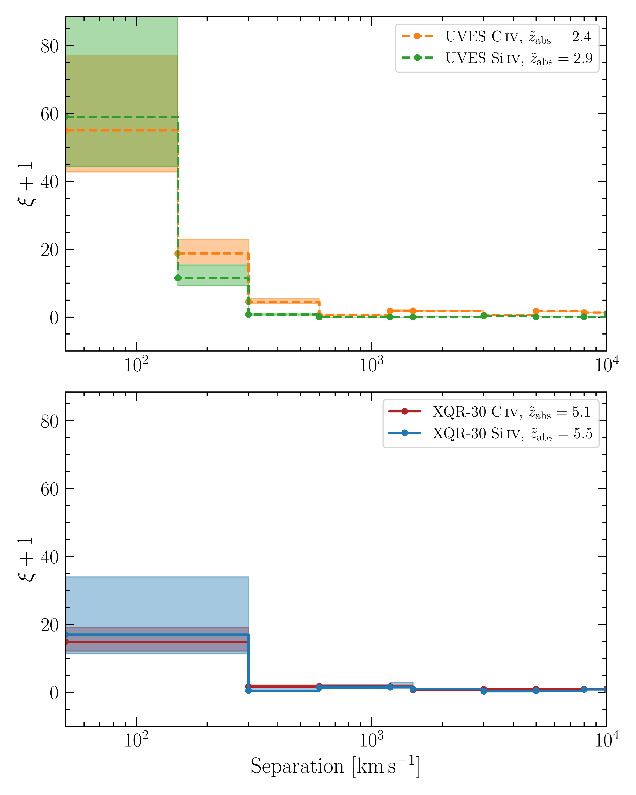
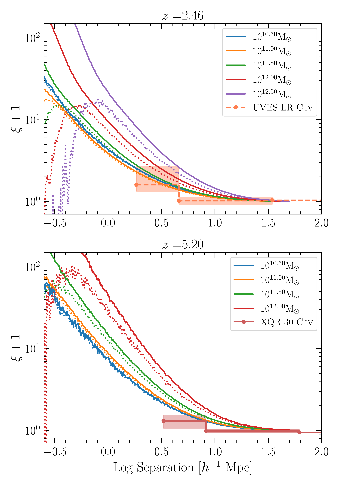
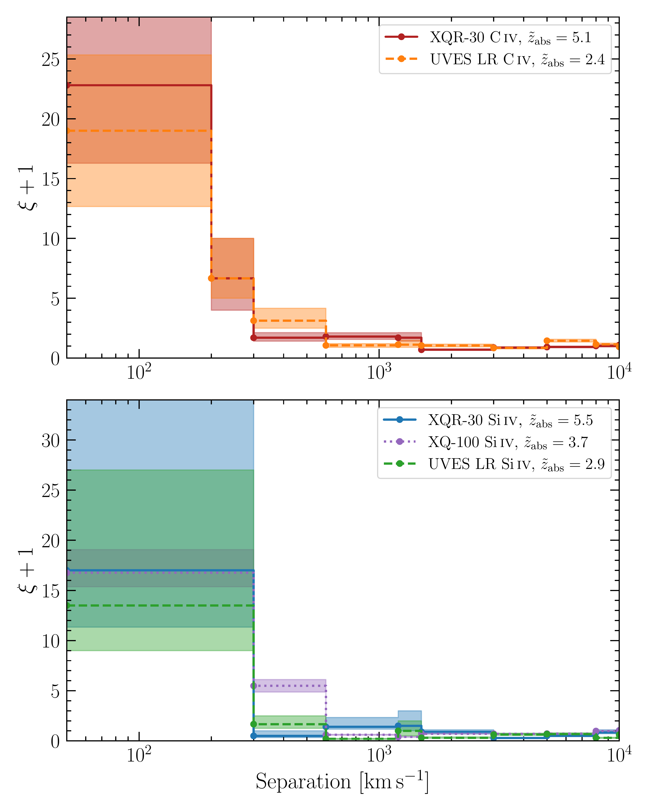

$\newcommand{\ensuremath}{}$
$\newcommand{\xspace}{}$
$\newcommand{\object}[1]{\texttt{#1}}$
$\newcommand{\farcs}{{.}''}$
$\newcommand{\farcm}{{.}'}$
$\newcommand{\arcsec}{''}$
$\newcommand{\arcmin}{'}$
$\newcommand{\ion}[2]{#1#2}$
$\newcommand{\textsc}[1]{\textrm{#1}}$
$\newcommand{\hl}[1]{\textrm{#1}}$
$\newcommand{\footnote}[1]{}$
$\newcommand{\xqr}{E-XQR-30}$
$\newcommand{\fe}[1]{Fe {\sc ii}~\lambda#1}$
$\newcommand{\civ}{C {\sc iv}}$
$\newcommand{\siiv}{Si {\sc iv}}$
$\newcommand{\cf}{\xi(v, v+\Delta v)}$
$\newcommand{\md}{\Omega_{\rm C \textsc{iv}}}$
$\newcommand{\kms}{km s^{-1}}$
$\newcommand{\comment}[1]{\textcolor{blue}{#1} }$

# The clustering of $\civ$ and $\siiv$ at the end of reionisation: A perspective from the E-XQR-30 survey

<mark>Appeared on: 2025-09-05</mark> -  _9 pages, 6 figures, accepted for publication in Astronomy & Astrophysics_

L. Welsh, et al. -- incl., <mark>L. Xie</mark>

**Abstract:**            We aim to study the clustering of metal absorption lines and the structures that they arise in as a function of cosmic time. We focus on C IV and Si IV absorption features that are identified along a given quasar sightline. We exploit the two-point correlation function (2PCF) to investigate the clustering of these structures as a function of their separation. We utilise the E-XQR-30 data to perform a novel analysis at z>5. We also draw on literature surveys (including XQ-100) of lower redshift quasars to investigate the possible evolution of this clustering towards cosmic noon (i.e., z~2-3). We find no significant evolution with redshift when considering the separation of absorbers in velocity space. Since we are comparing data across a large interval of cosmic time, we also consider the separation between absorbers in the reference frame of physical distances. In this reference frame, we find that the amplitude of the clustering increases with cosmic time for both C IV and Si IV on the scales of <1500 physical kpc. For the first time, we assess the 2PCF of C IV and Si IV close to the epoch of reionisation utilising the absorber catalogue from the E-XQR-30 survey. We compare this with lower redshift data and find that, on small scales, the clustering of these structures grows with cosmic time. We compare these results to the clustering of galaxies in the GAEA simulations. It appears that the structures traced by C IV are broadly comparable to the galaxies from the considered simulations. The clustering is most similar to that of the galaxies with virial masses M~10^10.5 M_sun. We require tailor-made simulations to investigate the full range of factors contributing to the observed clustering. Future ground-based spectrographs will further facilitate surveys of absorbers at this epoch with increased sensitivity.         

**Figure 2. -** Top: The two point correlation function of $\civ$ and $\siiv$ based on the UVES LP data previously analysed in [Calura, Cristiani and Viel (2010)](), [Finlator and Cristiani (2022)](). In this  calculation we have imposed the same column density cuts as applied to the $\xqr$ data. Compared to $\xqr$, the resulting distributions are sampled more frequently, with an additional  evaluation point at $\Delta v = 150$ $\kms$. The subsequent bins are consistent with those used for XQR-30. Bottom: The 2PCF of $\civ$ and $\siiv$ shown on the smallest scale accessible based on the limited statistics of the $\siiv$ data. These bins span $\Delta v=$[$50-300, 300-600, 600-1200, 1200-1500, 1500-3000$] $\kms$ for the first 5 bins. Note that distributions of $\xi$ values are formed via many realisations of the randomly distributed lines. For each sample, the solid line represents the median value while the shaded region encompasses the interquartile range. (*fig:2pcf_xqr30*)

**Figure 4. -** The 3D real space correlation calculated at different epochs using the GAEA simulation suite snapshots. The correlation is calculated using the corrfunc package. The different colors correspond to galaxies with different virial parent halo masses. The top and bottom panels correspond to different epochs as indicated by the titles. The solid curves represent the clustering of all galaxies in the snapshot. The dotted lines represent that of only the central galaxies associated with halos. The observed 2PCF of $\civ$ and $\siiv$ have been overplotted on these simulation data across different epochs. In this case, we calculate the 2PCF of $\civ$ systems (i.e., all the absorption within 200 $\kms$ is considered one feature). Again, the shaded regions correspond to the interquartile range of the observed distributions.  (*fig:xi_sim_n_obs*)

**Figure 3. -** The 2PCF of $\civ$(top) and $\siiv$(bottom) based on the absorbers in the $\xqr$ survey now combined with that of the lower redshift `UVES LR' data. The UVES LR data are taken with higher resolution and therefore we have merged the features that would not be resolved with XSHOOTER. We additionally include the 2PCF of $\siiv$ from a third dataset, the XQ-100 survey. The shaded region encompasses the interquartile range of the respective distributions. The $\siiv$ absorbers in XQ-100 are found at an intermediate epoch between the XQR-30 and UVES LR data. Note that we can probe down to smaller separations (within 200 $\kms$) with $\civ$ due to the increased statistics.  (*fig:2pcf_merged*)

