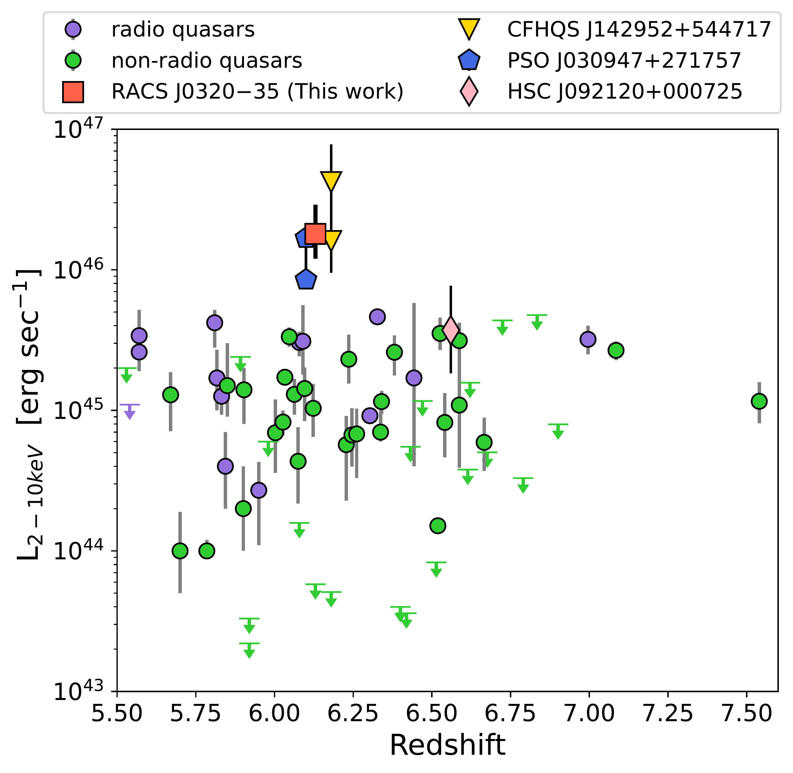

$\newcommand{\ensuremath}{}$
$\newcommand{\xspace}{}$
$\newcommand{\object}[1]{\texttt{#1}}$
$\newcommand{\farcs}{{.}''}$
$\newcommand{\farcm}{{.}'}$
$\newcommand{\arcsec}{''}$
$\newcommand{\arcmin}{'}$
$\newcommand{\ion}[2]{#1#2}$
$\newcommand{\textsc}[1]{\textrm{#1}}$
$\newcommand{\hl}[1]{\textrm{#1}}$
$\newcommand{\footnote}[1]{}$
$\newcommand{\vdag}{(v)^\dagger}$
$\newcommand$
$\newcommand$
$\newcommand{\longname}{RACS~J032021.44-352104.1 }$
$\newcommand{\shortname}{RACS~J0320-35}$
$\newcommand$
$\newcommand$
$\newcommand$

# X-ray investigation of possible super-Eddington accretion in a radio-loud quasar at $z=6.13$

<mark>Appeared on: 2025-09-08</mark> -  _Accepted for publication on ApJL on the 8th July 2025. 18 pages with 6 figures and 2 tables_

L. Ighina, et al. -- incl., <mark>S. Belladitta</mark>

**Abstract:** We present radio and X-ray observations of the recently discovered $z=6.13$ radio-powerful quasar RACS J032021.44 $-$ 352104.1 using uGMRT, ATCA, LBA, and _Chandra_ .The observed radio properties are in line with what is typically observed in high- $z$ radio quasars ( $\alpha_{\rm r}=0.72\pm 0.02$ and L $_{\rm 1.4GHz}=5.8 \pm 0.9 \times 10^{26}$ W Hz $^{-1}$ ). Despite the relatively low X-ray flux observed $F_{\rm 0.5-7.0 keV}=2.3\pm0.5 \times 10^{-14}$ erg sec $^{-1}$ cm $^{-2}$ , the intrinsic luminosity in the 2--10 keV rest frame is markedly high, $L_{\rm 2-10 keV}=1.8^{+1.1}_{-0.7} \times 10^{46}$ erg sec $^{-1}$ , making RACS J032021.44 $-$ 352104.1 one of the most luminous quasars currently known at $z>5.5$ . The high X-ray luminosity is largely driven by an extrapolation to energies below the observable X-ray window with $_ Chandra_$ and the slope derived in the 0.5-7 keV band (or 3.5--50 keV in the rest-frame; $\Gamma_{\rm X}=3.3\pm0.4$ ).By analysing the overall spectral energy distribution of the quasar we found that the remarkably soft X-ray emission: (1) cannot be produced by relativistic jets, even when relativistic boosting is considered; and (2) is consistent with expectations for a super-Eddington accreting SMBH.If such a high accretion rate was confirmed, this source would be a unique laboratory to study high accretion in the early Universe and could help resolve some challenges inherent in early black hole growth paradigms.

**Figure 3. -** ** Left panel:** X-ray luminosity in the 2--10 keV energy band (rest frame) as a function of redshift for the $z>5.5$ quasars with X-ray observations from either _ Chandra_ or _ XMM-Newton_ available in the literature. We highlight the following objects: $\shortname$(red square; this work), HSC J092120.56+000722.9 (pink diamond;  ([Wolf, Nandra and Salvato 2023]()) ), CFHQS J142952+544717 (yellow triangles;  ([Migliori, Siemiginowska and Sobolewska 2023](), [Marcotulli, Connor and Bañados 2025]()) ) and PSO J030947+271757 (purple pentagon;  ([Moretti, Ghisellini and Caccianiga 2021]()) ). Since these last two sources present variable/flaring emission, we show two data-points representing the quiescent and the flaring state respectively. All the other quasars are reported with different colours based if they are also detected in the radio band (purple) or not (green). ** Right panel:** Rest-frame, multi-wavelength spectral energy distribution of $\shortname$. The X-ray weak super-Eddington SED from [Pacucci and Narayan (2024)]() is shown in magenta. The solid black line is a quasar template  ([Polletta, Tajer and Maraschi 2007]())  matched to the optical-UV data-points. The dashed black line is the X-ray emission expected from the UV-X-ray relation derived by [Lusso and Risaliti (2016)]() and assuming $\Gamma_{\rm X}=2.0$. The gray regions show the 1,2$\sigma$ dispersion of the relation. The vertical yellow region indicates frequencies heavily affected by the absorption of the intergalactic medium. (*fig:Lum_comp*)

**Figure 4. -** MWA (200 MHz), uGMRT (400 and 650 MHz) and ATCA (2.1, 5.5 and 9 GHz) images centred on the optical position of RACS J0320$-$35. Contours start at $\pm$3$\times$RMS and increase by factors of $\sqrt{2}$. (*fig:radio_images*)

**Figure 1. -** ** Left:**_ Chandra_ images (20$"\times$20$"$) of RACS J0320$-$35 in the energy band 0.5--7 keV. The red cross indicates the optical position of the quasar, consistent with the X-ray source detected in the _ Chandra_ image. ** Rgiht:** Contour levels of the photon index and normalisation parameter derived from the fit of the _ Chandra_ observations. Different colours indicate different observation segments, with the filled ellipses showing the contours from all the observations combined. Dashed (solid) lines indicate the 90\%(68\%) confidence regions. (*fig:X_cont*)

