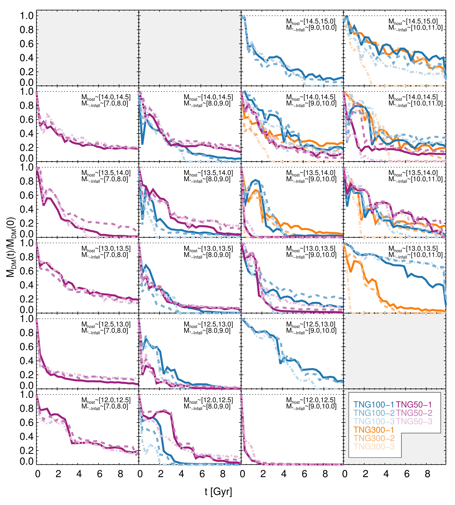
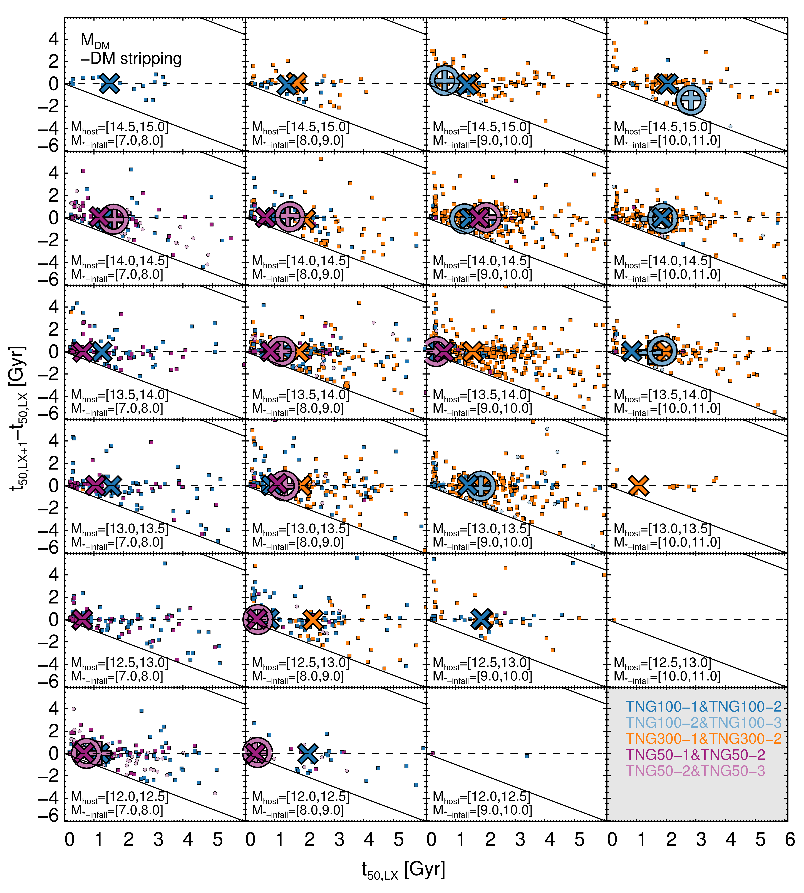
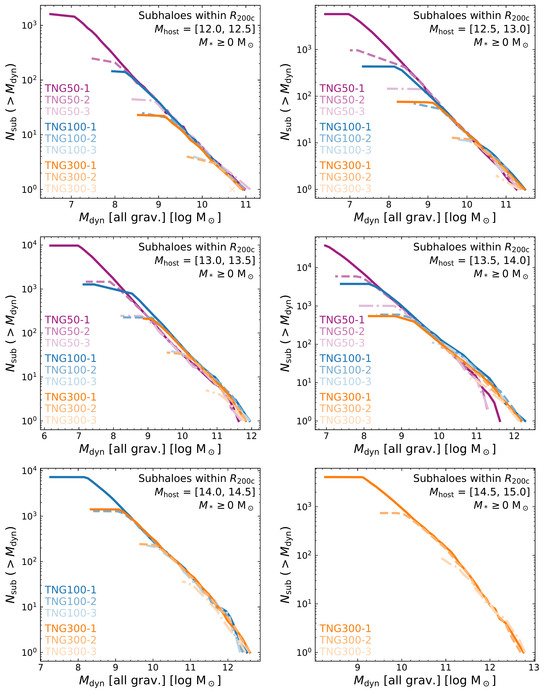

$\newcommand{\ensuremath}{}$
$\newcommand{\xspace}{}$
$\newcommand{\object}[1]{\texttt{#1}}$
$\newcommand{\farcs}{{.}''}$
$\newcommand{\farcm}{{.}'}$
$\newcommand{\arcsec}{''}$
$\newcommand{\arcmin}{'}$
$\newcommand{\ion}[2]{#1#2}$
$\newcommand{\textsc}[1]{\textrm{#1}}$
$\newcommand{\hl}[1]{\textrm{#1}}$
$\newcommand{\footnote}[1]{}$
$\newcommand{\sm}{\small}$
$\newcommand{\dint}{ {\rm d}}$
$\newcommand{\hmsun}{ h^{-1} {\rm M_\odot}}$
$\newcommand{\msun}{{ \rm M_\odot}}$
$\newcommand{\vmax}{{ V_{\rm max}~}}$
$\newcommand{\Lsun}{{ \rm L_\odot}}$
$\newcommand{\kms}{ {\rm km} {\rm s}^{-1}}$
$\newcommand{\cm}{ {\rm cm}}$
$\newcommand{\erg}{ {\rm erg}}$
$\newcommand{\Gyr}{ {\rm Gyr}}$
$\newcommand{\K}{ {\rm K}}$
$\newcommand{\Myr}{ {\rm Myr}}$
$\newcommand{\pc}{ {\rm pc}}$
$\newcommand{\kpc}{ {\rm kpc}}$
$\newcommand{\Mpc}{ {\rm Mpc}}$
$\newcommand{\hkpc}{ h^{-1} {\rm kpc}}$
$\newcommand{\hmpc}{ h^{-1} {\rm Mpc}}$
$\newcommand{\cpm}{ {\rm cm}^2 {\rm g}^{-1}}$
$\newcommand{\gcm}{  {\rm g} {\rm cm}^{-3}}$
$\newcommand{\mum}{ \mu{\rm m}}$
$\newcommand{\mstar}{M_{\star}}$
$\newcommand{\ml}[1]{\textcolor{red}{#1}}$
$\newcommand{\ap}[1]{\textcolor{magenta}{#1}}$
$\newcommand{\gsim}{ \lower .75ex \hbox{\sim} \llap{\raise .27ex \hbox{>}} }$
$\newcommand{\lsim}{ \lower .75ex \hbox{\sim} \llap{\raise .27ex \hbox{<}} }$
$\newcommand\MTWOC{M_{\rm 200c}}$
$\newcommand\RTWOC{R_{\rm 200c}}$
$\newcommand\mn{@urlcharsother}$
$\newcommand\mn{@doi}$
$\newcommand\mn{@doi@}$
$\newcommand\mn{@eprint#1#2}$
$\newcommand\mn{@eprint@arXiv#1}$
$\newcommand\mn{@eprint@dblp#1}$
$\newcommand\mn{@eprint@#1:#2:#3:#4}$
$\newcommand{\@}{tempa}$
$\newcommand{\@}{tempa }$
$\newcommand{\@}{tempb }$
$\newcommand{\@}{tempc$
$  }$
$\newcommand{\@}{tempb }$

# Numerical effects on the stripping of dark matter and stars in IllustrisTNG galaxy groups and clusters

<mark>Appeared on: 2025-09-10</mark> -  _23 pages, 16 figures, to be submitted to MNRAS_

M. R. Lovell, et al. -- incl., <mark>A. Pillepich</mark>

**Abstract:** $\noindent$ The stellar haloes and intra-cluster light around galaxies are crucial test beds for dark matter (DM) physics and galaxy formation models. We consider the role that the numerical resolution plays in the modelling of these systems by studying the stripping of satellites in the IllustrisTNG cosmological simulations. We focus on host haloes of total halo mass $\MTWOC=10^{12-15}\msun$ and satellites of stellar mass $>10^{7}$  $\msun$ , and compare stellar halo / satellite properties across 9 IllustrisTNG runs with baryonic particle mass resolution between $8.5\times10^4\msun$ and $7\times10^8$  $\msun$ , using a Lagrangian-region technique to identify counterpart satellites across different resolution simulations of the same volume. We publish the corresponding catalogues alongside this paper. We demonstrate that the stripping of DM from satellites that orbit in group- and cluster-mass hosts is largely independent of resolution at least until 90 per cent of their initial mass at infall has been stripped. We do not find evidence for spurious disruption of galaxies due to insufficient resolution for the satellite masses we consider. By contrast, the stripping of stellar mass is strongly resolution-dependent: each factor of 8 improvement in particle stellar mass typically adds 2 Gyr to the stripping time. Improved numerical resolution within the IllustrisTNG model generally results in more compact satellites with larger stellar masses, which in turn generate more centrally concentrated stellar haloes and intra-cluster mass profiles. However, the concomitant increase in stellar mass of both satellites and hosts may still be the cause for the overprediction of the stellar halo mass at large host radii relative to observations seen in some previous studies.

**Figure 8. -** The evolution with time of the DM mass in randomly-selected TNG example satellites, starting at infall. Columns (rows) denote bins in satellite stellar mass at infall (host halo mass at $z=0$). Here we show the evolution of satellite galaxies matched across runs at different resolution levels and selected in the highest one (L1, i.e. selected in TNG50-1, TNG100-1 and TNG300-1 as described in Section \ref{sec:stripping_methods}). Results from the L1, L2, and L3 runs are shown as solid, dashed and dot-dashed curves, respectively, with different colours denoting different simulated volumes. The smaller the resolution effects on the stripping of DM from satellites, the smaller is the distance among curves of the same colour. (*fig:IEDM*)

**Figure 10. -** The time after infall at which galaxies are first stripped to 50 per cent of their infall DM mass as measured within 30 kpc, $t_\rmn{50}$. On the $y$-axis we show the difference in stripping time between high- and low-resolution copies of satellites: L3 minus L2 and L2 minus L1. On the $x$-axis we show the $t_\rmn{50}$ of the higher resolution counterpart. If the number of L3--to--L2 matches in a panel is at least half the number of L2--to--L1 matches, we plot data for both sets of pairs; otherwise we only plot the L2--to--L1 data. Points below the 1:1 line (i.e. the dashed line at ratio equal 0) denote satellite pairs for which the low resolution counterpart is stripped earlier than the higher resolution version, and the opposite is true for points above the 1:1 line. The median data points are shown as large plus symbols (L3 versus L2) and large crosses (L2 versus L1) when binned by the L1 $M_\rmn{*-Infall}$; we also include L3 versus L2 medians when binned by L2 $M_\rmn{*-Infall}$ as empty circles. The diagonal black lines delineate parts of the plotting region that cannot include data, because either $t_\rmn{50}$ of the low resolution counterpart would occur prior to infall or later than 10.5 Gyr, i.e. at a time later than $z=0$. Each panel corresponds to a different halo mass / satellite infall stellar mass bin combination, which are binned by the $M_\rmn{host}$ and $M_\rmn{*-Infall}$ of the L1 counterpart. The relationship between symbol colour and data set combination is given in the bottom right panel figure legend. On average, and barring the worst resolution level at hand (TNG300-3), the same satellite across resolution levels is stripped of its DM mass at similar rates. However, poorer resolution tends to strip faster those satellites that take longer to be stripped (see markers below the zero line and with larger times after infall to be 50 per cent stripped). (*fig:STDM1*)

**Figure 5. -** Subhalo mass functions for six logarithmic bins in host halo mass across the TNG simulation suite at $z=0$. The definition of mass is the total mass bound to each subhalo, here referred to as the dynamical mass, $M_\rmn{dyn}$. Level-1 resolution simulations are shown with solid lines, level-2 with faded dashed lines, and level-3 with faded dot-dashed lines. TNG100, TNG300, and TNG50 results are shown in blue, orange, and magenta, respectively. The host halo masses increase across panels, from left to right and top to bottom; the host mass values are given in each panel legend. (*fig:submf*)

