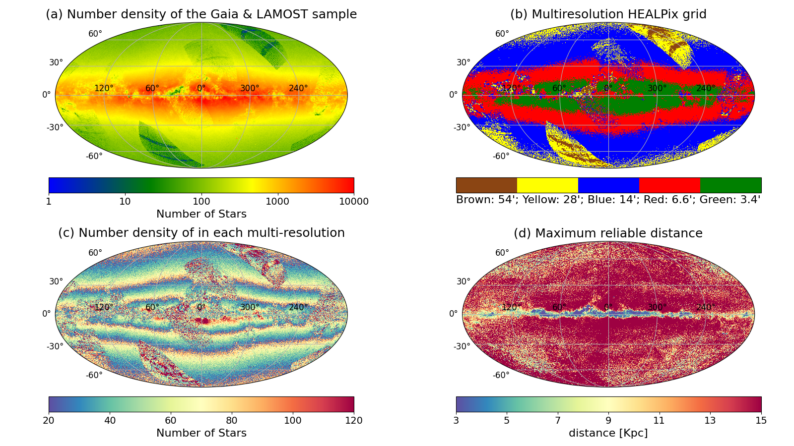
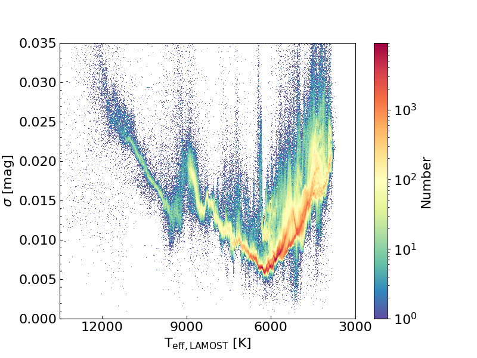
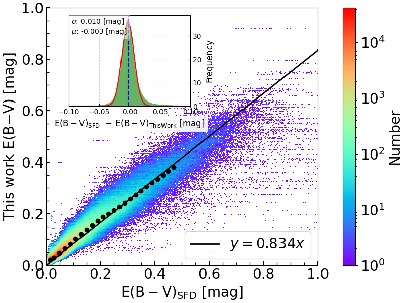

$\newcommand{\ensuremath}{}$
$\newcommand{\xspace}{}$
$\newcommand{\object}[1]{\texttt{#1}}$
$\newcommand{\farcs}{{.}''}$
$\newcommand{\farcm}{{.}'}$
$\newcommand{\arcsec}{''}$
$\newcommand{\arcmin}{'}$
$\newcommand{\ion}[2]{#1#2}$
$\newcommand{\textsc}[1]{\textrm{#1}}$
$\newcommand{\hl}[1]{\textrm{#1}}$
$\newcommand{\footnote}[1]{}$
$\newcommand$
$\newcommand$
$\newcommand$
$\newcommand$
$\newcommand$
$\newcommand$
$\newcommand$
$\newcommand$
$\newcommand$
$\newcommand$
$\newcommand$
$\newcommand$

# An all-sky 3D dust map Based on Gaia and LAMOST

<mark>Appeared on: 2025-09-10</mark> -  _25 pages, 20 figures, 3 tables, published in The Astrophysical Journal Supplement Series (ApJS)_

T. Wang (王涛), et al.

**Abstract:** We present a comprehensive 3D dust reddening map covering the entire Milky Way, constructed by combining reddening estimates based on LAMOST low-resolution spectra (E(B $-$ V) $_{\rm LAMOST}$ ) with those derived from $\gaia$ XP spectra (E(B $-$ V) $_{\rm XP}$ ), along with revised $\gaia$ distances. E(B $-$ V) $_{\rm LAMOST}$ values of $\sim$ 4.6 million unique sources were obtained with the standard-pair analysis using LAMOST DR11 stellar parameters and synthesized $B/V$ -band photometry from $\gaia$ XP spectra, showing a typical precision of $\sim$ 0.01 mag. The E(B $-$ V) $_{\rm XP}$ from the catalog of [Zhang, Green and Rix (2023)]() , which was derived using forward modeling of $\gaia$ XP spectra, were cross-validated with E(B $-$ V) $_{\rm LAMOST}$ , leading to the selection of $\sim$ 150 million high-reliability measurements. The combined dataset achieves a median precision of $\sim$ 0.03 mag for E(B $-$ V). To model the reddening--distance relationship along various lines-of-sight, we implemented a parametric approach that accounts for contributions from the local bubble, diffuse interstellar-medium, and multiple potential molecular clouds. The sky was adaptively partitioned based on stellar density, resulting in angular resolutions ranging from 3.4 $^{\prime}$ to 58 $^{\prime}$ , with about half of the sky having a resolution better than 6.9 $^{\prime}$ . The reddening precision of our 3D map for individual stars reaches $\sim$ 0.01 mag in most regions at $|b| > 20^\circ$ , but degrades to 0.01 -- 0.05 mag at $|b| < 20^\circ$ . The map reaches a maximum distance of 3 -- 5 kpc in high-extinction regions with $|b| < 5^\circ$ , and extends to 10 -- 15 kpc elsewhere. An interactive platform and Python package have been developed for utilization of the 3D dust map.

**Figure 14. -** Adaptive multi-resolution line-of-sight scheme maximum reliable distance for each line-of-sight. (a) The number density of the LAMOST and XP sample（see subsection \ref{sec:data_set}）in the Galactic coordinate system. The number of stars per $\sim$ 0.21 deg$^2$ area（$\rm N_{side}$ =128）is shown. (b) A adaptive multi-resolution map created using the data shown in panel (a), in the same coordinate system. The map consists of five distinct HEALPix pixels, each represented by a different color: brown represents a resolution of 54$\arcmin$(area $\sim$ 0.84$ \mathrm{deg}^2$), yellow represents 28$\arcmin$(area $\sim$ 0.21$ \mathrm{deg}^2$), blue represents 14$\arcmin$(area $\sim$ 0.05$ \mathrm{deg}^2$), red represents 6.6$\arcmin$(area $\sim$ 0.01$ \mathrm{deg}^2$), and green represents 3.4$\arcmin$(area $\sim$ 0.003$ \mathrm{deg}^2$). (c) The distribution of the number of stars per line-of-sight, derived from the adaptive multi-resolution scheme shown in panel (b), is color-coded according to the stellar count. (d) In the adaptive multi-resolution map, the maximum reliable distance for each line-of-sight is color-coded. (*fig:HEALPix*)

**Figure 2. -** The 2D histogram of the residual standard deviation from the linear fit to the target stars, derived using the standard-pair algorithm, as a function of $\tefflm$, with color encoding representing the stellar number density. (*fig:star_pair_fit_sigma*)

**Figure 9. -** A comparison of the E(B$-$V) derived from the extinction integral at the maximum reliable distance in this work and those from the SFD is shown. The black points represent the median values within each bin, and the black line is the linear fit to these points. \st{Note that regions with |b| > 20$^\circ$ and MCs have been excluded.} LMC, SMC, and |b| < 20$^\circ$ regions were excluded. (*fig:sfd_our*)

