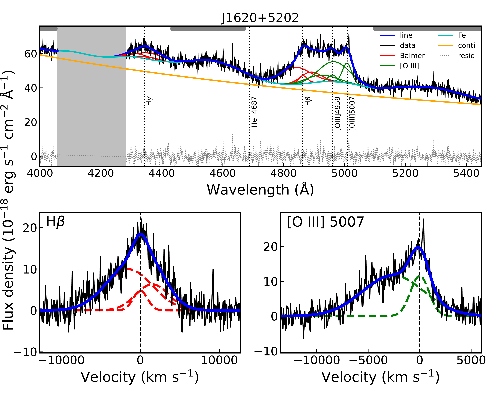
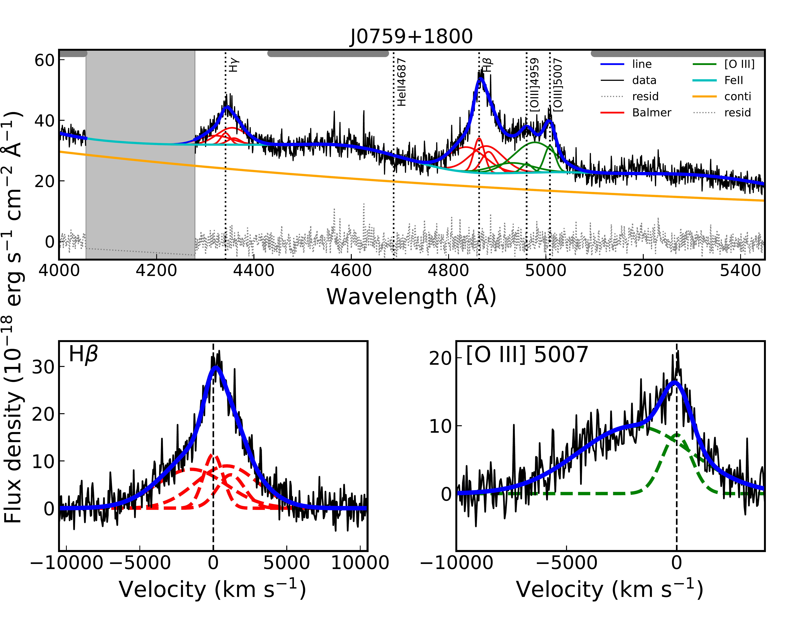
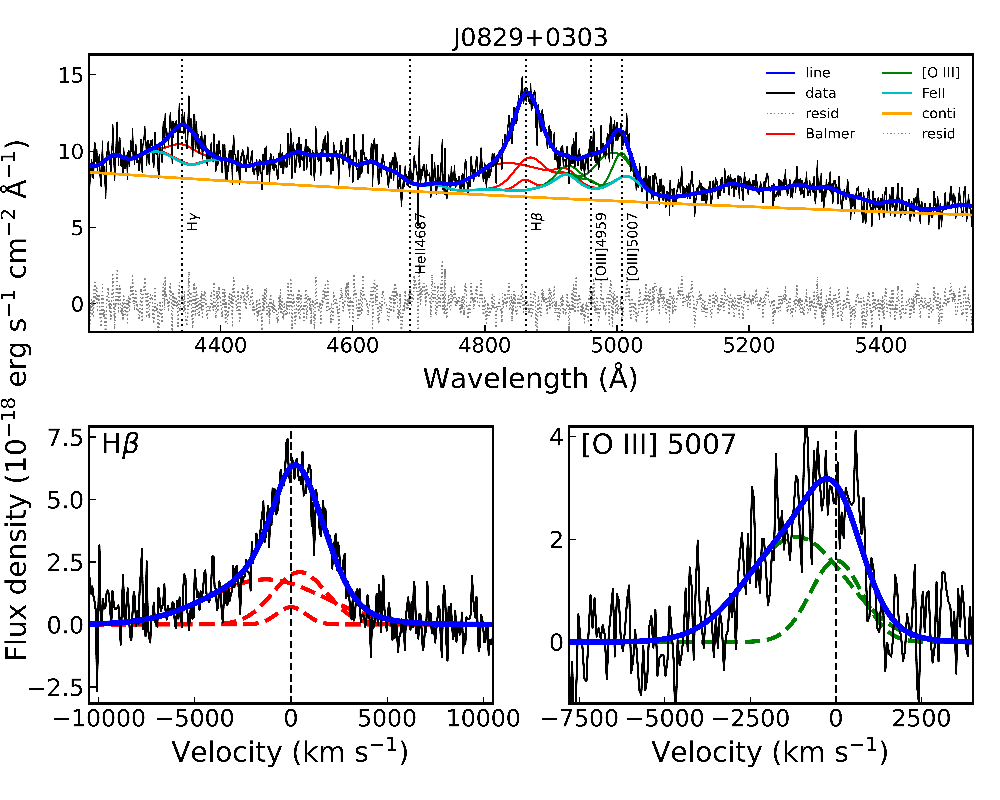
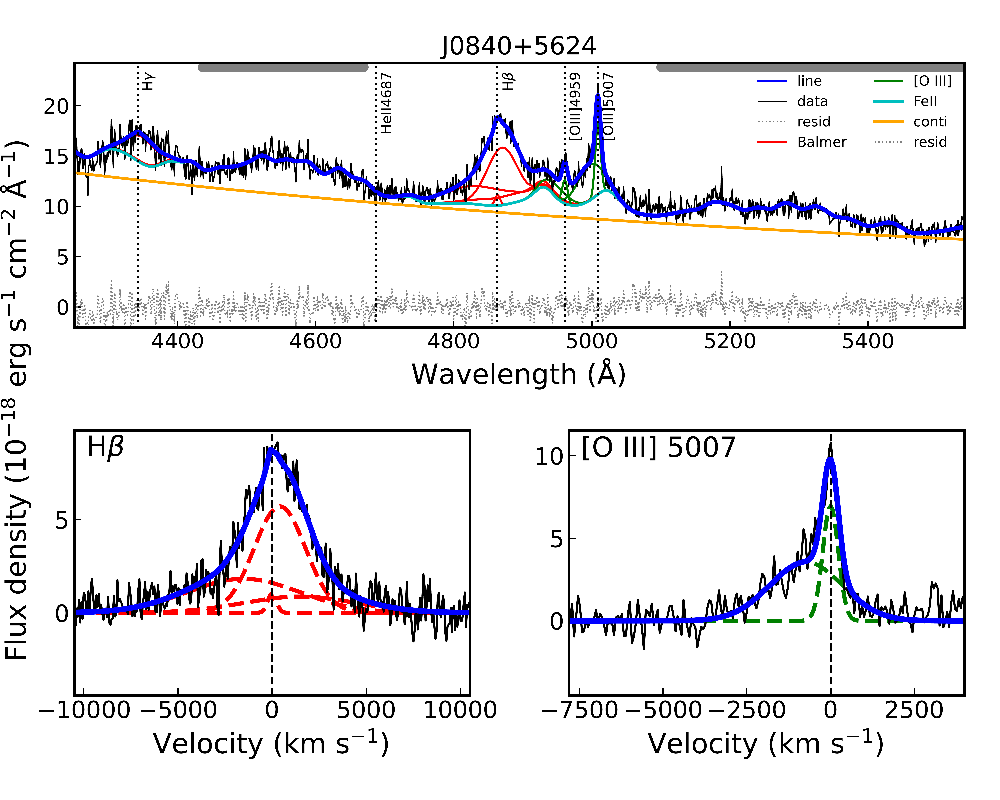
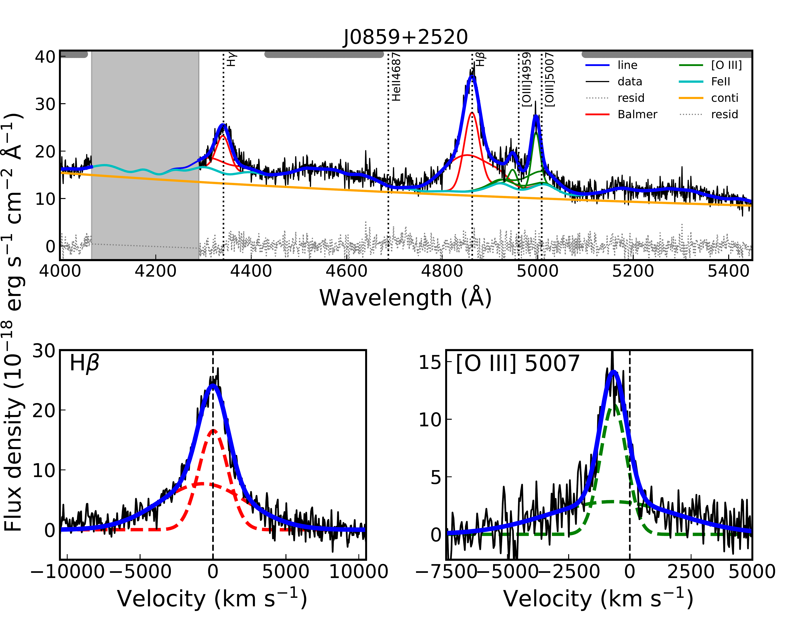
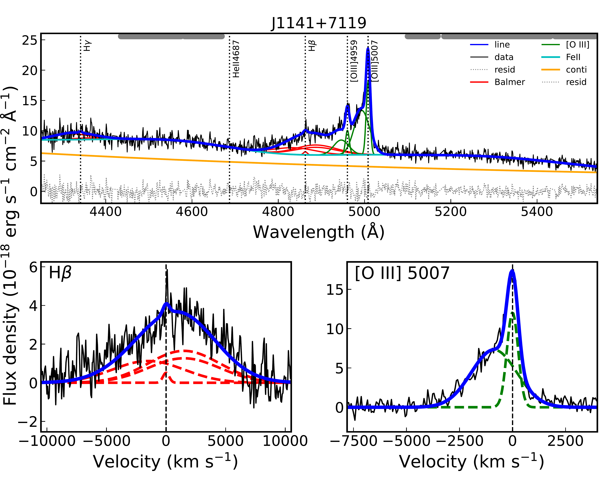
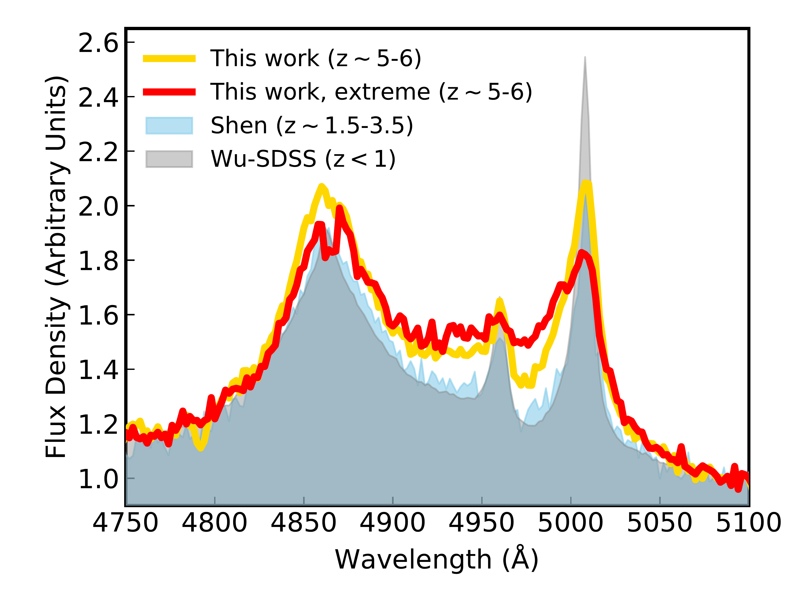
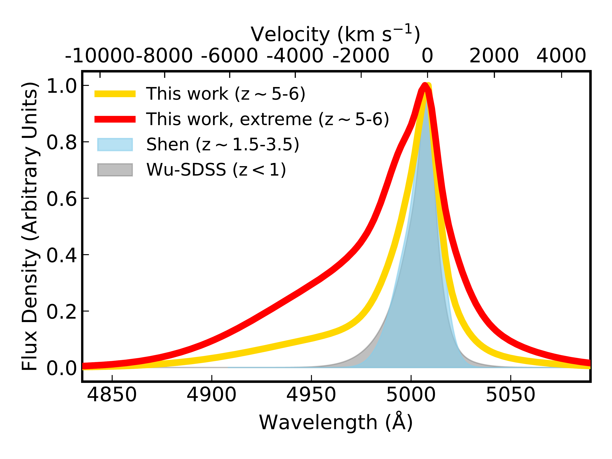
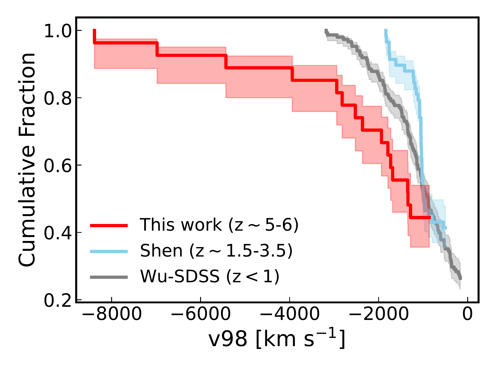
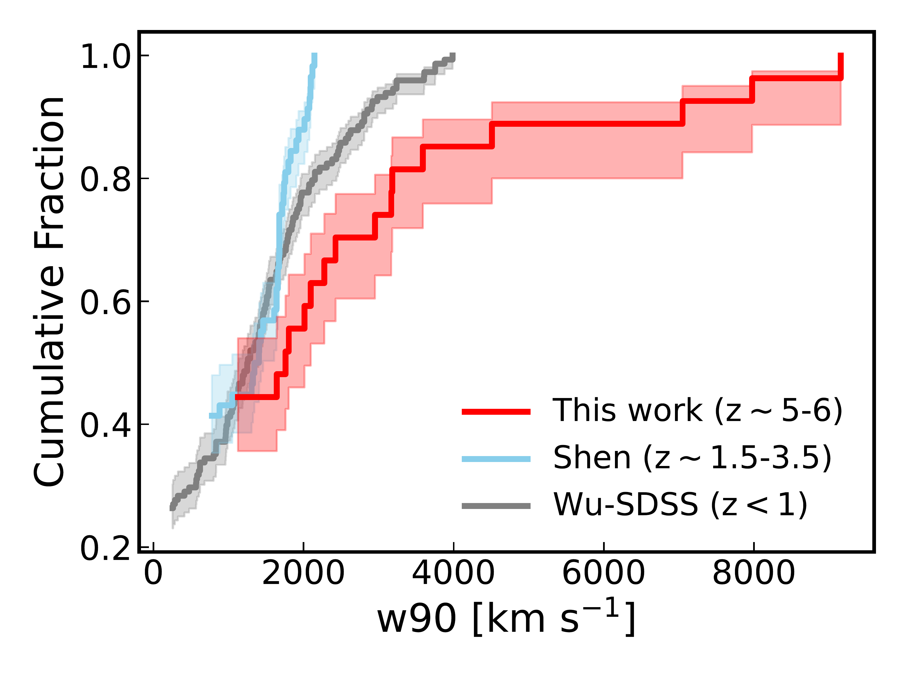

$\newcommand{\ensuremath}{}$
$\newcommand{\xspace}{}$
$\newcommand{\object}[1]{\texttt{#1}}$
$\newcommand{\farcs}{{.}''}$
$\newcommand{\farcm}{{.}'}$
$\newcommand{\arcsec}{''}$
$\newcommand{\arcmin}{'}$
$\newcommand{\ion}[2]{#1#2}$
$\newcommand{\textsc}[1]{\textrm{#1}}$
$\newcommand{\hl}[1]{\textrm{#1}}$
$\newcommand{\footnote}[1]{}$
$\newcommand{\bibinfo}[2]{#2}$
$\newcommand{\eprint}[2][]{\url{#2}}$
$\newcommand{\doi}[1]{\url{https://doi.org/#1}}$
$\newcommand{\bibinfo}[2]{#2}$
$\newcommand{\eprint}[2][]{\url{#2}}$
$\newcommand{\doi}[1]{\url{https://doi.org/#1}}$
$\newcommand{\vdag}{(v)^\dagger}$
$\newcommand$
$\newcommand$
$\newcommand{\xh}{<\chi_{H I}>}$
$\newcommand{\TQ}{t_{Q}}$
$\newcommand{\paa}{{Pa\alpha}}$
$\newcommand{\pab}{{Pa\beta}}$
$\newcommand{\av}{{A_{V}}}$
$\newcommand{\ebv}{E(B-V)}$
$\newcommand{\siv}{[S~{\sc iv}] 10.51 \mum}$
$\newcommand{\oiiitext}{[O~{\sc iii}]}$
$\newcommand{\sivtext}{[S~{\sc iv}]}$
$\newcommand{\lya}{Ly\alpha}$
$\newcommand{\Lbol}{L_{\rm bol}}$
$\newcommand{\edd}{\lambda_{Edd}}$
$\newcommand{\arcsec}{^{\prime\prime}}$
$\newcommand{\cii}{[C~{\sc ii}] 158 \mum}$
$\newcommand{\ciitext}{[C~{\sc ii}]}$
$\newcommand{\mum}{\ifmmode{\rm \mu m}\else{\mum}\fi}$
$\newcommand{\vdisp}{\vdisp}$
$\newcommand{\wba}{w_{80}}$
$\newcommand{\wjiu}{w_{90}}$
$\newcommand{\vwu}{{v_{50}}}$
$\newcommand{\vjiu}{{v_{90}}}$
$\newcommand{\vyi}{{v_{10}}}$
$\newcommand{\vbasi}{{v_{84}}}$
$\newcommand{\vyiliu}{{v_{16}}}$
$\newcommand{\flux}{erg cm^{-2} s^{-1}}$
$\newcommand{\fsb}{erg cm^{-2} s^{-1} }$
$\newcommand{\Lwu}{{\lambda L_{\lambda}(5100)}}$
$\newcommand{\vjiuba}{{v_{98}}}$
$\newcommand{\vlingwu}{{v_{05}}}$
$\newcommand{\vjiuwu}{{v_{95}}}$
$\newcommand{\ajiuyi}{{A_{91}}}$
$\newcommand{\ajiuyiha}{{A_{91,H\alpha}}}$
$\newcommand{\ajiuyio}{{A_{91,[O~\sc{III}]}}}$
$\newcommand{\spi}{{\it Spitzer}}$
$\newcommand{\her}{{\it Herschel}}$
$\newcommand{\oi}{\hbox{[O {\scriptsize I}]}}$
$\newcommand{\oii}{{[O {\scriptsize II}]}}$
$\newcommand{\oiii}{{[O~{\sc iii}] \lambda5007}}$
$\newcommand{\oiiiab}{{[O~{\sc iii}] \lambda\lambda4959,5007}}$
$\newcommand{\oiiib}{{[O~{\sc iii}] \lambda4959}}$
$\newcommand{\nv}{\hbox{N {\scriptsize V}}}$
$\newcommand{\civ}{\hbox{C {\scriptsize IV} \lambda1549}}$
$\newcommand{\nev}{\hbox{[Ne {\scriptsize V}]}}$
$\newcommand{\nii}{\hbox{[N {\scriptsize II}]}}$
$\newcommand{\sii}{\hbox{[S {\scriptsize II}]}}$
$\newcommand{\siitext}{\hbox{[S {\scriptsize II}]}}$
$\newcommand{\ha}{\hbox{H\alpha}}$
$\newcommand{\hb}{\hbox{H\beta}}$
$\newcommand{\hg}{\hbox{H\gamma}}$
$\newcommand{\hd}{\hbox{H\delta}}$
$\newcommand{\mgii}{\hbox{Mg {\scriptsize II}}}$
$\newcommand{\feii}{\hbox{Fe {\scriptsize II}}}$
$\newcommand{\red}[1]{\textcolor{red}{#1}}$
$\newcommand{\blue}[1]{\textcolor{blue}{#1}}$
$\newcommand{\kms}{km s^{-1}}$
$\newcommand{\msun}{M_{\odot}}$
$\newcommand{\msunyr}{{M_{\odot} yr^{-1}}}$
$\newcommand{\lsun}{\ensuremath{\mathrm{L}_{\odot}}}$
$\newcommand{\eden}{cm^{-3}}$
$\newcommand{\momfluxsfr}{\dot{P}_{SFR} }$
$\newcommand{\momfluxagn}{\dot{P}_{QSO} }$
$\newcommand{\momfluxout}{\dot{P}_{outflow} }$
$\newcommand{\momfluxratio}{\frac{\dot{P}_{outflow}}{\dot{P}_{AGN}}}$
$\newcommand{\msigma}{M_{\bullet}-\sigma~}$
$\newcommand{\ergs}{erg s^{-1}}$
$\newcommand{\ergscm}{erg s^{-1} cm^{-2}}$
$\newcommand{\myr}{M_\odot~yr^{-1}}$
$\newcommand{\loghn}{log(\nii/\ha) }$
$\newcommand{\logohb}{log(\oiii/\hb) }$
$\newcommand$
$\newcommand$
$\newcommand$
$\newcommand$
$\newcommand$
$\newcommand$
$\newcommand\url{#1}$
$\newcommand{\urlprefix}{URL }$
$\newcommand\url{#1}$
$\newcommand{\urlprefix}{URL }$

# Frequent Extreme Galaxy-scale Outflows among Luminous Early Quasars

<mark>Appeared on: 2025-09-11</mark> -  _24 pages, 6 figures. Nature in review. This manuscript represents the original submitted version following journal policy. Comments are welcome!_

W. Liu, et al. -- incl., <mark>S. Belladitta</mark>, <mark>J. Wolf</mark>

**Abstract:**            The existence of abundant post-starburst/quiescent galaxies just $\sim$1-2 Gyrs after the Big Bang challenges our current paradigm of galaxy evolution. Cosmological simulations suggest that quasar feedback is likely the most promising mechanism responsible for such rapid quenching. Here we report a high detection rate (6/27) of exceptionally fast and powerful galaxy-scale outflows traced by [O III] emission in z $\sim$ 5-6 luminous quasars as revealed by the James Webb Space Telescope (JWST), with velocity up to $\sim$8400 km s$^{-1}$ and order-of-magnitude kinetic energy outflow rates up to $\sim$260% the observed quasar bolometric luminosities. This fraction is $\gtrsim$6.6 times larger than that in luminosity-matched comparison samples at z $\sim$ 1.5-3.5 (0/58) and z $<$ 1 (5/148). These extreme outflows are comparable to or even faster than the most rapid [O III] outflows reported at z $\lesssim$ 3, and could reach the circumgalactic medium (CGM) or even the intergalactic medium (IGM). The average kinetic energy outflow rate of our entire sample is $\sim$230$\times$ higher than that at cosmic noon. The substantially higher frequency of outflows with energetics well above the threshold for negative feedback in our sample strongly suggests that quasar feedback plays a significant role in efficiently quenching/regulating early massive galaxies.         

**Figure 2. -** **Top:** The object with the fastest $\oiiitext$ outflow ($|$\vjiuba$|$$\sim$ 8400 $\kms$) discovered in our sample, with the JWST spectrum (black), best-fit emission line profiles (blue), iron emission (cyan), continuum (orange), and residual (gray dotted line). The best-fit individual Gaussian components for $\hb$ and $\hg$ are shown in red and those for $\oi$iiab are shown in green. Systemic velocities of individual emission lines are shown in vertical black dotted lines. The spectral windows adopted for fitting the quasar pseudo continuum are marked by the gray thick bars. The detector gap and adjacent noisy regions not used in the fitting are masked by the vertical gray shaded region. **Bottom:**$\hb$(left) and $\oi$ii(right) line profiles with their best-fit models (blue solid lines) and individual components (dashed lines). (*fig:profile*)

**Figure 1. -** Same as Fig. \ref{fig:profile} but for the remaining 5 extreme outflows discovered in our sample. (*fig:samples*)

**Figure 3. -** **Upper Left:**
Mean rest-frame spectra of all outflows (objects with $\vwu$$<$0 $\kms$, orange) and extreme outflows ($|$\vjiuba$|>$2700 $\kms$; red) in our sample, zoomed in to the $\hb$--$\oiiitext$ region, in comparison with outflow sources in _Shen sample_(blue) and _Wu-SDSS sample_(gray) with bolometric luminosity ranges matched to our sample. The spectra of individual objects are binned to 2 Å/pixel. The mean spectra are normalized with the mean flux density within 5080--5100Å. **Upper Right:** Same as left but for the best-fit $\oi$ii model profile, which are instead normalized at maximum flux density.
**Bottom:**
Cumulative distribution functions of $\oiiitext$ non-parametric kinematics measurements (left: $\vjiu$ba; right: $\wjiu$) for our sample (red), _Shen sample_(blue) and _Wu-SDSS sample_(gray). The 68\% confidence intervals are indicated by the shaded regions. (*fig:hist*)

