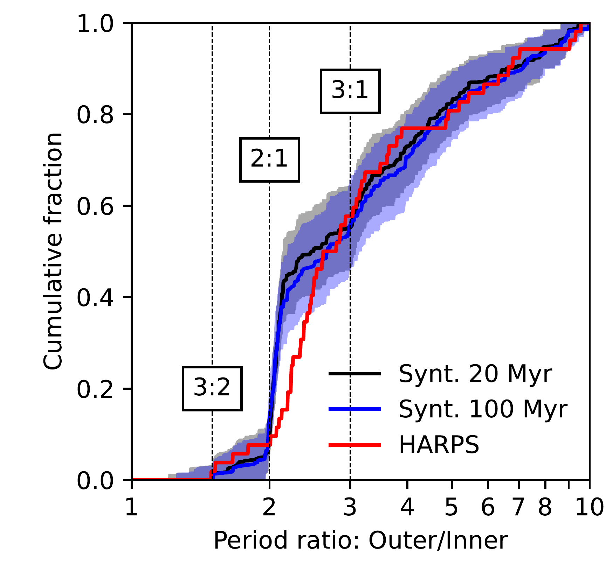
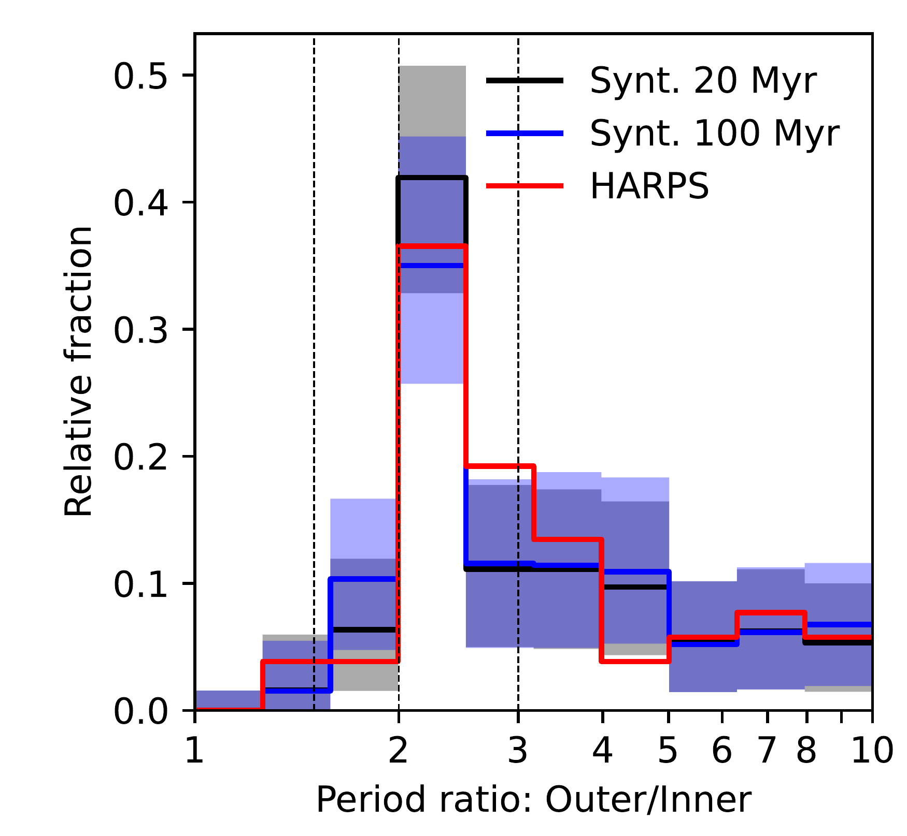
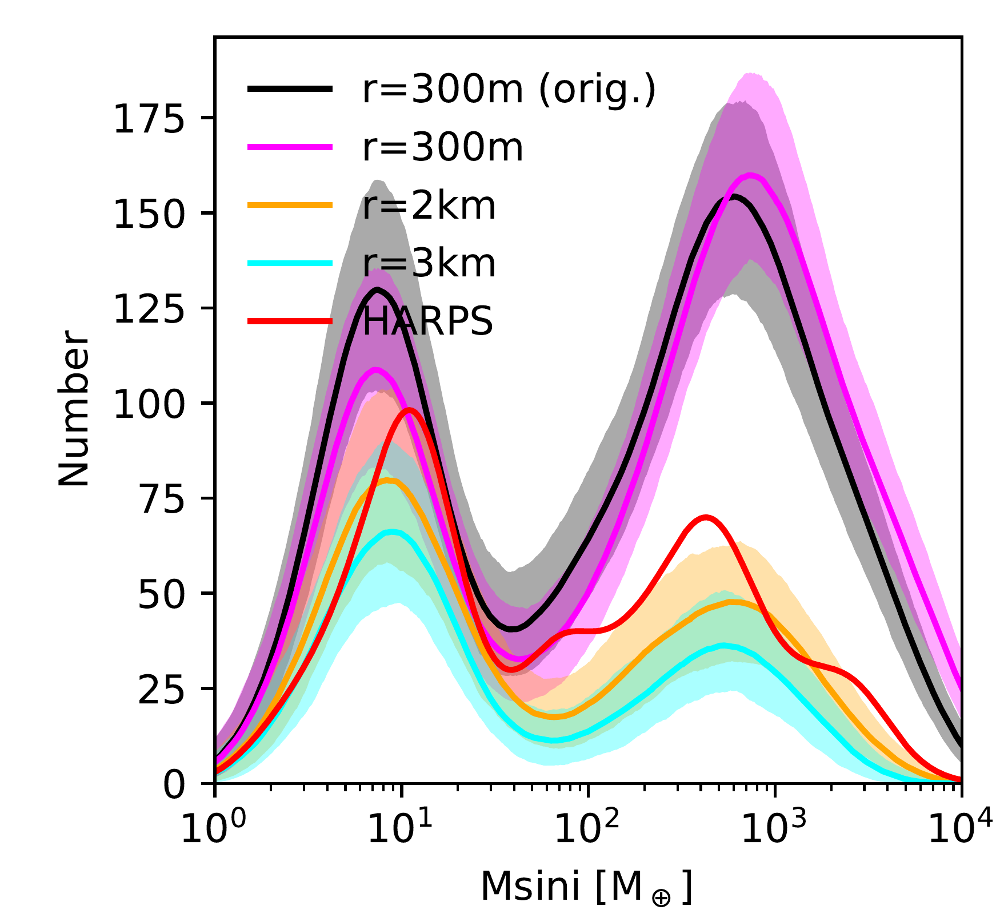
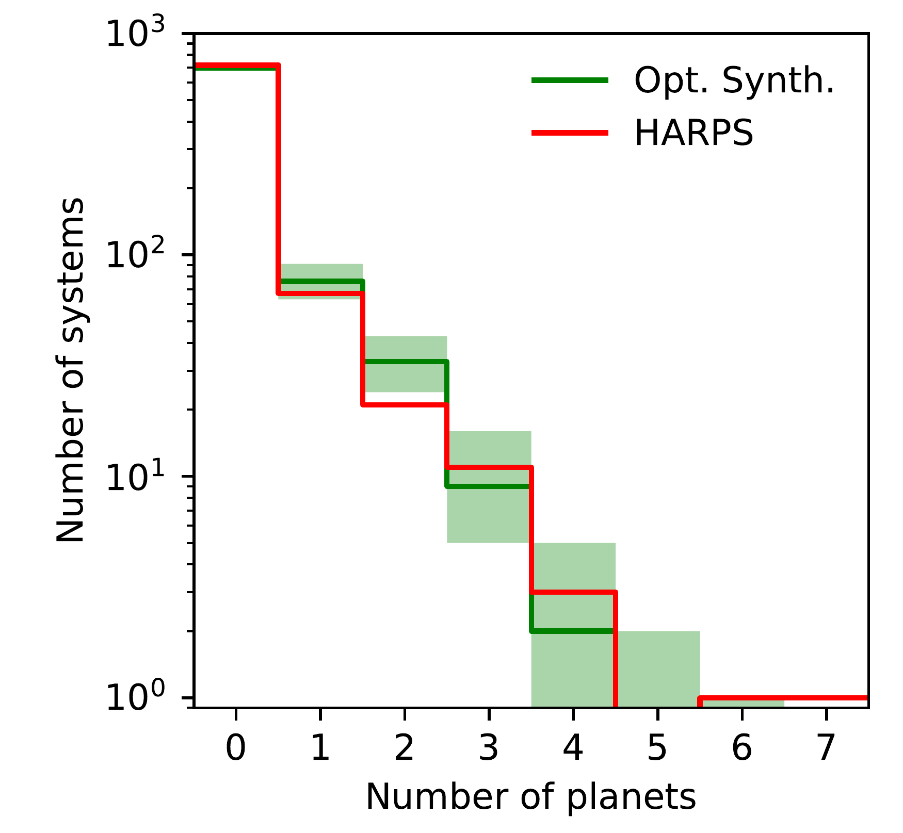

$\newcommand{\ensuremath}{}$
$\newcommand{\xspace}{}$
$\newcommand{\object}[1]{\texttt{#1}}$
$\newcommand{\farcs}{{.}''}$
$\newcommand{\farcm}{{.}'}$
$\newcommand{\arcsec}{''}$
$\newcommand{\arcmin}{'}$
$\newcommand{\ion}[2]{#1#2}$
$\newcommand{\textsc}[1]{\textrm{#1}}$
$\newcommand{\hl}[1]{\textrm{#1}}$
$\newcommand{\footnote}[1]{}$
$\newcommand{\paperone}{\citetalias{2021AAEmsenhuberA}}$
$\newcommand{\papertwo}{\citetalias{2021AAEmsenhuberB}}$
$\newcommand{\mearth}{M_\oplus}$
$\newcommand{\msun}{M_\odot}$
$\newcommand{\mj}{M_{\textrm{\tiny \jupiter}}}$
$\newcommand{\rj}{R_{\textrm{\tiny \jupiter}}}$
$\newcommand{\mstar}{M_\star}$
$\newcommand{\mplanet}{M_\mathrm{planet}}$
$\newcommand{\rplan}{R_\mathrm{plan}}$
$\newcommand{\nobs}{N_{\rm obs}}$

# The New Generation Planetary Population Synthesis (NGPPS): VII. Statistical comparison with the HARPS/Coralie survey

<mark>Appeared on: 2025-09-15</mark> -  _Accepted for publication in A&A. Abstract abridged to meet arXiv requirements_

A. Emsenhuber, et al. -- incl., <mark>R. Burn</mark>

**Abstract:** Planetary population synthesis is a tool that is used to better understand the key processes of planet formation at the statistical level. We seek to quantify the fidelity with which modern population syntheses reproduce observations in view of their use as predictive tools. We compared synthetic populations from the Generation 3 Bern Model of Planet Formation and Evolution (core accretion, solar-type host stars) and the HARPS/Coralie radial velocity sample. We biased the synthetic planet population according to the completeness of the observed data. We then performed quantitative statistical comparisons and systematically identified agreements and  differences. Our nominal population reproduces many of the main features of the HARPS planets, such as two main groups of planets in the mass-distance diagram (close-in sub-Neptunes and distant giants), a bimodal mass function with a less populated `desert', an observed mean multiplicity of about 1.6, and several key correlations regarding the stellar metallicity dependency, the period ratio distribution, and the eccentricity distribution. Considering that the model was not optimised beforehand to reproduce any particular survey, this indicates that some of the important physical processes governing planetary formation could be captured. The remaining discrepancies that can be quantified thanks to the population synthesis approach point to areas that are not fully captured in the model. For instance, we find that the synthetic population has 1) in absolute terms too many planets by $\SI{\approx70}{\%}$ , 2) a `desert' that is too deep by $\SI{\approx60}{\%}$ , 3) a relative excess of giant planets by $\SI{\approx40}{\%}$ , 4) planet eccentricities that are on average too low by a factor of about two (median of $\num{0.07}$ versus $\num{0.15}$ ), and 5) a metallicity effect that is too weak. Finally, the synthetic planets are overall too close to the star compared to the HARPS sample.The differences allowed us to find model parameters that better reproduce the observed planet masses, for which we computed additional synthetic populations.We find that decreasing the planet formation efficiency by increasing the planetesimal size re-balances the number of sub-Neptunes versus giant planets. Changing the efficiency of gas-driven migration also affects the sub-Neptune to giant planet ratio, with lower migration rates resulting in more giant planets and fewer sub-Neptunes. However, only modifying the model parameters seems to be insufficient for the model to fully reproduce both the observed mass and distance distributions at the same time. Instead, physical processes appear to be missing. Planets may originate on wider orbits than our model predicts. Mechanisms leading to higher eccentricities and slower disc-limited gas accretion also seem necessary. We also advocate that theoretical models should make a quantitative, rather than merely a qualitative, comparison between the many current and future large surveys and theoretical results to better understand the origins of planetary systems.

**Figure 17. -** Cumulative distribution (left) and histogram (right) of the period ratios of adjacent planets for the biased 100-embryo population (\texttt{NG76}, in black), the same population but with _N_-body interactions extended to \SI{100}{\mega\year}(\texttt{NG76longshot}, in blue), and the HARPS/Coralie surveys \citepalias[in red]{2011MayorArxiv}. For the synthetic planets, the values are obtained over \num{1000} simulated observations of the underlying population and showing the \SI{95}{\percent} confidence interval. The number of observable pairs is limited, as only systems with multiple planets are usable. The locations of several MMRs are highlighted. (*fig:comp-pratio*)

**Figure 11. -** Comparison of the planet mass distribution between different biased synthetic populations and the observed population. The nominal population with 20 embryos per system (\texttt{NG74}, same as the orange line in Fig. \ref{fig:nemb}) is shown with the black line; the others use the minimum of the Bondi rate and radial flow of the gas disc for the disc-limited gas accretion rate with different planetesimal size, as given in the legend. For each of the synthetic populations, we performed \num{1000} Monte Carlo synthetic observations. The bold line showing the median of these, and the lighter region shows the \SI{95}{\percent} confidence interval. The results are shown as a kernel density estimate, though rescaled to be absolute. (*fig:psize-comp*)

**Figure 7. -** Histogram of the number of planets per systems in both the HARPS/Coralie surveys (red) and the optimised synthetic population \texttt{NG192}(green). (*fig:match-mult*)

