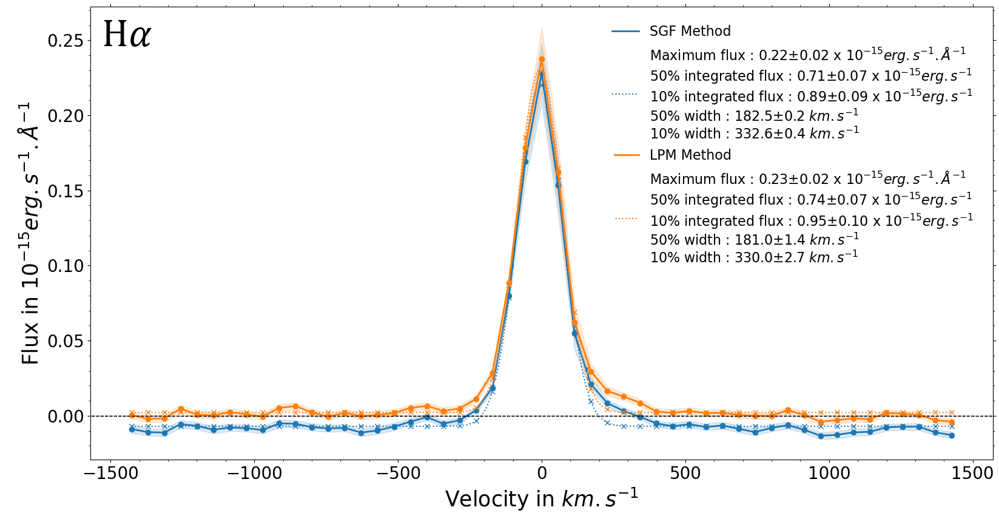
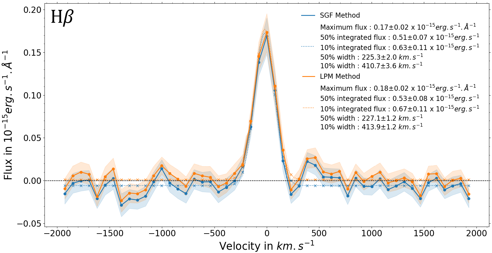
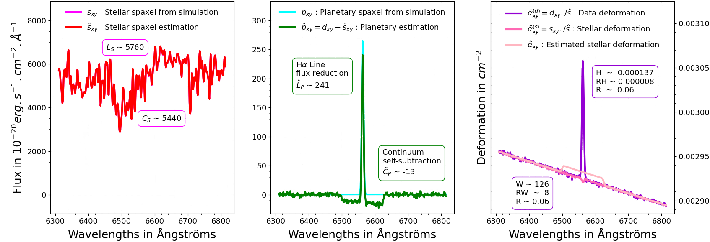

$\newcommand{\ensuremath}{}$
$\newcommand{\xspace}{}$
$\newcommand{\object}[1]{\texttt{#1}}$
$\newcommand{\farcs}{{.}''}$
$\newcommand{\farcm}{{.}'}$
$\newcommand{\arcsec}{''}$
$\newcommand{\arcmin}{'}$
$\newcommand{\ion}[2]{#1#2}$
$\newcommand{\textsc}[1]{\textrm{#1}}$
$\newcommand{\hl}[1]{\textrm{#1}}$
$\newcommand{\footnote}[1]{}$
$\newcommand{\tensorA}{\boldsymbol{\mathcal{A}}}$
$\newcommand{\tensorO}{\boldsymbol{\mathcal{O}}}$
$\newcommand{\tensorPhi}{\boldsymbol{\varPhi}}$
$\newcommand{\tensorD}{\boldsymbol{\mathcal{D}}}$
$\newcommand{\tensorS}{\boldsymbol{\mathcal{S}}}$
$\newcommand{\tensorP}{\boldsymbol{\mathcal{P}}}$
$\newcommand{\tensorE}{\boldsymbol{\mathcal{E}}}$
$\newcommand{\tensorSest}{\boldsymbol{\hat{\mathcal{S}}}}$
$\newcommand{\tensorPest}{\boldsymbol{\hat{\mathcal{P}}}}$
$\newcommand{\Halpha}{\ensuremath{\mathsf{H}_{\upalpha}}\xspace}$
$\newcommand{\Hbeta}{\ensuremath{\mathsf{H}_{\upbeta}}\xspace}$
$\newcommand{\PaBeta}{\ensuremath{\mathsf{Pa}_{\upbeta}}\xspace}$
$\newcommand{\BrGamma}{\ensuremath{\mathsf{Br}_{\upgamma}}\xspace}$
$\newcommand$
$\newcommand$
$\newcommand$
$\newcommand$
$\newcommand{\arraystretch}{1.46}$
$\newcommand{\arraystretch}{1.11}$

# Stellar halo subtraction alternative for accreting companions' characterization with integral field spectroscopy: Analytical and on-sky demonstration on the PDS70, HTLup, and YSES1 systems

<mark>Appeared on: 2025-09-15</mark> -  _14 pages, 15 figures, to be published in A&A_

R. Julo, et al.

**Abstract:** Medium-resolution integral field spectrographs (IFS), such as the Multi-Unit Spectroscopic Explorer (MUSE) instrument at the Very Large Telescope (VLT), are equipped to detect the emission lines (e.g., $\Halpha, \Hbeta$ ) of faint accreting companions when associated with dedicated stellar halo subtraction methods. We recently proposed a new approach based on polynomial modulations of a stellar spectrum estimate across the field of view, with orthogonal polynomials and lines masking. This new technique is designed to better preserve both continuum and emission lines of accreting companions. We seek to highlight and quantify analytically and on real data the benefits of this new approach over the one classically used, particularly with regard to distortions of the extracted spectra. We also examine both operating regimes. We carried out analytical calculations based on simple toy models of spectra to identify and quantify the main theoretical problems of the state-of-the-art technique, the proposed corrections of our new method, and the remaining limitations of the latter. Simulations of the most extreme situations identified were used to highlight these problems and corrections. Archival VLT/MUSE data of the young PDS70 and HTLup systems were used to vet the detection and characterization capabilities using on-sky observations. New images of the YSES1 planetary system were used to further illustrate the gains. We show that the state-of-the-art stellar halo subtraction method, based on low-pass filtering, can lead to the self-subtraction of the emission lines and modify the neighboring continua, depending on the line contrast to neighboring continuum contrast ratios. We show that the proposed technique corrects these characterization problems, while maintaining the same detection capabilities. The two protoplanets PDS70 b and c were detected with 5 $\sigma$ significance. The $\Halpha$ line estimate of the HTLup B stellar companion was improved by $\sim$ 30 \% for the integrated flux and by $\sim$ 8 \% for the 10 \% -width. As for YSES1 b, we found it uniquely displays a combination of $\Halpha$ , $\Hbeta$ , CaII H \& K triplet, and HeI lines in emission that can be attributed to accretion and/or chromospheric activity. We derived an accretion rate at $\Halpha$ of $\sim1.45 \times 10^{-9}$ $\mathrm{M_{Jup}/year}$ with our new method, versus $\sim1.11 \times 10^{-9}$ $\mathrm{M_{Jup}/year}$ with the reference method, namely, $\sim$ 30 \% less. These new results are compatible with values derived for other companions in this mass range. We note that YSES1 c was not detected in our observations. The proposed subtraction method better preserves the spectral information, notably the emission line fluxes and profiles, while achieving similar detection performance. Based on a linear and parametric approach, it can be extended and/or combined with additional faint signal search algorithms.

**Figure 20. -** Zoom in on 51 channels around the $\Halpha$ line of the YSES1 b spectrum estimates, both with the SGF (in blue) and LPM (in orange) methods. Colored areas delimit the 1-$\sigma$ confidence intervals with regard to noise. Dotted Gaussians are fitted to the lines to estimate their main parameters (presented in the legend, with confidence intervals derived from Gaussian fits to the lower and upper bounds of those of the spectrum estimates). The horizontal dots indicate the zero-flux level, i.e., the theoretical flux lower bound. Unlike the LPM method (whose estimate baseline is positive), the SGF method yet cause abnormal negative values (i.e., which cannot be explained by additive electronic noise), as exposed by the Gaussian fits; that is mainly these negative values, unanticipated by the models, that disrupt the usual routines subsequently applied to the estimates. Moreover, even when the Gaussian parameters are calculated relative to their baselines (as is done here) in order to account for this effect as much as possible, it still leads to biased parameter estimations; in fact, self-subtraction not only shifts the lines but also vertically distorts them (as shown in Sect. \ref{sgf}). (*fig:YSES1b_Halpha*)

**Figure 21. -** Same as Fig. \ref{fig:YSES1b_Halpha}, but for the $\Hbeta$ line (the mask used by the LPM method during the estimation process being centered on the $\Hbeta$ line). (*fig:YSES1b_Hbeta*)

**Figure 2. -** Subtraction results at the position of a planet with the SGF method. Left: Overlapping simulation (ground truth) and estimation of the stellar spaxel. There is no emission line in this simulation. Middle: The green spaxel is the estimation of the planetary spaxel, while the cyan one is the associated ground truth. The self-subtraction problem is clearly visible in this situation. Right: The reason for the self-subtraction is evidenced. This is the deformation estimation, in light pink, overfitting the planetary line component of the data to stellar spectrum estimation ratio, in purple. Yet, this overfitting is relatively greater than the planetary and stellar continuum-to-line ratios are different. The real deformation is in dark pink.
 (*fig:sgf_with_out_line*)

