

$\newcommand{\ensuremath}{}$
$\newcommand{\xspace}{}$
$\newcommand{\object}[1]{\texttt{#1}}$
$\newcommand{\farcs}{{.}''}$
$\newcommand{\farcm}{{.}'}$
$\newcommand{\arcsec}{''}$
$\newcommand{\arcmin}{'}$
$\newcommand{\ion}[2]{#1#2}$
$\newcommand{\textsc}[1]{\textrm{#1}}$
$\newcommand{\hl}[1]{\textrm{#1}}$
$\newcommand{\footnote}[1]{}$

# Cluster Ages to Reconstruct the Milky Way Assembly (CARMA). IV.: Chrono-dynamics of 7 old LMC star clusters and the peculiar origin of NGC 1841

<mark>Appeared on: 2025-09-15</mark> -  _Accepted for publication in A&A, 22 pages, 13 figures, 4 tables_

F. Niederhofer, et al. -- incl., <mark>M. Häberle</mark>

**Abstract:** In this study, we report conclusive evidence for an ancient star cluster that has been accreted by the Large Magellanic Cloud (LMC). By leveraging observations from the _Hubble_ Space Telescope ( _HST_ ), we investigate the chrono-dynamical structure of a sample of seven old star clusters within the LMC in a self-consistent way. The multi-epoch nature of the dataset allowed the determination of high-precision proper motions for the clusters. Employing an isochrone-fitting methodology, we additionally infer from the deep high-resolution _HST_ data homogeneous and robust estimates for their distances, ages and metallicities. Supplementing these data with literature line-of-sight velocities, we investigate the full 3-dimensional dynamics of the clusters within the frame of the LMC. With respect to the other clusters in our sample, NGC 1841 depicts a peculiar case. Its position in the age-metallicity plane, that makes it about 1 Gyr younger  than the other metal-poor LMC clusters, but also its dynamical properties with a radial orbit almost perpendicular to the LMC disc plane, clearly advocates for a different origin. We thus conclude that NGC 1841 has likely been accreted by the LMC from a smaller galaxy. The other clusters in our sample show disc-like kinematics, with the case of NGC 2210 being peculiar, based on its inclined orbit. Their coherent age-metallicity relation closely resembles that of Gaia-Sausage-Enceladus globular clusters, thus suggesting a similar early evolution for the two dwarf galaxies.  We do not find clear-cut chrono-kinematic evidence that NGC 2005 has been accreted by the LMC as suggested by a previous study based on its chemical abundance pattern. Regardless of its nature, its very old age illustrates that peculiar chemical evolutions already emerge at very early times.

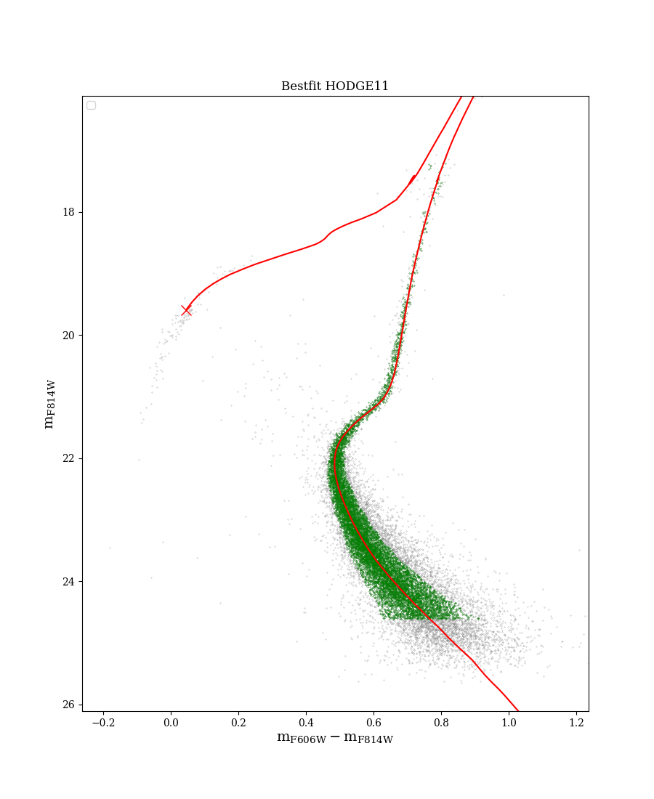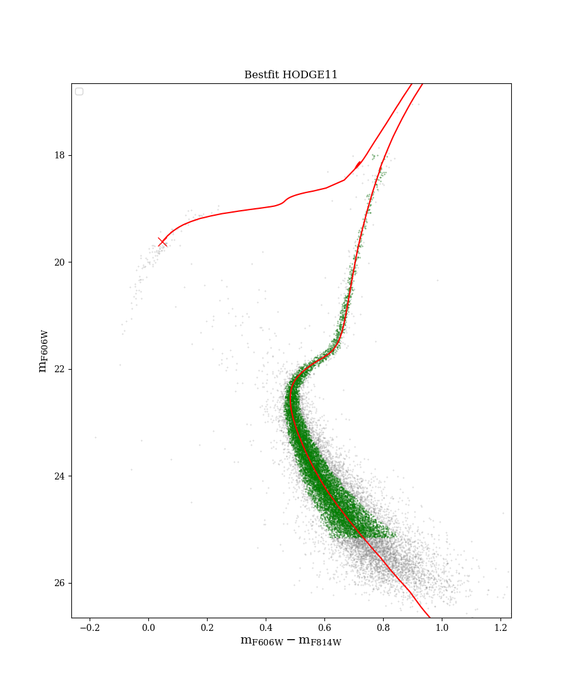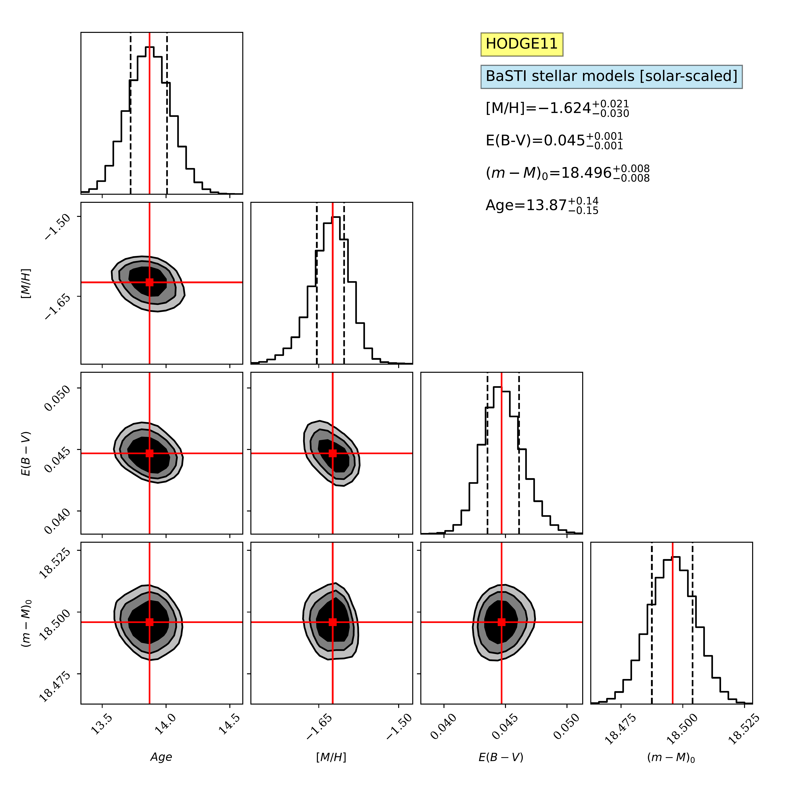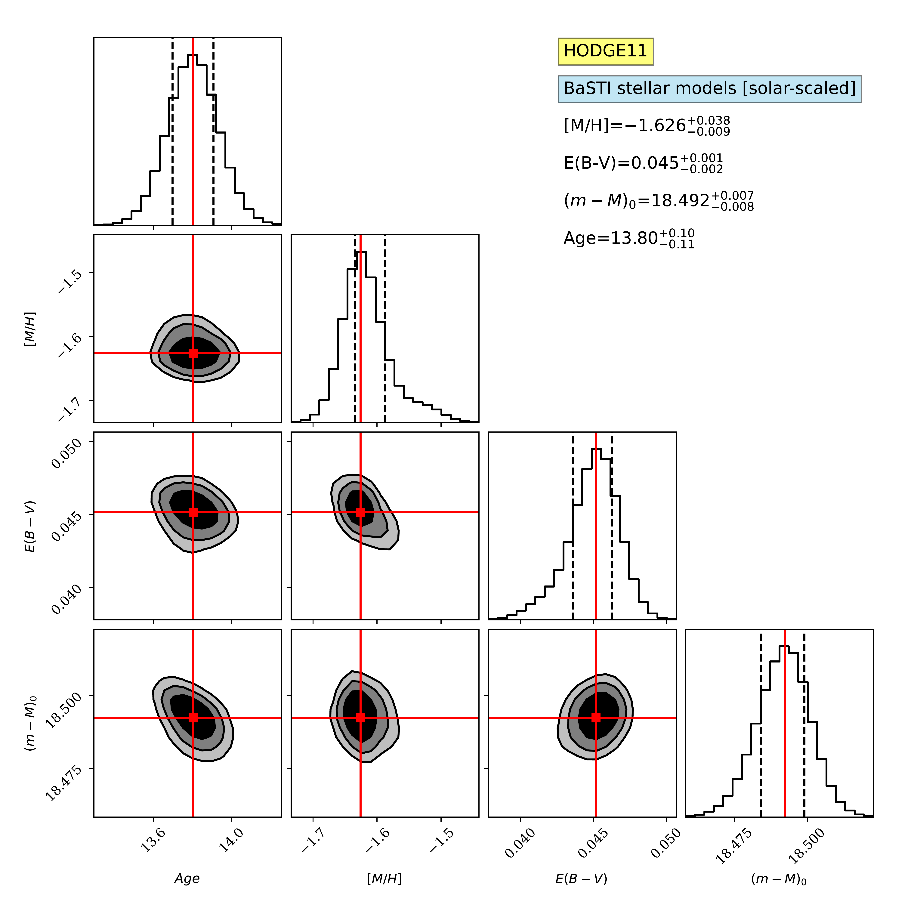

**Figure 6. -** Isochrone fitting results for Hodge 11. (a) Best-fit isochrone model in the $m_{\rm F814W}$ vs. $m_{\rm F606W}-m_{\rm F814W}$ CMD. (b) Best-fit isochrone model in the $m_{\rm F606W}$ vs. $m_{\rm F606W}-m_{\rm F814W}$ CMD.
        The red X-symbol shown in both CMDs corresponds to the location of the zero-age horizontal branch.
        (c): Corner plot of the posterior probability distributions of pairwise model parameters for the $m_{\rm F814W}$ vs. $m_{\rm F606W}-m_{\rm F814W}$ CMD. The best-fit parameters are quoted in the labels.
        (d): Corner plot of the posterior probability distributions of pairwise model parameters for the $m_{\rm F606W}$ vs. $m_{\rm F606W}-m_{\rm F814W}$ CMD. The best-fit parameters are quoted in the labels.
         (*fig:hodge11_isofit*)

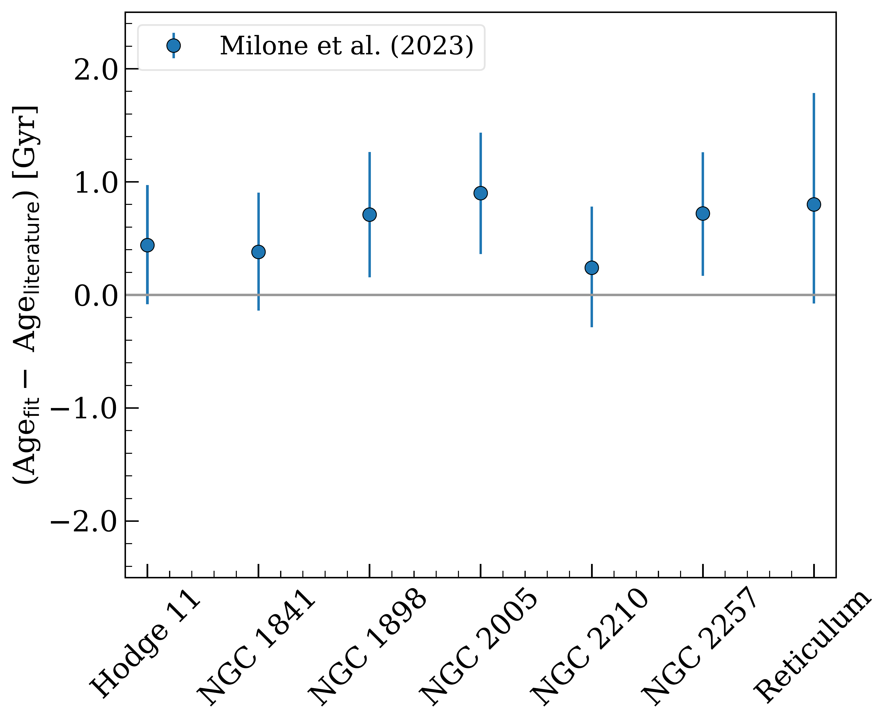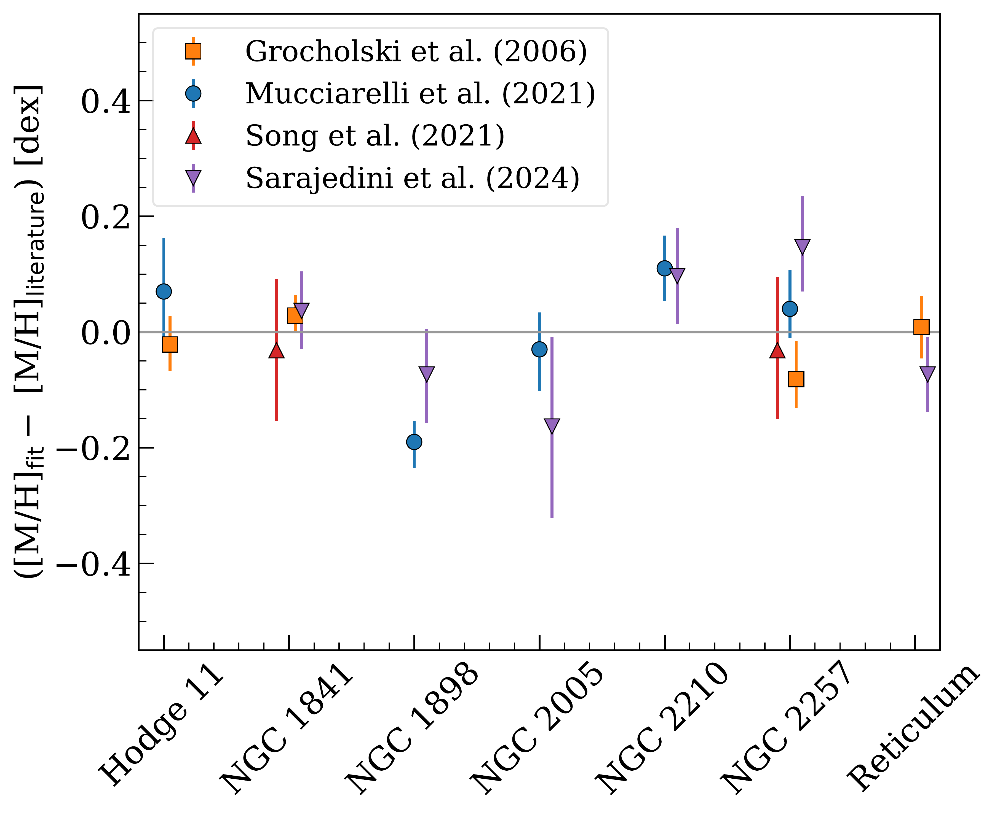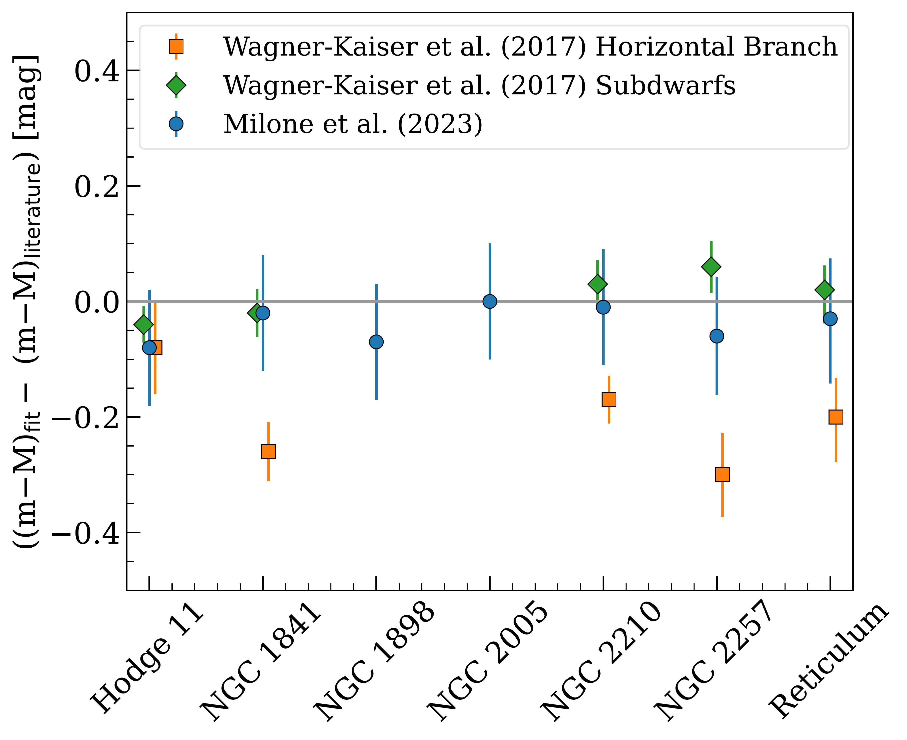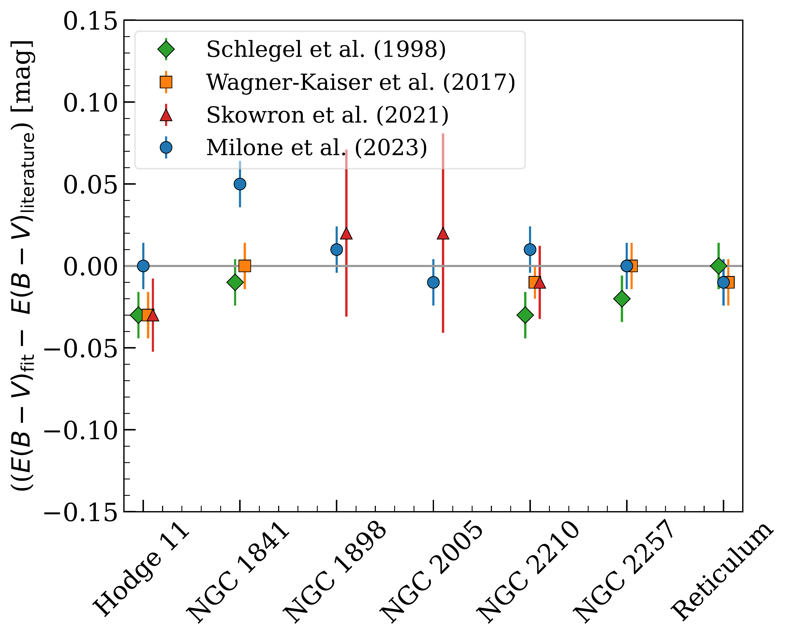

**Figure 4. -** Comparison between the cluster parameters derived in this work and literature values. Top-left panel: Differences between the measured cluster ages and ages derived by [Milone, Cordoni and Marino (2023)](). Top-right panel: Differences between the inferred metallicity and the results from [Grocholski, et. al (2006)](), [Mucciarelli, Massari and Minelli (2021)](), [Song, Mateo and Bailey (2021)]() and [ and Sarajedini (2024)]().
Bottom-left panel: Differences between the distance modulus derived in this study and the measurements from [Wagner-Kaiser, Mackey and Sarajedini (2017)]() and [Milone, Cordoni and Marino (2023)](). Bottom-right panel: Differences between the derived $E(B-V)$ values and the reddenings from [Wagner-Kaiser, Mackey and Sarajedini (2017)]() and [Milone, Cordoni and Marino (2023)](), as well as the resulting values from the reddening maps from [Schlegel, Finkbeiner and Davis (1998)]() and [Skowron, Skowron and Udalski (2021)]().
 (*fig:clusters_compar*)

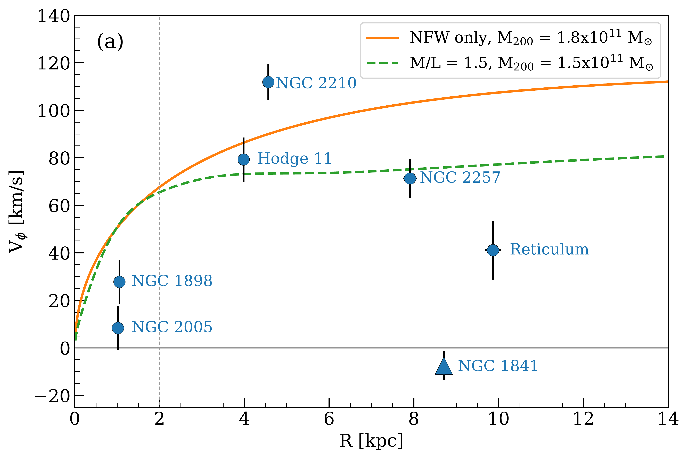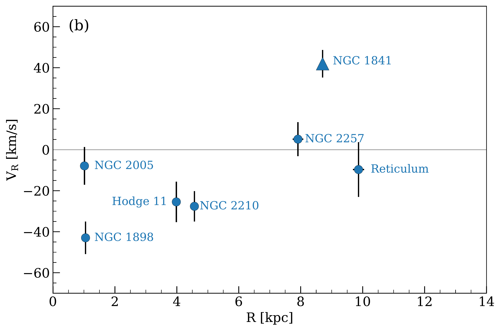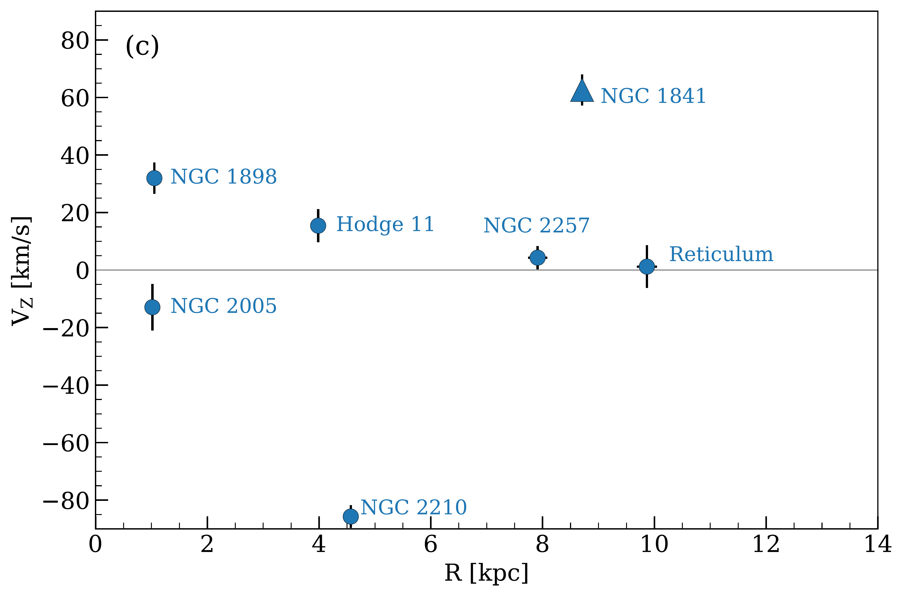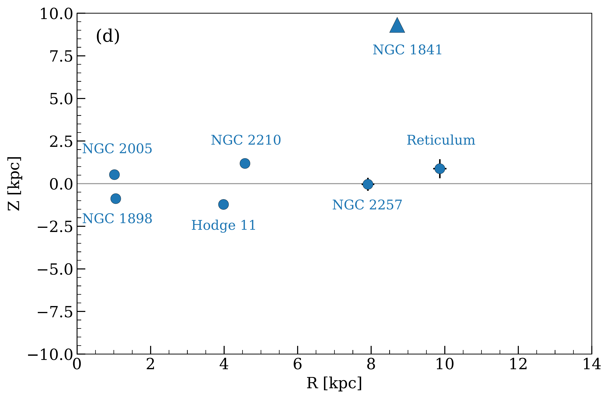

**Figure 5. -** Outline of the clusters' velocities and positions within the LMC. In each panel, NGC 1841 is highlighted with triangle symbol. Panel (a) shows the tangential velocity V$_{\phi}$ as a function of the radial distance from the LMC centre R. Also shown are model circular velocities resulting from a pure NFW profile (orange solid line) and a model composed of a dark matter halo and a stellar disc and bar (green dashed line). The size of the stellar bar is indicated by the vertical dashed line. The radial velocity V$_{R}$ as a function of R is presented in panel (b). Panel (c) illustrates the out-of-plane velocity V$_{Z}$ as a function of R and panel (d) shows the vertical distance from the plane Z as a function of R.
 (*fig:clusters_kinematics*)

