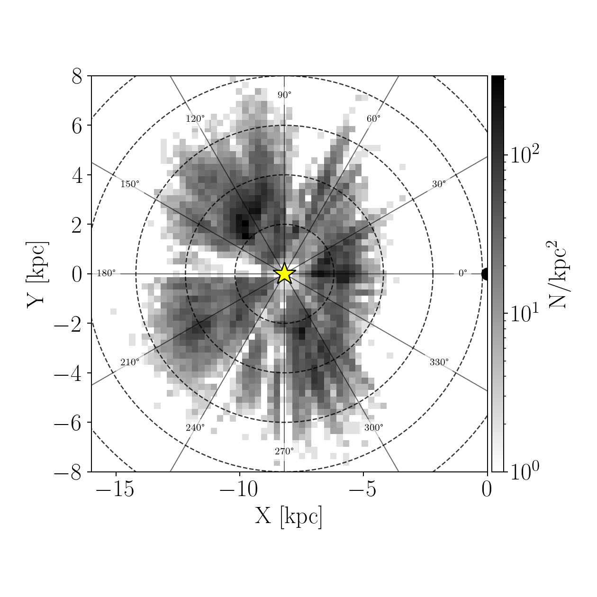
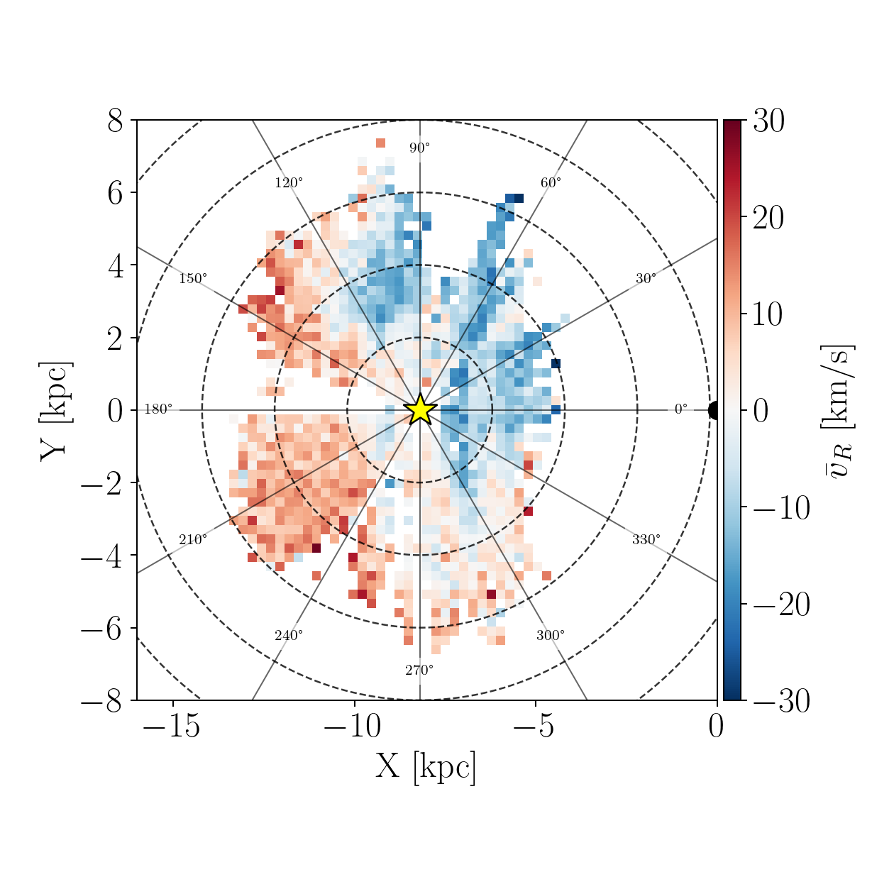
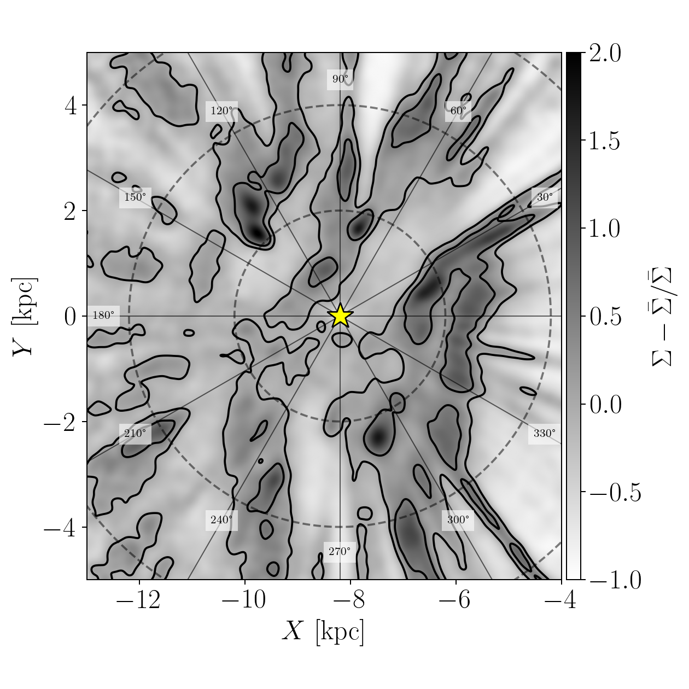
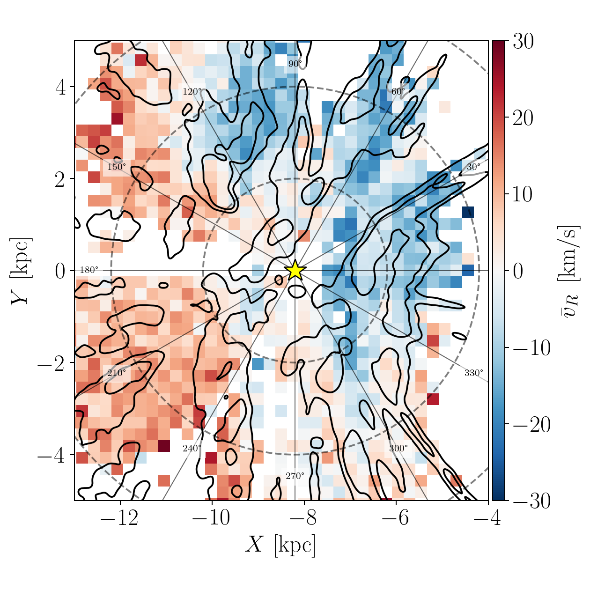
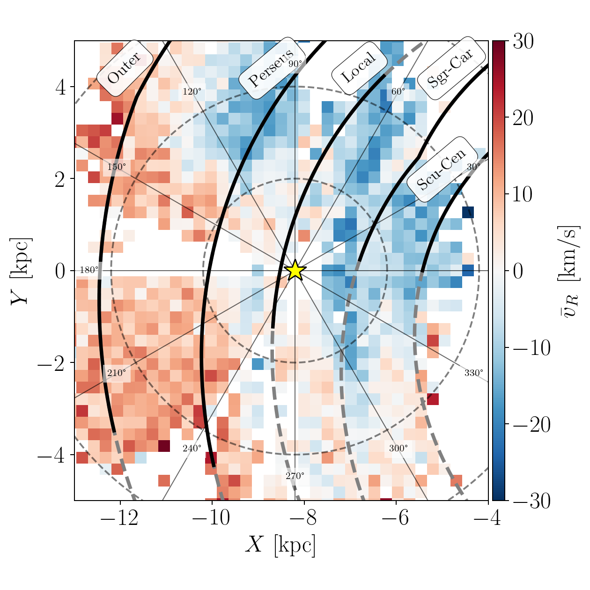
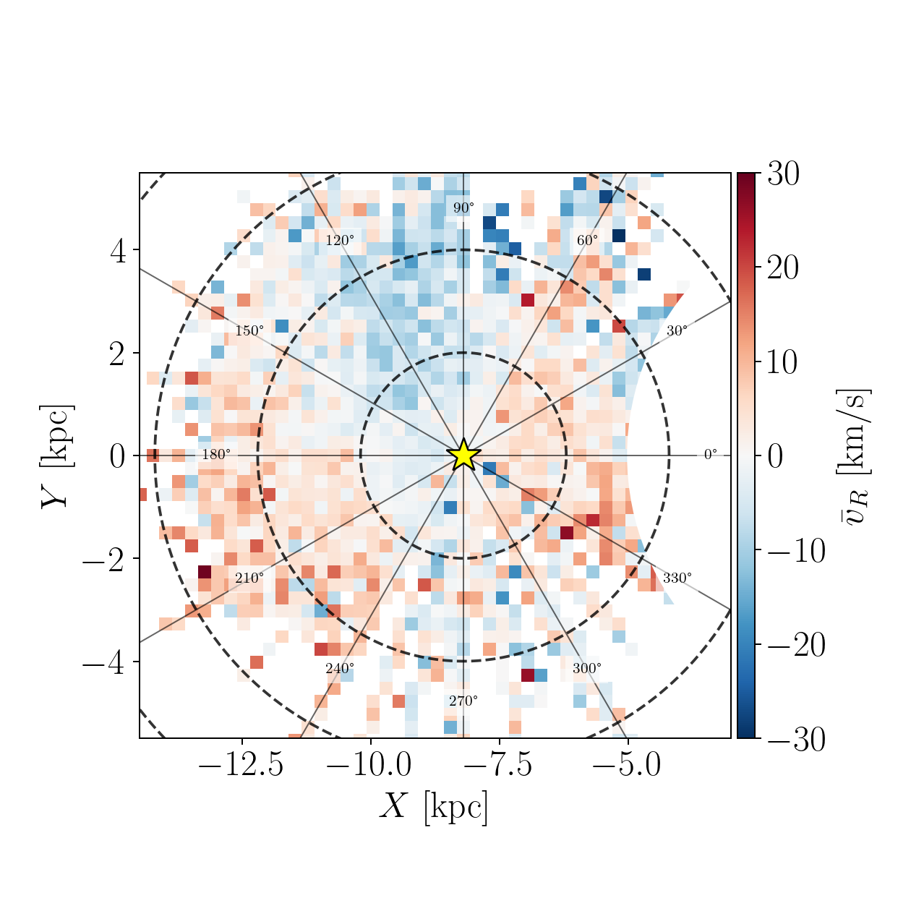

$\newcommand{\ensuremath}{}$
$\newcommand{\xspace}{}$
$\newcommand{\object}[1]{\texttt{#1}}$
$\newcommand{\farcs}{{.}''}$
$\newcommand{\farcm}{{.}'}$
$\newcommand{\arcsec}{''}$
$\newcommand{\arcmin}{'}$
$\newcommand{\ion}[2]{#1#2}$
$\newcommand{\textsc}[1]{\textrm{#1}}$
$\newcommand{\hl}[1]{\textrm{#1}}$
$\newcommand{\footnote}[1]{}$

# The large-scale kinematics of young stars in the Milky Way disc: first results from SDSS-V

<mark>Appeared on: 2025-09-15</mark> -  _13 pages (13 figures) + 3 pages of appendices (5 figures). Under review at A&A; revised after first referee comments_

E. Zari, et al. -- incl., <mark>H.-W. Rix</mark>

**Abstract:** We present a first large-scale kinematic map of $\sim$ 50,000 young OB stars ( $T_{\rm eff} \geq 10,000$ K), based on BOSS spectroscopy from the Milky Way Mapper OB program in the ongoing Sloan Digital Sky Survey V (SDSS-V). Using photogeometric distances, line-of-sight velocities and Gaia DR3 proper motions, we map 3D Galactocentric velocities across the Galactic plane to $\sim$ 5 kpc from the Sun, with a focus on radial motions ( $v_R$ ). Our results reveal mean radial motion with amplitudes of $\pm 30$ km/s that are coherent on kiloparsec scales, alternating between inward and outward motions. These $\bar{v}_R$ amplitudes are considerably higher than those observed for older, red giant populations. These kinematic patterns show only a weak correlation with spiral arm over-densities. Age estimates, derived from MIST isochrones, indicate that 85 \% of the sample is younger than $\sim300$ Myr and that the youngest stars ( $\le 30$ Myr) align well with density enhancements. The age-dependent $\bar{v}_R$ in Auriga makes it plausible that younger stars exhibits different velocity variations than older giants. The origin of the radial velocity features remains uncertain, and may result from a combination of factors,  including spiral arm dynamics, the Galactic bar, resonant interactions, or phase mixing following a perturbation. The present analysis is based on approximately one-third of the full target sample. The completed survey will enable a more comprehensive investigation of these features and a detailed dynamical interpretation.

**Figure 12. -** Distribution of the Hot Star Sample in the Galactic plane. The left panel shows the density distribution of the sources. The right panel shows the distribution of sources colour-coded by their Galactocentric radial velocity (computed as described in the text). In both panels, the Sun is in $X,Y =$(-8.2,0) kpc, and it is indicated by the yellow star. The Galactic centre is in $X,Y =$(0,0) kpc. The dashed circles have radii of 2, 4, 6, 8, and 10 kpc. The solid lines indicate constant Galactic longitudes. (*fig:map-galcenrv*)

**Figure 14. -** Comparison between the density distribution of OB stars, the spiral arm model from  \cite{Reid2019}, and the radial velocity asymmetries.  In the left panel and central panels, the solid black contours  represent the  0, and 0.5 density contrast levels. In the right panel, the spiral arms are named following \cite{Reid2019}: Outer arm; Perseus arm; Local arm;  Sagittarius–Carina arm; Scutum–Centaurus arm. In the three panels, the yellow star indicates the Sun's position in $X,Y = -8.2,0$ kpc, and the Galactic centre is located in $X,Y = 0,0$ kpc. The dashed lines represent circle radii of  2, 4, and 6 kpc.  The solid lines indicate constant Galactic longitudes. (*fig:compare_rv*)

**Figure 7. -** Distribution of red giant stars in the Milky Way disc from APOGEE DR17. The red giant stars are colour-coded by their average Galactocentric radial velocity  The location of the Sun is indicated by  the yellow star. The dashed black lines mark concentric circles at $\Delta R=2$ kpc.  The solid lines indicate constant Galactic longitudes. The region within 5 kpc from the Galactic centre is masked as the stellar motions in that region are influenced by the bar. (*fig:apogeeDR17*)

