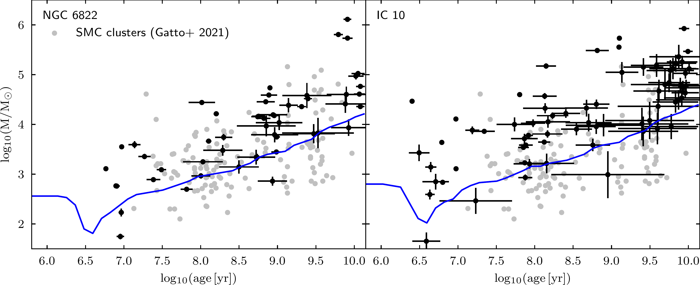
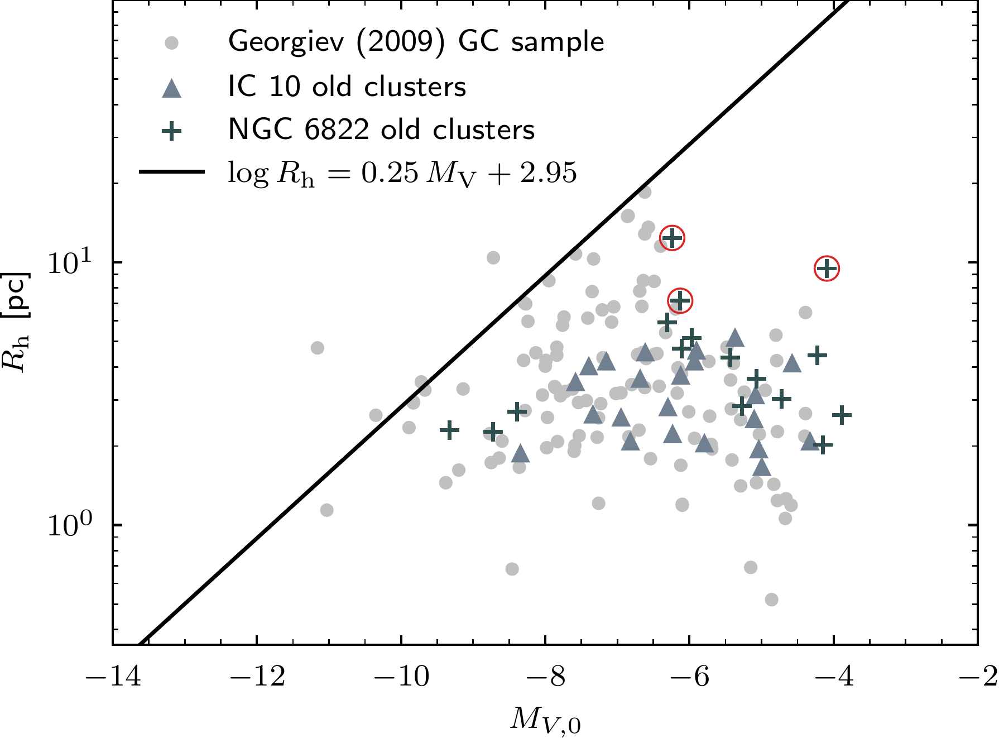

$\newcommand{\ensuremath}{}$
$\newcommand{\xspace}{}$
$\newcommand{\object}[1]{\texttt{#1}}$
$\newcommand{\farcs}{{.}''}$
$\newcommand{\farcm}{{.}'}$
$\newcommand{\arcsec}{''}$
$\newcommand{\arcmin}{'}$
$\newcommand{\ion}[2]{#1#2}$
$\newcommand{\textsc}[1]{\textrm{#1}}$
$\newcommand{\hl}[1]{\textrm{#1}}$
$\newcommand{\footnote}[1]{}$
$\newcommand{\orcid}[1]$
$\newcommand{\arraystretch}{1.4}$

# $\Euclid$: Early Release Observations -- The star cluster systems of the Local Group dwarf galaxies IC 10 and NGC 6822$\thanks{This paper is published on     behalf of the Euclid Consortium}$

<mark>Appeared on: 2025-09-15</mark> - 

J. M. Howell, et al. -- incl., <mark>K. Jahnke</mark>

**Abstract:** Star clusters are valuable indicators of galaxy evolution, offering insights into the buildup of stellar populations across cosmic time. Understanding the intrinsic star cluster populations of dwarf galaxies is particularly important given these systems' role in the hierarchical growth of larger systems.  We use data from $\Euclid$ 's Early Release Observation programme to study star clusters in two star-forming dwarf irregular galaxies in the Local Group, NGC 6822 and IC 10 [ $M_{\star}\sim$ (1--4) $\times10^8 M_{\odot}$ ] . With $\Euclid$ , star clusters are resolved into individual stars across the main bodies and haloes of both galaxies. Through visual inspection of the $\IE$ images, we uncover 30 new star cluster candidates in NGC 6822 and 16 in IC 10, ranging from compact to diffuse extended clusters. We compile and re-evaluate previously identified literature candidates, resulting in final combined catalogues of 52 (NGC 6822) and 71 (IC 10) cluster candidates with confidence-based classifications. We present homogeneous photometry in $\IE$ , $\YE$ , $\JE$ , and $\HE$ , and in archival $_ UBVRI_$ data, alongside size measurements and properties derived from the SED-fitting code \texttt{BAGPIPES} . Through synthetic cluster injection, we conclude our sample is ${\sim}50\%$ complete to $M \lesssim 10^3 {M}_{\odot}$ for ages $\lesssim100 \rm{Myr}$ , and to $M \lesssim 3\times10^4 {M}_{\odot}$ for ages of ${\sim}10 \rm{Gyr}$ . We find that IC 10 has more young clusters than NGC 6822, and its young clusters extend to higher masses, consistent with its starburst nature.  We find several old massive ( $\gtrsim10^5 M_{\odot}$ ) clusters in both dwarfs, including an exceptional cluster in NGC 6822's outskirts with a mass of $1.3 \times 10^6 M_{\odot}$ , nearly twice as massive as any other old cluster in either galaxy.  In NGC 6822, we also identify a previously undetected, old, and extended cluster ( $R_{\mathrm{h}} = 12.4 \pm 0.11 \mathrm{pc}$ ). Using well-defined criteria, we identify 11 candidate GCs in NGC 6822 and eight in IC 10.  Both galaxies have high specific frequencies ( $S_{\rm N}$ ) for their luminosities but remain consistent with the known GC scaling relationships in the low-luminosity regime.

**Figure 14. -** Examples of old and young clusters across NGC 6822, both previously found and new from this study, showcased alongside an RGB image of the \Euclid data displaying its full FoV. \IE, \YE, and \HE are the blue, green, and red channels, respectively. Each cutout is ${\sim}44$ pc on the side in the \IE band, displayed in log scale. The zoom-in region is roughly $16$\farcm$5 \times 13$\farcm$5$($2.5 \text{kpc} \times 2  \text{kpc}$). The top row includes the GCs SC7 (ESCC-NGC6822-08) and SC5 (ESCC-NGC6822-06), the middle row shows the cluster Hubble-VI (ESCC-NGC6822-01), and the bottom row features a newly identified extended cluster candidate, ESCC-NGC6822-27. (*fig:example_clusts*)

**Figure 19. -** Masses as a function of age as derived by \texttt{BAGPIPES} for the star clusters in NGC 6822 (left) and IC 10 (right). The blue line shows the 50\% completeness limit in the inner regions. Also plotted in grey is the sample of SMC clusters from \citet{Gatto2021}. (*fig:age_vs_mass*)

**Figure 7. -** Half-light radii as a function of absolute _ V_-band magnitude for the old cluster sample, and for the sample of GCs from \citep{Georgiev2009}. The empirical relation  $\logten(R_{\rm h}/{\rm pc}) = 0.25  {M_V} + 2.95$\citep{Mackey2005}, which defines the upper envelope of MW GCs, is overplotted. Small red circles mark the three most extended clusters in NGC 6822.   (*fig:Rh_vs_Vmag*)

