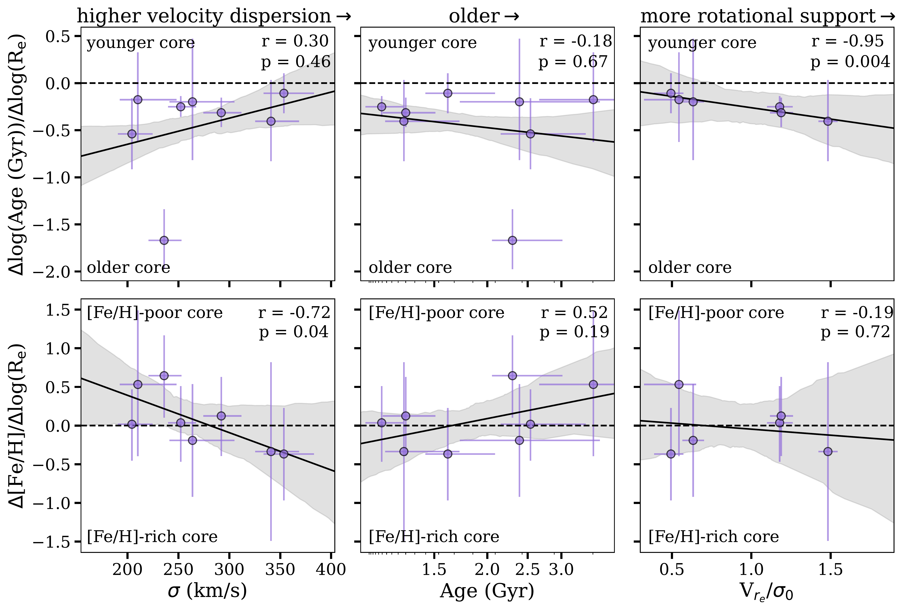
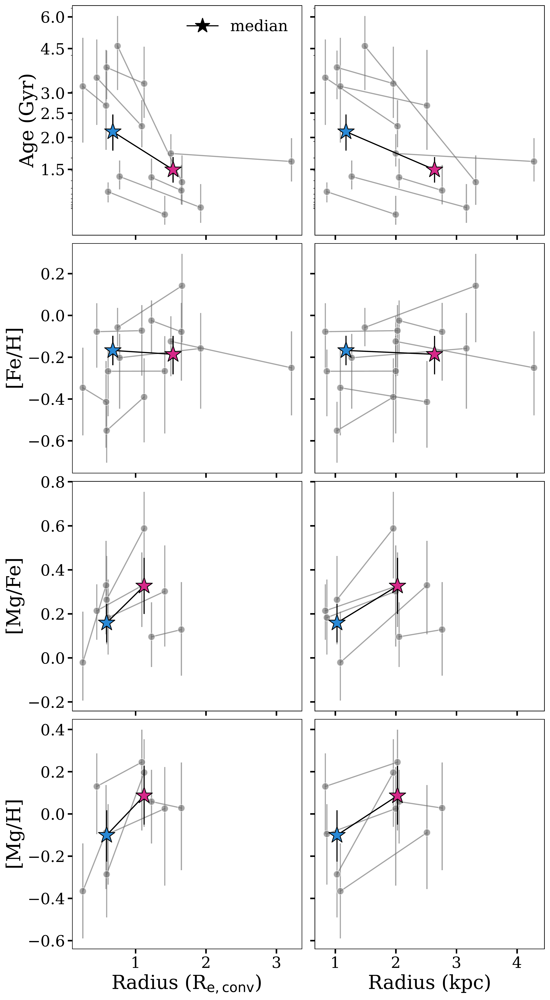
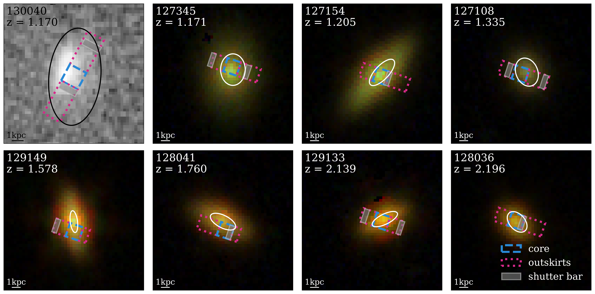

$\newcommand{\ensuremath}{}$
$\newcommand{\xspace}{}$
$\newcommand{\object}[1]{\texttt{#1}}$
$\newcommand{\farcs}{{.}''}$
$\newcommand{\farcm}{{.}'}$
$\newcommand{\arcsec}{''}$
$\newcommand{\arcmin}{'}$
$\newcommand{\ion}[2]{#1#2}$
$\newcommand{\textsc}[1]{\textrm{#1}}$
$\newcommand{\hl}[1]{\textrm{#1}}$
$\newcommand{\footnote}[1]{}$

# Building up _JWST_-SUSPENSE: inside-out quenching at cosmic noon from age, Fe-, and Mg-abundance gradients

<mark>Appeared on: 2025-09-17</mark> -  _13 pages, 6 figures (excluding appendices); submitted to A&A_

C. M. Cheng, et al. -- incl., <mark>A. d. Graaff</mark>

**Abstract:** Spatially resolved stellar populations of massive, quiescent galaxies at cosmic noon provide powerful insights into star-formation quenching and stellar mass assembly mechanisms.  Previous photometric work has revealed that the cores of these galaxies are redder than their outskirts.  However, spectroscopy is needed to break the age-metallicity degeneracy and uncover the driver of these colour gradients.  Here, we derive age and elemental abundance gradients for 8 distant ( $1.2 \lesssim z \lesssim 2.2$ ), massive ( $10.3\lesssim\log({\rm M}_*/{\rm M}_\odot)\lesssim 11.1$ ), quiescent galaxies, by fitting full-spectrum models to ultra-deep NIRSpec-MSA spectroscopy from the _JWST_ -SUSPENSE survey.  We find that these galaxies have negative age, positive [ Mg/H ] and [ Mg/Fe ] , and flat [ Fe/H ] gradients, implying that galaxy cores are older and Mg-deficient compared to galaxy outskirts.  The age gradients indicate inside-out quenching, while the Mg-deficient cores suggest rapid gas expulsion as the central quenching mechanism.  Thus, galaxy cores formed faster and quenched more efficiently than their outskirts.  In this scenario, however, our [ Fe/H ] and [ Mg/Fe ] gradients are still puzzling.  Our results contrast lower-redshift studies, which find flat age and [ Mg/Fe ] gradients and negative metallicity gradients.  Additionally, we find a positive trend between age gradients and rotational support, and marginal trends between gradients and galaxy velocity dispersions and ages.  We discuss our findings in the context of galaxy growth scenarios, including minor mergers and progenitor bias, and the possible occurrence of different quenching mechanisms across redshift.  With this work, we present the first stellar population gradients from NIRSpec-MSA spectroscopy, in the largest current sample of distant, quiescent galaxies.

**Figure 5. -** Spatially resolved age and [Fe/H] gradients, normalized by $R_{\rm e}$(see Section \ref{sec:radii}), as a function of galaxy parameters.  We show the age gradients in the top row and the [Fe/H] gradients in the bottom row.  The outlying object with a strongly negative age gradient is 127154.  We show the integrated velocity dispersion ($\sigma$, from our alf$\alpha$ fits to the integrated spectra) in the left column, the integrated age (from our integrated alf$\alpha$ fits) in the middle, and $V_{r_{\rm e}}/\sigma_0$(measured in \citealt{Slob_2025}) on the right.  Horizontal dashed lines indicate where flat gradients would lie.  We perform a linear fit to the points in each panel, shown by the solid lines, with $1\sigma$ bootstrapped uncertainties indicated by the shaded regions. (*fig:grads_vs_params*)

**Figure 1. -** Spatially-resolved stellar population parameters derived from our alf$\alpha$ full spectrum fits.  In the left column, we plot our measured parameters as a function of de-projected radius in units of $R_{\rm e}$(determined as described in Section \ref{sec:radii}).  In the right column, we plot our measured parameters as a function of de-projected radius in units of kpc.  We show age in the top row, [Fe/H] in the second row, [Mg/Fe] in the third row, and [Mg/H] in the bottom row.  In each panel, we show the measured parameters for each individual galaxy as points connected by lines.  We show the median parameters as stars connected by lines. (*fig:params_vs_radius*)

**Figure 2. -** Colour image cutouts of the 8 distant, quiescent galaxies in our sample.  Seven galaxies have NIRCam imaging, which we combine into RGB images here.  Galaxy 130040 does not have NIRCam imaging, so we show a cutout of the COSMOS _HST_/ACS F814W image (\citealt{COSMOS_ACS_mosaics, Scoville_2007}, note that this image is rotated by 90 degrees compared to the NIRCam images).  We highlight the regions that we combine for the core and outskirt spectra in blue and pink, respectively (see Section \ref{sec:extraction}).  We also indicate where shutter bars lie within these core and outskirt regions with shaded rectangles.  We indicate $1 R_{\rm e}$ in convolved space for each galaxy with an ellipse (see Section \ref{sec:radii}). (*fig:image_cutout_overview*)

