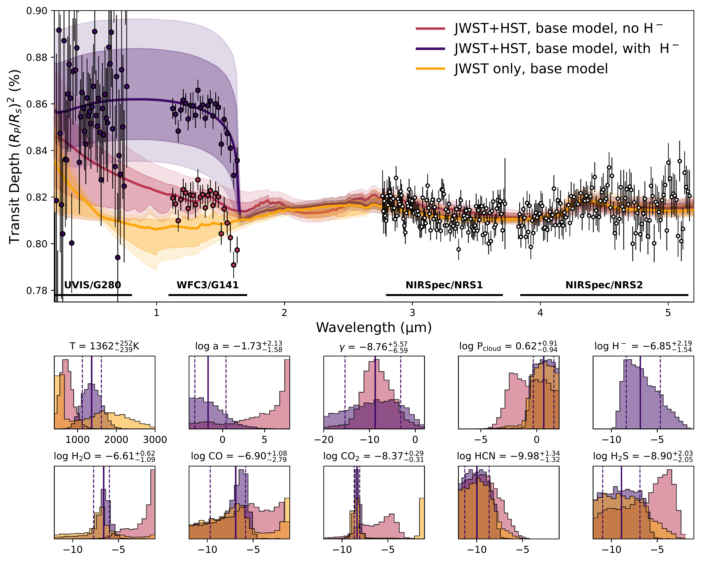
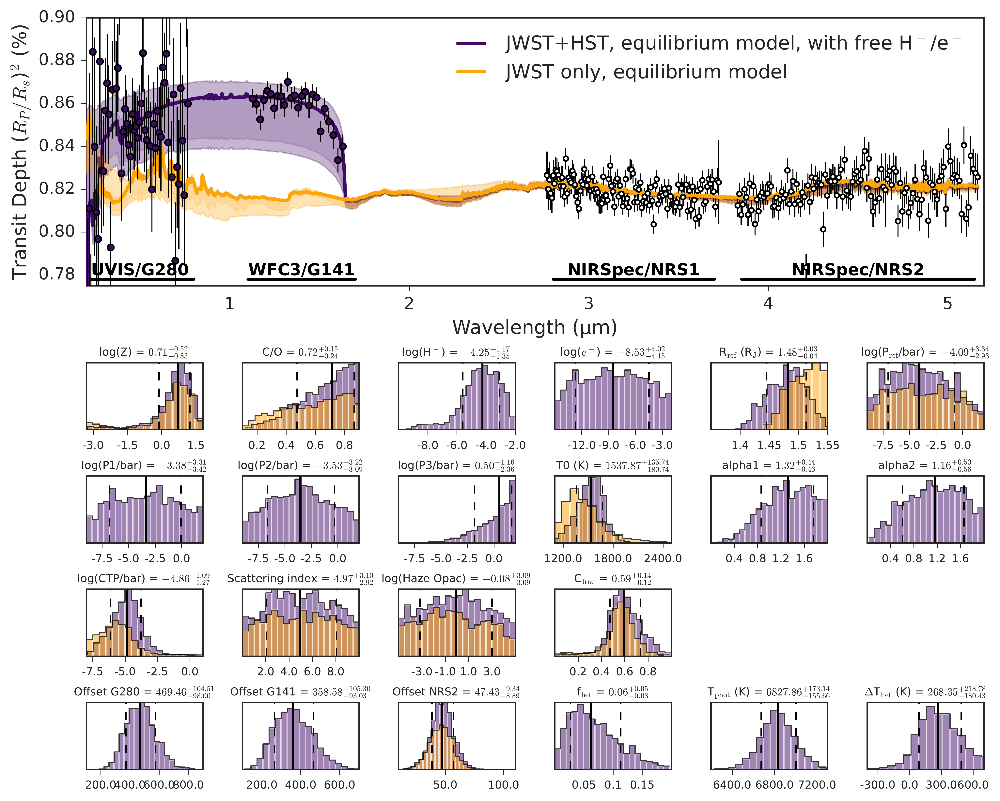

$\newcommand{\ensuremath}{}$
$\newcommand{\xspace}{}$
$\newcommand{\object}[1]{\texttt{#1}}$
$\newcommand{\farcs}{{.}''}$
$\newcommand{\farcm}{{.}'}$
$\newcommand{\arcsec}{''}$
$\newcommand{\arcmin}{'}$
$\newcommand{\ion}[2]{#1#2}$
$\newcommand{\textsc}[1]{\textrm{#1}}$
$\newcommand{\hl}[1]{\textrm{#1}}$
$\newcommand{\footnote}[1]{}$
$\newcommand{\Rsun}{R_{\odot}}$
$\newcommand{\Msun}{M_{\odot}}$
$\newcommand{\Rjup}{R_{\mathrm{J}}}$
$\newcommand{\Mjup}{M_{\mathrm{J}}}$
$\newcommand{\Rp}{R_{\mathrm{P}}}$
$\newcommand{\Mp}{M_{\mathrm{P}}}$
$\newcommand{\Rs}{R_{\mathrm{*}}}$
$\newcommand{\Ms}{R_{\mathrm{*}}}$
$\newcommand{\Teq}{T_{\mathrm{eq}}}$
$\newcommand{\Teff}{T_{\mathrm{eff}}}$
$\newcommand{◦ee}{^{\circ}}$
$\newcommand{\obliquity}{|\lambda|}$
$\newcommand{\mystar}{KELT-7\xspace}$
$\newcommand{\myplanet}{KELT-7 b\xspace}$
$\newcommand{\eureka}{\texttt{Eureka!}\xspace}$
$\newcommand{\tiberius}{\texttt{Tiberius}\xspace}$
$\newcommand{\exoticjedi}{\texttt{ExoTiC-JEDI}\xspace}$
$\newcommand{\pRT}{\texttt{pRT}\xspace}$
$\newcommand{\poseidon}{\texttt{POSEIDON}\xspace}$
$\newcommand{\nemesispy}{\texttt{NEMESISPY}\xspace}$
$\newcommand{\nemesis}{\texttt{NEMESIS}\xspace}$
$\newcommand{\arraystretch}{1.5}$
$\newcommand{\arraystretch}{1.2}$
$\newcommand{\arraystretch}{1.3}$

# BOWIE-ALIGN: Weak spectral features in KELT-7b's JWST NIRSpec/G395H transmission spectrum imply a high cloud deck or a low-metallicity atmosphere

<mark>Appeared on: 2025-09-17</mark> -  _22 pages, 16 main figures, 7 tables, accepted for publication in MNRAS_

<mark>E.-M. Ahrer</mark>, et al. -- incl., <mark>P. Mollière</mark>

**Abstract:** Hot Jupiters and their atmospheres are prime targets for transmission spectroscopy due to their extended atmospheres and the corresponding large signal-to-noise, providing the best possible constraints for the atmospheric carbon-to-oxygen (C/O) ratio and metallicity of exoplanets.Within BOWIE-ALIGN, we aim to compare JWST spectra of a sample of orbitally aligned and misaligned hot Jupiters orbiting F-type stars to probe the link between hot Jupiter atmospheres and planet formation history.Here, we present a near-infrared transmission spectrum of the aligned planet KELT-7b using one transit observed with JWST NIRSpec/G395H. We find weak features, only tentative evidence for $\ce{H2O}$ and $\ce{CO2}$ in the atmosphere of KELT-7b. This poses a challenge to constrain the atmospheric properties of KELT-7b and two possible scenarios emerge from equilibrium chemistry and free chemistry retrievals: a high-altitude cloud deck muting all features or an extremely low metallicity atmosphere, respectively.The retrieved C/O ratios from our data reductions range from $0.43 - 0.74$ , while the atmospheric metallicity is suggested to be solar to super-solar ( $1-16 \times$ solar). Although these wide constraints prevent detailed conclusions about KELT-7b's formation history, a solar-to-super-solar metallicity would imply the accretion of solid material during its formation, which is valuable information for the survey's wider goals of understanding the relative importance of gaseous to solid accretion.

**Figure 8. -** Extracted raw spectroscopic light curves (top row) and corresponding residuals (bottom row) of each reduction (columns; $\eureka$, $\exoticjedi$ and $\tiberius$) of $\myplanet$ with NIRSpec/G395H at a resolution of R=400. The white area corresponds to the gap between the two detectors (NRS1 and NRS2). (*fig:light-curves-2d*)

**Figure 11. -** Top: $\poseidon$ free chemistry retrievals comparison between using only JWST data (orange) and in combination with previously published HST data (pink: excluding \ce{H-}; purple: including \ce{H-}). For clarity, we include the WFC/G141 data twice, as the difference in offset retrieved when including \ce{H-} is significant. The colour of the data corresponds to the offset applied from each model. For the UVIS/G280 data we only applied one offset as the uncertainties are relatively large and the offset difference is not as significant. \newline Bottom: The posterior plots for the retrieved species, cloud deck and temperature ($T$), as well as scattering slope parameters for the retrievals with HST data ($\log a, \gamma$). The colours correspond to the individual models, demonstrating that the inclusion of HST data does not provide further constraints for the cloud deck or abundances as the unknown \ce{H-} abundance in combination with the lack of overlapping wavelengths prevents inferences about the continuum of $\myplanet$'s atmosphere. Quoted median values and 1$\sigma$ errors correspond to the posteriors retrieved on the JWST and HST data when including \ce{H-} opacity, shown with the vertical solid and dashed lines. (*fig:appendix_g395h_hst*)

**Figure 16. -** Top: NEMESISPY equilibrium chemistry retrievals comparison between using JWST data in combination with previously published HST data (purple: including \ce{H-} and \ce{e-}) and JWST data only (orange). The colour of the data corresponds to the offset applied from each model. Whilst the retrieval including the HST data was conducted with the G280 dataset held fixed, here we shift the plot such that the offsets are shown relative to NRS1 to facilitate comparison with figure \ref{fig:appendix_g395h_hst}. \newline Bottom: The posterior plots for the metallicity and C:O ratio, H$^-$ and e$^-$, R$_{\mathrm{ref}}$ and P$_{\mathrm{ref}}$; temperature (P1,P2,P2,T0,alpha1,alpha2); cloud properties (cloud top pressure, haze scattering index, haze opacity and cloud fraction); offsets; and stellar parameters (heterogeneity fraction, photospheric temperature, heterogeneity temperature relative to photosphere).  The colours correspond to the individual models, demonstrating that the inclusion of HST data does not provide further constraints for the cloud deck or metallicity. The discrepancy in the retrieved radius is due to the two retrievals referencing the instrument offsets to different baseline instruments (G280 for the full retrieval and NRS1 for the JWST-only retrieval). The offsets for both retrievals are presented relative to NRS1 to aid comparison. (*fig:appendix_g395h_hst_nemesispy*)

