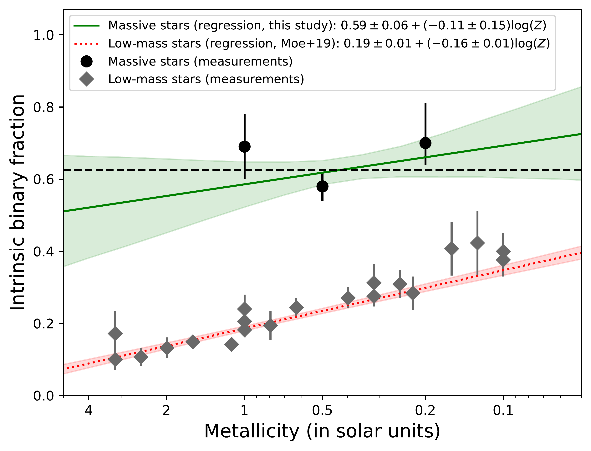
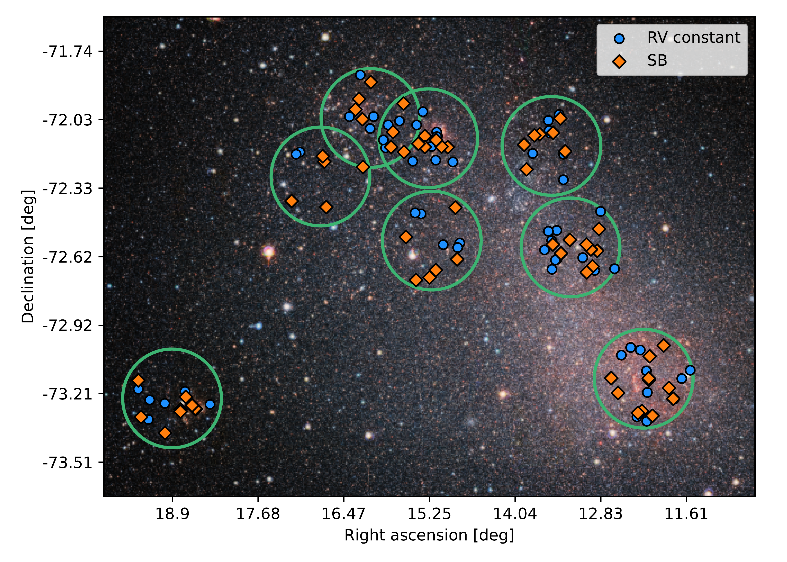
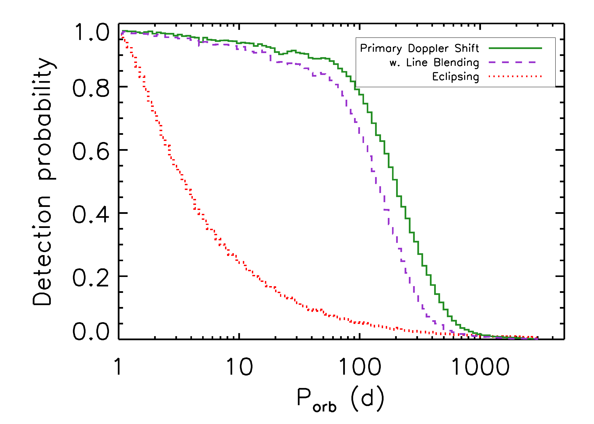

$\newcommand{\ensuremath}{}$
$\newcommand{\xspace}{}$
$\newcommand{\object}[1]{\texttt{#1}}$
$\newcommand{\farcs}{{.}''}$
$\newcommand{\farcm}{{.}'}$
$\newcommand{\arcsec}{''}$
$\newcommand{\arcmin}{'}$
$\newcommand{\ion}[2]{#1#2}$
$\newcommand{\textsc}[1]{\textrm{#1}}$
$\newcommand{\hl}[1]{\textrm{#1}}$
$\newcommand{\footnote}[1]{}$
$\newcommand{\bibinfo}[2]{#2}$
$\newcommand{\eprint}[2][]{\url{#2}}$
$\newcommand{\doi}[1]{\url{https://doi.org/#1}}$
$\newcommand{\giraffe}{{\sc giraffe}}$
$\newcommand{\figurename}{Figure}$
$\newcommand{\figurename}{Extended Data Figure}$
$\newcommand{\kms}{km s^{-1}}$
$\newcommand{\cms}{cm s^{-2}}$
$\newcommand{\ergscm}{erg s^{-1} cm^{-2}}$
$\newcommand{\ergs}{erg s^{-1}}$
$\newcommand{\zsun}{Z_{\odot}}$
$\newcommand{\Zsun}{Z_{\odot}}$
$\newcommand{\lsol}{L_{\odot}}$
$\newcommand{\lsun}{L_{\odot}}$
$\newcommand{\Lsun}{L_{\odot}}$
$\newcommand{\Msun}{M_{\odot}}$
$\newcommand{\msun}{M_{\odot}}$
$\newcommand{\msunyr}{M_{\odot} yr^{-1}}$
$\newcommand{\msol}{M_{\odot}}$
$\newcommand{\rsol}{R_{\odot}}$
$\newcommand{\rsun}{R_{\odot}}$
$\newcommand{\Rsun}{R_{\odot}}$
$\newcommand{\teff}{T_\mathrm{eff}}$
$\newcommand{\logg}{\log g}$
$\newcommand{\mdot}{M_\odot}$
$\newcommand{\vinf}{v_\infty}$
$\newcommand{\vsini}{\varv \sin i}$
$\newcommand{\ha}{H{\alpha}}$
$\newcommand{\halpha}{H{\alpha}}$
$\newcommand{\hb}{H{\beta}}$
$\newcommand{\hbeta}{H{\beta}}$
$\newcommand{\hdelta}{H{\delta}}$
$\newcommand{\hgamma}{H{\gamma}}$
$\newcommand{\l}{\lambda}$
$\newcommand{\hea}{\ion{He}{i}}$
$\newcommand{\heb}{\ion{He}{ii}}$
$\newcommand{\snr}{S/N}$
$\newcommand{\bloem}{BLOeM}$
$\newcommand{\flames}{\sc flames}$
$\newcommand{\aap}{Astron.~Astrophys.}$
$\newcommand{\aaps}{Astron.~Astrophys.~Suppl.}$
$\newcommand{\aapr}{Astron.~Astrophys.~Rev.}$
$\newcommand{\aj}{Astron.~J}$
$\newcommand{\apj}{Astrophys.~J}$
$\newcommand{\apjs}{Astrophys.~J.~Suppl.}$
$\newcommand{\apjl}{Astrophys.~Lett.}$
$\newcommand{\aplett}{Astrophys.~Lett.}$
$\newcommand{\araa}{Ann.~Rev. Astron.~Astroph.}$
$\newcommand{\mnras}{Mon.~Not.~Royal~Ac.~Soc.}$
$\newcommand{\nat}{Nature}$
$\newcommand{\pasp}{Publ. Astron. Soc. Pac.}$
$\newcommand{\pasa}{Publ. Astron. Soc. Australia}$
$\newcommand\url{#1}$
$\newcommand{\urlprefix}{URL }$

# A high fraction of close massive binary stars at low metallicity

<mark>Appeared on: 2025-09-17</mark> -  _32 pages, 12 figures_

H. Sana, et al. -- incl., <mark>S. Shahaf</mark>

**Abstract:** At high metallicity, a majority of massive stars have at least one close stellar companion.The evolution of such binaries is subject to strong interaction processes, heavily impacting the characteristics of their life-ending supernova and compact remnants.For the low-metallicity environments of high-redshift galaxies constraints on the multiplicity properties of massive stars over the separation range leading to binary interaction are crucially missing.  Here we show that the presence of massive stars in close binaries is ubiquitous, even at low metallicity.Using the Very Large Telescope, we obtained multi-epoch radial velocity measurements of a representative sample of 139 massive O-type stars across the Small Magellanic Cloud, which has a metal content of about one fifth of the solar value. We find that 45 \% of them show radial velocity variations which demonstrate that they are members of close binary systems, and predominantly have orbital periods shorter than one year. Correcting for observational biases indicatesthat at least $70^{+11}_{-6}$ \% of the O stars in our sample are in close binaries, and that at least $68^{+7}_{-8}$ \% of all O stars interact with a companion star during their lifetime. We found no evidence supporting a statistically significant trend of the multiplicity properties with metallicity.Our results indicate that multiplicity and binary interactions govern the evolution of massive stars and determine their cosmic feedback and explosive fates.

**Figure 4. -** Metallicity dependence of the intrinsic binary fraction of O-type stars (data: circles, model: green; this work) and of solar-mass stars (data: diamonds, model: red; \cite{Moe2019}).
The best-fit parameters and their standard deviations are computed with a linear regression to the displayed data points and their 1$\sigma$ error-bars. The green and red shaded regions show the 68\%(1$\sigma$) confidence intervals of the regressions to the high-mass and low-mass data, respectively. The slope for massive stars ($-0.11 \pm 0.15$, solid line) is consistent with a constant line (dashed line), but does not allow to reject a slight trend with metallicity at the level of the slope reported for solar-mass stars ($-0.16 \pm0.01$, dotted line).    (*f:reg*)

**Figure 1. -** **Distribution of O-type stars** in the $\bloem$ sample overlaid on a VISTA Y-J-K$_\mathrm{S}$ false-color image of the SMC. Image credit:ESO/VISTA VMC. Large circles show the 8 fields of view of the $\bloem$ campaign. Diamonds indicate detected O-type spectroscopic binaries (SB); circles, RV constant, presumably single stars.  (*f:fov*)

**Figure 2. -** {Binary detection probability} of the $\bloem$ survey for O stars in our sample as a function of the orbital period. The plain green line is computed while considering the Doppler shift of the primary star only (main method). The dashed, purple line also include the line-blending detection bias, which reduces detection at long periods. The dotted, red lines indicates the fraction of the simulated systems that display eclipses according to Equation \ref{eq:eclipses}. Detection probability curves as function of other parameters are provided in Extended Data Figure 2. (*f:detect_p*)

