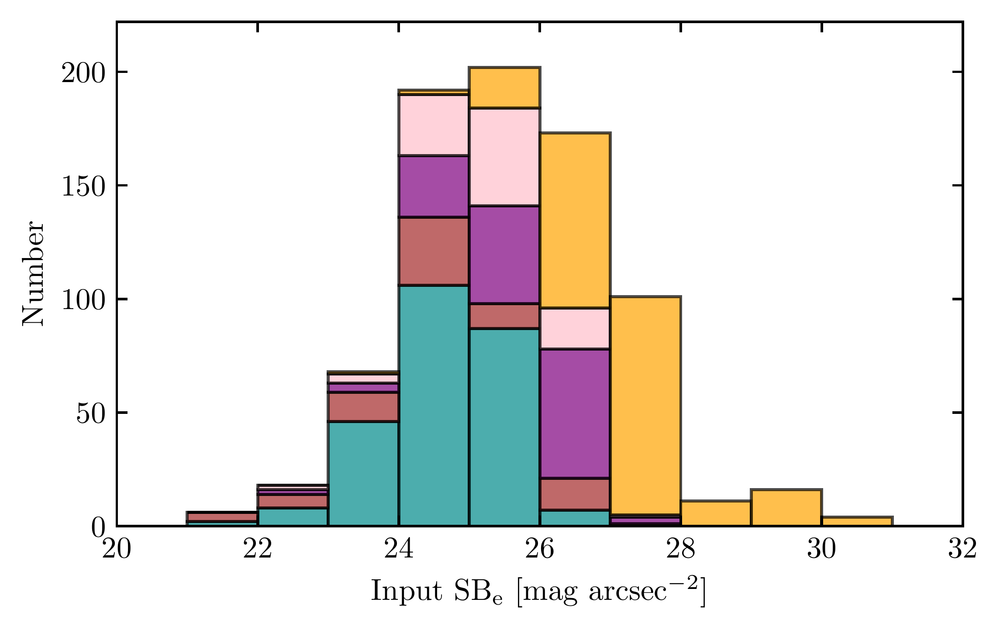
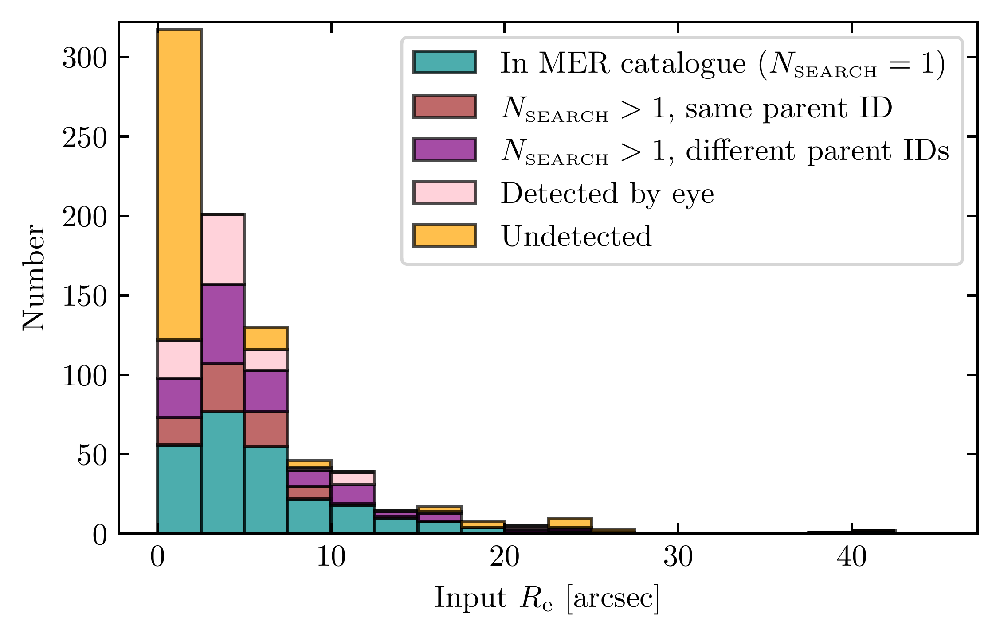
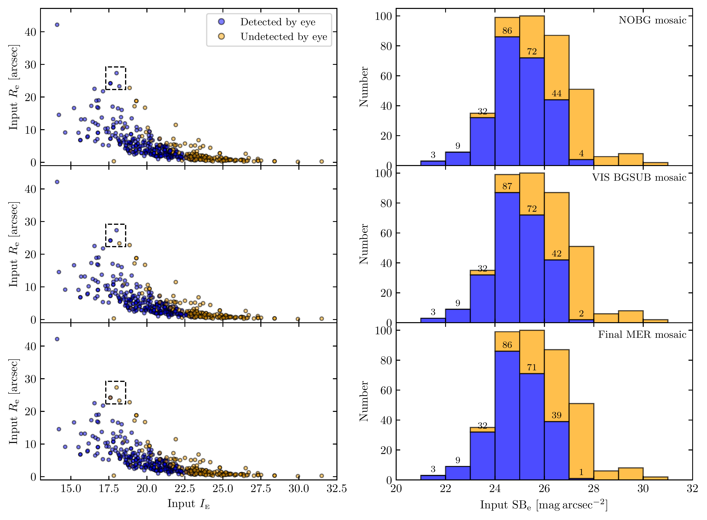
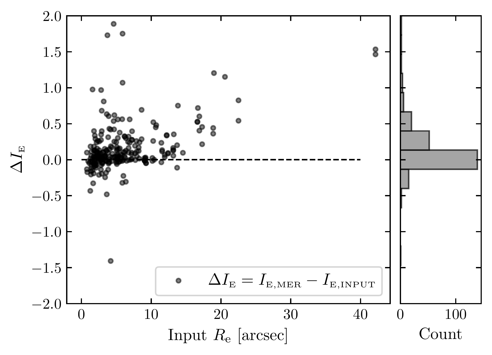

$\newcommand{\ensuremath}{}$
$\newcommand{\xspace}{}$
$\newcommand{\object}[1]{\texttt{#1}}$
$\newcommand{\farcs}{{.}''}$
$\newcommand{\farcm}{{.}'}$
$\newcommand{\arcsec}{''}$
$\newcommand{\arcmin}{'}$
$\newcommand{\ion}[2]{#1#2}$
$\newcommand{\textsc}[1]{\textrm{#1}}$
$\newcommand{\hl}[1]{\textrm{#1}}$
$\newcommand{\footnote}[1]{}$
$\newcommand{\AL}[1]{\textcolor{teal}{#1}}$
$\newcommand{\orcid}[1]$
$\newcommand{\arraystretch}{1.2}$
$\newcommand{\arraystretch}{1.2}$
$\newcommand{\arraystretch}{1.2}$
$\newcommand{\arraystretch}{1.2}$
$\newcommand{\arraystretch}{1.2}$
$\newcommand{\arraystretch}{1.2}$

# $\Euclid$ preparation. Using mock Low Surface Brightness dwarf galaxies to probe Wide Survey detection capabilities

<mark>Appeared on: 2025-09-17</mark> -  _21 pages, 18 figures, 7 tables_

E. Collaboration, et al. -- incl., <mark>K. Jahnke</mark>

**Abstract:** Local Universe dwarf galaxies are both cosmological and mass assembly probes. Deep surveys have enabled the study of these objects down to the low surface brightness (LSB) regime. In this paper, we estimate $\Euclid$ 's dwarf detection capabilities as well as limits of its MERge processing function (MER pipeline), responsible for producing the stacked mosaics and final catalogues. To do this, we inject mock dwarf galaxies in a real Euclid Wide Survey (EWS) field in the VIS band and compare the input catalogue to the final MER catalogue. The mock dwarf galaxies are generated with simple Sérsic models and structural parameters extracted from observed dwarf galaxy property catalogues. To characterize the detected dwarfs, we use the mean surface brightness inside the effective radius ${\rm SB}_{\rm e}$ (in mag arcsec $^{-2}$ ). The final MER catalogues achieve completenesses of $91 \%$ for ${\rm SB}_{\rm e}\in[21,24]$ , and $54 \%$ for ${\rm SB}_{\rm e}\in[24,28]$ . These numbers do not take into account possible contaminants, including confusion with background galaxies at the location of the dwarfs. After taking into account those effects, they become respectively $86 \%$ and $38 \%$ . The MER pipeline performs a final local background subtraction with small mesh size, leading to a flux loss for galaxies with $R_{\rm e}>10\arcsec$ . By using the final MER mosaics and reinjecting this local background, we obtain an image in which we recover reliable photometric properties for objects under the arcminute scale. This background-reinjected product is thus suitable for the study of Local Universe dwarf galaxies. $\Euclid$ 's data reduction pipeline serves as a test bed for other deep surveys, particularly regarding background subtraction methods, a key issue in LSB science.

**Figure 14. -** Histograms of the input ${\rm SB}_{\rm e}$(left panel) and the input $R_{\rm e}$(right panel), colour-coded according to their detection by eye and in the MER catalogue, $N_\sfont{SEARCH}$ being the number of MER sources found by using the search radius $R_{\sfont{SEARCH}}$ for the crossmatch. It is worth noting that the dwarfs in MER catalogues and those with $N_\sfont{SEARCH}>1$ are also detected by eye. In Appendix \ref{AppA}, we also provide the histogram of $\langle \mu_\sfont{I} \rangle$ as defined in \cite{Q1-SP001}. In this plot, all the dwarfs (nucleated or not) are included. (*fig:detect_catalog_histo*)

**Figure 17. -** Input $R_{\rm e}$ as a function of the input total magnitude in $\IE$(left panel) and the corresponding histogram of the input ${\rm SB}_{\rm e}$(right panel), colour-coded according to their detection or non-detection by eye in the three types of products: NOBG, VIS BGSUB, and the final MER mosaic subtracted by VIS and MER backgrounds. Only the non-nucleated dwarfs, at all distances, have been used in this analysis.  We labelled the number of dwarfs that are visually detected in each ${\rm SB}_{\rm e}$ bin. The dashed rectangle shows examples of objects that were detected differently with the various background treatments. (*fig:detection*)

**Figure 8. -** Difference between the \texttt{SourceXtractor++} measured magnitude in the final MER catalogue and the input magnitude of injected dwarfs as a function of $R_{\rm e}$, for all dwarfs detected in the final MER catalogue. (*fig:detect_catalog_2*)

