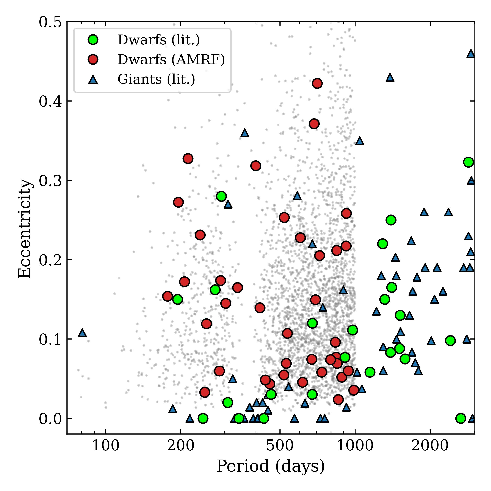
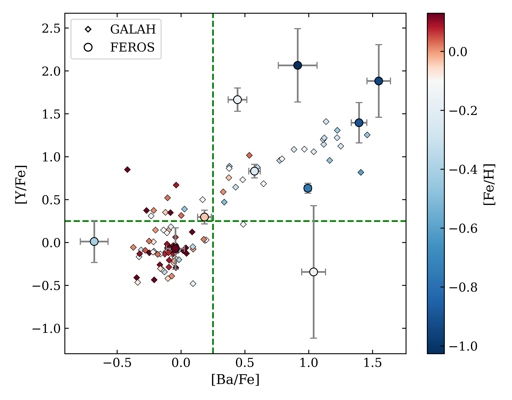
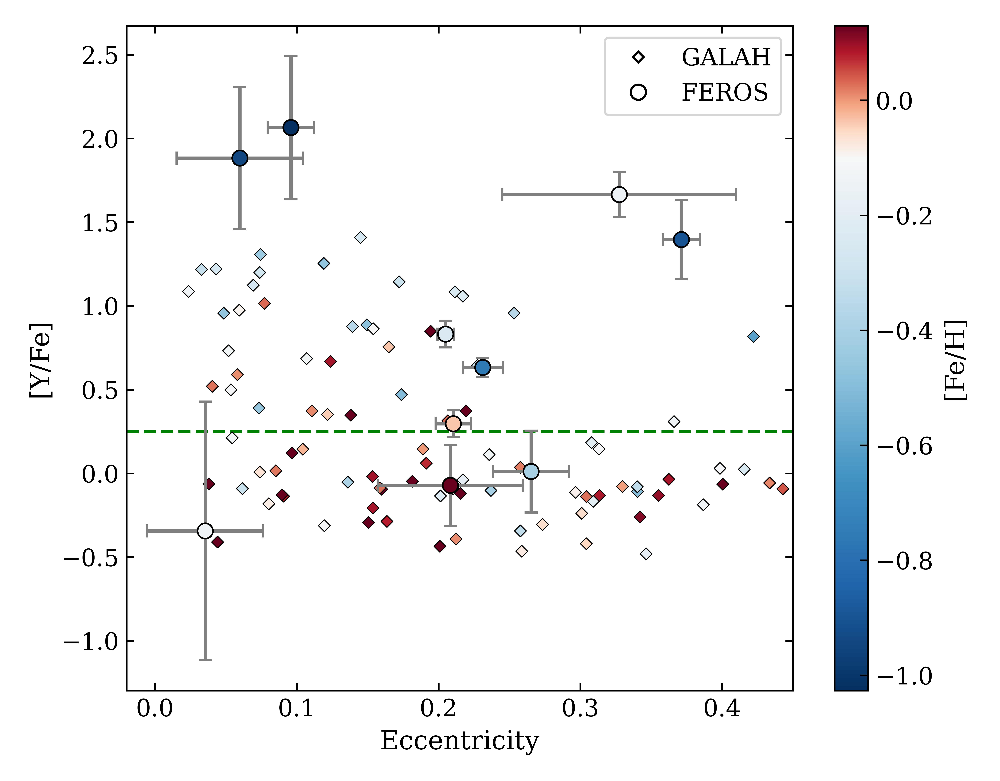
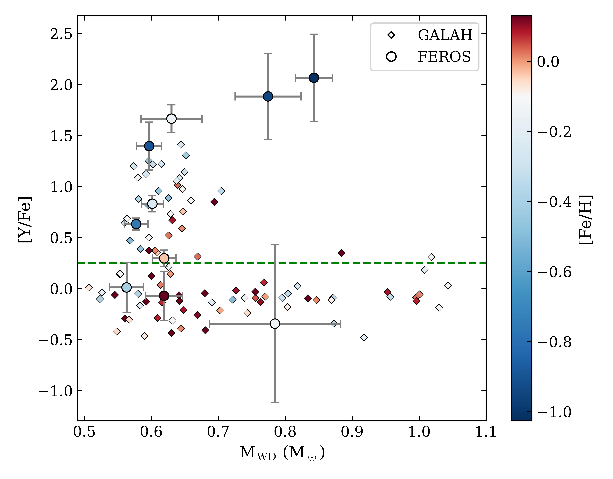

$\newcommand{\ensuremath}{}$
$\newcommand{\xspace}{}$
$\newcommand{\object}[1]{\texttt{#1}}$
$\newcommand{\farcs}{{.}''}$
$\newcommand{\farcm}{{.}'}$
$\newcommand{\arcsec}{''}$
$\newcommand{\arcmin}{'}$
$\newcommand{\ion}[2]{#1#2}$
$\newcommand{\textsc}[1]{\textrm{#1}}$
$\newcommand{\hl}[1]{\textrm{#1}}$
$\newcommand{\footnote}[1]{}$
$\newcommand{\noun}[1]{\textsc{\MakeLowercase{#1}}}$
$\newcommand{\code}{\texttt}$
$\newcommand{\m}[1]{M_#1}$
$\newcommand{\mwd}{M_\text{WD}}$
$\newcommand{\msun}{M_\odot}$
$\newcommand{\bah}{[Ba/H]}$
$\newcommand{\bafe}{[Ba/Fe]}$
$\newcommand{\yh}{[Y/H]}$
$\newcommand{\yfe}{[Y/Fe]}$
$\newcommand{\sH}{[s/H]}$
$\newcommand{\sfe}{[s/Fe]}$
$\newcommand{\rl}{r\textsubscript{L}}$
$\newcommand{\rorb}{R\textsubscript{orb}}$
$\newcommand{\sproc}{\textit{s}-process}$

# Gaia Barium Dwarfs and Their Ostensibly Ordinary Counterparts

<mark>Appeared on: 2025-09-18</mark> - 

P. Rekhi, et al. -- incl., <mark>S. Shahaf</mark>, <mark>J. Müller-Horn</mark>, <mark>H.-W. Rix</mark>

**Abstract:** The recently identified Gaia population of main-sequence--white dwarf (MS+WD) binaries at separations of ${\sim} 1 {\rm AU}$ , often with moderate eccentricities, is not readily reproduced by binary population synthesis models.Barium stars represent a closely related population whose enrichment in $\sproc$ elements both confirms the presence of a WD companion and attests to past binary interaction.It also indicates that mass transfer occurred at least during the late and post-AGB phases of the WD progenitor, when $\sproc$ elements are dredged up.In this work, we further explore the connection between the astrometrically identified Gaia MS+WD binaries and the classical barium star population.To achieve this, we used high-resolution FEROS spectroscopy to measure abundances for 30 Gaia DR3 non-single-star binaries, identifying 10 as Ba-enriched. Together with our recent analysis of archival GALAH data, this yields a sample of 38 barium dwarfs with dynamically measured WD masses, compared to only 6 previously known systems with known WD masses at these separations.We find that, in cases where metallicity is sufficiently low to facilitate efficient $\sproc$ production, barium and yttrium enrichment is often detected. This enrichment is also identified in eccentric systems, suggesting that post-AGB mass transfer mechanisms are capable of pumping eccentricity into the orbit or occur without erasing it.Our results indicate that the Gaia MS+WD binaries trace the population from which barium stars emerge.  Treating the large Gaia-discovered population as an extension of known $\sproc$ enriched dwarfs opens an avenue to empirically constrain their formation and evolution.

**Figure 2. -** Period-Eccentricity diagram of the Shahaf_2024_TriageGaia AMRF sample (gray), its Ba-enriched subset from this work and \citetalias{Rekhi_2024_BaEnrichment}(red) and Ba/CH/CEMP-s stars from literature \citep[green/blue; ][]{Jorissen_2016_BinaryProperties, Escorza_2019_BariumRelated, Escorza_2023_BariumRelated}. The samples show scatter consistent with each other. Our samples uncover a significantly larger population of Ba dwarfs at $e$ > 0.1 at P < 1000 d, which is underrepresented in literature. The AMRF sample thus provides a systematic route to identifying large samples of Ba dwarfs with orbital parameters and companion WD masses from the Gaia NSS catalog. (*fig:P e general*)

**Figure 7. -** [Ba/Fe] vs [Y/Fe] coloured by [Fe/H], for the 10 targets having Y measurements. The green dashed line denotes the enrichment boundary.
Ba-enhanced stars generally exhibit Y enhancement, reducing the likelihood of spurious Ba/Y enhancement.  (*fig:ba y comp*)

**Figure 8. -** [Y/Fe] as function of (a) eccentricity and (b) $\m$wd. (*fig: Y color plots*)

