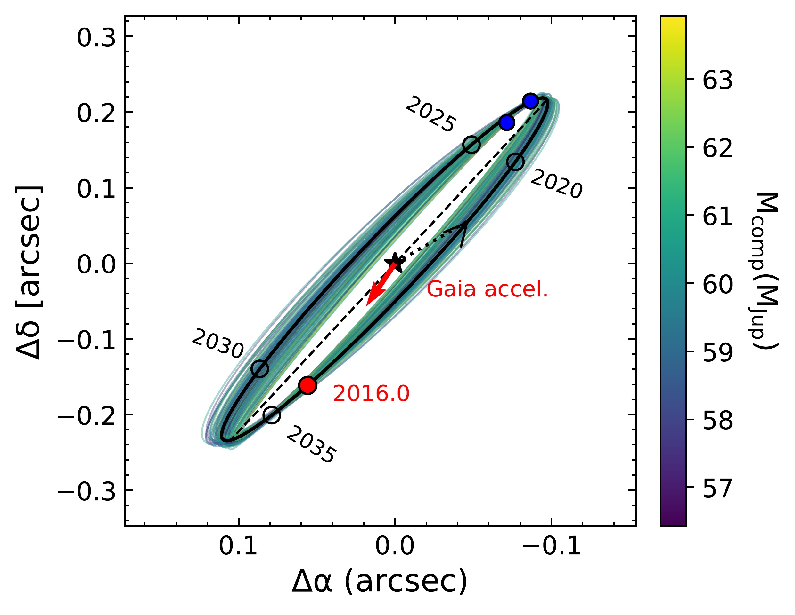

$\newcommand{\ensuremath}{}$
$\newcommand{\xspace}{}$
$\newcommand{\object}[1]{\texttt{#1}}$
$\newcommand{\farcs}{{.}''}$
$\newcommand{\farcm}{{.}'}$
$\newcommand{\arcsec}{''}$
$\newcommand{\arcmin}{'}$
$\newcommand{\ion}[2]{#1#2}$
$\newcommand{\textsc}[1]{\textrm{#1}}$
$\newcommand{\hl}[1]{\textrm{#1}}$
$\newcommand{\footnote}[1]{}$
$\newcommand{\uat}[2]{\href{http://vocabs.ands.org.au/repository/api/lda/aas/the-unified-astronomy-thesaurus/current/resource.html?uri=http://astrothesaurus.org/uat/#1}{#2 (#1)}}$
$\newcommand\mk{#1}$

# Direct Imaging Explorations for Companions from the Subaru/IRD Strategic Program II; Discovery of a Brown-dwarf Companion around a Nearby mid-M dwarf LSPM J1446+4633

<mark>Appeared on: 2025-09-18</mark> -  _11 pages, 7 figs, 4 tables, accepted for publication in AJ_

T. Uyama, et al. -- incl., <mark>T. Henning</mark>

**Abstract:** We report the discovery of a new directly-imaged brown dwarf companion with Keck/NIRC2+pyWFS around a nearby mid-type M dwarf LSPM J1446+4633 (hereafter J1446). The $L'$ -band contrast ( $4.5\times10^{-3}$ ) is consistent with a $\sim20-60 M_{\rm Jup}$ object at 1--10 Gyr and our two-epoch NIRC2 data suggest a $\sim30\%$ ( $\sim3.1\sigma)$ variability in its $L'$ -band flux. We incorporated Gaia DR3 non-single-star catalog into the orbital fitting by combining the Subaru/IRD RV monitoring results, NIRC2 direct imaging results, and Gaia proper motion acceleration. As a result, we derive ${59.8}_{-1.4}^{+1.5} M_{\rm Jup}$ and $\approx4.3 {\rm au}$ for the dynamical mass and the semi-major axis of the companion J1446B, respectively.J1446B is one of the intriguing late-T dwarfs showing variability at $L'$ -band for future atmospheric studies with the constrained dynamical mass.Because the J1446 system is accessible with various observation techniques such as astrometry, direct imaging, and high-resolution spectroscopy including radial velocity measurement, it has a potential as a great benchmark system to improve our understanding for cool dwarfs.

**Figure 4. -** 
    Left: Modeled projected orbits of J1446B from fitting the Gaia DR3 acceleration (a red arrow in left) and two measured Keck/NIRC2 relative astrometric measurements (blue dots in left), and Subaru/IRD RVs (red dots in right). The host star defines the origin and is indicated by a black star; one hundred random orbital draws are shown and color-coded by companion mass, with the best-fit orbit (black). The fitted offset at 2016.0 is plotted in red, and the direction of the measured Gaia DR3 acceleration is indicated by the red arrow. Right: Modeled RVs from a random sampling of orbits from the posterior are color-coded by companion mass with the best-fit orbit.
     (*fig: orvara fitting*)

**Figure 3. -** TESS lightcurves of J1446 ranging four sectors. Left: Comparisons of the measured flux variations in the four sectors, where we adopted median time of each section as a reference date. Right: The same comparison as the left panel except for the y-axis with normalized fluxes. (*fig: TESS*)

**Figure 1. -** Common proper motion test of the companion candidate around J1446. The blue and orange crosses indicate the relative location to the central star ($\Delta{\rm RA}$ for x-axis and $\Delta{\rm Dec}$ for y-axis, respectively). The gray solid line indicates a trajectory of a zero proper-motion background star and the red cross indicates an expected position of the background-star case in the second epoch. We insert the zoomed-in panel for the relative astrometry of the first and second epochs, whose error-bars are small in the original panel.  (*fig: cpm test*)

