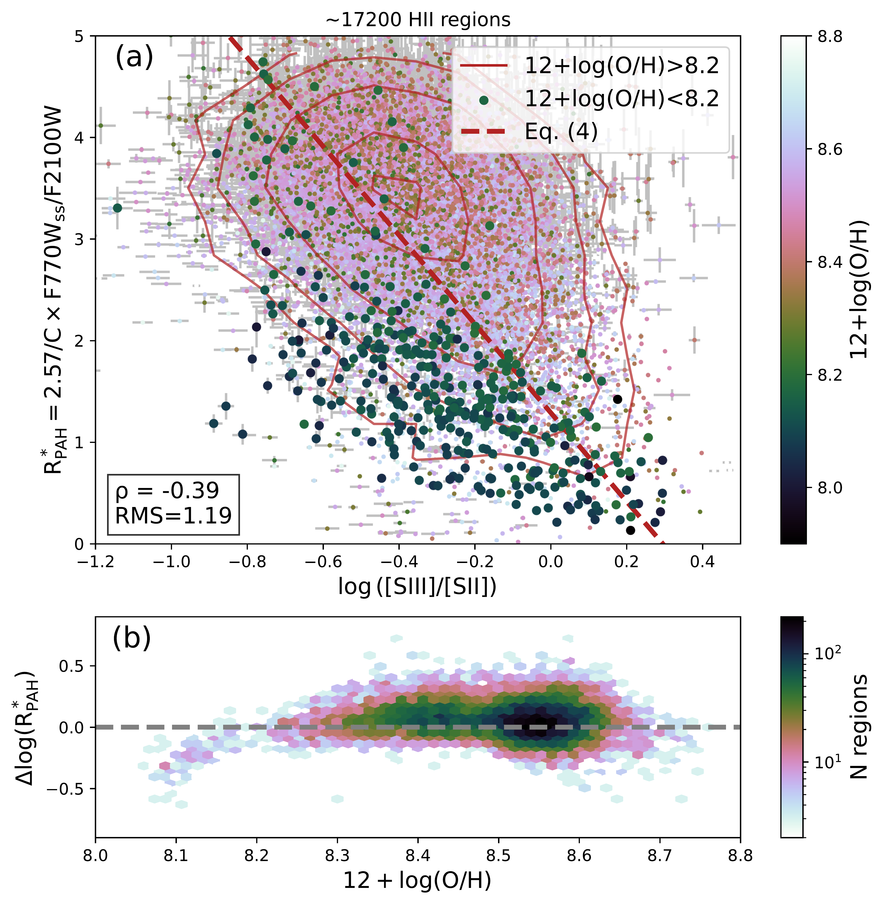
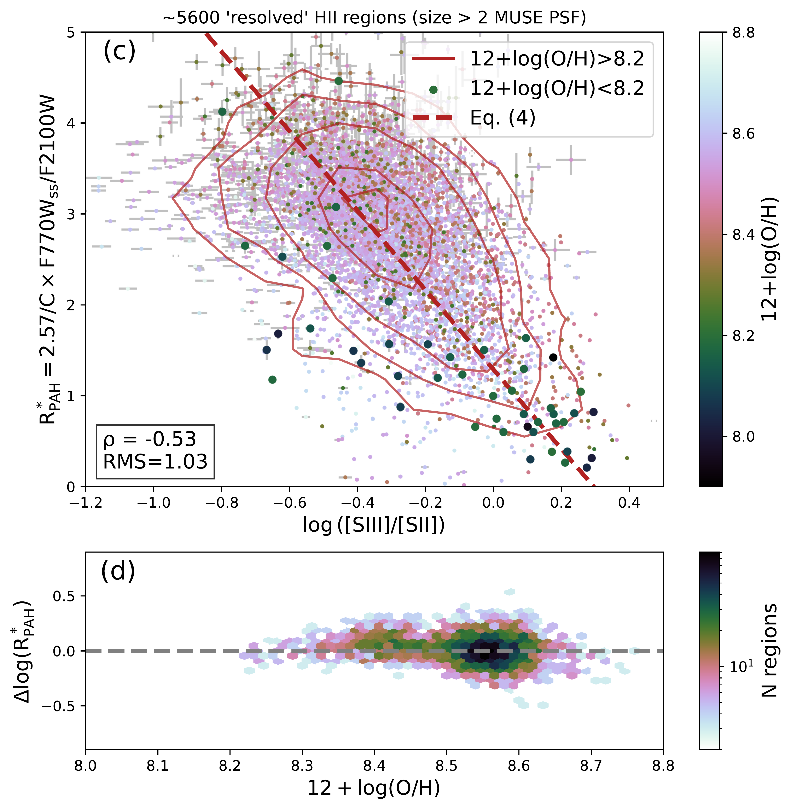
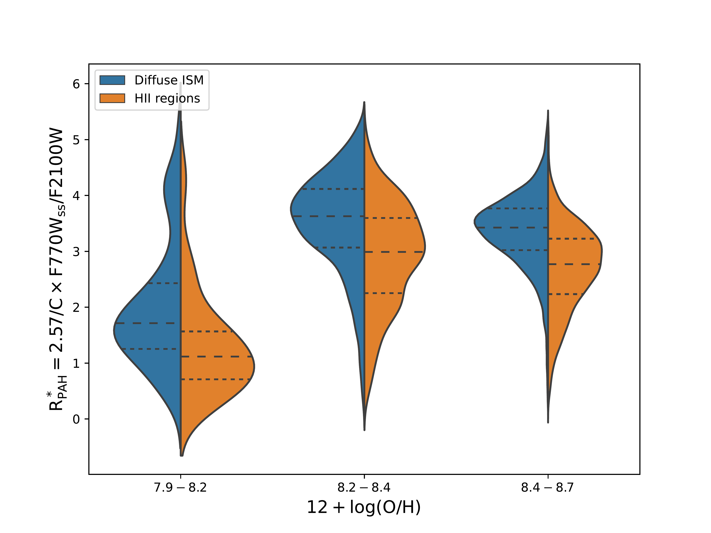
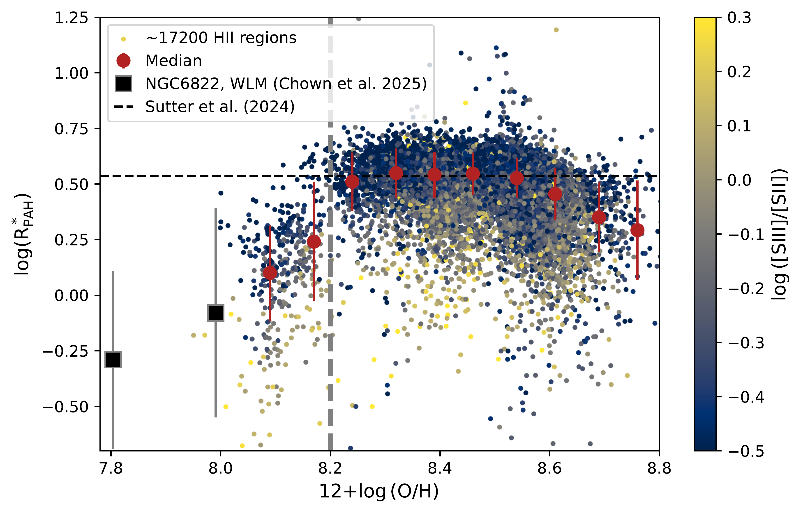

$\newcommand{\ensuremath}{}$
$\newcommand{\xspace}{}$
$\newcommand{\object}[1]{\texttt{#1}}$
$\newcommand{\farcs}{{.}''}$
$\newcommand{\farcm}{{.}'}$
$\newcommand{\arcsec}{''}$
$\newcommand{\arcmin}{'}$
$\newcommand{\ion}[2]{#1#2}$
$\newcommand{\textsc}[1]{\textrm{#1}}$
$\newcommand{\hl}[1]{\textrm{#1}}$
$\newcommand{\footnote}[1]{}$
$\newcommand{\SII}{[S~{\sc ii}]}$
$\newcommand{\SIII}{[S~{\sc iii}]}$
$\newcommand{\OIII}{[O~{\sc iii}]}$
$\newcommand{\NII}{[N~{\sc ii}]}$
$\newcommand{\HII}{H~{\sc ii}}$
$\newcommand{\HeII}{He~{\sc ii}}$
$\newcommand{\HI}{H~{\sc i}}$
$\newcommand{\Ha}{H\alpha}$
$\newcommand{\Hb}{H\beta}$
$\newcommand{\kms}{ \mbox{km} \mbox{s}^{-1}}$
$\newcommand{\ergs}{ \mbox{erg} \mbox{s}^{-1}}$
$\newcommand{\HST}{\textit{HST}}$
$\newcommand{\JWST}{\textit{JWST}}$
$\newcommand{\SIIHa}{[S~{\sc ii}]/H\alpha}$
$\newcommand{\SIIISII}{[S~{\sc iii}]/[S~{\sc ii}]}$
$\newcommand{\NIIHa}{[N~{\sc ii}]/H\alpha}$
$\newcommand{\OIIIHb}{[O~{\sc iii}]/H\beta}$
$\newcommand{\RPAH}{{\rm R_{PAH}}}$
$\newcommand{\RPAHst}{{\rm R_{PAH}^*}}$
$\newcommand{\SBDIG}{\mathrm{\Sigma(H\alpha)_{DIG}}}$
$\newcommand{\sigmaHa}{\sigma(H\alpha)}$
$\newcommand{\be}{\begin{equation}}$
$\newcommand{\ee}{\end{equation}}$
$\newcommand{\red}{\textcolor{red}}$
$\newcommand{\green}{\textcolor{green}}$
$\newcommand{\note}{\red}$
$\newcommand{\revone}\begin{document}$
$\newcommand{\numHII}{17151}$
$\newcommand{\numSNRs}{\revone{396}}$
$   \title{Polycyclic aromatic hydrocarbons destruction in star-forming regions across 42 nearby galaxies}$
$    \titlerunning{PHANGS-JWST and MUSE: PAHs in star-forming regions}$
$\newcommand{\OSU}{\label{OSU} Department of Astronomy, The Ohio State University, 140 West 18th Avenue, Columbus, Ohio 43210, USA}$
$\newcommand{\Alberta}{\label{Alberta} Department of Physics, University of Alberta, Edmonton, AB T6G 2E1, Canada}$
$\newcommand{\ANU}{\label{ANU} Research School of Astronomy and Astrophysics, Australian National University, Canberra, ACT 2611, Australia}$
$\newcommand{\IPAC}{\label{IPAC} Caltech-IPAC, 1200 E. California Blvd. Pasadena, CA 91125, USA}$
$\newcommand{\Carnegie}{\label{Carnegi} Observatories of the Carnegie Institution for Science, 813 Santa Barbara Street, Pasadena, CA 91101, USA}$
$\newcommand{ÇAPP}{\label{CCAPP} Center for Cosmology and Astroparticle Physics, 191 West Woodruff Avenue, Columbus, OH 43210, USA}$
$\newcommand{\CfA}{\label{CfA} Harvard-Smithsonian Center for Astrophysics, 60 Garden Street, Cambridge, MA 02138, USA}$
$\newcommand{\CITEVA}{\label{CITEVA} Centro de Astronomía (CITEVA), Universidad de Antofagasta, Avenida Angamos 601, Antofagasta, Chile}$
$\newcommand{\CNRS}{\label{CNRS} CNRS, IRAP, 9 Av. du Colonel Roche, BP 44346, F-31028 Toulouse cedex 4, France}$
$\newcommand{\ESO}{\label{ESO} European Southern Observatory, Karl-Schwarzschild Stra{\ss}e 2, D-85748 Garching bei München, Germany}$
$\newcommand{\HD}{\label{HD} Astronomisches Rechen-Institut, Zentrum für Astronomie der Universität Heidelberg, Mönchhofstra\ss e 12-14, D-69120 Heidelberg, Germany}$
$\newcommand{\ICRAR}{\label{ICRAR} International Centre for Radio Astronomy Research, University of Western Australia, 35 Stirling Highway, Crawley, WA 6009, Australia}$
$\newcommand{\IRAM}{\label{IRAM} Institut de Radioastronomie Millimétrique (IRAM), 300 Rue de la Piscine, F-38406 Saint Martin d'Hères, France}$
$\newcommand{\ITA}{\label{ITA} Universität Heidelberg, Zentrum für Astronomie, Institut für Theoretische Astrophysik, Albert-Ueberle-Str 2, D-69120 Heidelberg, Germany}$
$\newcommand{\IWR}{\label{IWR} Universität Heidelberg, Interdisziplinäres Zentrum für Wissenschaftliches Rechnen, Im Neuenheimer Feld 205, D-69120 Heidelberg, Germany}$
$\newcommand{\JHU}{\label{JHU} Department of Physics and Astronomy, The Johns Hopkins University, Baltimore, MD 21218, USA}$
$\newcommand{\Leiden}{\label{Leiden} Leiden Observatory, Leiden University, P.O. Box 9513, 2300 RA Leiden, The Netherlands}$
$\newcommand{\Maryland}{\label{Maryland} Department of Astronomy, University of Maryland, College Park, MD 20742, USA}$
$\newcommand{\MPE}{\label{MPE} Max-Planck-Institut für extraterrestrische Physik, Giessenbachstra{\ss}e 1, D-85748 Garching, Germany}$
$\newcommand{\MPIA}{\label{MPIA} Max-Planck-Institut für Astronomie, Königstuhl 17, D-69117, Heidelberg, Germany}$
$\newcommand{\Nagoya}{\label{Nagoya} Department of Physics, Nagoya University, Furo-cho, Chikusa-ku, Nagoya, Aichi 464-8602, Japan}$
$\newcommand{\NRAO}{\label{NRAO} National Radio Astronomy Observatory, 520 Edgemont Road, Charlottesville, VA 22903-2475, USA}$
$\newcommand{\OAN}{\label{OAN} Observatorio Astronómico Nacional (IGN), C/Alfonso XII, 3, E-28014 Madrid, Spain}$
$\newcommand{\ObsParis}{\label{ObsParis} Sorbonne Université, Observatoire de Paris, Université PSL, CNRS, LERMA, F-75014, Paris, France}$
$\newcommand{\Princeton}{\label{Princeton} Department of Astrophysical Sciences, Princeton University, Princeton, NJ 08544 USA}$
$\newcommand{\UToledo}{\label{UToledo} University of Toledo, 2801 W. Bancroft St., Mail Stop 111, Toledo, OH, 43606}$
$\newcommand{\Toulouse}{\label{Toulouse} Université de Toulouse, UPS-OMP, IRAP, F-31028 Toulouse cedex 4, France}$
$\newcommand{\UBonn}{\label{UBonn} Argelander-Institut für Astronomie, Universität Bonn, Auf dem Hügel 71, 53121 Bonn, Germany}$
$\newcommand{\UChile}{\label{UChile} Departamento de Astronomía, Universidad de Chile, Camino del Observatorio 1515, Las Condes, Santiago, Chile}$
$\newcommand{\UConn}{\label{UConn} Department of Physics, University of Connecticut, Storrs, CT, 06269, USA}$
$\newcommand{\UCSD}{\label{UCSD} Department of Astronomy \& Astrophysics,  University of California, San Diego, 9500 Gilman Drive, La Jolla, CA 92093, USA}$
$\newcommand{\UGent}{\label{UGent} Sterrenkundig Observatorium, Universiteit Gent, Krijgslaan 281 S9, B-9000 Gent, Belgium}$
$\newcommand{\ULyon}{\label{ULyon} Univ Lyon, Univ Lyon 1, ENS de Lyon, CNRS, Centre de Recherche Astrophysique de Lyon UMR5574,\ F-69230 Saint-Genis-Laval, France}$
$\newcommand{\UMass}{\label{UMass} University of Massachusetts—Amherst, 710 N. Pleasant Street, Amherst, MA 01003, USA}$
$\newcommand{\UWyoming}{\label{UWyoming} Department of Physics and Astronomy, University of Wyoming, Laramie, WY 82071, USA}$
$\newcommand{\LAM}{\label{LAM} Aix Marseille Univ, CNRS, CNES, LAM (Laboratoire d’Astrophysique de Marseille), Marseille, France}$
$\newcommand{\UHawaii}{\label{UHawaii} Institute for Astronomy, University of Hawaii, 2680 Woodlawn Drive, Honolulu, HI 96822, USA}$
$\newcommand{\UCM}{\label{UCM} Departamento de Física de la Tierra y Astrofísica, Universidad Complutense de Madrid, E-28040, Spain}$
$\newcommand{\IPARC}{\label{IPARC} Instituto de Física de Partículas y del Cosmos IPARCOS, Facultad de Ciencias Físicas, Universidad Complutense de Madrid, E-28040, Spain}$
$\newcommand{\STScI}{\label{STScI} Space Telescope Science Institute, 3700 San Martin Drive, Baltimore, MD 21218, USA}$
$\newcommand{\McMaster}{\label{McMaster} Department of Physics and Astronomy, McMaster University, 1280 Main Street West, Hamilton, ON L8S 4M1, Canada}$
$\newcommand{\INAF}{\label{INAF} INAF -- Osservatorio Astrofisico di Arcetri, Largo E. Fermi 5, I-50157, Firenze, Italy}$
$\newcommand{\Sydney}{\label{Sydney} Sydney Institute for Astronomy, School of Physics A28, The University of Sydney, NSW 2006, Australia}$
$\newcommand{\UA}{\label{UA} Centro de Astronomía (CITEVA), Universidad de Antofagasta, Avenida Angamos 601, Antofagasta, Chile}$
$\newcommand{\CITA}{\label{CITA} Canadian Institute for Theoretical Astrophysics (CITA), University of Toronto, 60 St George St, Toronto, ON M5S 3H8, Canada}$
$\newcommand{\ASIAA}{\label{ASIAA} Institute of Astronomy and Astrophysics, Academia Sinica, No. 1, Sec. 4, Roosevelt Road, Taipei 106319, Taiwan}$
$\newcommand{\TKU}{\label{TKU} Department of Physics, Tamkang University, No.151, Yingzhuan Rd., Tamsui Dist., New Taipei City 251301, Taiwan}$
$\newcommand{\PSMA}{\label{PSMA} Penn State Mont Alto, 1 Campus Drive, Mont Alto, PA  17237, USA}$
$\newcommand{\ILL}{\label{ILL} ILL}$
$\newcommand{\Whitman}{\label{Whitman} Whitman College, 345 Boyer Avenue, Walla Walla, WA 99362, USA}$
$\newcommand{\Ox}{\label{Ox} Sub-department of Astrophysics, Department of Physics, University of Oxford, Keble Road, Oxford OX1 3RH, UK}$
$\newcommand{\stromlo}{\label{stromlo} Research School of Astronomy and Astrophysics, Australian National University, Mt Stromlo Observatory, Weston Creek, ACT 2611, Australia}$
$\newcommand{\FAU}{\label{FAU} Dr. Karl-Remeis Sternwarte and Erlangen Centre for Astroparticle Physics, Friedrich-Alexander Universitat Erlangen-Nurnberg, Sternwartstr. 7, 96049 Bamberg, Germany}$
$\newcommand{\Nice}{\label{Nice} Université C\^ote d'Azur, Observatoire de la C\^ote d'Azur, CNRS, Laboratoire Lagrange, 06000, Nice, France}$
$\newcommand{\Gemini}{\label{Gemini} International Gemini Observatory, NSF NOIRLab, 950 N Cherry Ave, Tucson, AZ 85719, USA}$
$\newcommand{\ESOchile}{\label{ESOchile} European Southern Observatory (ESO), Alonso de Córdova 3107, Casilla 19, Santiago 19001, Chile}$
$\newcommand{\UNAM}{\label{UNAM}$
$Instituto de Astronomía, Universidad Nacional Autónoma de México, Ap. 70-264, 04510 CDMX, Mexico}$
$\newcommand{\KIPAC}{\label{KIPAC} Kavli Institute for Particle Astrophysics \& Cosmology, Stanford University, CA 94305, USA}$
$\newcommand{\CDU}{\label{CDU} Center for Decoding the Universe, Stanford University, CA 94305, USA}$
$\newcommand{\UnknownInst}{\label{UnknownInst} What is your affiliation?}$
$\author{$
$        Oleg V. Egorov\orcid{0000-0002-4755-118X}\inst{\ref{HD}}\thanks{\email{oleg.egorov@uni-heidelberg.de}}$
$        \and$
$    Adam~K.~Leroy\orcid{0000-0002-2545-1700}$
$\inst{\ref{OSU}, \ref{CCAPP}}$
$\and$
$    Karin Sandstrom\orcid{0000-0002-4378-8534}\inst{\ref{UCSD}}$
$    \and$
$    Kathryn Kreckel\orcid{0000-0001-6551-3091}\inst{\ref{HD}}$
$    \and$
$    Dalya Baron\orcid{0000-0003-4974-3481}\inst{\ref{KIPAC}, \ref{CDU}}$
$    \and$
$    Francesco Belfiore\orcid{0000-0002-2545-5752}\inst{\ref{INAF}}$
$       \and$
$    Ryan Chown\orcid{0000-0001-8241-7704}\inst{\ref{OSU}}$
$    \and$
$    Jessica Sutter\orcid{0000-0002-9183-8102}\inst{\ref{Whitman}}$
$    \and$
$   Médéric Boquien\orcid{0000-0003-0946-6176}$
$\inst{\ref{Nice}}$
$\and$
$    Mar Canal i Saguer\inst{\ref{FAU}}$
$    \and$
$    Enrico Congiu\orcid{0000-0002-8549-4083}\inst{\ref{ESOchile}}$
$    \and$
$Daniel~A.~Dale\orcid{0000-0002-5782-9093}\inst{\ref{UWyoming}}$
$    \and$
$    Evgeniya Egorova\orcid{0000-0003-2717-8784}\inst{\ref{HD}}$
$    \and$
$    Michael Huber\inst{\ref{HD}}$
$    \and$
$    Jing Li\orcid{0000-0002-4825-9367}\inst{\ref{HD}}$
$   \and$
$Thomas~G.~Williams\orcid{0000-0002-0012-2142}$
$    \inst{\ref{Ox}}$
$    \and$
$    Jérémy Chastenet\orcid{0000-0002-5235-5589}\inst{\ref{UGent}}$
$    \and$
$    I-Da Chiang\orcid{0000-0003-2551-7148}\inst{\ref{ASIAA}}$
$    \and$
$    Ivan Gerasimov\orcid{0000-0001-7113-8152}\inst{\ref{Nice}}$
$    \and$
$    Hamid Hassani\orcid{0000-0002-8806-6308}\inst{\ref{Alberta}}$
$\and$
$   Hwihyun Kim\orcid{0000-0003-4770-688X}\inst{\ref{Gemini}}$
$   \and$
$   Hannah Koziol\orcid{0009-0001-5949-1524}\inst{\ref{UCSD}}$
$   \and$
$   Janice C. Lee\orcid{0000-0003-0946-6176}\inst{\ref{STScI}}$
$   \and$
$   Rebecca L. McClain\orcid{0000-0002-6187-4866}\inst{\ref{OSU}, \ref{CCAPP}}$
$\and$
$José Eduardo Méndez Delgado\orcid{0000-0002-6972-6411}\inst{\ref{UNAM}}$
$   \and$
$Hsi-An Pan\orcid{0000-0002-1370-6964}\inst{\ref{TKU}}$
$\and$
$   Debosmita Pathak\orcid{0000-0003-2721-487X$
$}\inst{\ref{OSU}}$
$    \and$
$    Erik Rosolowsky\orcid{0000-0002-5204-2259}\inst{\ref{Alberta}}$
$    \and$
$    Sumit K. Sarbadhicary\orcid{0000-0002-4781-7291}$
$\inst{\ref{OSU}, \ref{CCAPP}}$
$\and$
$    Eva Schinnerer\orcid{0000-0002-3933-7677}\inst{\ref{MPIA}}$
$    \and$
$    David Thilker\orcid{0000-0002-8528-7340}\inst{\ref{JHU}}$
$    \and$
$    Leonardo Ubeda\orcid{0000-0001-7130-2880}\inst{\ref{STScI}}$
$    \and$
$    Tony Weinbeck\orcid{0009-0005-8923-558X}\inst{\ref{UWyoming}}$
$}$
$\institute{\HD \and \OSU \and ÇAPP \and \UCSD  \and \KIPAC \and \CDU \and \INAF  \and \Whitman  \and  \Nice \and \FAU  \and \ESOchile \and \UWyoming \and \Ox   \and \UGent \and \ASIAA \and \Alberta \and  \Gemini \and \STScI \and \UNAM \and \TKU \and \MPIA \and \JHU$
$}$
$   \date{Received ????? ??, 2025; accepted ????? ??, ????}$
$  \abstract{$
$  Polycyclic aromatic hydrocarbons (PAHs) are widespread in the interstellar medium (ISM) of \simSolar metallicity galaxies, where they play a critical role in ISM heating, cooling, and reprocessing stellar radiation. The PAH fraction, the abundance of PAHs relative to total dust mass, is a key parameter in ISM physics. Using JWST and MUSE observations of 42 galaxies from the PHANGS survey, we analyze the PAH fraction in over 17 000 \HII regions spanning a gas-phase oxygen abundance of \rm 12+\log(O/H) = 8.0–8.8 (Z \sim 0.2–1.3~Z_\odot), and \sim400 isolated supernova remnants (SNRs). We find a significantly lower PAH fraction \revone{toward} \HII regions compared to a reference sample of diffuse ISM areas at matched metallicity. At \rm 12+\log(O/H) > 8.2, the PAH fraction \revone{toward} \HII regions is strongly anti-correlated with the local ionization parameter, suggesting that PAH destruction is correlated with ionized gas and/or hydrogen-ionizing UV radiation.$
$  At lower metallicities, the PAH fraction declines steeply in both \HII regions and the diffuse ISM, likely reflecting less efficient PAH formation in metal-poor environments. Carefully isolating dust emission from the vicinity of optically-identified supernova remnants, we see evidence for selective PAH destruction from measurements of lower PAH fractions, which is, however, indistinguishable at \sim 50 pc scales.$
$  Overall, our results point to ionizing radiation as the dominant agent of PAH destruction within \HII regions, with metallicity playing a key role in their global abundance in galaxies.$
$}$
$   \keywords{Galaxies: ISM --$
$                Infrared: ISM -- ISM: HII regions -- ISM: dust, extinction -- ISM: abundances$
$               }$
$   \maketitle$
$\n\end{equation}\end{document}}$
$\newcommand{\ee}{\end{equation}}$
$\newcommand{\numHII}{17151}$
$\newcommand{\numSNRs}{\revone{396}}$
$\newcommand{\OSU}{\label{OSU} Department of Astronomy, The Ohio State University, 140 West 18th Avenue, Columbus, Ohio 43210, USA}$
$\newcommand{\Alberta}{\label{Alberta} Department of Physics, University of Alberta, Edmonton, AB T6G 2E1, Canada}$
$\newcommand{\ANU}{\label{ANU} Research School of Astronomy and Astrophysics, Australian National University, Canberra, ACT 2611, Australia}$
$\newcommand{\IPAC}{\label{IPAC} Caltech-IPAC, 1200 E. California Blvd. Pasadena, CA 91125, USA}$
$\newcommand{\Carnegie}{\label{Carnegi} Observatories of the Carnegie Institution for Science, 813 Santa Barbara Street, Pasadena, CA 91101, USA}$
$\newcommand{ÇAPP}{\label{CCAPP} Center for Cosmology and Astroparticle Physics, 191 West Woodruff Avenue, Columbus, OH 43210, USA}$
$\newcommand{\CfA}{\label{CfA} Harvard-Smithsonian Center for Astrophysics, 60 Garden Street, Cambridge, MA 02138, USA}$
$\newcommand{\CITEVA}{\label{CITEVA} Centro de Astronomía (CITEVA), Universidad de Antofagasta, Avenida Angamos 601, Antofagasta, Chile}$
$\newcommand{\CNRS}{\label{CNRS} CNRS, IRAP, 9 Av. du Colonel Roche, BP 44346, F-31028 Toulouse cedex 4, France}$
$\newcommand{\ESO}{\label{ESO} European Southern Observatory, Karl-Schwarzschild Stra{\ss}e 2, D-85748 Garching bei München, Germany}$
$\newcommand{\HD}{\label{HD} Astronomisches Rechen-Institut, Zentrum für Astronomie der Universität Heidelberg, Mönchhofstra\ss e 12-14, D-69120 Heidelberg, Germany}$
$\newcommand{\ICRAR}{\label{ICRAR} International Centre for Radio Astronomy Research, University of Western Australia, 35 Stirling Highway, Crawley, WA 6009, Australia}$
$\newcommand{\IRAM}{\label{IRAM} Institut de Radioastronomie Millimétrique (IRAM), 300 Rue de la Piscine, F-38406 Saint Martin d'Hères, France}$
$\newcommand{\ITA}{\label{ITA} Universität Heidelberg, Zentrum für Astronomie, Institut für Theoretische Astrophysik, Albert-Ueberle-Str 2, D-69120 Heidelberg, Germany}$
$\newcommand{\IWR}{\label{IWR} Universität Heidelberg, Interdisziplinäres Zentrum für Wissenschaftliches Rechnen, Im Neuenheimer Feld 205, D-69120 Heidelberg, Germany}$
$\newcommand{\JHU}{\label{JHU} Department of Physics and Astronomy, The Johns Hopkins University, Baltimore, MD 21218, USA}$
$\newcommand{\Leiden}{\label{Leiden} Leiden Observatory, Leiden University, P.O. Box 9513, 2300 RA Leiden, The Netherlands}$
$\newcommand{\Maryland}{\label{Maryland} Department of Astronomy, University of Maryland, College Park, MD 20742, USA}$
$\newcommand{\MPE}{\label{MPE} Max-Planck-Institut für extraterrestrische Physik, Giessenbachstra{\ss}e 1, D-85748 Garching, Germany}$
$\newcommand{\MPIA}{\label{MPIA} Max-Planck-Institut für Astronomie, Königstuhl 17, D-69117, Heidelberg, Germany}$
$\newcommand{\Nagoya}{\label{Nagoya} Department of Physics, Nagoya University, Furo-cho, Chikusa-ku, Nagoya, Aichi 464-8602, Japan}$
$\newcommand{\NRAO}{\label{NRAO} National Radio Astronomy Observatory, 520 Edgemont Road, Charlottesville, VA 22903-2475, USA}$
$\newcommand{\OAN}{\label{OAN} Observatorio Astronómico Nacional (IGN), C/Alfonso XII, 3, E-28014 Madrid, Spain}$
$\newcommand{\ObsParis}{\label{ObsParis} Sorbonne Université, Observatoire de Paris, Université PSL, CNRS, LERMA, F-75014, Paris, France}$
$\newcommand{\Princeton}{\label{Princeton} Department of Astrophysical Sciences, Princeton University, Princeton, NJ 08544 USA}$
$\newcommand{\UToledo}{\label{UToledo} University of Toledo, 2801 W. Bancroft St., Mail Stop 111, Toledo, OH, 43606}$
$\newcommand{\Toulouse}{\label{Toulouse} Université de Toulouse, UPS-OMP, IRAP, F-31028 Toulouse cedex 4, France}$
$\newcommand{\UBonn}{\label{UBonn} Argelander-Institut für Astronomie, Universität Bonn, Auf dem Hügel 71, 53121 Bonn, Germany}$
$\newcommand{\UChile}{\label{UChile} Departamento de Astronomía, Universidad de Chile, Camino del Observatorio 1515, Las Condes, Santiago, Chile}$
$\newcommand{\UConn}{\label{UConn} Department of Physics, University of Connecticut, Storrs, CT, 06269, USA}$
$\newcommand{\UCSD}{\label{UCSD} Department of Astronomy \& Astrophysics,  University of California, San Diego, 9500 Gilman Drive, La Jolla, CA 92093, USA}$
$\newcommand{\UGent}{\label{UGent} Sterrenkundig Observatorium, Universiteit Gent, Krijgslaan 281 S9, B-9000 Gent, Belgium}$
$\newcommand{\ULyon}{\label{ULyon} Univ Lyon, Univ Lyon 1, ENS de Lyon, CNRS, Centre de Recherche Astrophysique de Lyon UMR5574,\ F-69230 Saint-Genis-Laval, France}$
$\newcommand{\UMass}{\label{UMass} University of Massachusetts—Amherst, 710 N. Pleasant Street, Amherst, MA 01003, USA}$
$\newcommand{\UWyoming}{\label{UWyoming} Department of Physics and Astronomy, University of Wyoming, Laramie, WY 82071, USA}$
$\newcommand{\LAM}{\label{LAM} Aix Marseille Univ, CNRS, CNES, LAM (Laboratoire d’Astrophysique de Marseille), Marseille, France}$
$\newcommand{\UHawaii}{\label{UHawaii} Institute for Astronomy, University of Hawaii, 2680 Woodlawn Drive, Honolulu, HI 96822, USA}$
$\newcommand{\UCM}{\label{UCM} Departamento de Física de la Tierra y Astrofísica, Universidad Complutense de Madrid, E-28040, Spain}$
$\newcommand{\IPARC}{\label{IPARC} Instituto de Física de Partículas y del Cosmos IPARCOS, Facultad de Ciencias Físicas, Universidad Complutense de Madrid, E-28040, Spain}$
$\newcommand{\STScI}{\label{STScI} Space Telescope Science Institute, 3700 San Martin Drive, Baltimore, MD 21218, USA}$
$\newcommand{\McMaster}{\label{McMaster} Department of Physics and Astronomy, McMaster University, 1280 Main Street West, Hamilton, ON L8S 4M1, Canada}$
$\newcommand{\INAF}{\label{INAF} INAF -- Osservatorio Astrofisico di Arcetri, Largo E. Fermi 5, I-50157, Firenze, Italy}$
$\newcommand{\Sydney}{\label{Sydney} Sydney Institute for Astronomy, School of Physics A28, The University of Sydney, NSW 2006, Australia}$
$\newcommand{\UA}{\label{UA} Centro de Astronomía (CITEVA), Universidad de Antofagasta, Avenida Angamos 601, Antofagasta, Chile}$
$\newcommand{\CITA}{\label{CITA} Canadian Institute for Theoretical Astrophysics (CITA), University of Toronto, 60 St George St, Toronto, ON M5S 3H8, Canada}$
$\newcommand{\ASIAA}{\label{ASIAA} Institute of Astronomy and Astrophysics, Academia Sinica, No. 1, Sec. 4, Roosevelt Road, Taipei 106319, Taiwan}$
$\newcommand{\TKU}{\label{TKU} Department of Physics, Tamkang University, No.151, Yingzhuan Rd., Tamsui Dist., New Taipei City 251301, Taiwan}$
$\newcommand{\PSMA}{\label{PSMA} Penn State Mont Alto, 1 Campus Drive, Mont Alto, PA  17237, USA}$
$\newcommand{\ILL}{\label{ILL} ILL}$
$\newcommand{\Whitman}{\label{Whitman} Whitman College, 345 Boyer Avenue, Walla Walla, WA 99362, USA}$
$\newcommand{\Ox}{\label{Ox} Sub-department of Astrophysics, Department of Physics, University of Oxford, Keble Road, Oxford OX1 3RH, UK}$
$\newcommand{\stromlo}{\label{stromlo} Research School of Astronomy and Astrophysics, Australian National University, Mt Stromlo Observatory, Weston Creek, ACT 2611, Australia}$
$\newcommand{\FAU}{\label{FAU} Dr. Karl-Remeis Sternwarte and Erlangen Centre for Astroparticle Physics, Friedrich-Alexander Universitat Erlangen-Nurnberg, Sternwartstr. 7, 96049 Bamberg, Germany}$
$\newcommand{\Nice}{\label{Nice} Université C\^ote d'Azur, Observatoire de la C\^ote d'Azur, CNRS, Laboratoire Lagrange, 06000, Nice, France}$
$\newcommand{\Gemini}{\label{Gemini} International Gemini Observatory, NSF NOIRLab, 950 N Cherry Ave, Tucson, AZ 85719, USA}$
$\newcommand{\ESOchile}{\label{ESOchile} European Southern Observatory (ESO), Alonso de Córdova 3107, Casilla 19, Santiago 19001, Chile}$
$\newcommand{\UNAM}{\label{UNAM}$
$Instituto de Astronomía, Universidad Nacional Autónoma de México, Ap. 70-264, 04510 CDMX, Mexico}$
$\newcommand{\KIPAC}{\label{KIPAC} Kavli Institute for Particle Astrophysics \& Cosmology, Stanford University, CA 94305, USA}$
$\newcommand{\CDU}{\label{CDU} Center for Decoding the Universe, Stanford University, CA 94305, USA}$
$\newcommand{\UnknownInst}{\label{UnknownInst} What is your affiliation?}$
$\newcommand{\red}{\textcolor{red}}$
$\newcommand{\green}{\textcolor{green}}$
$\newcommand{\note}{\red}$
$\newcommand{\revone}\begin$

# Polycyclic aromatic hydrocarbons destruction in star-forming regions across 42 nearby galaxies

<mark>Appeared on: 2025-09-18</mark> -  _19 pages, 15 figures. Accepted for publication in A&A_

O. V. Egorov, et al. -- incl., <mark>K. Kreckel</mark>, <mark>J. Li</mark>, <mark>E. Schinnerer</mark>

**Abstract:** Polycyclic aromatic hydrocarbons (PAHs) are widespread in the interstellar medium (ISM) of $\sim$ Solar metallicity galaxies, where they play a critical role in ISM heating, cooling, and reprocessing stellar radiation. The PAH fraction, the abundance of PAHs relative to total dust mass, is a key parameter in ISM physics. Using JWST and MUSE observations of 42 galaxies from the PHANGS survey, we analyze the PAH fraction in over 17 000 $\HII$ regions spanning a gas-phase oxygen abundance of $\rm 12+\log(O/H) = 8.0$ –8.8 ( $Z \sim 0.2$ –1.3 $Z_\odot$ ), and $\sim400$ isolated supernova remnants (SNRs). We find a significantly lower PAH fraction $\revone{toward}$ $\HII$ regions compared to a reference sample of diffuse ISM areas at matched metallicity. At $\rm 12+\log(O/H) > 8.2$ , the PAH fraction $\revone{toward}$ $\HII$ regions is strongly anti-correlated with the local ionization parameter, suggesting that PAH destruction is correlated with ionized gas and/or hydrogen-ionizing UV radiation.  At lower metallicities, the PAH fraction declines steeply in both $\HII$ regions and the diffuse ISM, likely reflecting less efficient PAH formation in metal-poor environments. Carefully isolating dust emission from the vicinity of optically-identified supernova remnants, we see evidence for selective PAH destruction from measurements of lower PAH fractions, which is, however, indistinguishable at $\sim 50$ pc scales.  Overall, our results point to ionizing radiation as the dominant agent of PAH destruction within $\HII$ regions, with metallicity playing a key role in their global abundance in galaxies.

**Figure 12. -** PAH fraction anti-correlates with $\log$($\SII$I/$\SII$) (ionization parameter tracer) for thousands $\HII$ regions in 42 PHANGS-JWST galaxies. Panel (a, b) shows all $\sim 17200$ analyzed $\HII$ regions, while  $\sim 5600$ brightest \revone{"resolved"}$\HII$ regions are shown on Panels (c, d). The dashed red line shows the best-fit linear regression to the \revone{"resolved"} sample defined by Eq. \ref{eq:RPAH_vs_ip}. Histograms on panels (b, d) show how the logarithmic residuals after subtracting this linear trend depend on metallicity. Color on panels (a, c) denotes gas-phase oxygen abundance; red contours show the probability density of the high-metallicity ($\rm 12+\log(O/H) > 8.2$) points (levels correspond to 50, 65, 80, 95 and 99 percentile intervals). The Spearman correlation coefficient ($\rho$) and RMS scatter around the linear fit are reported on panels (a, c).  (*fig:RPAH_vs_ip*)

**Figure 4. -** Distribution of $\RPAH$st for \revone{"resolved"}(luminous) $\HII$ regions (orange) and the regions of the similar size from diffuse ISM (blue) for several gas-phase metallicity bins. Dashed and two dotted lines on each distribution show median and 25 and 75 percentile quartiles, respectively. Both $\RPAH$ and $\RPAH$st are lower in $\HII$ regions than in diffuse ISM. A strong decrease of $\RPAH$st in the lowest metallicity bin is seen for both $\HII$ regions and diffuse ISM. (*fig:diff_vs_hii*)

**Figure 1. -** Distribution of $\rm \log({\rm R_{PAH}^*})$ vs oxygen abundance color-coded by $\rm \log([SIII]/[SII])$(tracer of the ionization parameter) for all $\HII$ regions in the sample. Red circles show average values in different metallicity bins (reported in Tab. \ref{tab:Rpah_vs_z_bins}). Vertical gray dashed line marks $\rm 12 + \log(O/H) = 8.2$ as a threshold between the low- and high-metallicity regimes. The horizontal dashed line correspond to the average $\RPAH$ for diffuse ISM measured by [Sutter, Sandstrom and Chastenet (2024)](). Black squares correspond to measurements for WLM and NGC6822 (from low- to high-metallicity) made by  ([Chown, Leroy and Bolatto 2025]())  using JWST F770W and F2100W images. The PAH fraction drops significantly in the low-metallicity regime.  (*fig:RPAH_vs_met*)

